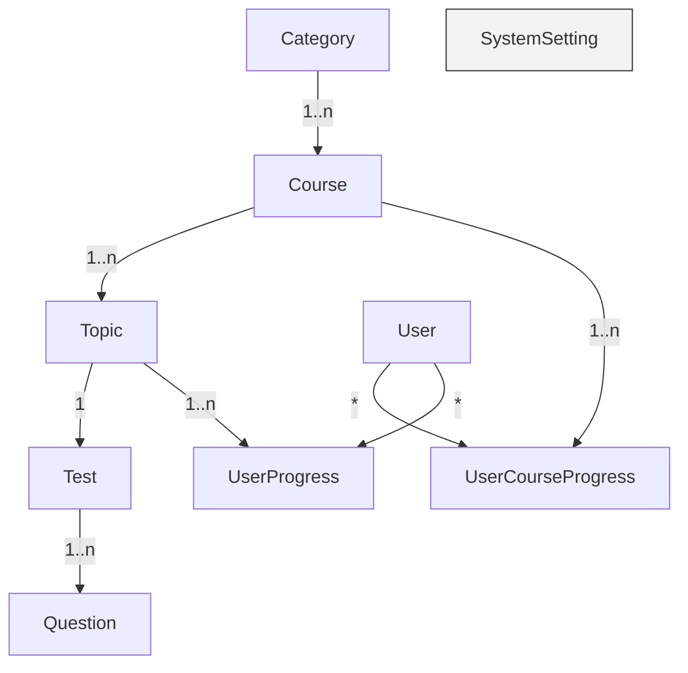
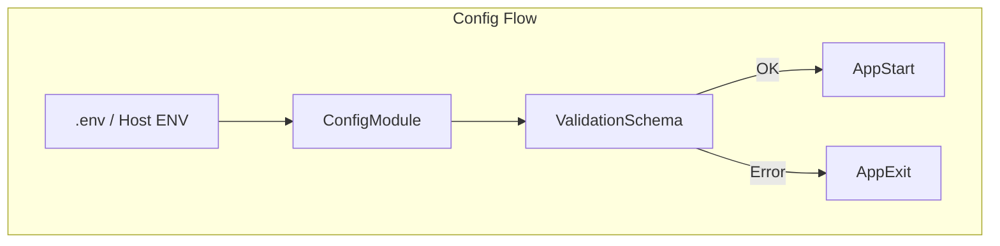

# QA Learning Management System - README

Този документ предоставя инструкции за настройка, конфигурация и стартиране на проекта.

---

## Структура на проекта

Проектът използва **Monorepo** архитектура, управлявана с **pnpm workspaces**. Тази структура е избрана, за да улесни споделянето на код и типове между различните части на приложението и е оптимизирана за разработка с AI асистенти.

```
qa-platform/
├── apps/
│   ├── web/               # Публично React приложение за потребители
│   ├── admin/             # React приложение за административния панел
│   └── backend/           # NestJS API сървър
├── packages/
│   ├── shared-types/      # Споделени TypeScript типове (DTOs, Enums)
│   ├── ui-components/     # Споделени React UI компоненти (Codux)
│   └── constants/         # Споделени константи (API пътища и др.)
└── package.json           # Главен package.json за управление на workspaces
```

### Директория `apps`

Тук се намират отделните приложения:

- **`web`**: Публичното React приложение, което потребителите виждат. То включва страници за разглеждане на курсове, регистрация, вход и потребителски дашборд.
- **`admin`**: React приложение за административния панел. Достъпно е само за потребители с роля 'admin' и служи за управление на съдържанието, потребителите и системните настройки.
- **`backend`**: NestJS API сървърът, който обслужва `web` и `admin` приложенията. Той отговаря за бизнес логиката, комуникацията с базата данни и автентикацията.

### Директория `packages`

Тук се намират споделените пакети, които се използват от приложенията в `apps`:

- **`shared-types`**: Съдържа TypeScript дефиниции (интерфейси, енумерации), които се споделят между `backend` и `frontend` приложенията. Това гарантира типова сигурност и консистентен API контракт.
- **`ui-components`**: Библиотека със споделени, преизползваеми React компоненти (бутони, инпути, карти), които се използват и в `web`, и в `admin` приложението, за да се поддържа консистентен дизайн.
- **`constants`**: Съдържа споделени константи, като например API маршрути, имена на кукита и други магически низове, за да се избегне дублиране и грешки.

---

## Entity Relationship Diagram (Task 1.2.1)

Следната диаграма показва връзките между основните таблици в базата данни:



Диаграмата отразява:

* **Category → Course → Topic → Test → Question** – йерархия на учебното съдържание.
* **UserProgress / UserCourseProgress** – таблици за напредък на потребителя с композитни първични ключове.
* **SystemSetting** – ключ-стойност конфигурация на системата.

---

## TypeScript Конфигурация

Проектът е изцяло написан на TypeScript, за да се осигури типова сигурност и по-добра поддръжка на кода. Конфигурацията е разделена на няколко файла:

- **`tsconfig.base.json`**: Основният конфигурационен файл, намиращ се в главната директория. Той дефинира общите правила за компилация (`strict: true`, `esModuleInterop: true` и др.), които се наследяват от всички останали проекти и пакети.
- **`apps/*/tsconfig.json`** и **`packages/*/tsconfig.json`**: Всеки проект и пакет има собствен `tsconfig.json` файл, който `extends` базовия. Това позволява дефинирането на специфични за проекта настройки (например, `jsx: "react-jsx"` за React приложенията или `"module": "commonjs"` за NestJS).

Тази структура позволява централизирано управление на основните правила, като същевременно дава гъвкавост на всеки отделен пакет.

---

## Локална разработка с Docker

Следните стъпки стартират **напълно самодостатъчна** дев среда (NestJS API + PostgreSQL) само с Docker.

1. **Подготовка на `.env` файловете**

   В корена на репото има примерен `.env.example`. Копирайте го като `.env` и при нужда променете стойностите:

   ```bash
   cp .env.example .env
   ```

   Ключови променливи:

   * `BACKEND_PORT` – портът на NestJS (по подразбиране `3000`)
   * `DB_PORT` – портът на PostgreSQL, мапнат към хоста (`5432`)
   * `DB_NAME`, `DB_USER`, `DB_PASSWORD` – данни за БД

   Ако стартирате бекенда извън контейнера, копирайте и примерния файл в `apps/backend`:

   ```bash
   cp apps/backend/.env.example apps/backend/.env
   ```

2. **Стартиране / билд на контейнерите**

   ```bash
   docker compose up -d --build
   ```

   Командата ще:
   * изгради `backend` image (виж `apps/backend/Dockerfile`)
   * стартира `postgres` и `backend` контейнери
   * изчака Postgres да стане `healthy` (health-check).

3. **Полезни команди**

   ```bash
   docker compose ps          # Статус на контейнерите
   docker compose logs -f     # Лайв логове
   docker compose down        # Спиране и почистване
   ```

> Забележка: `.dockerignore` изключва локалните `node_modules` и build артефакти, ускорявайки build-а и предотвратявайки грешки с файлови права.

Backend API трябва да е достъпен на `http://localhost:${BACKEND_PORT}`. Проверете със:

```bash
curl http://localhost:3000/health
```

---

## Управление на конфигурацията (Backend)

Backend приложението използва NestJS `@nestjs/config` модул за централизирано управление и **валидация** на всички критични променливи на средата.

1. Модулът `AppConfigModule` се зарежда глобално и използва `Joi` схема (`src/config/validation.ts`) за валидиране на:
   - `DATABASE_URL` – задължително, валиден URI към PostgreSQL.
   - `PORT` – незадължително, по подразбиране `3000`.
2. Ако липсва задължителна променлива или стойността ѝ е невалидна, приложението **спира стартирането** и хвърля грешка.
3. Всички `.env.example` файлове трябва да отразяват тази схема.



---

## Миграции на базата данни

NestJS backend-ът използва **TypeORM** миграции, за да поддържа схемата на базата данни под контрол.

### Генериране на нова миграция

```bash
# В корена на репото
pnpm --filter @qa-platform/backend run migration:generate
```

Тази команда:
1. Зарежда `src/data-source.ts`, който динамично избира **PostgreSQL** (ако `DATABASE_URL` е зададен) или in-memory **SQLite** при локална разработка.
2. Сравнява метаданните на TypeORM entities със съществуващата схема и генерира нов файл в `apps/backend/src/database/migrations/` със суфикс `InitialMigration` или съответното име.

### Прилагане на миграциите

```bash
pnpm --filter @qa-platform/backend run migration:run
```

Командата свързва към базата (по `DATABASE_URL`) и изпълнява всички неприлагани миграции. В CI pipeline-а това се случва автоматично (виж по-долу).

---

## CI/CD

Проектът използва **GitHub Actions** за непрекъсната интеграция и доставка. Основният workflow файл се намира в `.github/workflows/ci.yml` и се изпълнява при всеки `push` и `pull request`.

### Pipeline стъпки

1. **Checkout** – Изтегля кода.
2. **Setup Node & PNPM** – Инсталира Node.js 20 и pnpm.
3. **Install** – Изпълнява `pnpm install --frozen-lockfile`, за да гарантира консистентност на зависимостите.
4. **Lint** – Стартира `pnpm lint`, за да провери кода спрямо ESLint правила.
5. **Build** – Изпълнява `pnpm build`, който рекурсивно стартира `build` скриптовете във всички пакети (ако са дефинирани).
6. **Regression Suite** – Изпълнява `pnpm test:regression`, който стартира unit, integration и E2E тестове през всички пакети.

Pipeline-ът действа като **quality gate** – ако някоя стъпка се провали, процесът спира и кодът не може да бъде слят в основния клон.
