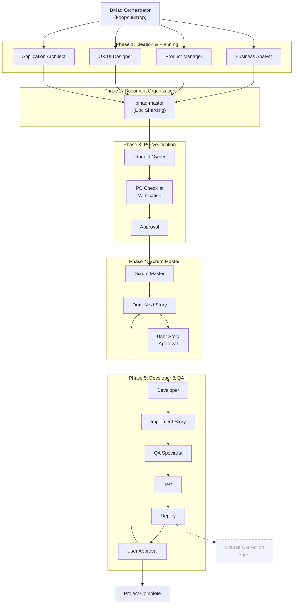

# BMAD Методология - Пътеводител

## Въведение в BMAD

BMAD (Business Model, Architecture, and Development) е иновативна методология за управление на софтуерни проекти, която използва специализирани AI агенти за автоматизиране и оптимизиране на процеса на разработка.

## Ключови агенти и техните роли

### 1. BMad Orchestrator (Главен координатор)
- **Активация**: `@bmad-orchestrator`
- **Роля**: Главен координатор на целия процес
- **Основни функции**:
  - Координира всички останали агенти
  - Помага с избора на подходящия агент за всяка задача
  - Осигурява гладка комуникация между различните етапи от процеса
  - Предоставя общ преглед на състоянието на проекта

### 2. BMad Master (Изпълнител на задачи)
- **Активация**: `@bmad-master`
- **Роля**: Изпълнява конкретни задачи и шаблони
- **Основни функции**:
  - Изпълнява конкретни задачи от методологията
  - Работи с шаблони и чеклисти
  - По-директен и технически фокусиран от Orchestrator

### 3. Бизнес анализатор (Business Analyst Coach)
- **Роля**: Валидиране на идеята и пазарно проучване
- **Основни задачи**:
  - Анализ на пазарните възможности
  - Валидиране на бизнес идеята
  - Дефиниране на MVP (Минимално жизнеспособен продукт)
  - Идентифициране на ключовите изисквания

### 4. Мениджър на продукта (Product Manager)
- **Роля**: Дефиниране на продуктовата визия
- **Основни задачи**:
  - Създаване на продуктова визия и стратегия
  - Дефиниране на детайлни изисквания
  - Приоритизиране на функционалностите
  - Дефиниране на метрики за успех

### 5. UX/UI дизайнер (Design Architect)
- **Роля**: Създаване на потребителски опит
- **Основни задачи**:
  - Проектиране на потребителския интерфейс
  - Създаване на уърфреймове и прототипи
  - Провеждане на потребителски тестове
  - Осигуряване на достъпност и удобство на използване

### 6. Архитект на приложението (Application Architect)
- **Роля**: Дефиниране на техническата архитектура
- **Основни задачи**:
  - Избор на подходящи технологии и рамки
  - Дефиниране на системната архитектура
  - Създаване на стандарти за кодиране
  - Осигуряване на мащабируемост и сигурност

### 7. Собственик на продукта (Product Owner)
- **Роля**: Управление на изискванията
- **Основни задачи**:
  - Разделяне на проекта на управляеми части
  - Приоритизиране на функциите
  - Осигуряване на съответствие с бизнес целите
  - Комуникация между заинтересованите страни

### 8. Scrum майстор (Scrum Master)
- **Роля**: Поддръжка на процеса на разработка
- **Основни задачи**:
  - Управление на ежедневните срещи
  - Премахване на пречки в процеса
  - Подпомагане на екипа да следва избраните практики
  - Осигуряване на ефективна комуникация в екипа

### 9. Разработчик (Developer)
- **Роля**: Имплементация на кода
- **Основни задачи**:
  - Разработване на функционалностите според изискванията
  - Писане и поддръжка на тестове
  - Преглед на код и рефакториране
  - Сътрудничество с QA за осигуряване на качество

### 10. QA специалист (QA Specialist)
- **Роля**: Осигуряване на качеството
- **Основни задачи**:
  - Дефиниране на тестови стратегии
  - Изпълнение на автоматизирани и ръчни тестове
  - Докладване и проследяване на дефекти
  - Уверяване, че продуктът отговаря на изискванията

### 11. Агент за корекция на курса (Course Correction Agent) *(опционален)*
- **Бележка**: Този агент не е част от официалната BMAD Method, но може да се използва като разширение за мониторинг и оптимизация.
- **Роля**: Мониторинг и оптимизация
- **Основни задачи**:
  - Анализ на напредъка на проекта
  - Идентифициране на проблемни области
  - Предлагане на корективни действия
  - Осигуряване на непрекъснато подобрение

## Как да започнете

1. Започнете с извикване на BMad Orchestrator:
   ```
   @bmad-orchestrator
   ```
2. Следвайте инструкциите на Orchestrator, който ще ви насочи към подходящите агенти
3. За конкретни задачи, можете да използвате директно BMad Master:
   ```
   @bmad-master
   ```

## Диаграма на процеса (Mermaid)



### Обяснение на взаимодействията с BMad Master:

1. **Достъп до всички етапи**: BMad Master може да бъде извикан от всеки агент в системата за изпълнение на конкретни задачи.
2. **Изпълнение на задачи**: Изпълнява конкретни задачи, шаблони и автоматизации по заявка от другите агенти.
3. **Техническа поддръжка**: Осигурява техническа подкрепа за изпълнението на задачите в рамките на различните етапи.
4. **Интеграция с инструменти**: Може да интегрира различни инструменти и системи според изискванията на конкретния етап.

## Обяснение на взаимодействията

1. **BMad Orchestrator** е централната точка за координация, която управлява целия процес и осигурява гладкото предаване между етапите.

2. **Първа фаза - Идея и валидация**:
   - Бизнес анализаторът валидира идеята и извършва пазарно проучване
   - Мениджърът на продукта дефинира изискванията
   - UX/UI дизайнерът започва работа върху потребителския опит

3. **Втора фаза - Техническа подготовка**:
   - Архитектът на приложението дефинира техническата архитектура
   - Собственикът на продукта управлява изискванията и приоритизира функциите

4. **Трета фаза - Изпълнение**:
    - Scrum Master координира екипа
    - Разработчиците имплементират решението
    - QA екипът валидира качеството чрез тестове

5. **Обратна връзка и корекции** *(опционално)*:
    - (По избор) Агентът за корекция на курса следи напредъка и прави препоръки за оптимизация
   - При необходимост процесът може да се върне към по-ранна фаза за преоценка
