# Интерактивна онлайн система за самостоятелно обучение
## Техническа спецификация и план за разработка

## Съдържание
1. [Обзор на проекта](#обзор-на-проекта)
2. [Функционални изисквания](#функционални-изисквания)
3. [Техническа архитектура](#техническа-архитектура)
4. [База данни](#база-данни)
5. [Сигурност](#сигурност)
6. [Инфраструктура](#инфраструктура)
7. [План за имплементация](#план-за-имплементация)

---

## 1. Обзор на проекта

### Цел
Създаване на интерактивна онлайн система за самостоятелно обучение с фокус върху:
- Лесна употреба от крайни потребители
- Проследяване на прогреса и оценяване на знанията
- Възможност за монетизация чрез реклами
- Събиране на данни за анализ и научни изследвания

### Технологичен стек
- **Frontend:** React (Codux)
- **Backend:** NestJS микросервиси
- **База данни:** PostgreSQL + Redis
- **Инфраструктура:** Docker, Nginx, Cloudflare
- **Мониторинг:** Prometheus + Grafana

---

## 2. Функционални изисквания

### 2.1. Потребителска автентикация и управление

#### Регистрация
- Регистрация само с email и парола
- Автоматично присвояване на роля 'student'
- Email верификация (препоръчително)

#### Вписване
- Стандартно вписване с email и парола
- JWT базирана автентикация
- Refresh token механизъм

#### Възстановяване на парола
- Изпращане на уникален линк на email
- Временен токен с ограничена валидност
- Сигурна форма за нова парола

#### Администраторски достъп
- Ръчно създаване на admin потребител (не през публичен API)
- Разширени права за управление на системата

### 2.2. Учебно съдържание

#### Курсове и глави
- Йерархична структура: Курс → Глави → Съдържание
- Поддръжка на различни типове съдържание (текст, видео, изображения)
- Версиониране на съдържанието

#### Проследяване на прогреса
- Автоматично проследяване при достигане край на страница
- Ръчно маркиране като "прочетено"
- Бутон "Следваща глава" с автоматично записване
- Измерване на време прекарано на страница
- Персонални статистики за напредък

### 2.3. Тестове и оценяване

#### Функционалности
- Различни типове въпроси (единичен избор, множествен избор, свободен текст)
- Времеви ограничения
- Автоматично оценяване
- Детайлни резултати и обратна връзка

#### Анализ и отчети
- Индивидуални резултати
- Агрегирани статистики
- Експорт на данни за изследвания

### 2.4. Рекламна система

#### Anti-adblocker стратегия
- Сървърно-рендерирани реклами
- Вградени изображения от същия домейн
- Динамични CSS класове
- Base64 кодирани изображения
- Избягване на ключови думи като "ad", "banner"

#### Функционалности
- Управление на рекламни кампании
- Проследяване на импресии и кликове
- Таргетиране по потребителски групи

---

## 3. Техническа архитектура

### 3.1. Микросервисна архитектура

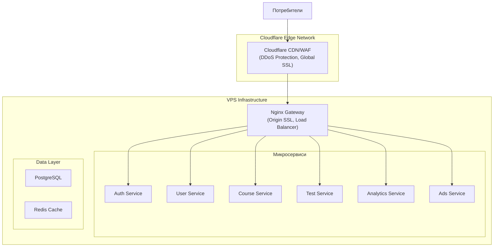

### 3.2. Описание на микросервисите

#### Auth Service
- JWT token management
- Регистрация и вписване
- Възстановяване на пароли
- Session management

#### User Service
- Потребителски профили
- Управление на роли
- Потребителски настройки

#### Course Service
- CRUD операции за курсове
- Управление на съдържание
- Версиониране
- Проследяване на прогрес

#### Test Service
- Управление на тестове
- Обработка на отговори
- Оценяване и резултати

#### Analytics Service
- Събиране на данни
- Генериране на отчети
- Експорт функционалности

#### Ads Service
- Управление на реклами
- Anti-adblocker механизми
- Статистики и отчети

### 3.3. Детайлни схеми на микросервисите

#### Auth Service Schema

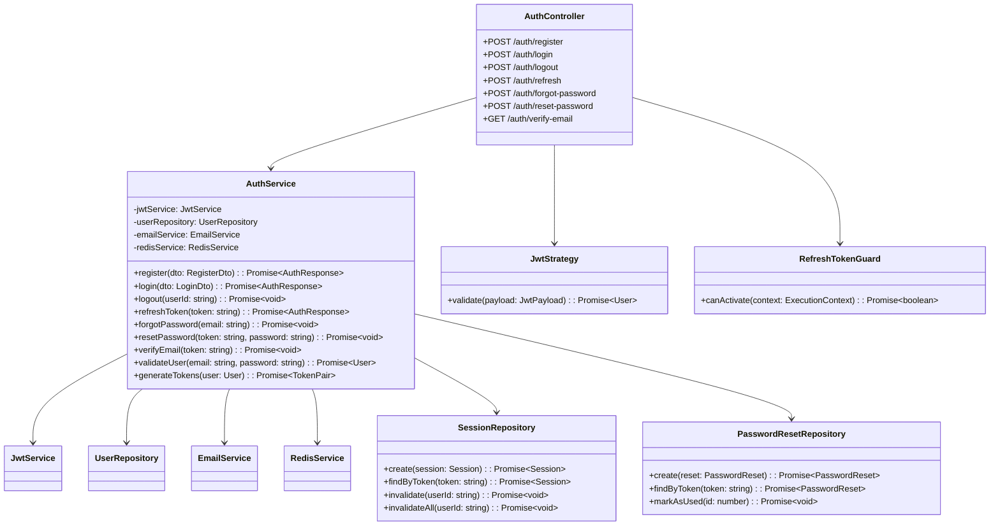

#### User Service Schema

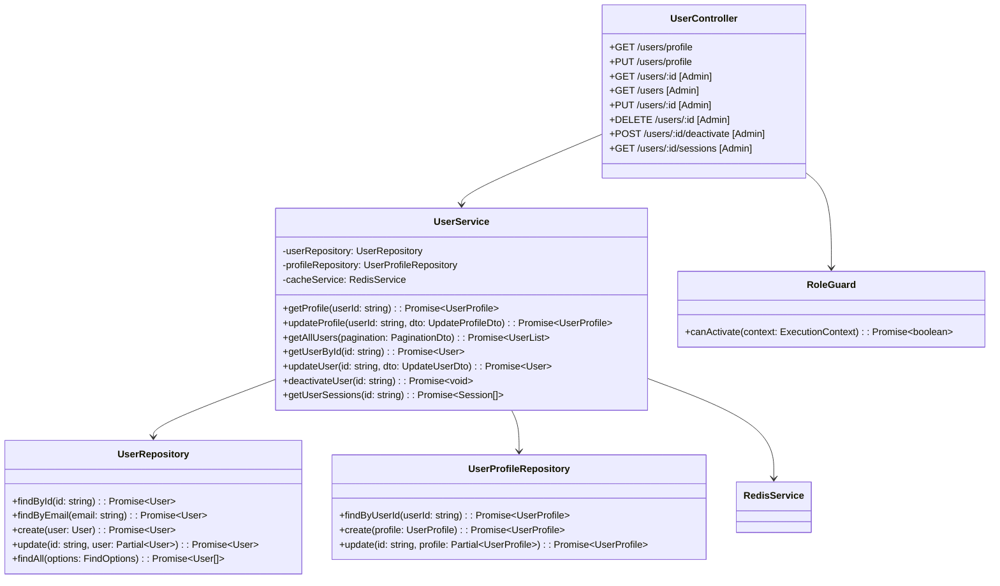

#### Course Service Schema

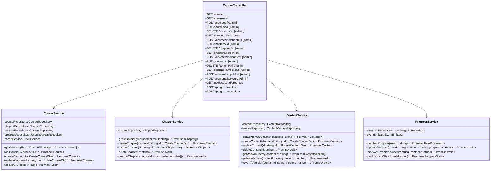

#### Test Service Schema

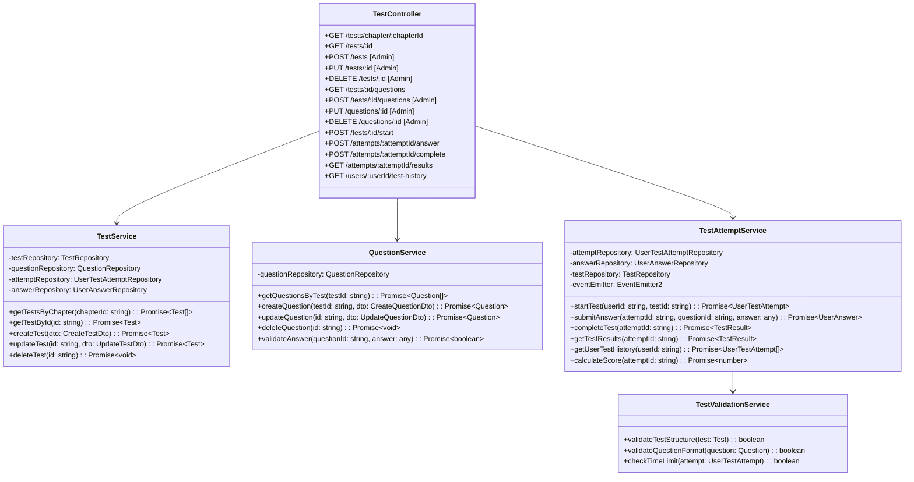

#### Analytics Service Schema

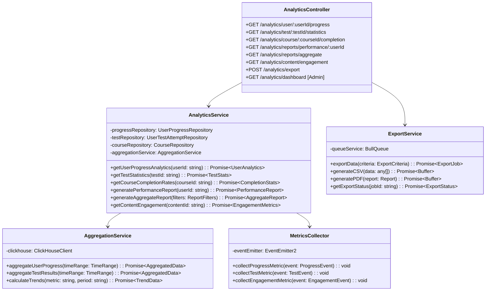

#### Ads Service Schema

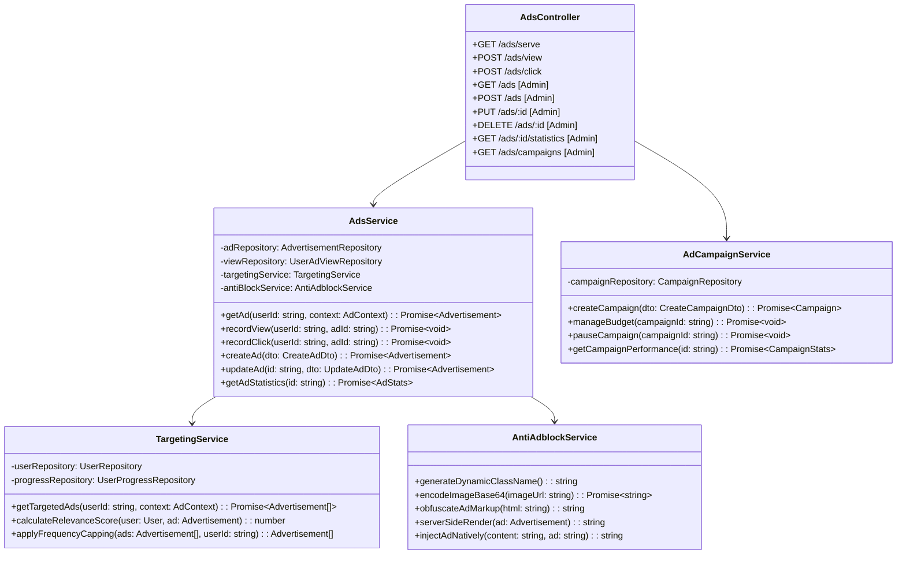

### 3.4. Междусервисна комуникация

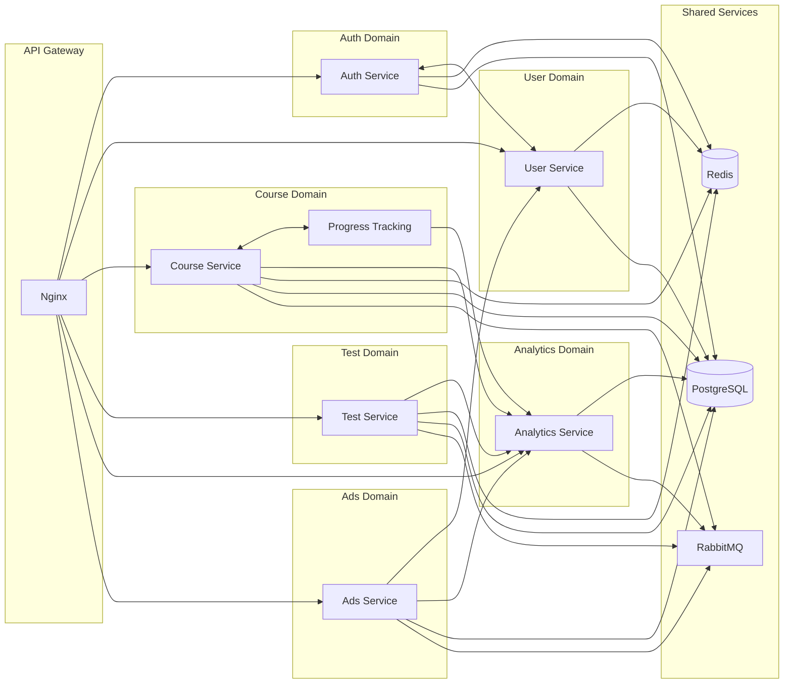

---

## 4. База данни

### 4.1. Схема на базата данни

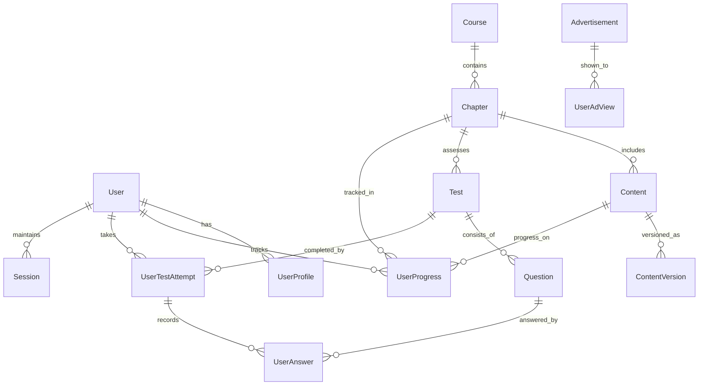

### 4.2. Ключови таблици

#### User
- Основна информация за автентикация
- Роли и права
- Security fields (failed_login_attempts, last_login)

#### Course/Chapter/Content
- Йерархична структура на учебното съдържание
- Поддръжка на версиониране
- Метаданни и настройки

#### UserProgress
- Детайлно проследяване на напредъка
- Време прекарано на съдържание
- Процент на завършеност

#### Test/Question/UserAnswer
- Гъвкава система за тестове
- Различни типове въпроси
- Детайлни резултати

---

## 5. Сигурност

### 5.1. Многопластова защита

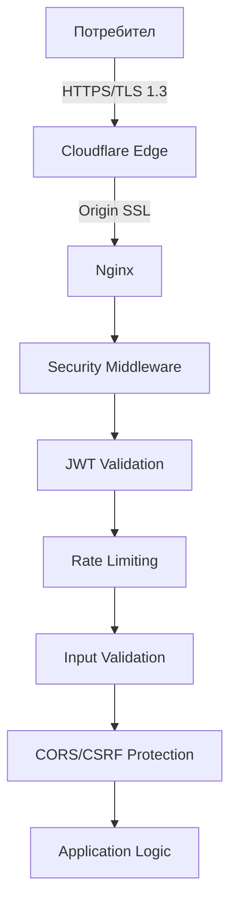

### 5.2. Ключови мерки за сигурност

#### Транспортен слой
- Cloudflare Edge SSL + Origin Certificate
- HSTS headers
- TLS 1.3 only

#### Автентикация и оторизация
- JWT с кратък access token (15-60 мин)
- Refresh tokens в HttpOnly cookies
- Ролеви модел на достъп

#### Защита от атаки
- **XSS:** CSP headers, output encoding, input sanitization
- **CSRF:** Double-submit cookies, SameSite attributes
- **SQL Injection:** ORM с параметризирани заявки
- **DDoS:** Cloudflare автоматична защита
- **Rate Limiting:** На ниво API endpoints

#### Защита на данните
- Bcrypt/Argon2 за пароли
- Уникални соли за всяка парола
- Валидация и санитизация на входните данни
- Audit logging за критични операции

### 5.3. Environment-based конфигурация

```typescript
// Development: Relaxed security за по-лесно тестване
// Test: Минимална security overhead
// Production: Максимална защита по подразбиране
```

---

## 6. Инфраструктура

### 6.1. VPS спецификации
- **CPU:** 6 vCPU ядра
- **RAM:** 12 GB
- **Storage:** 200 GB SSD / 100 GB NVMe
- **Traffic:** 32 TB

### 6.2. Разпределение на ресурсите

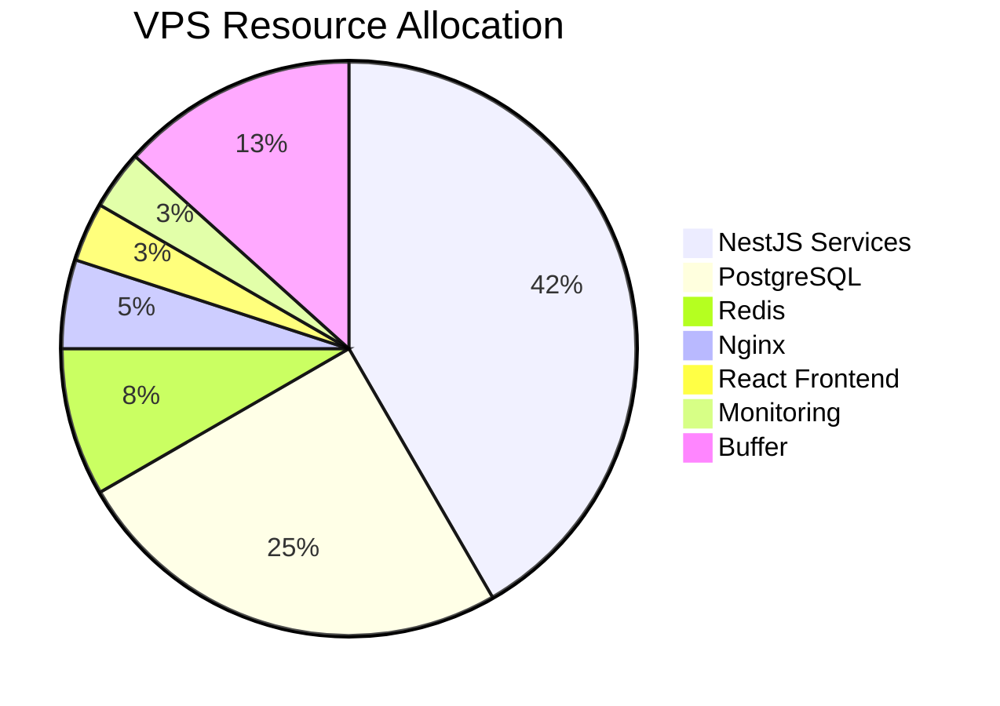

### 6.3. Cloudflare интеграция

#### Предимства
- 60-80% намаляване на директен трафик
- Глобална CDN мрежа (300+ locations)
- Автоматична DDoS защита
- WAF и bot protection
- Origin IP скриване

#### Конфигурация
```yaml
ssl_mode: "Full (strict)"
security_level: "Medium"
always_use_https: true
hsts_enabled: true
bot_fight_mode: true
minify:
  css: true
  js: true
  html: true
```

### 6.4. Docker композиция

```yaml
version: '3.8'
services:
  nginx:
    image: nginx:alpine
    volumes:
      - ./nginx.conf:/etc/nginx/nginx.conf
      - /etc/ssl/cloudflare:/etc/ssl/cloudflare
    ports:
      - "80:80"
      - "443:443"
  
  postgres:
    image: postgres:15-alpine
    environment:
      POSTGRES_DB: learning_platform
      POSTGRES_USER: ${DB_USER}
      POSTGRES_PASSWORD: ${DB_PASSWORD}
    volumes:
      - postgres_data:/var/lib/postgresql/data
  
  redis:
    image: redis:7-alpine
    command: redis-server --requirepass ${REDIS_PASSWORD}
  
  # Микросервиси...
```

---

## 7. План за имплементация

### Фаза 1: Основна инфраструктура (1-2 седмици)
- [ ] Настройка на VPS и Docker среда
- [ ] Конфигурация на Cloudflare
- [ ] Настройка на Nginx с Origin SSL
- [ ] PostgreSQL и Redis setup
- [ ] Основна CI/CD pipeline

### Фаза 2: Автентикация и потребители (2-3 седмици)
- [ ] Auth Service с JWT
- [ ] User Service
- [ ] Регистрация и вписване
- [ ] Възстановяване на пароли
- [ ] Admin функционалности

### Фаза 3: Учебно съдържание (3-4 седмици)
- [ ] Course Service
- [ ] Content management
- [ ] Версиониране
- [ ] Progress tracking
- [ ] Frontend за преглед на курсове

### Фаза 4: Тестове и оценяване (2-3 седмици)
- [ ] Test Service
- [ ] Различни типове въпроси
- [ ] Автоматично оценяване
- [ ] Резултати и статистики

### Фаза 5: Анализи и реклами (2 седмици)
- [ ] Analytics Service
- [ ] Ads Service с anti-adblocker
- [ ] Отчети и експорт

### Фаза 6: Финализиране (1-2 седмици)
- [ ] Security audit
- [ ] Performance optimization
- [ ] Мониторинг setup
- [ ] Документация
- [ ] Deployment

### Общо време за разработка: ~13-16 седмици

---

## Допълнителни препоръки

### Бъдещи подобрения
1. **Мобилно приложение** - React Native за по-добра мобилна поддръжка
2. **Gamification** - точки, значки, класации за мотивация
3. **AI асистент** - персонализирани препоръки за обучение
4. **Live sessions** - възможност за уебинари и live обучения
5. **Интеграции** - Google Calendar, Zoom, MS Teams

### Технически подобрения
1. **GraphQL** - за по-ефективно извличане на данни
2. **WebSockets** - за real-time функционалности
3. **Elasticsearch** - за подобрено търсене в съдържанието
4. **S3 storage** - за медийни файлове
5. **Kubernetes** - при нужда от по-сериозно скалиране

### Мониторинг и поддръжка
1. **Automated backups** - ежедневни бекъпи на БД
2. **Health checks** - автоматични проверки на услугите
3. **Error tracking** - Sentry или подобен инструмент
4. **A/B testing** - за оптимизиране на UX
5. **User feedback** - система за обратна връзка