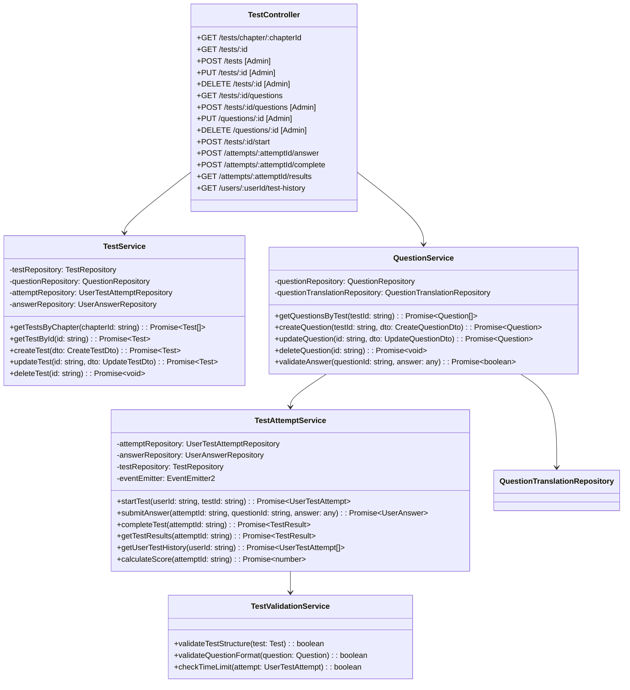
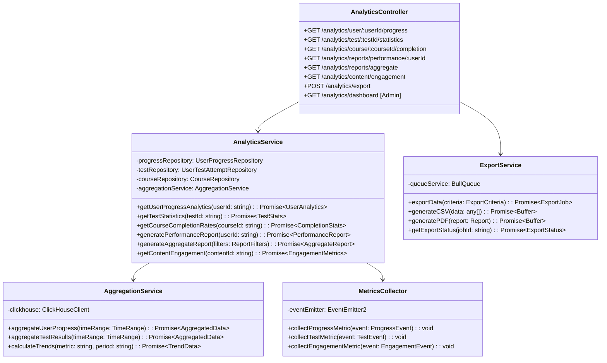
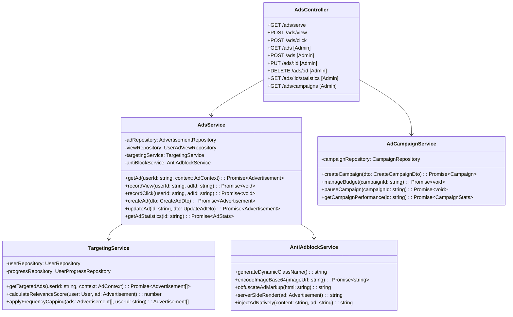

# Допълнителни схеми на микросервисите

## Test Service Schema (продължение)

```mermaid
classDiagram
    class TestController {
        +GET /tests/chapter/:chapterId
        +GET /tests/:id
        +POST /tests [Admin]
        +PUT /tests/:id [Admin]
        +DELETE /tests/:id [Admin]
        +GET /tests/:id/questions
        +POST /tests/:id/questions [Admin]
        +PUT /questions/:id [Admin]
        +DELETE /questions/:id [Admin]
        +POST /tests/:id/start
        +POST /attempts/:attemptId/answer
        +POST /attempts/:attemptId/complete
        +GET /attempts/:attemptId/results
        +GET /users/:userId/test-history
    }
    
    class TestService {
        -testRepository: TestRepository
        -questionRepository: QuestionRepository
        -attemptRepository: UserTestAttemptRepository
        -answerRepository: UserAnswerRepository
        +getTestsByChapter(chapterId: string): Promise~Test[]~
        +getTestById(id: string): Promise~Test~
        +createTest(dto: CreateTestDto): Promise~Test~
        +updateTest(id: string, dto: UpdateTestDto): Promise~Test~
        +deleteTest(id: string): Promise~void~
    }
    
    class QuestionService {
        -questionRepository: QuestionRepository
        -questionTranslationRepository: QuestionTranslationRepository
        +getQuestionsByTest(testId: string): Promise~Question[]~
        +createQuestion(testId: string, dto: CreateQuestionDto): Promise~Question~
        +updateQuestion(id: string, dto: UpdateQuestionDto): Promise~Question~
        +deleteQuestion(id: string): Promise~void~
        +validateAnswer(questionId: string, answer: any): Promise~boolean~
    }
    
    class TestAttemptService {
        -attemptRepository: UserTestAttemptRepository
        -answerRepository: UserAnswerRepository
        -testRepository: TestRepository
        -eventEmitter: EventEmitter2
        +startTest(userId: string, testId: string): Promise~UserTestAttempt~
        +submitAnswer(attemptId: string, questionId: string, answer: any): Promise~UserAnswer~
        +completeTest(attemptId: string): Promise~TestResult~
        +getTestResults(attemptId: string): Promise~TestResult~
        +getUserTestHistory(userId: string): Promise~UserTestAttempt[]~
        +calculateScore(attemptId: string): Promise~number~
    }
    
    class TestValidationService {
        +validateTestStructure(test: Test): boolean
        +validateQuestionFormat(question: Question): boolean
        +checkTimeLimit(attempt: UserTestAttempt): boolean
    }
    
    TestController --> TestService
    TestController --> QuestionService
    QuestionService --> QuestionTranslationRepository
    QuestionService --> TestAttemptService
    TestAttemptService --> TestValidationService
```

## Analytics Service Schema

```mermaid
classDiagram
    class AnalyticsController {
        +GET /analytics/user/:userId/progress
        +GET /analytics/test/:testId/statistics
        +GET /analytics/course/:courseId/completion
        +GET /analytics/reports/performance/:userId
        +GET /analytics/reports/aggregate
        +GET /analytics/content/engagement
        +POST /analytics/export
        +GET /analytics/dashboard [Admin]
    }
    
    class AnalyticsService {
        -progressRepository: UserProgressRepository
        -testRepository: UserTestAttemptRepository
        -courseRepository: CourseRepository
        -aggregationService: AggregationService
        +getUserProgressAnalytics(userId: string): Promise~UserAnalytics~
        +getTestStatistics(testId: string): Promise~TestStats~
        +getCourseCompletionRates(courseId: string): Promise~CompletionStats~
        +generatePerformanceReport(userId: string): Promise~PerformanceReport~
        +generateAggregateReport(filters: ReportFilters): Promise~AggregateReport~
        +getContentEngagement(contentId: string): Promise~EngagementMetrics~
    }
    
    class AggregationService {
        -clickhouse: ClickHouseClient
        +aggregateUserProgress(timeRange: TimeRange): Promise~AggregatedData~
        +aggregateTestResults(timeRange: TimeRange): Promise~AggregatedData~
        +calculateTrends(metric: string, period: string): Promise~TrendData~
    }
    
    class ExportService {
        -queueService: BullQueue
        +exportData(criteria: ExportCriteria): Promise~ExportJob~
        +generateCSV(data: any[]): Promise~Buffer~
        +generatePDF(report: Report): Promise~Buffer~
        +getExportStatus(jobId: string): Promise~ExportStatus~
    }
    
    class MetricsCollector {
        -eventEmitter: EventEmitter2
        +collectProgressMetric(event: ProgressEvent): void
        +collectTestMetric(event: TestEvent): void
        +collectEngagementMetric(event: EngagementEvent): void
    }
    
    AnalyticsController --> AnalyticsService
    AnalyticsService --> AggregationService
    AnalyticsController --> ExportService
    AnalyticsService --> MetricsCollector
```

## Ads Service Schema

```mermaid
classDiagram
    class AdsController {
        +GET /ads/serve
        +POST /ads/view
        +POST /ads/click
        +GET /ads [Admin]
        +POST /ads [Admin]
        +PUT /ads/:id [Admin]
        +DELETE /ads/:id [Admin]
        +GET /ads/:id/statistics [Admin]
        +GET /ads/campaigns [Admin]
    }
    
    class AdsService {
        -adRepository: AdvertisementRepository
        -viewRepository: UserAdViewRepository
        -targetingService: TargetingService
        -antiBlockService: AntiAdblockService
        +getAd(userId: string, context: AdContext): Promise~Advertisement~
        +recordView(userId: string, adId: string): Promise~void~
        +recordClick(userId: string, adId: string): Promise~void~
        +createAd(dto: CreateAdDto): Promise~Advertisement~
        +updateAd(id: string, dto: UpdateAdDto): Promise~Advertisement~
        +getAdStatistics(id: string): Promise~AdStats~
    }
    
    class TargetingService {
        -userRepository: UserRepository
        -progressRepository: UserProgressRepository
        +getTargetedAds(userId: string, context: AdContext): Promise~Advertisement[]~
        +calculateRelevanceScore(user: User, ad: Advertisement): number
        +applyFrequencyCapping(ads: Advertisement[], userId: string): Advertisement[]
    }
    
    class AntiAdblockService {
        +generateDynamicClassName(): string
        +encodeImageBase64(imageUrl: string): Promise~string~
        +obfuscateAdMarkup(html: string): string
        +serverSideRender(ad: Advertisement): string
        +injectAdNatively(content: string, ad: string): string
    }
    
    class AdCampaignService {
        -campaignRepository: CampaignRepository
        +createCampaign(dto: CreateCampaignDto): Promise~Campaign~
        +manageBudget(campaignId: string): Promise~void~
        +pauseCampaign(campaignId: string): Promise~void~
        +getCampaignPerformance(id: string): Promise~CampaignStats~
    }
    
    AdsController --> AdsService
    AdsService --> TargetingService
    AdsService --> AntiAdblockService
    AdsController --> AdCampaignService
```
