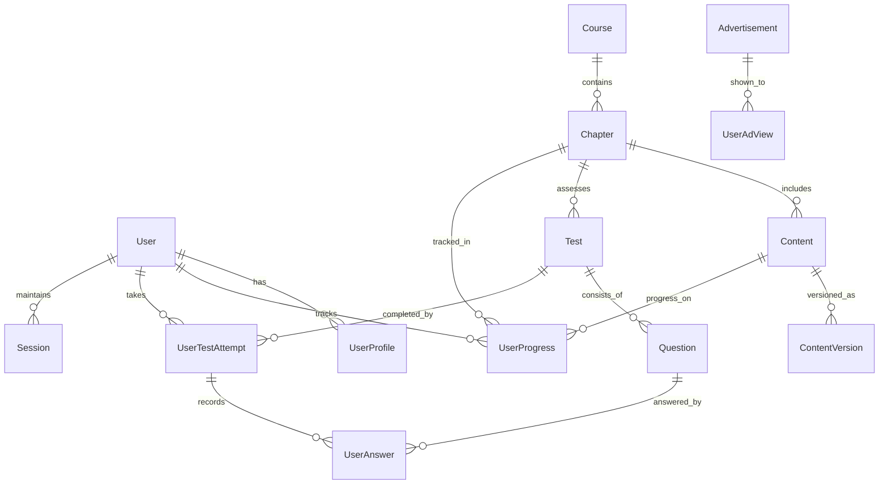

# База данни

## Схема на базата данни

## Ключови таблици

### User
- Основна информация за автентикация
- Роли и права
- Security fields (failed_login_attempts, last_login)

### Course/Chapter/Content
- Йерархична структура на учебното съдържание
- Поддръжка на версиониране
- Метаданни и настройки

### UserProgress
- Детайлно проследяване на напредъка
- Време прекарано на съдържание
- Процент на завършеност

### Test/Question/UserAnswer
- Гъвкава система за тестове
- Различни типове въпроси
- Детайлни резултати

## Оптимизационни стратегии

1. Индексиране на често използвани полета
2. Кеширане на често достъпвани данни в Redis
3. Партициониране на големи таблици за по-добра производителност 
4. Периодично архивиране на стари данни
5. Оптимизирани заявки с внимателно проектирани JOIN операции
