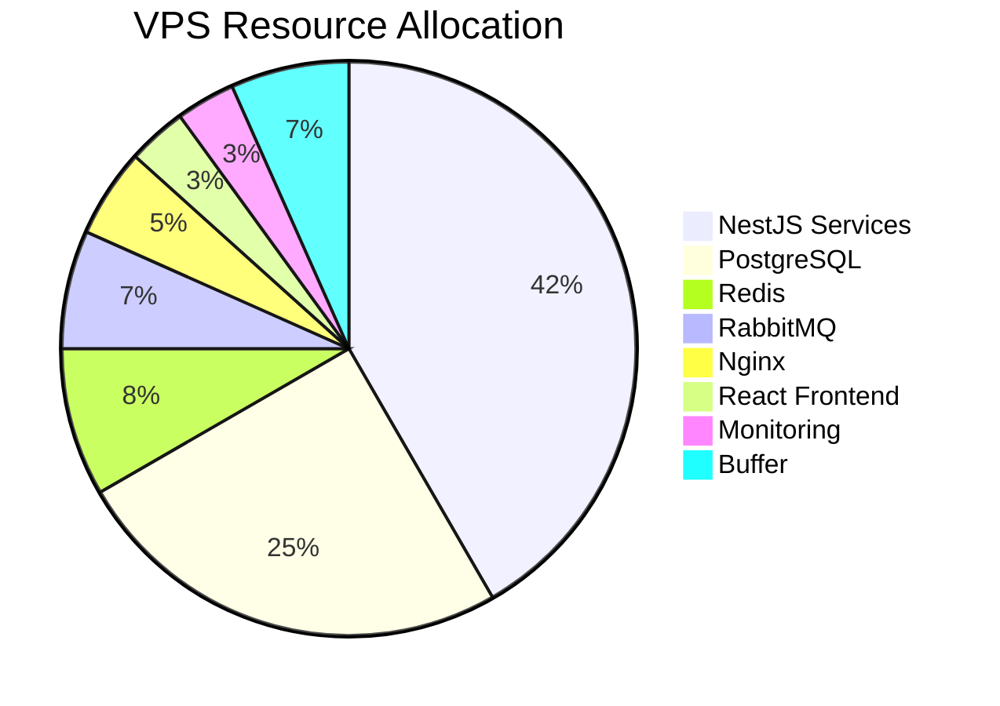

# Инфраструктура

## VPS спецификации
- **CPU:** 6 vCPU ядра
- **RAM:** 12 GB
- **Storage:** 200 GB SSD / 100 GB NVMe
- **Traffic:** 32 TB

## Разпределение на ресурсите



## Cloudflare интеграция

### Предимства
- 60-80% намаляване на директен трафик
- Глобална CDN мрежа (300+ locations)
- Автоматична DDoS защита
- WAF и bot protection
- Origin IP скриване

### Конфигурация
```yaml
ssl_mode: "Full (strict)"
security_level: "Medium"
always_use_https: true
hsts_enabled: true
bot_fight_mode: true
minify:
  css: true
  js: true
  html: true
```

## Docker композиция

```yaml
version: '3.8'
services:
  nginx:
    image: nginx:alpine
    volumes:
      - ./nginx.conf:/etc/nginx/nginx.conf
      - /etc/ssl/cloudflare:/etc/ssl/cloudflare
    ports:
      - "80:80"
      - "443:443"
  
  postgres:
    image: postgres:15-alpine
    environment:
      POSTGRES_DB: learning_platform
      POSTGRES_USER: ${DB_USER}
      POSTGRES_PASSWORD: ${DB_PASSWORD}
    volumes:
      - postgres_data:/var/lib/postgresql/data
  
  redis:
    image: redis:7-alpine
    command: redis-server --requirepass ${REDIS_PASSWORD}
  
  # Микросервиси...
```

## Мониторинг и наблюдаемост

### Основни компоненти
- Prometheus за събиране на метрики
- Grafana за визуализация
- Loki за централизирано събиране на логове
- Alertmanager за известия и аларми

### Ключови метрики
- Системни метрики: CPU, RAM, Disk I/O
- Сервизни метрики: Response time, Error rates
- Бизнес метрики: Активни потребители, Завършени курсове

### Disaster Recovery & Backup

### RPO / RTO Targets
| Resource | RPO | RTO |
|----------|-----|-----|
| PostgreSQL | 15 min | 60 min |
| Redis | 5 min | 15 min |
| S3 Assets | 24 h | 24 h |

### Backup Schedule
- PostgreSQL: WAL + nightly full dump (S3)
- Redis: RDB snapshot every 5 min (S3)
- S3 static assets: Cross-region replication + lifecycle to Glacier

### Restore Playbook
1. Declare incident, switch system to read-only
2. Provision new DB from latest snapshot
3. Replay WAL to target point
4. Smoke tests + SLO validation
5. Reopen writes

### Testing & Exercises
- Quarterly restore drill (table-top + live)

## CI/CD автоматизация
- Автоматизирани тестове във всяка фаза
- Стриктни quality gates преди deployment
- Zero-downtime deployment процес
