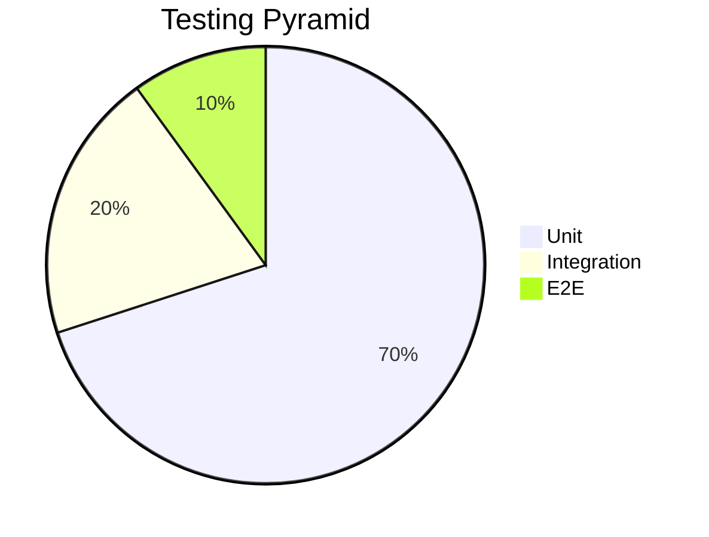

# Тестова стратегия

## 1. Цели

- Осигуряване на високо качество на кода и функционална коректност
- Ранно откриване на дефекти чрез автоматизирани тестове
- 80%+ code coverage за critical path
- Лесно проследяване на покритието на всички user stories

## 2. Тестова пирамида



## 3. Видове тестове

| Ниво | Инструменти | Описание | Изпълнение |
|------|-------------|----------|------------|
| **Unit** | Jest, ts-mockito | Тест на единични функции/класове | При всеки commit (CI) |
| **Integration** | Jest + Docker Compose | Тест на взаимодействие между компоненти и DB/Redis | Nightly CI + PR label `needs-integration` |
| **Contract (Pact)** | Pactum | Проверка за съвместимост между услуги | Nightly |
| **E2E** | Supertest (API), k6 (load) | Тестира пълни API пътеки | Pre-release |
| **Security** | OWASP ZAP | DAST сканиране | През седмица |

## 4. Процес на разработка (TDD-lite)

1. **Създай user story / задача** в Jira (пример: `COURSE-123`).
2. Дефинирай критерии за приемане (Given/When/Then).
3. **Добави тестове** към същия branch:
   - Unit тестове за бизнес логика
   - Когато е необходимо – integration тестове (например нова DB транзакция)
4. PR не може да бъде merge-нат без:
   - ✔ зелени тестове
   - ✔ 80%+ покритие на модифицираните файлове
   - ✔ review от друг разработчик

## 5. Структура на тестовите директории

```
[service]/
└── test/
    ├── unit/
    ├── integration/
    ├── contract/
    └── e2e/
```

## 6. Интеграция с CI/CD

- GitHub Actions jobs:
  1. `test:unit` – изпълнява Jest unit тестове
  2. `test:int` – пуска docker-compose stack и integration тестове
  3. `test:e2e` – изпълнява Supertest срещу билднат образ
  4. `test:coverage` – качва lcov към SonarQube
- Праг на покритие: `"global": { "branches": 80, "functions": 80, "lines": 80 }`

## 7. Трейсабилити към user stories

- Използваме GitHub Conventional Commits: `feat(COURSE-123): add progress endpoint`
- Jest `--json` репорт се качва и свързва PR-а с Jira ticket

## 8. Непрекъснато подобрение

- Ежеседмичен Quality Report в Grafana
- 5 Whys анализ при възникнал production bug
- Рефакторинг на тестове, когато покритието падне < 80%
