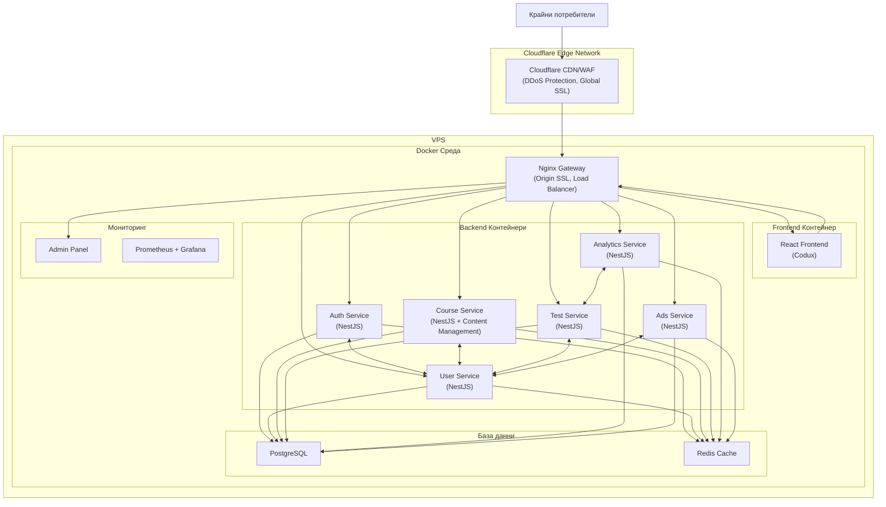
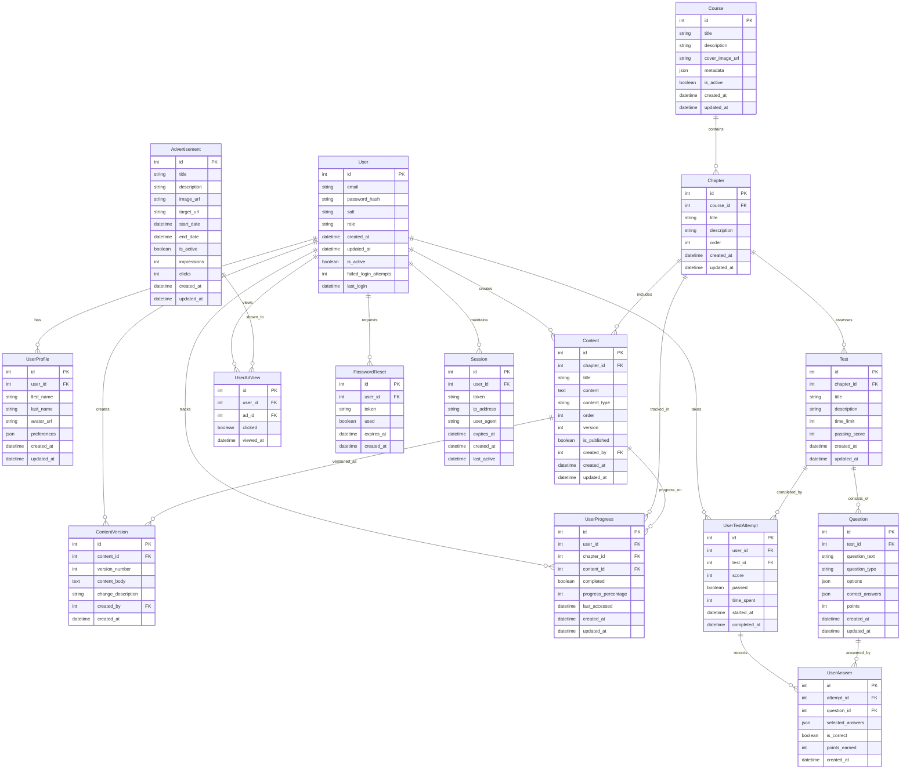
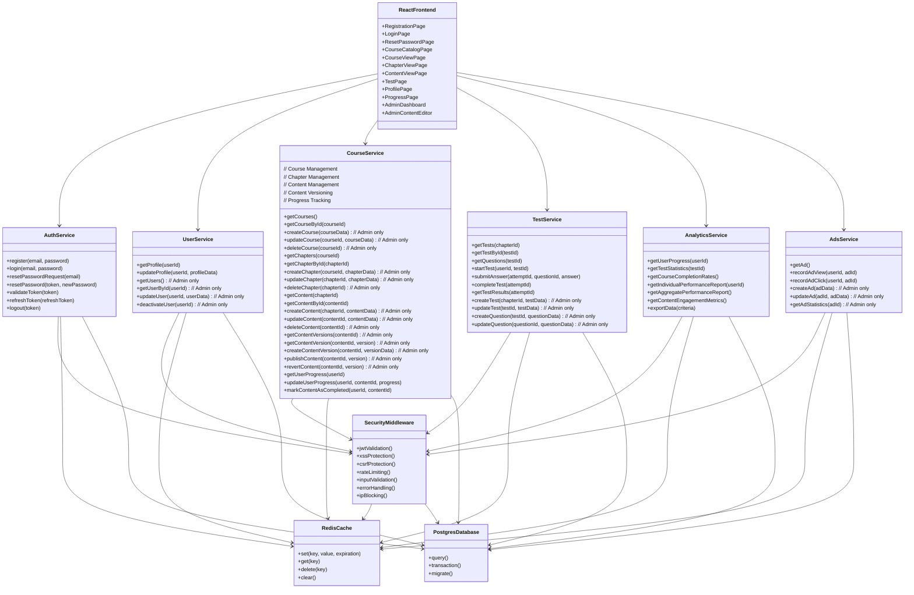
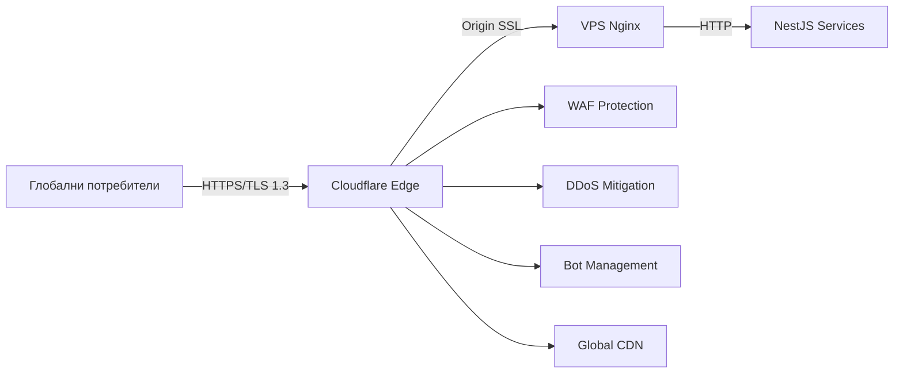
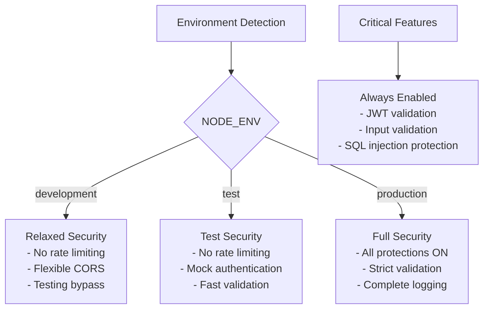
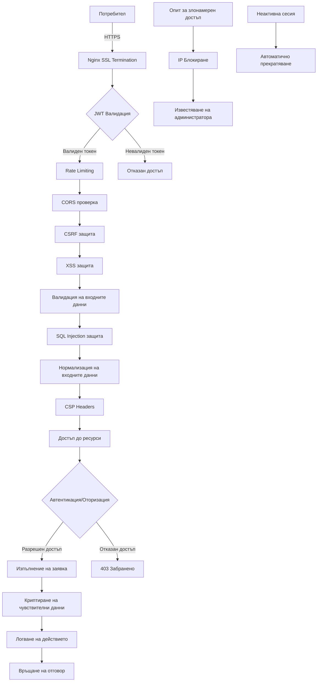
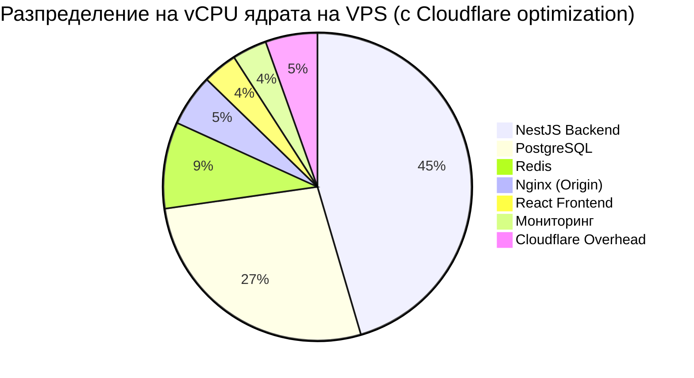

# Архитектура на интерактивна онлайн система за самостоятелно обучение

## Обща системна архитектура

## Структура на базата данни (ER диаграма)

## Компонентна диаграма на системата

## Cloudflare Integration Layer

Cloudflare служи като първа линия на защита и performance optimization:

### Cloudflare функционалности:
- **Edge CDN** - глобално разпространение на съдържанието с 300+ локации
- **DDoS Protection** - автоматична защита до 100+ Tbps без допълнителна конфигурация
- **Web Application Firewall** - блокиране на OWASP Top 10 атаки
- **Origin Protection** - скриване на VPS IP адреса от публичен достъп
- **SSL Management** - автоматично SSL/TLS handling с Modern encryption
- **Performance Optimization** - compression, minification, HTTP/2
- **Analytics** - detailed traffic и security insights

## Environment-based Security Configuration

Системата използва environment-driven подход за управление на защитите:

### Security Feature Categories:
- **Critical** (винаги включени): JWT validation, Input validation, SQL injection protection
- **Important** (изключени в dev/test): Rate limiting, CSRF protection, Strict CORS
- **Optional** (configurable): Detailed logging, Performance monitoring

## Сигурност и защитни механизми

## Разпределение на ресурсите на VPS

*Забележка: Cloudflare намалява натоварването на VPS с 60-80% заради edge caching и traffic filtering.*

## Подробно описание на архитектурата

### 1. Основна архитектура

Предложената архитектура е базирана на **микросервисен подход**, но e опростена и оптимизирана за посочените VPS ресурси. Основните компоненти са:

- **Cloudflare Edge Network** - служи като първа линия на защита и CDN, осигурява глобална дистрибуция, DDoS защита и SSL терминиране
- **Nginx Gateway** - служи като входна точка към VPS системата, осигурява Origin SSL терминиране, балансиране на натоварването и Real IP detection от Cloudflare
- **React Frontend** - изграден с Codux, респонсивен и оптимизиран за различни устройства
- **Backend микросервиси** - изградени с NestJS:
  - **Auth Service** - управлява всички процеси по автентикация
  - **User Service** - управлява потребителски данни и профили
  - **Course Service** - управлява курсове, глави, учебно съдържание с версиониране и проследяване на прогреса
  - **Test Service** - управлява тестове, въпроси и отговори
  - **Analytics Service** - събира и анализира данни от използването на системата
  - **Ads Service** - управлява показването на реклами
- **БД слой** - PostgreSQL за постоянно съхранение и Redis за кеширане
- **Admin Panel** - за управление на системата
- **Мониторинг** - Prometheus и Grafana за наблюдение на производителността

### 2. База данни и модел на данните

Базата данни е проектирана с мисъл за:
- **Нормализация** - за намаляване на дублирането
- **Индексиране** - за оптимално търсене
- **Връзки между таблиците** - за поддържане на интегритет на данните
- **JSON полета** - за гъвкавост при необходимост
- **Времеви маркери** - за проследяване на създаване и промени
- **Версиониране на съдържанието** - за проследяване на промени и възможност за връщане към предишни версии

Основни таблици включват:
- **User** - съхранява основна потребителска информация
- **UserProfile** - разширена информация за потребителя
- **Course**, **Chapter**, **Content** - учебно съдържание
- **ContentVersion** - версиониране на съдържанието
- **Test**, **Question**, **UserTestAttempt**, **UserAnswer** - тестове и отговори
- **Advertisement**, **UserAdView** - рекламна система
- **UserProgress** - проследяване на прогреса на потребителя
- **PasswordReset**, **Session** - управление на сесии и рестартиране на пароли

### 3. Разширена функционалност на Course Service

Course Service сега включва цялостно управление на съдържанието:

#### 3.1 Управление на курсове и глави
- CRUD операции за курсове
- CRUD операции за глави
- Йерархична структура на съдържанието

#### 3.2 Управление на съдържанието
- CRUD операции за съдържание
- Поддръжка на различни типове съдържание (text, video, image, etc.)
- Rich text editing capabilities

#### 3.3 Версиониране на съдържанието
- Автоматично създаване на версии при всяка промяна
- Преглед на история на промените
- Възможност за връщане към предишни версии
- Публикуване на конкретни версии
- Draft/Published states

#### 3.4 Проследяване на прогреса
- Автоматично записване на прогреса при преглед на съдържание
- Ръчно маркиране като завършено
- Проследяване на времето прекарано върху съдържанието
- Персонални статистики

### 4. Cloudflare Integration

Cloudflare осигурява enterprise-level защита и performance без допълнителни разходи:

#### 4.1 Сигурност
- **DDoS Protection** - автоматична защита до 100+ Tbps
- **WAF Protection** - блокиране на OWASP Top 10 атаки
- **Bot Management** - sophisticated bot detection
- **Origin Protection** - VPS IP адресът е скрит от публичен достъп

#### 4.2 Performance
- **Global CDN** - 300+ edge locations по света
- **Compression** - automatic гзip/brotli compression
- **HTTP/2 & HTTP/3** - modern protocols support
- **Caching** - intelligent edge caching

#### 4.3 SSL/TLS Management
- **Universal SSL** - free SSL certificate за домейна
- **Origin Certificate** - 15-годишен certificate за VPS
- **TLS 1.3** - latest encryption standards
- **HSTS** - strict transport security

### 5. Environment-based Security

Системата използва адаптивен подход към сигурността според environment:

#### 5.1 Development Environment
- Relaxed CORS settings за local testing
- Disabled rate limiting за development productivity
- Enhanced logging за debugging
- Testing bypass mechanisms

#### 5.2 Testing Environment
- Minimal security overhead за fast test execution
- Mock authentication services
- Isolated test data
- Automated security testing

#### 5.3 Production Environment
- Maximum security enforcement
- All protection mechanisms active
- Comprehensive audit logging
- Real-time security monitoring

### 6. Сигурност

Архитектурата включва многопластов подход към сигурността:
- **Транспортен слой**: HTTPS с Cloudflare Edge SSL + Origin SSL
- **Автентикация**: JWT токени с кратък срок на валидност
- **Оторизация**: Ролеви модел (потребител/администратор)
- **Защита от атаки**: XSS, CSRF, SQL Injection, Rate Limiting
- **Защита на входните данни**: Валидация, нормализация, дезинфекция
- **Защита на паролите**: Хеширане със соли и pepper
- **Сесийна сигурност**: Управление на сесии, автоматично излизане при неактивност
- **Мониторинг и логване**: Проследяване на подозрителни дейности, блокиране на IP адреси

### 7. Реклами без adblocker блокиране

За реализация на рекламите, които да не се блокират от adblocker-и, препоръчвам:

1. **Вградени картинки от същия домейн** - adblocker-ите най-често блокират външни домейни
2. **Динамично генериране на имена на CSS класове** - избягва блокиране базирано на класове
3. **Вградени картинки с Base64 кодиране** - трудно се блокират
4. **Сървърно-рендерирани реклами** - интегрирани директно в HTML
5. **Избягване на ключови думи** като "ad", "banner", "sponsor" в CSS и HTML

### 8. Проследяване на прогреса

За проследяване на прогреса на потребителя предлагам:

1. **Автоматично проследяване на прегледаното съдържание** - системата да отбелязва автоматично, когато потребителят достигне до края на страницата
2. **Бутон "Маркирай като прочетено"** - за случаите, когато потребителят иска да отбележи ръчно
3. **Бутон "Следваща глава"** - както споменахте, да записва прогреса при преминаване
4. **Проследяване на времето прекарано на страницата** - за по-точна метрика
5. **Тестове за валидиране на знания** - за да се гарантира, че потребителят не само е преминал, но и е усвоил материала

### 9. Мащабируемост и разширяемост

Архитектурата е проектирана с мисъл за бъдещо разширяване:

1. **Микросервисна архитектура** - позволява добавяне на нови услуги без да се засягат съществуващите
2. **Контейнеризация с Docker** - лесно мащабиране на отделни компоненти
3. **Cloudflare CDN** - глобална дистрибуция без infrastruktura промени
4. **Кеширане с Redis** - подобряване на производителността
5. **API-first подход** - лесно интегриране с мобилни приложения в бъдеще
6. **Опашки за обработка на тежки задачи** - при нужда от генериране на сложни отчети
7. **Възможност за миграция към MongoDB** - при нужда от по-гъвкаво съхранение на съдържание

### 10. Оптимизация за VPS ресурси

За оптимално използване на посочените ресурси (6 vCPU, 12GB RAM, 200GB SSD) с Cloudflare:

1. **Значително намалено натоварване** - Cloudflare филтрира 60-80% от traffic-а
2. **Балансирано разпределение на CPU ядрата** - повече ресурси за DB и backend
3. **Кеширане за намаляване на повторни DB заявки**
4. **Оптимизация на индексите в PostgreSQL**
5. **Edge compression** - Cloudflare автоматично компресира статично съдържание
6. **Lazy loading на съдържание в React**
7. **Автоматично скалиране на услугите според натоварването**
8. **Мониторинг на ресурси и ранно предупреждение при достигане на лимити**
9. **Origin protection** - само legitimate traffic достига до VPS

## Заключение

Предложената архитектура осигурява балансирано решение, което:
- Отговаря на всички посочени функционални изисквания
- Интегрира всички изисквани механизми за сигурност с Cloudflare protection layer
- Ефективно използва ограничените ресурси на VPS с помощта на edge optimization
- Осигурява enterprise-level security без допълнителни разходи
- Осигурява глобална performance чрез Cloudflare CDN
- Поддържа environment-based configuration за лесно development и testing
- Осигурява лесна мащабируемост и разширяемост в бъдеще
- Следва съвременните добри практики за разработка
- Включва цялостно управление на съдържанието с версиониране
- Предоставя гъвкавост за бъдеща миграция към други технологии

Архитектурата е проектирана да започне с минимално необходимите компоненти за VPS, но да позволява поетапно разширяване с нови функционалности или скалиране към по-голяма инфраструктура, ако се появи такава нужда в бъдеще. Cloudflare интеграцията осигурява enterprise-level възможности при startup budget.