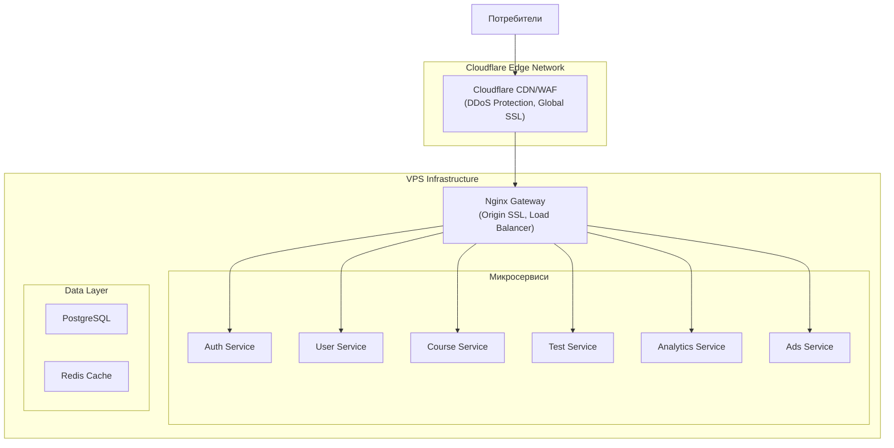
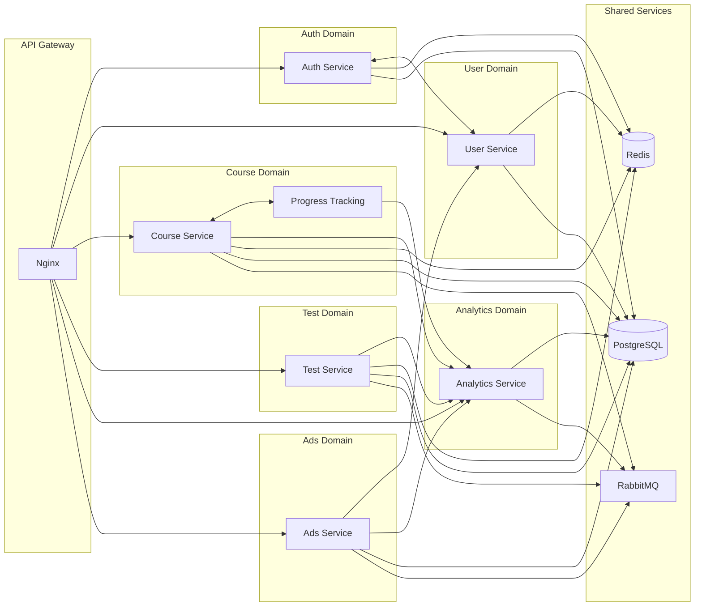

# Микросервисна архитектура

## Общ преглед на архитектурата

## Описание на микросервисите

### Auth Service
- JWT token management
- Регистрация и вписване
- Възстановяване на пароли
- Session management

### User Service
- Потребителски профили
- Управление на роли
- Потребителски настройки

### Course Service
- CRUD операции за курсове
- Управление на съдържание
- Версиониране
- Проследяване на прогрес

### Test Service
- Управление на тестове
- Обработка на отговори
- Оценяване и резултати

### Analytics Service
- Събиране на данни
- Генериране на отчети
- Експорт функционалности

### Ads Service
- Управление на реклами
- Anti-adblocker механизми
- Статистики и отчети

## Междусервисна комуникация

