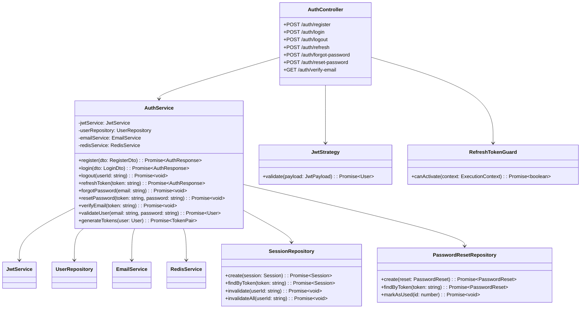
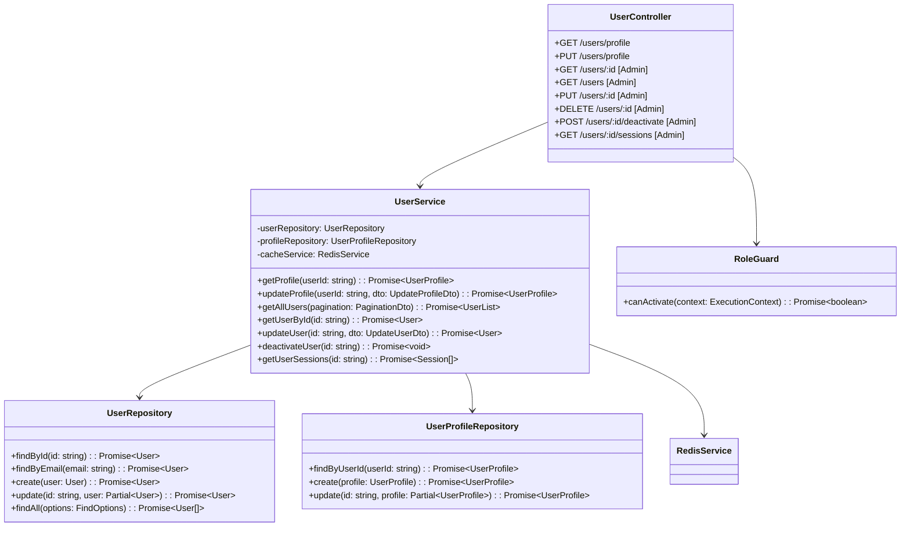
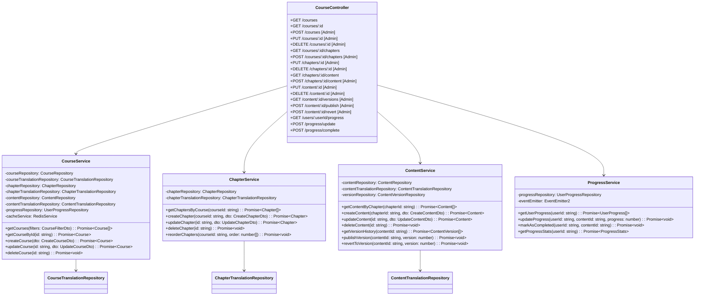

# Детайлни схеми на микросервисите

## Auth Service Schema

```mermaid
classDiagram
    class AuthController {
        +POST /auth/register
        +POST /auth/login
        +POST /auth/logout
        +POST /auth/refresh
        +POST /auth/forgot-password
        +POST /auth/reset-password
        +GET /auth/verify-email
    }
    
    class AuthService {
        -jwtService: JwtService
        -userRepository: UserRepository
        -emailService: EmailService
        -redisService: RedisService
        +register(dto: RegisterDto): Promise~AuthResponse~
        +login(dto: LoginDto): Promise~AuthResponse~
        +logout(userId: string): Promise~void~
        +refreshToken(token: string): Promise~AuthResponse~
        +forgotPassword(email: string): Promise~void~
        +resetPassword(token: string, password: string): Promise~void~
        +verifyEmail(token: string): Promise~void~
        +validateUser(email: string, password: string): Promise~User~
        +generateTokens(user: User): Promise~TokenPair~
    }
    
    class JwtStrategy {
        +validate(payload: JwtPayload): Promise~User~
    }
    
    class RefreshTokenGuard {
        +canActivate(context: ExecutionContext): Promise~boolean~
    }
    
    class SessionRepository {
        +create(session: Session): Promise~Session~
        +findByToken(token: string): Promise~Session~
        +invalidate(userId: string): Promise~void~
        +invalidateAll(userId: string): Promise~void~
    }
    
    class PasswordResetRepository {
        +create(reset: PasswordReset): Promise~PasswordReset~
        +findByToken(token: string): Promise~PasswordReset~
        +markAsUsed(id: number): Promise~void~
    }
    
    AuthController --> AuthService
    AuthService --> JwtService
    AuthService --> UserRepository
    AuthService --> EmailService
    AuthService --> RedisService
    AuthService --> SessionRepository
    AuthService --> PasswordResetRepository
    AuthController --> JwtStrategy
    AuthController --> RefreshTokenGuard
```

## User Service Schema

```mermaid
classDiagram
    class UserController {
        +GET /users/profile
        +PUT /users/profile
        +GET /users/:id [Admin]
        +GET /users [Admin]
        +PUT /users/:id [Admin]
        +DELETE /users/:id [Admin]
        +POST /users/:id/deactivate [Admin]
        +GET /users/:id/sessions [Admin]
    }
    
    class UserService {
        -userRepository: UserRepository
        -profileRepository: UserProfileRepository
        -cacheService: RedisService
        +getProfile(userId: string): Promise~UserProfile~
        +updateProfile(userId: string, dto: UpdateProfileDto): Promise~UserProfile~
        +getAllUsers(pagination: PaginationDto): Promise~UserList~
        +getUserById(id: string): Promise~User~
        +updateUser(id: string, dto: UpdateUserDto): Promise~User~
        +deactivateUser(id: string): Promise~void~
        +getUserSessions(id: string): Promise~Session[]~
    }
    
    class UserRepository {
        +findById(id: string): Promise~User~
        +findByEmail(email: string): Promise~User~
        +create(user: User): Promise~User~
        +update(id: string, user: Partial~User~): Promise~User~
        +findAll(options: FindOptions): Promise~User[]~
    }
    
    class UserProfileRepository {
        +findByUserId(userId: string): Promise~UserProfile~
        +create(profile: UserProfile): Promise~UserProfile~
        +update(id: string, profile: Partial~UserProfile~): Promise~UserProfile~
    }
    
    class RoleGuard {
        +canActivate(context: ExecutionContext): Promise~boolean~
    }
    
    UserController --> UserService
    UserController --> RoleGuard
    UserService --> UserRepository
    UserService --> UserProfileRepository
    UserService --> RedisService
```

## Course Service Schema

```mermaid
classDiagram
    class CourseController {
        +GET /courses
        +GET /courses/:id
        +POST /courses [Admin]
        +PUT /courses/:id [Admin]
        +DELETE /courses/:id [Admin]
        +GET /courses/:id/chapters
        +POST /courses/:id/chapters [Admin]
        +PUT /chapters/:id [Admin]
        +DELETE /chapters/:id [Admin]
        +GET /chapters/:id/content
        +POST /chapters/:id/content [Admin]
        +PUT /content/:id [Admin]
        +DELETE /content/:id [Admin]
        +GET /content/:id/versions [Admin]
        +POST /content/:id/publish [Admin]
        +POST /content/:id/revert [Admin]
        +GET /users/:userId/progress
        +POST /progress/update
        +POST /progress/complete
    }
    
    class CourseService {
        -courseRepository: CourseRepository
        -courseTranslationRepository: CourseTranslationRepository
        -chapterRepository: ChapterRepository
        -chapterTranslationRepository: ChapterTranslationRepository
        -contentRepository: ContentRepository
        -contentTranslationRepository: ContentTranslationRepository
        -progressRepository: UserProgressRepository
        -cacheService: RedisService
        +getCourses(filters: CourseFilterDto): Promise~Course[]~
        +getCourseById(id: string): Promise~Course~
        +createCourse(dto: CreateCourseDto): Promise~Course~
        +updateCourse(id: string, dto: UpdateCourseDto): Promise~Course~
        +deleteCourse(id: string): Promise~void~
    }
    
    class ChapterService {
        -chapterRepository: ChapterRepository
        -chapterTranslationRepository: ChapterTranslationRepository
        +getChaptersByCourse(courseId: string): Promise~Chapter[]~
        +createChapter(courseId: string, dto: CreateChapterDto): Promise~Chapter~
        +updateChapter(id: string, dto: UpdateChapterDto): Promise~Chapter~
        +deleteChapter(id: string): Promise~void~
        +reorderChapters(courseId: string, order: number[]): Promise~void~
    }
    
    class ContentService {
        -contentRepository: ContentRepository
        -contentTranslationRepository: ContentTranslationRepository
        -versionRepository: ContentVersionRepository
        +getContentByChapter(chapterId: string): Promise~Content[]~
        +createContent(chapterId: string, dto: CreateContentDto): Promise~Content~
        +updateContent(id: string, dto: UpdateContentDto): Promise~Content~
        +deleteContent(id: string): Promise~void~
        +getVersionHistory(contentId: string): Promise~ContentVersion[]~
        +publishVersion(contentId: string, version: number): Promise~void~
        +revertToVersion(contentId: string, version: number): Promise~void~
    }
    
    class ProgressService {
        -progressRepository: UserProgressRepository
        -eventEmitter: EventEmitter2
        +getUserProgress(userId: string): Promise~UserProgress[]~
        +updateProgress(userId: string, contentId: string, progress: number): Promise~void~
        +markAsCompleted(userId: string, contentId: string): Promise~void~
        +getProgressStats(userId: string): Promise~ProgressStats~
    }
    
    CourseController --> CourseService
    CourseController --> ChapterService
    CourseController --> ContentService
    CourseController --> ProgressService
    CourseService --> CourseTranslationRepository
    ChapterService --> ChapterTranslationRepository
    ContentService --> ContentTranslationRepository
```
