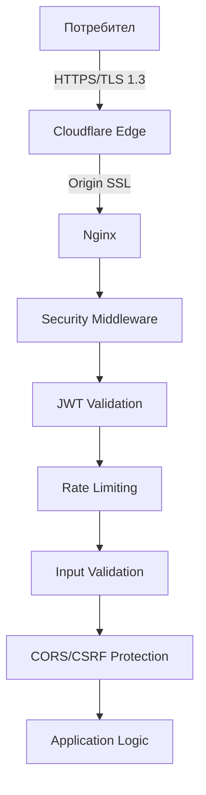

# Сигурност

## Многопластова защита



## Ключови мерки за сигурност

### Транспортен слой
- Cloudflare Edge SSL + Origin Certificate
- HSTS headers
- TLS 1.3 only

### Автентикация и оторизация
- JWT с кратък access token (15-60 мин)
- Refresh tokens в HttpOnly cookies
- Ролеви модел на достъп

### Защита от атаки
- **XSS:** CSP headers, output encoding, input sanitization
- **CSRF:** Double-submit cookies, SameSite attributes
- **SQL Injection:** ORM с параметризирани заявки
- **DDoS:** Cloudflare автоматична защита
- **Rate Limiting:** На ниво API endpoints

### Защита на данните
- Bcrypt/Argon2 за пароли
- Уникални соли за всяка парола
- Валидация и санитизация на входните данни
- Audit logging за критични операции

## Environment-based конфигурация

```typescript
// Development: Relaxed security за по-лесно тестване
// Test: Минимална security overhead
// Production: Максимална защита по подразбиране
```

## Препоръки за допълнителна сигурност

- Редовни security одити
- Penetration testing
- Обучение на екипа за добри практики в сигурността
- Автоматизирани security скенери в CI/CD процеса
- Сигурно управление на secrets и credentials

[➜ Threat Model & GDPR](../security/threat-model.md)

## Мониторинг на сигурността

- Логване на всички authentication събития
- Наблюдение за подозрителни действия
- Автоматизирани алерти при необичайна активност
- Анализ на логове и security събития
