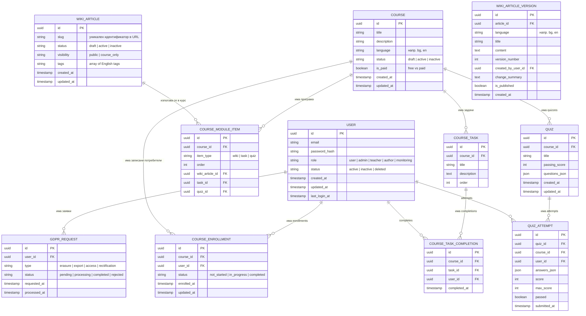

# beelms – Модел на базата данни (ER диаграма)

_Роля: Architect. Фаза: BMAD Solutioning. Концептуален модел на данните (ER) за базата._

Този документ описва концептуалния модел на данните за beelms (ER диаграма + текстови описания), базиран на:
- Product Brief – `docs/product/product-brief.md`
- PRD – `docs/product/prd.md`
- MVP feature list – `docs/architecture/mvp-feature-list.md`
- System architecture – `docs/architecture/beelms-core-architecture.md`
- OpenAPI спецификация – `docs/architecture/openapi.yaml`

Целта е да даде ясен модел за реализацията на базата данни (PostgreSQL) преди детайлни migration-и и ORM модели.

## 1. Основни ентитети

- **User** – регистриран потребител на платформата.
- **WikiArticle** – логическа статия в Wiki (по един slug, независимо от езиците и версиите).
- **WikiArticleVersion** – конкретна езикова версия на статия в определен момент.
- **GdprRequest** – заявка свързана с права по GDPR (изтриване, експорт и т.н.).
- **Course** – курс (title/description/language/status).
- **CourseModuleItem** – елемент в програмата на курс (wiki/task/quiz) с ред.
- **CourseEnrollment** – записване на потребител в курс + базов статус/прогрес.
- **CourseTask** – задача, която е част от курс.
- **CourseTaskCompletion** – маркиране на задача като изпълнена от даден потребител.
- **Quiz** – quiz (MCQ) към курс.
- **QuizAttempt** – опит (attempt) за quiz + резултат.

Този базов модел може да бъде разширяван по-късно (напр. с по-детайлни логове за метрики, нотификации и др.), без да нарушава текущия MVP.

## 2. ER диаграма (Mermaid)

## 3. Описания на ентитетите

### 3.1. User

Представя регистриран потребител на платформата.

- Един user може да има много `GdprRequest` записи.
- Потребителите с `role = 'admin'` имат достъп до admin панела и управлението на Wiki/потребители.
- Допълнителните роли (`teacher`, `author`, `monitoring`) се използват за ограничаване/разделяне на достъпа до създаване на съдържание и до агрегирани метрики (детайли в Product Brief/PRD).

### 3.2. WikiArticle и WikiArticleVersion

Моделът разделя логическата статия от нейните езикови и исторически версии.

- `WikiArticle.slug` се използва в публичните URL и в API (`/api/wiki/articles/{slug}`).
- `WikiArticle.status` указва състоянието на статията: `draft` (чернова, не се вижда публично), `active` (показва се в публичната Wiki) или `inactive` (скрита/деактивирана, но запазена в системата).
- Всяка статия има една или повече версии (`WikiArticleVersion`).
- Версиите са по език (`language`) и номер на версия (`version_number`).
- Admin панелът работи основно с версиите (създаване, редакция, rollback).

#### 3.2.1. Admin Wiki потоци върху модела

- **Списък /admin/wiki**
  - използва `WikiArticle` + последната версия по `created_at` за избрания език, за да показва `title`, `status` и `updatedAt`.
- **Създаване на статия (/admin/wiki/create, POST /api/admin/wiki/articles)**
  - създава един запис в `WIKI_ARTICLE` (slug + status);
  - за всеки избран език създава по един запис в `WIKI_ARTICLE_VERSION` с `version_number = 1`;
  - `is_published = true` само когато `status = 'active'`.
- **Редакция на съдържание (/admin/wiki/[slug]/edit, PUT /api/admin/wiki/articles/{id})**
  - не променя съществуващите записи, а добавя **нова версия** в `WIKI_ARTICLE_VERSION` със `version_number = max+1` за дадения език;
  - актуализира `status` на `WIKI_ARTICLE` (draft/active/inactive) и флага `is_published` на новата версия.
- **Промяна на статус само (PATCH /api/admin/wiki/articles/{id}/status)**
  - актуализира само колоната `status` в `WIKI_ARTICLE` без да създава нова версия.
- **История и rollback**
  - `GET /api/admin/wiki/articles/{id}/versions` чете всички редове от `WIKI_ARTICLE_VERSION` за даден `article_id`;
  - `POST /api/admin/wiki/articles/{id}/versions/{versionId}/restore` създава **нова** версия, базирана на съдържанието на избраната историческа версия ("rollback"), с увеличен `version_number`.

### 3.3. GdprRequest

- Всеки запис представлява заявка от потребител за право по GDPR.
- Полетата `type` и `status` се използват за обработка и одит.
- При успешна обработка на заявка за изтриване данните на потребителя могат да бъдат анонимизирани/изтрити според архитектурните решения.

### 3.4. Course и CourseModuleItem

- `Course` моделира course catalog + Course Detail.
- `CourseModuleItem` описва програмата на курса (модули) и позволява курсът да комбинира:
  - `wiki` елементи (връзка към Wiki съдържание);
  - `task` елементи (практически задачи);
  - `quiz` елементи (оценяване).

### 3.5. CourseEnrollment (My Courses)

- `CourseEnrollment` пази записването на потребител в курс и базов статус на прогрес.
- За MVP стойности като `progressPercent` могат да бъдат изчислявани динамично на база completions/attempts.

### 3.6. CourseTask и CourseTaskCompletion

- `CourseTask` пази описанието на задачата.
- `CourseTaskCompletion` пази маркирането на задача като изпълнена от конкретен потребител.

### 3.7. Quiz и QuizAttempt

- `Quiz` пази quiz дефиниция (MVP: въпроси/опции могат да се съхраняват като JSON).
- `QuizAttempt` пази submit-натите отговори и резултата (score/pass) за конкретен потребител.

## 4. Забележки за имплементация

- Този модел е **концептуален** и може да бъде адаптиран при реалното проектиране на схемата (напр. допълнителни индекси, помощни таблици, audit логове).
- Метриките за MVP могат да се изчисляват динамично върху `User` и агрегирани логове за заявки.
