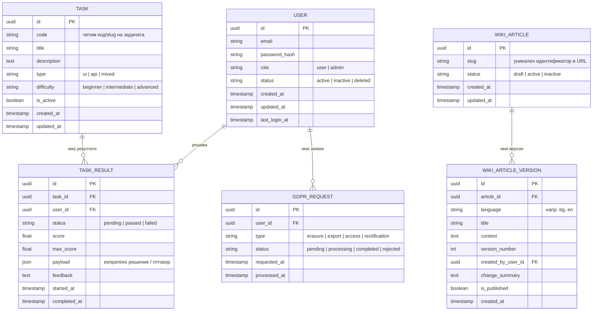

# QA4Free – Модел на базата данни (ER диаграма)

_Роля: Architect. Фаза: BMAD Solutioning. Концептуален модел на данните (ER) за базата._

Този документ описва концептуалния модел на данните за QA4Free (ER диаграма + текстови описания), базиран на:
- Product Brief – `docs/product/product-brief.md`
- PRD – `docs/product/prd.md`
- MVP feature list – `docs/architecture/mvp-feature-list.md`
- System architecture – `docs/architecture/system-architecture.md`
- OpenAPI спецификация – `docs/architecture/openapi.yaml`

Целта е да даде ясен модел за реализацията на базата данни (PostgreSQL) преди детайлни migration-и и ORM модели.

## 1. Основни ентитети

- **User** – регистриран потребител на платформата.
- **WikiArticle** – логическа статия в Wiki (по един slug, независимо от езиците и версиите).
- **WikiArticleVersion** – конкретна езикова версия на статия в определен момент.
- **Task** – практическа задача в средата (UI/API/комбинирана).
- **TaskResult** – резултат от решаване на конкретна задача от конкретен потребител.
- **GdprRequest** – заявка свързана с права по GDPR (изтриване, експорт и т.н.).

Този базов модел може да бъде разширяван по-късно (напр. с по-детайлни логове за метрики, нотификации и др.), без да нарушава текущия MVP.

## 2. ER диаграма (Mermaid)

## 3. Описания на ентитетите

### 3.1. User

Представя регистриран потребител на платформата.

- Един user може да има много `TaskResult` записи.
- Един user може да има много `GdprRequest` записи.
- Потребителите с `role = 'admin'` имат достъп до admin панела и управлението на Wiki/потребители.

### 3.2. WikiArticle и WikiArticleVersion

Моделът разделя логическата статия от нейните езикови и исторически версии.

- `WikiArticle.slug` се използва в публичните URL и в API (`/api/wiki/articles/{slug}`).
- `WikiArticle.status` указва състоянието на статията: `draft` (чернова, не се вижда публично), `active` (показва се в публичната Wiki) или `inactive` (скрита/деактивирана, но запазена в системата).
- Всяка статия има една или повече версии (`WikiArticleVersion`).
- Версиите са по език (`language`) и номер на версия (`version_number`).
- Admin панелът работи основно с версиите (създаване, редакция, rollback).

### 3.3. Task и TaskResult

- `Task` описва практическа задача (заглавие, описание, тип, трудност и др.).
- `TaskResult` описва опит за решаване от конкретен user:
  - връзка към `Task` и `User`;
  - статус (pending/passed/failed);
  - числова оценка (`score`, `max_score`);
  - суров payload на решението (напр. подадени данни);
  - генериран feedback за потребителя.
- Тези ентитети са планирани основно за бъдещия „exams“ модул (post-MVP). В текущото MVP не се използват за събиране на метрики за завършени практичeски задачи.

### 3.4. GdprRequest

- Всеки запис представлява заявка от потребител за право по GDPR.
- Полетата `type` и `status` се използват за обработка и одит.
- При успешна обработка на заявка за изтриване данните на потребителя могат да бъдат анонимизирани/изтрити според архитектурните решения.

## 4. Забележки за имплементация

- Този модел е **концептуален** и може да бъде адаптиран при реалното проектиране на схемата (напр. допълнителни индекси, помощни таблици, audit логове).
- Training API за MVP не изисква собствени таблици – eндпойнтите `/api/training/ping` и `/api/training/echo` са статични/стейтлес за целите на упражненията.
- Метриките за MVP могат да се изчисляват динамично върху `User` и агрегирани логове за заявки, без да се използват `Task`/`TaskResult` за проследяване на завършени практичeски задачи.
