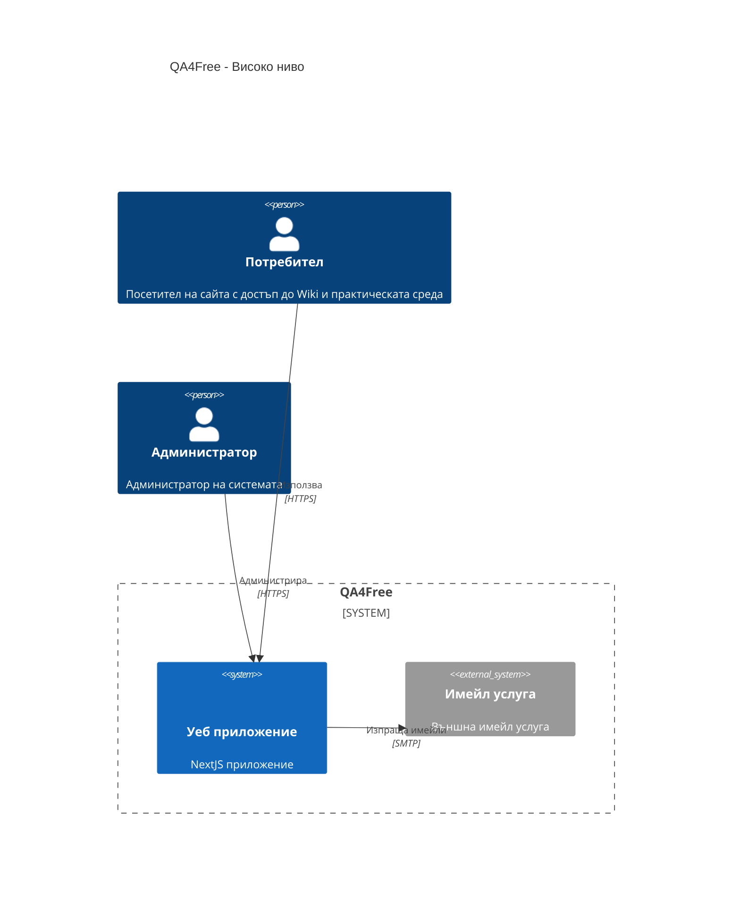
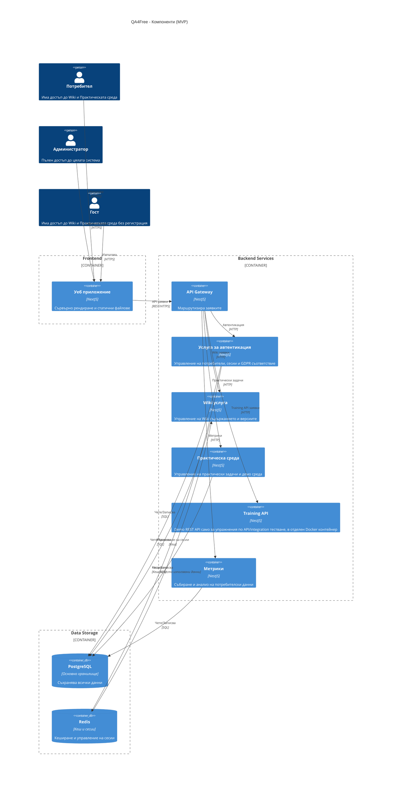
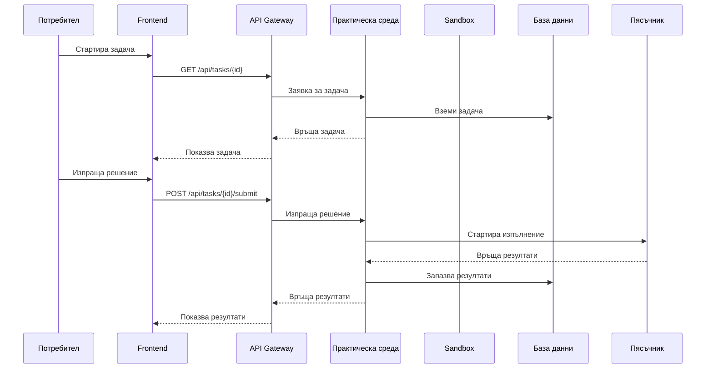

# Системна архитектура на QA4Free

_Роля: Architect. Фаза: BMAD Solutioning. Описва техническата архитектура и нефункционалните изисквания за MVP._

## Съдържание
- [Системна архитектура на QA4Free](#системна-архитектура-на-qa4free)
  - [Съдържание](#съдържание)
  - [Въведение](#въведение)
  - [Архитектурен стил](#архитектурен-стил)
  - [Високо ниво](#високо-ниво)
  - [Компоненти](#компоненти)
  - [Потребителски роли и права](#потребителски-роли-и-права)
    - [Администратор](#администратор)
    - [Потребител (регистриран)](#потребител-регистриран)
    - [Гост (нерегистриран потребител)](#гост-нерегистриран-потребител)
  - [Управление на версиите на Wiki съдържанието](#управление-на-версиите-на-wiki-съдържанието)
    - [Архитектура на версиирането](#архитектура-на-версиирането)
    - [Компоненти](#компоненти-1)
  - [GDPR съответствие](#gdpr-съответствие)
    - [Събирани данни](#събирани-данни)
    - [Права на потребителите](#права-на-потребителите)
    - [Имплементация](#имплементация)
  - [Управление на потребителски данни](#управление-на-потребителски-данни)
    - [Експорт на данни](#експорт-на-данни)
    - [Изтриване на акаунт](#изтриване-на-акаунт)
    - [Технически детайли](#технически-детайли)
  - [Технологичен стек](#технологичен-стек)
    - [Frontend](#frontend)
    - [Backend](#backend)
    - [Бази данни](#бази-данни)
    - [Инфраструктура](#инфраструктура)
    - [Мониторинг и логване](#мониторинг-и-логване)
  - [Инфраструктура](#инфраструктура-1)
    - [Хостинг](#хостинг)
    - [Домейн](#домейн)
  - [Безопасност](#безопасност)
  - [Практическа среда](#практическа-среда)
    - [Компоненти](#компоненти-2)
    - [Интеграции](#интеграции)
  - [Система за метрики и анализи](#система-за-метрики-и-анализи)
    - [Събирани данни](#събирани-данни-1)
    - [Визуализация](#визуализация)
  - [Демо среда за практически задачи](#демо-среда-за-практически-задачи)
    - [Архитектура](#архитектура)
    - [Диаграма на последователност за изпълнение на задачи](#диаграма-на-последователност-за-изпълнение-на-задачи)
  - [Масштабируемост](#масштабируемост)
  - [Заключение](#заключение)
    - [Ключови характеристики на архитектурата](#ключови-характеристики-на-архитектурата)
    - [Следващи стъпки](#следващи-стъпки)
    - [Ограничения и бъдещи разширения](#ограничения-и-бъдещи-разширения)

## Въведение
Този документ описва архитектурата на системата QA4Free - платформа за обучение по Quality Assurance, която комбинира функционалности на Wikipedia с елементи на LMS система.

## Архитектурен стил
Системата използва **микросервисна архитектура** с ясно дефинирани граници между отделните услуги. Това позволява:
- Независимо мащабиране на компонентите
- По- лесно поддържане и разширяване
- Използване на най-подходящите технологии за всеки компонент

## Високо ниво

## Компоненти

## Потребителски роли и права

### Администратор
- Пълен достъп до цялата система
- Управление на потребители (създаване, редактиране, деактивиране)
- Създаване, редактиране и деактивиране на Wiki страници
 - Управление на версиите на Wiki страници (връщане към версия, изтриване на избрани версии)
- Преглед на метрики и анализи
- Управление на тестове и практически задачи

### Потребител (регистриран)
- Преглед на Wiki съдържание
- Използване на Практическата среда за упражнения
- Преглед на личната си активност
- Експорт на лични данни
- Изтриване на акаунт

### Гост (нерегистриран потребител)
- Преглед на Wiki съдържание
- Използване на Практическата среда за упражнения
- Възможност за регистрация

## Управление на версиите на Wiki съдържанието

### Архитектура на версиирането
- Всяка промяна в Wiki страница създава нова версия
- Пазят се пълна история на всички редакции
- Възможност за преглед на разлики между версии
- Възможност за връщане на предишна версия
 - Възможност администратор да изтрива избрани по-стари версии (освен текущата активна)

### Компоненти
- **Версионен контрол** - проследяване на промените
- **Diff инструмент** - визуализиране на разликите
- **История на редакциите** - списък с всички версии
- **API за управление на версиите** - REST ендпойнти за създаване, връщане и изтриване на версии

## GDPR съответствие

### Събирани данни
- Име и имейл адрес (само за регистрирани потребители)
- История на действията (логване, достъп до страници)
- Устройство и браузър информация (анонимизирана)
- Интереси и поведение (агрегирани данни)

### Права на потребителите
- Право на достъп до личните данни
- Право на изтриване (right to be forgotten)
- Право на преносимост на данните
- Право на коригиране на неточни данни

### Имплементация
- Автоматично изтриване на данни след изтриване на акаунт
- API ендпойнти за експорт на лични данни
- Политика за съхранение на данни (30 дни след деактивиране на акаунта)
- Криптиране на чувствителни данни

## Управление на потребителски данни

### Експорт на данни
- Генериране на архив с всички лични данни
- Включване на:
  - Профилна информация
  - История на действията
  - Тестови резултати
  - Предпочитания

### Изтриване на акаунт
- Анонимизиране на всички лични данни
- Запазване на анонимни данни за анализи
- Изтриване на чувствителни данни
- Потвърждение по имейл преди изтриване

### Технически детайли
- Асинхронна обработка на заявките
- Опашка за обработка на големи количества данни
- Логване на всички операции с данни
- Уведомяване на потребителя при завършване

## Технологичен стек

### Frontend
- **Next.js** (React) - за сървърно рендиране и статичен генериращ сайт
- **TypeScript** - за по-добра поддръжка на типовете
- **Tailwind CSS** - за стилизиране
- **Redux Toolkit** - за управление на състоянието
- **Axios** - за HTTP заявки
- **React Query** - за управление на данните и кеширане
- **next-i18next** - за управление на преводите и мултиезичност
- **next-seo** - за SEO оптимизация и управление на мета тагове

### Backend
- **NestJS** - основен фреймуърк за бекенд услугите
- **TypeScript** - за по-добра поддръжка на типовете
- **TypeORM** - за достъп до базата данни
- **JWT** - за автентикация
- **Swagger** - за API документация
- **Passport** - за автентикация и оторизация
- **Class-validator** - за валидация на входящите данни
- **i18n модул** - за управление на преводите и мултиезичност
- **Redis** - за кеширане и управление на сесии
- **TypeORM History** - за проследяване на промените в базата данни
- **Node-cron** - за планирани задачи (изтриване на данни, архивиране)
- **Bcryptjs** - за криптиране на пароли
- **Helmet** - за защита на HTTP заглавията
- **Rate limiting** - за защита срещу брут форс атаки

### Бази данни
- **PostgreSQL** - основна база данни
- **Redis** - за кеширане и управление на сесии

### Инфраструктура
- **Docker** - за контейнеризация
- **Docker Compose** - за управление на мулти-контейнерни приложения
- **Nginx** - като reverse proxy
- **Let's Encrypt** - за SSL сертификати

### Мониторинг и логване
- **Winston** - за логване
- **Prometheus** + **Grafana** - за метрики
- **Sentry** - за проследяване на грешки

## Инфраструктура

### Хостинг
- **VPS** в Contabo с конфигурация:
  - 6 vCPU ядра
  - 12GB RAM
  - 100GB NVMe дисково пространство
  - 300 Mbit/s мрежов порт
  - Неограничен трафик

### Домейн
- **qa4free.com** - основен домейн

## Безопасност
- **Криптиране** - Всички връзки са криптирани с **HTTPS**
- **Автентикация** - JWT токени с краен срок на валидност и възможност за отнемане
- **Валидация** - Строга валидация на всички входящи данни
- **Защита срещу атаки**:
  - **CSRF** - SameSite cookies и CSRF токени
  - **XSS** - Автоматично екраниране на изходните данни
  - **SQL инжекции** - Параметризирани заявки и ORM
  - **Защита срещу брут форс**:
    - Rate limiting за всички потребители
    - Временни банове на IP адреси с твърде много грешни опити
    - Автоматично отключване след определен период
    - Обаждането на администратор при съмнителна активност
- **Защита на данните**:
  - Криптиране на чувствителни данни в базата
  - Хеширане на пароли с bcrypt
  - Регулярни архиви на данните
- **Одит и логване**:
  - Логване на всички критични действия
  - Проследяване на потребителските сесии
  - Сигнали за подозрителна активност
- **Поддръжка и актуализации**:
  - Редовни ъпдейти на всички зависимости
  - Сканиране за уязвимости
  - План за реакция при инциденти

## Практическа среда

### Компоненти
1. **Изпълнител на задачи**
   - Интерпретира и изпълнява практически задачи
   - Времеви лимити за изпълнение
   - Автоматично оценяване на резултатите

2. **Пясъчник среда**
   - Изолирана Docker среда за изпълнение на код
   - Ограничени ресурси за сигурност
   - Поддръжка на различни езици за програмиране
   - Автоматично почистване след използване

3. **Обратна връзка**
   - Детайлна информация за изпълнението
   - Препоръки за подобрение
   - Визуализация на резултатите

### Интеграции
- **Wiki услуга** - за достъп до учебни материали
- **Услуга за автентикация** - за валидация на достъпа
- **Метрики** - за проследяване на напредъка на потребителите

## Система за метрики и анализи

### Събирани данни
1. **Потребителско поведение**
   - Време, прекарано на страници
   - Натискани бутони и линкове
   - Пътеки на навигация

2. **Учебен напредък**
   - Завършени тестове и резултати
   - Трудни концепции (базирани на грешки)
   - Време за усвояване на теми

3. **Системна производителност**
   - Време за зареждане на страници
   - Грешки и проблеми
   - Натоварване на сървъра

### Визуализация
- Табло за администраторите
- Индивидуален прогрес за потребителите
- Агрегирани анализи за подобряване на съдържанието

## Демо среда за практически задачи

### Архитектура
1. **Контейнеризация**
   - Отделен Docker контейнер за всяка сесия
   - Ограничени ресурси за сигурност
   - Автоматично почистване след използване

2. **Поддържани технологии**
   - Web приложения (HTML, CSS, JavaScript) с различни UI елементи (бутони, drop-down списъци, текстови полета и др.) за упражнения по manual и UI automation тестване
   - API тестване (REST) чрез примерен QA4Free Training API (услугата `training-api` с ендпойнти под `/api/training/*`), документиран със **Swagger/OpenAPI**, за упражнения по integration и API тестване
   - Бази данни (SQL, NoSQL) за тестване на CRUD и data-driven сценарии

3. **Интеграции**
   - Автоматично оценяване на резултатите
   - Възможност за споделяне на код
   - Интеграция с GitHub/GitLab

### Диаграма на последователност за изпълнение на задачи

## Масштабируемост
- Хоризонтално маштабиране на отделните услуги
- Кеширане на често използвани данни с Redis
- Възможност за добавяне на допълнителни инстанции на услугите при необходимост
- Оптимизирани заявки към базата данни и ефективно използване на индекси

## Заключение

### Ключови характеристики на архитектурата
- **Микросервисна архитектура** с ясно дефинирани граници между компонентите
- **Висока достъпност** чрез хоризонтално мащабиране и излишък
- **Сигурност** чрез модерни практики за защита на данните и потребителската поверителност
- **Гъвкавост** за бъдещо разширяване на функционалностите
- **Производителност** чрез ефективно използване на кеширане и оптимизирани заявки

### Следващи стъпки
1. Детайлно проектиране на базата данни
2. Имплементация на основните сервизи
3. Разработка на потребителския интерфейс
4. Интеграционно тестване
5. Настройка на инфраструктурата и деплойване

### Ограничения и бъдещи разширения
- В бъдеще може да се добави поддръжка на още езици
- Възможност за интеграция с допълнителни услуги (например платформи за онлайн обучение)
- Разширяване на функционалностите за анализ на данните
- Подобряване на системата за модерация на съдържанието
