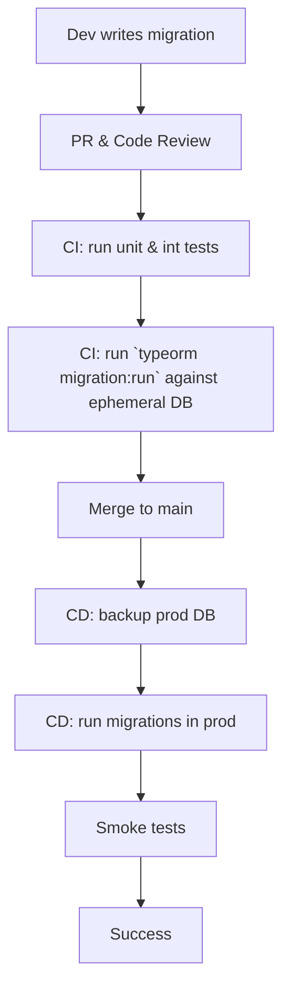

# Стратегия за управление на данни и миграции

## 1. Цели

- Сигурно и последователно управление на схемата на базата данни
- Zero-downtime миграции в production
- Възможност за лесно връщане назад (rollback)
- Проследимост на промените (audit)

## 2. Инструменти

| Инструмент | Версия | Роля |
|------------|--------|------|
| **TypeORM CLI** | 0.3.x | Генериране и изпълнение на миграции |
| **PgBouncer** | Latest | Connection pooling за онлайн миграции |
| **Liquibase** (optional) | 4.x | Schema diff за legacy случаи |
| **Docker Compose** | 3.8 | Локално изпълнение на миграции |
| **GitHub Actions** | – | Автоматизирано изпълнение на миграции |
| **pg_dump / pg_restore** | 15.x | Backup & restore |

## 3. Naming Convention

```
/migrations
 └── 2025.06.18T1830Z-create-user-table.ts
       ^ ISO8601 timestamp   ^ description
```

- Уникален timestamp + kebab-case описание
- Един PR = една миграция (когато е възможно)

## 4. Процес на миграция



### 4.1 Локална разработка

```bash
npm run typeorm migration:generate -- -n add_course_tags
npm run typeorm migration:run
```

### 4.2 CI Pipeline (GitHub Actions)

1. Spin up postgres service via docker
2. `npm run typeorm migration:run` – проверява, че схемата е коректна
3. Artifact: миграционен log + dump на схемата

### 4.3 Deployment

- `pre-deploy` стъпка: `pg_dump -Fc` backup на продукцията
- `deploy` стъпка: `typeorm migration:run --transaction=all`
- `post-deploy`: автоматичен smoke тест + метрики
- При неуспех: `typeorm migration:revert` + `pg_restore`

## 5. Data Versioning & Seeding

- **Seed** данни се държат в `/seeds/*.ts`, изпълнявани само в dev/staging
- Production seed се избягва, освен ако няма нужда от системни записи (roles)
- Използва се `typeorm-seeding`

## 6. Backward Compatibility

### Feature Flags

- При несъвместими промени, новата функционалност се скрива зад feature flag (e.g., LaunchDarkly, ConfigCat).
- Флагът се включва само за съвместими версии на кода и база.
- След валидиране в production, старата логика и колонките се премахват с отделна миграция.


- Нова колонка се добавя като *nullable*, запълва се, след това се прави *NOT NULL*
- Премахване на колонка:
  1. Маркира се като deprecated, не се използва в кода
  2. Изпраща се миграция, която го премахва чак след 2 минорни версии

## 7. Zero-Downtime Техники

- Declarative миграции с транзакции
- Индекси се създават `CONCURRENTLY`
- `ALTER TYPE` операции се избягват; използва се нова таблица + view
- DDL changes се пускат когато трафикът е нисък (maintenance window)

## 8. Audit & Monitoring

- Таблица `schema_migrations` авто-генерирана от TypeORM
- Grafana dashboard с:
  - Време за изпълнение на миграциите
  - Успешни/неуспешни миграции
- Slack alert при неуспех на миграция

## 9. Data Retention & Archival

- Таблици с чувствителни данни имат `deleted_at` (soft delete)
- Архивиране на стари записи в S3 Glacier (>2 години)
- GDPR data export via `db_export_service`

## 10. Rollback Playbook

1. Спиране на записите в системата (read-only mode)
2. `typeorm migration:revert` до предишната версия
3. Проверка на метриките
4. Включване на write режим
