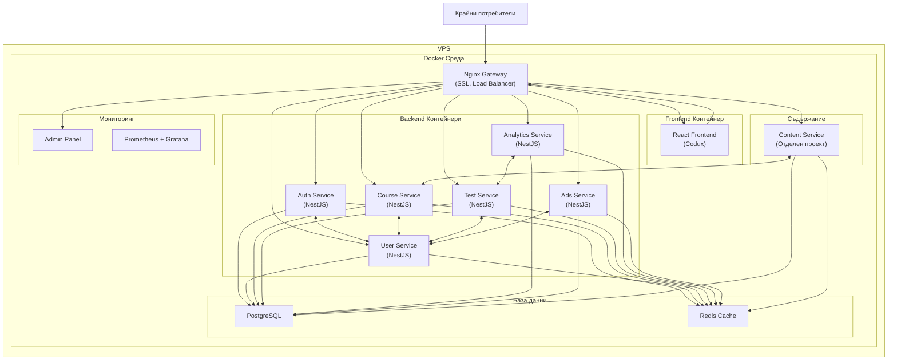
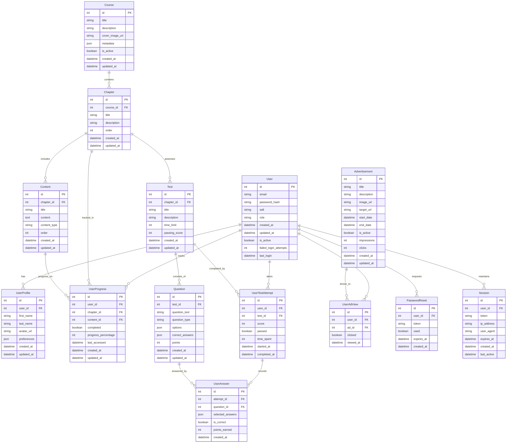
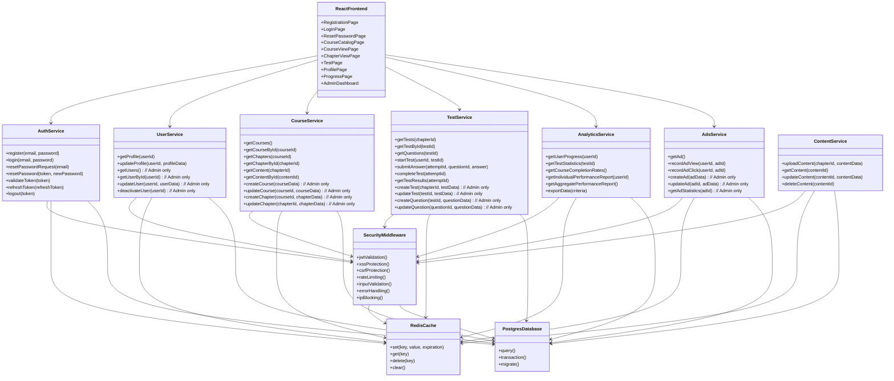
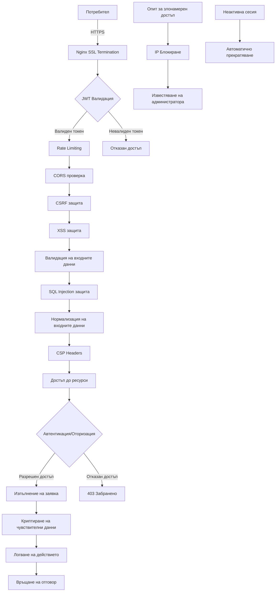
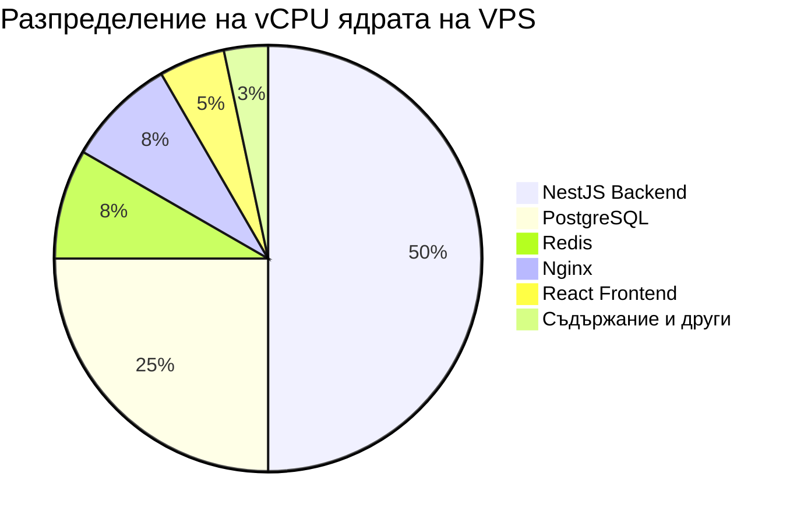

Имам един проект. Ето повече за него, зато започнем първо с идеята:

# Интерактивна онлайн система за самостоятелно offline обучение

## Описание на идеята

Искам да създам интерактивна онлайн система за самостоятелно offile обучение, която да може да се използва от крайни потребители.  
Ето и кратко описание на функционалността на системата:

1. Регистриране на потребител. Потребителя трябва да може да се регистрира само по email адрес и парола.
2. Вписване на потребител. Потребителя трябва да може да се вписва с вече регистрираните email адрес и парола.
3. Рестартиране на паролата. Потребителя трябва да може да си рестартира паролата, като при заявка системата трябва да изпраща линк за рестартиране на паролата на потребител. При натискане на линка, потребителя трябва да е препратен към страницата за въвеждането на нова парола.
4. Създаден admin потребител (искам да се създаде ръчно, не искам да имам endpoint който да прави това - поне на този етап)
5. Вписване с admin потребителя.
6. Тестове които да проверят до колко заучения материал от крайния потребител е запомнен. Крайния потребител трябва да може да решава тестове. Системата трябва да може да събира информация от решените тестове и да генерира отчет. Също в бъдеще тази събрана информация ще може да се използва за анализ и евентуално изследване с цел публикация.
7. Реклама. Системата трябва да има механизъм по който да се показват рекламни материали, ако някоя фирма реши да спонсорира дейността на системата. За целта трябва да се направи механизъм, по който рекламите, дан е се скриват от adblocker-ите (евентуално съм си мислил за hardcoded картинки, не знам дали има други подходи - това трябва да се провери)
8. Следене на прогреса на курса. Системата трябва да разполага с механизъм, с който да може да запомня до къде е стигнал крайния потребител. Не съм измислил как точно ще се случва това. Предложи идея. Мислех си, например потребителя да клика на бутон - следваща глава. И с това кликване да се запазва прогреса на курса.

Ще използваме VPS с тези параметри:  
6 vCPU Cores
12 GB RAM
200 GB SSD
or 100 GB NVMe
32 TB Traffic
Unlimited Incoming

За BE:
Искам да ползвам NestJS с Postgres за база от данни.
Кеширане с Redis.
Docker контейнеризация.

За FE:
Мисля да ползвам Codux, което прави React проект.

Вече имам проект, който да изпраща съдържание към база.
Вече имам друг проект, който да връща поискано съдържание от базата към потребителя с REST заявки.
Тоест съдържанието ще се обработва от различен проект. По този начин, ще имам повече сигурност и добра концептуална структура.

Сигурност:
Искам да добавя всички популярни механизми за сигурност при работата с endpoins. Например:

- JWT токени за влизане в системата
- HTTPS
- CORS
- CSRF защита
- XSS защита
- SQL injection защита
- Input validation
- Error handling
- Logging
- Rate limiting
- IP blocking
- Password hashing
- Управление на сесиите - Автоматично прекратяване на неактивни сесии, лимит на паралелни сесии
- Content Security Policy (CSP) - Предотвратява инжектиране на зловреден скрипт
- HTTP Security Headers - X-Content-Type-Options, X-Frame-Options, Strict-Transport-Security
- Криптиране на данните в покой - Особено за чувствителна информация
- Сигурна конфигурация на cookies - HttpOnly, Secure, SameSite флагове
- Input sanitization
- Input validation
- Input normalization
- Input validation

Архитектура:

# Архитектура на интерактивна онлайн система за самостоятелно обучение

## Обща системна архитектура

## Структура на базата данни (ER диаграма)

## Компонентна диаграма на системата

## Сигурност и защитни механизми

## Разпределение на ресурсите на VPS

## Подробно описание на архитектурата

### 1. Основна архитектура

Предложената архитектура е базирана на **микросервисен подход**, но e опростена и оптимизирана за посочените VPS ресурси. Основните компоненти са:

- **Nginx Gateway** - служи като входна точка към системата, осигурява SSL терминиране, балансиране на натоварването и базова защита от атаки
- **React Frontend** - изграден с Codux, респонсивен и оптимизиран за различни устройства
- **Backend микросервиси** - изградени с NestJS:
  - **Auth Service** - управлява всички процеси по автентикация
  - **User Service** - управлява потребителски данни и профили
  - **Course Service** - управлява курсове, глави и учебно съдържание
  - **Test Service** - управлява тестове, въпроси и отговори
  - **Analytics Service** - събира и анализира данни от използването на системата
  - **Ads Service** - управлява показването на реклами
- **Content Service** - отделен проект, който управлява съдържанието
- **БД слой** - PostgreSQL за постоянно съхранение и Redis за кеширане
- **Admin Panel** - за управление на системата
- **Мониторинг** - Prometheus и Grafana за наблюдение на производителността

### 2. База данни и модел на данните

Базата данни е проектирана с мисъл за:

- **Нормализация** - за намаляване на дублирането
- **Индексиране** - за оптимално търсене
- **Връзки между таблиците** - за поддържане на интегритет на данните
- **JSON полета** - за гъвкавост при необходимост
- **Времеви маркери** - за проследяване на създаване и промени

Основни таблици включват:

- **User** - съхранява основна потребителска информация
- **UserProfile** - разширена информация за потребителя
- **Course**, **Chapter**, **Content** - учебно съдържание
- **Test**, **Question**, **UserTestAttempt**, **UserAnswer** - тестове и отговори
- **Advertisement**, **UserAdView** - рекламна система
- **UserProgress** - проследяване на прогреса на потребителя
- **PasswordReset**, **Session** - управление на сесии и рестартиране на пароли

### 3. Сигурност

Архитектурата включва многопластов подход към сигурността:

- **Транспортен слой**: HTTPS с модерно шифроване
- **Автентикация**: JWT токени с кратък срок на валидност
- **Оторизация**: Ролеви модел (потребител/администратор)
- **Защита от атаки**: XSS, CSRF, SQL Injection, Rate Limiting
- **Защита на входните данни**: Валидация, нормализация, дезинфекция
- **Защита на паролите**: Хеширане със соли и pepper
- **Сесийна сигурност**: Управление на сесии, автоматично излизане при неактивност
- **Мониторинг и логване**: Проследяване на подозрителни дейности, блокиране на IP адреси

### 4. Реклами без adblocker блокиране

За реализация на рекламите, които да не се блокират от adblocker-и, препоръчвам:

1. **Вградени картинки от същия домейн** - adblocker-ите най-често блокират външни домейни
2. **Динамично генериране на имена на CSS класове** - избягва блокиране базирано на класове
3. **Вградени картинки с Base64 кодиране** - трудно се блокират
4. **Сървърно-рендерирани реклами** - интегрирани директно в HTML
5. **Избягване на ключови думи** като "ad", "banner", "sponsor" в CSS и HTML

### 5. Проследяване на прогреса

За проследяване на прогреса на потребителя предлагам:

1. **Автоматично проследяване на прегледаното съдържание** - системата да отбелязва автоматично, когато потребителят достигне до края на страницата
2. **Бутон "Маркирай като прочетено"** - за случаите, когато потребителят иска да отбележи ръчно
3. **Бутон "Следваща глава"** - както споменахте, да записва прогреса при преминаване
4. **Проследяване на времето прекарано на страницата** - за по-точна метрика
5. **Тестове за валидиране на знания** - за да се гарантира, че потребителят не само е преминал, но и е усвоил материала

### 6. Мащабируемост и разширяемост

Архитектурата е проектирана с мисъл за бъдещо разширяване:

1. **Микросервисна архитектура** - позволява добавяне на нови услуги без да се засягат съществуващите
2. **Контейнеризация с Docker** - лесно мащабиране на отделни компоненти
3. **Кеширане с Redis** - подобряване на производителността
4. **API-first подход** - лесно интегриране с мобилни приложения в бъдеще
5. **Опашки за обработка на тежки задачи** - при нужда от генериране на сложни отчети
6. **Разделение на съдържанието в отделен проект** - както сте посочили, подобрява сигурността и концептуалната структура

### 7. Оптимизация за VPS ресурси

За оптимално използване на посочените ресурси (6 vCPU, 12GB RAM, 200GB SSD):

1. **Балансирано разпределение на CPU ядрата** - повече ресурси за DB и backend
2. **Кеширане за намаляване на повторни DB заявки**
3. **Оптимизация на индексите в PostgreSQL**
4. **Компресия на статично съдържание**
5. **Lazy loading на съдържание в React**
6. **Автоматично скалиране на услугите според натоварването**
7. **Мониторинг на ресурси и ранно предупреждение при достигане на лимити**

## Заключение

Предложената архитектура осигурява балансирано решение, което:

- Отговаря на всички посочени функционални изисквания
- Интегрира всички изисквани механизми за сигурност
- Ефективно използва ограничените ресурси на VPS
- Осигурява лесна мащабируемост и разширяемост в бъдеще
- Следва съвременните добри практики за разработка

Архитектурата е проектирана да започне с минимално необходимите компоненти за VPS, но да позволява поетапно разширяване с нови функционалности или скалиране към по-голяма инфраструктура, ако се появи такава нужда в бъдеще.

Development план:

# План за разработка на интерактивна онлайн система за обучение

## Фаза 1: Подготовка на локална среда за разработка

1. Настройка на локална среда за разработка с Docker Compose
2. Създаване на Docker контейнери за:
   - NestJS микросервиси
   - PostgreSQL база данни
   - Redis кеш
   - Nginx за локално тестване
3. Настройка на VS Code с необходимите разширения
4. Създаване на Git хранилище и структура на проекта
5. Настройка на ESLint и Prettier за поддържане на код стандарти

## Фаза 2: Разработка на базата данни

6. Създаване на миграционни скриптове за PostgreSQL
7. Имплементиране на моделите и релациите в базата данни
8. Настройка на Redis за кеширане
9. Тестване и оптимизация на базата данни
10. Създаване на скриптове за обновяване и връщане към предишни версии на базата

## Фаза 3: Разработка на Backend микросервиси

11. Разработка на Auth Service
    - Имплементация на регистрация, вписване и обновяване на парола
    - JWT токен автентикация
    - Middleware за защита на маршрутите
12. Разработка на User Service
    - CRUD операции за потребители
    - Профилни данни
    - Потребителски настройки
13. Разработка на Course Service
    - CRUD операции за курсове и глави
    - API за извличане на структурирано съдържание
14. Разработка на Test Service
    - CRUD операции за тестове и въпроси
    - API за решаване на тестове и записване на резултати
15. Разработка на Analytics Service
    - Събиране на данни
    - Генериране на отчети
16. Разработка на Ads Service
    - Показване на реклами
    - Проследяване на показвания и кликвания
17. Имплементация на Content Service за интеграция с вашия съществуващ проект
18. Добавяне на междинен слой за сигурност към всички микросервиси

## Фаза 4: Разработка на Frontend с Codux/React

19. Създаване на структура на потребителския интерфейс
20. Разработка на компоненти за автентикация
    - Регистрационна форма
    - Форма за вписване
    - Форма за рестартиране на парола
21. Разработка на основни компоненти
    - Навигация и меню
    - Списък с курсове
    - Преглед на съдържание
    - Решаване на тест
    - Потребителски профил
22. Разработка на Admin панел
    - Табло за управление
    - Управление на потребители
    - Управление на курсове и съдържание
    - Управление на тестове
    - Преглед на аналитични данни
    - Управление на реклами
23. Имплементация на проследяване на прогреса
24. Имплементация на система за показване на реклами (защитена от adblocker)
25. Оптимизация на производителността и UX

## Фаза 5: Интеграция и тестване

26. Интеграция на всички микросервиси
27. Настройка на комуникацията между микросервисите
28. Интеграция на Frontend с Backend API
29. Разработка на компонентни тестове за Frontend
30. Разработка на unit тестове за Backend микросервиси
31. Разработка на интеграционни тестове
32. Тестване на производителността
33. Тестване на сигурността
    - Penetration тестове
    - Тестове за уязвимост
    - Тестване на защитите срещу XSS, CSRF, SQL Injection и др.
34. Тестване на потребителското преживяване

## Фаза 6: Оптимизация и подготовка за внедряване

35. Оптимизация на SQL заявките
36. Настройка на кеширането
37. Оптимизация на свалянето на статично съдържание
38. Настройка на логване и мониторинг
39. Настройка на бекъп стратегия
40. Създаване на документация за разработчици
41. Създаване на документация за потребители
42. Финална проверка на сигурността

## Фаза 7: Подготовка за разгръщане на VPS

43. Подготовка на Docker Compose файлове за продукционна среда
44. Настройка на CI/CD процес
45. Създаване на скриптове за автоматично разгръщане
46. Настройка на SSL/TLS сертификати
47. Разработка на стратегия за миграция на данни
48. Разработка на план за възстановяване при аварии
49. Настройка на автоматични бекъпи
50. Подготовка на скриптове за мониторинг

## Фаза 8: Разгръщане и внедряване

51. Подготовка на VPS сървъра
52. Настройка на операционната система и защитна стена
53. Инсталиране на Docker и необходими зависимости
54. Създаване на администраторски потребител
55. Разгръщане на микросервисите
56. Разгръщане на базата данни
57. Разгръщане на кеш сървъра
58. Разгръщане на Frontend
59. Конфигуриране на Nginx и SSL/TLS
60. Тестване на внедрената система
61. Мониторинг на производителността след разгръщане
62. Оптимизации на базата на събраните данни от мониторинга

## Фаза 9: Последващо развитие

63. Събиране на обратна връзка от потребители
64. Планиране на нови функционалности
65. Интегриране на допълнителни микросервиси при нужда
66. Оптимизация на мащабируемостта според натоварването
67. Периодични обновления за сигурност
68. Развитие на аналитичната платформа за изследователски цели

Този план позволява методично и структурирано разработване на системата, като първо се фокусира върху локалната разработка и тестване, а след това преминава към разгръщане и внедряване. С използването на Docker контейнеризация, същата система, която разработвате локално, може лесно да бъде преместена на VPS сървъра, което минимизира проблемите при внедряване.

Ето и самия проект до момента:
docker-compose.yml
services:

# PostgreSQL база данни

db:
image: postgres:15
container_name: learning-platform-db
environment:
POSTGRES_USER: ${DB_USER}
POSTGRES_PASSWORD: ${DB_PASSWORD}
POSTGRES_DB: ${DB_NAME}
volumes: - postgres_data:/var/lib/postgresql/data - ./db/init.sql:/docker-entrypoint-initdb.d/init.sql
ports: - '5432:5432'
networks: - learning-network
healthcheck:
test: ['CMD-SHELL', 'pg_isready -U ${DB_USER} -d ${DB_NAME}']
interval: 10s
timeout: 5s
retries: 5

# Redis кеш

redis:
image: redis:7-alpine
container_name: learning-platform-redis
command: redis-server --requirepass ${REDIS_PASSWORD}
volumes: - redis_data:/data
ports: - '6379:6379'
networks: - learning-network
healthcheck:
test: ['CMD', 'redis-cli', 'ping']
interval: 10s
timeout: 5s
retries: 5

# Auth Service

auth-service:
build:
context: ./services/auth
dockerfile: Dockerfile
container_name: learning-platform-auth
environment:
NODE_ENV: development
DATABASE_URL: postgres://${DB_USER}:${DB_PASSWORD}@db:5432/${DB_NAME}
      REDIS_URL: redis://:${REDIS_PASSWORD}@redis:6379
JWT_SECRET: ${JWT_SECRET}
ports: - '3001:3000'
networks: - learning-network
depends_on:
db:
condition: service_healthy
redis:
condition: service_healthy
volumes: - ./services/auth:/app - /app/node_modules
command: npm run start:dev

# User Service

user-service:
build:
context: ./services/user
dockerfile: Dockerfile
container_name: learning-platform-user
environment:
NODE_ENV: development
DATABASE_URL: postgres://${DB_USER}:${DB_PASSWORD}@db:5432/${DB_NAME}
      REDIS_URL: redis://:${REDIS_PASSWORD}@redis:6379
JWT_SECRET: ${JWT_SECRET}
ports: - '3002:3000'
networks: - learning-network
depends_on:
db:
condition: service_healthy
redis:
condition: service_healthy
volumes: - ./services/user:/app - /app/node_modules
command: npm run start:dev

# Course Service

course-service:
build:
context: ./services/course
dockerfile: Dockerfile
container_name: learning-platform-course
environment:
NODE_ENV: development
DATABASE_URL: postgres://${DB_USER}:${DB_PASSWORD}@db:5432/${DB_NAME}
      REDIS_URL: redis://:${REDIS_PASSWORD}@redis:6379
JWT_SECRET: ${JWT_SECRET}
ports: - '3003:3000'
networks: - learning-network
depends_on:
db:
condition: service_healthy
redis:
condition: service_healthy
volumes: - ./services/course:/app - /app/node_modules
command: npm run start:dev

# Test Service

test-service:
build:
context: ./services/test
dockerfile: Dockerfile
container_name: learning-platform-test
environment:
NODE_ENV: development
DATABASE_URL: postgres://${DB_USER}:${DB_PASSWORD}@db:5432/${DB_NAME}
      REDIS_URL: redis://:${REDIS_PASSWORD}@redis:6379
JWT_SECRET: ${JWT_SECRET}
ports: - '3004:3000'
networks: - learning-network
depends_on:
db:
condition: service_healthy
redis:
condition: service_healthy
volumes: - ./services/test:/app - /app/node_modules
command: npm run start:dev

# Analytics Service

analytics-service:
build:
context: ./services/analytics
dockerfile: Dockerfile
container_name: learning-platform-analytics
environment:
NODE_ENV: development
DATABASE_URL: postgres://${DB_USER}:${DB_PASSWORD}@db:5432/${DB_NAME}
      REDIS_URL: redis://:${REDIS_PASSWORD}@redis:6379
JWT_SECRET: ${JWT_SECRET}
ports: - '3005:3000'
networks: - learning-network
depends_on:
db:
condition: service_healthy
redis:
condition: service_healthy
volumes: - ./services/analytics:/app - /app/node_modules
command: npm run start:dev

# Ads Service

ads-service:
build:
context: ./services/ads
dockerfile: Dockerfile
container_name: learning-platform-ads
environment:
NODE_ENV: development
DATABASE_URL: postgres://${DB_USER}:${DB_PASSWORD}@db:5432/${DB_NAME}
      REDIS_URL: redis://:${REDIS_PASSWORD}@redis:6379
JWT_SECRET: ${JWT_SECRET}
ports: - '3006:3000'
networks: - learning-network
depends_on:
db:
condition: service_healthy
redis:
condition: service_healthy
volumes: - ./services/ads:/app - /app/node_modules
command: npm run start:dev

# Frontend

frontend:
build:
context: ./frontend
dockerfile: Dockerfile
container_name: learning-platform-frontend
environment:
NODE_ENV: development
REACT_APP_API_URL: http://nginx:8080
ports: - '3000:3000'
networks: - learning-network
volumes: - ./frontend:/app - /app/node_modules
command: npm start

# Nginx Gateway

nginx:
build:
context: ./nginx
dockerfile: Dockerfile
container_name: learning-platform-nginx
ports: - '8080:80'
networks: - learning-network
depends_on: - auth-service - user-service - course-service - test-service - analytics-service - ads-service - frontend
volumes: - ./nginx/nginx.conf:/etc/nginx/nginx.conf:ro

networks:
learning-network:
driver: bridge

volumes:
postgres_data:
redis_data:

docker-compose.override.yml

# Override за локална разработка

services:
db:
restart: unless-stopped
volumes: - ./db/logs:/var/log/postgresql
command: ['postgres', '-c', 'log_statement=all', '-c', 'log_connections=on', '-c', 'log_disconnections=on']

redis:
restart: unless-stopped
volumes: - ./redis/logs:/data/logs

auth-service:
restart: unless-stopped
environment:
DEBUG: 'true'
LOG_LEVEL: 'debug'
volumes: - ./services/auth:/app - /app/node_modules - ./services/auth/logs:/app/logs

user-service:
restart: unless-stopped
environment:
DEBUG: 'true'
LOG_LEVEL: 'debug'
volumes: - ./services/user:/app - /app/node_modules - ./services/user/logs:/app/logs

course-service:
restart: unless-stopped
environment:
DEBUG: 'true'
LOG_LEVEL: 'debug'
volumes: - ./services/course:/app - /app/node_modules - ./services/course/logs:/app/logs

test-service:
restart: unless-stopped
environment:
DEBUG: 'true'
LOG_LEVEL: 'debug'
volumes: - ./services/test:/app - /app/node_modules - ./services/test/logs:/app/logs

analytics-service:
restart: unless-stopped
environment:
DEBUG: 'true'
LOG_LEVEL: 'debug'
volumes: - ./services/analytics:/app - /app/node_modules - ./services/analytics/logs:/app/logs

ads-service:
restart: unless-stopped
environment:
DEBUG: 'true'
LOG_LEVEL: 'debug'
volumes: - ./services/ads:/app - /app/node_modules - ./services/ads/logs:/app/logs

frontend:
restart: unless-stopped
environment:
NODE_ENV: development
CHOKIDAR_USEPOLLING: 'true'
REACT_APP_API_URL: http://localhost:8080
volumes: - ./frontend:/app - /app/node_modules

nginx:
restart: unless-stopped
volumes: - ./nginx/logs:/var/log/nginx

.env
[Бинарно или не-текстово съдържание не е показано]

.env.example
[Бинарно или не-текстово съдържание не е показано]

.gitignore

# Logs

logs
_.log
npm-debug.log_
yarn-debug.log*
yarn-error.log*
lerna-debug.log*
pnpm-debug.log*

# Diagnostic reports

report.[0-9]_.[0-9]_.[0-9]_.[0-9]_.json

# Runtime data

pids
_.pid
_.seed
\*.pid.lock

# Directory for instrumented libs generated by jscoverage/JSCover

lib-cov

# Coverage directory used by tools like istanbul

coverage
\*.lcov

# nyc test coverage

.nyc_output

# Grunt intermediate storage

.grunt

# Bower dependency directory

bower_components

# Node.js dependency directories

node_modules/
jspm_packages/

# TypeScript compiled files

dist/
build/

# Snowpack dependency directory

web_modules/

# TypeScript cache

\*.tsbuildinfo

# Optional npm cache directory

.npm

# Optional eslint cache

.eslintcache

# Optional stylelint cache

.stylelintcache

# Microbundle cache

.rpt2_cache/
.rts2_cache_cjs/
.rts2_cache_es/
.rts2_cache_umd/

# Optional REPL history

.node_repl_history

# Output of 'npm pack'

\*.tgz

# Yarn Integrity file

.yarn-integrity

# dotenv environment variables file

# .env

# .env.development.local

# .env.test.local

# .env.production.local

# .env.local

# parcel-bundler cache

.cache
.parcel-cache

# Next.js build output

.next
out

# Nuxt.js build / generate output

.nuxt
dist

# Gatsby files

.cache/
public

# vuepress build output

.vuepress/dist

# vuepress v2.x temp and cache directory

.temp
.cache

# Serverless directories

.serverless/

# FuseBox cache

.fusebox/

# DynamoDB Local files

.dynamodb/

# TernJS port file

.tern-port

# Stores VSCode versions used for testing VSCode extensions

.vscode-test

# yarn v2

.yarn/cache
.yarn/unplugged
.yarn/build-state.yml
.yarn/install-state.gz
.pnp.\*

# Docker volumes

postgres_data/
redis_data/

# IDE

.idea
.vscode/\*
!.vscode/extensions.json
!.vscode/settings.json
!.vscode/tasks.json
!.vscode/launch.json

# OS specific files

.DS_Store
Thumbs.db

# Database

_.sqlite
_.sqlite3

# Temporary files

_.tmp
_.temp

# Debug files

debug.log
\*.debug

# Backup files

_.bak
_.backup

# Binary files for plugins

_.exe
_.dll
_.so
_.dylib

services
services/auth
services/auth/Dockerfile

services/auth/src
services/auth/src/entities
services/auth/src/entities/user.entity.ts
import { BaseEntity } from '@shared/entities/base.entity';
import { Column, Entity, Index } from 'typeorm';

@Entity('users')
export class User extends BaseEntity {
@Column({ length: 255, unique: true })
@Index('idx_user_email')
email: string;

@Column({ name: 'password_hash', length: 255 })
passwordHash: string;

@Column({ length: 255 })
salt: string;

@Column({ length: 50, default: 'user' })
role: string;

@Column({ name: 'is_active', default: true })
isActive: boolean;

@Column({ name: 'failed_login_attempts', default: 0 })
failedLoginAttempts: number;

@Column({ name: 'last_login', nullable: true, type: 'timestamp' })
lastLogin: Date | null;
}

services/auth/src/entities/password-reset.entity.ts
import { BaseEntity } from '@shared/entities/base.entity';
import { Column, Entity, Index, JoinColumn, ManyToOne } from 'typeorm';
import { User } from './user.entity';

@Entity('password_resets')
export class PasswordReset extends BaseEntity {
@Column({ name: 'user_id' })
@Index('idx_password_reset_user_id')
userId: number;

@ManyToOne(() => User, { onDelete: 'CASCADE' })
@JoinColumn({ name: 'user_id' })
user: User;

@Column({ length: 255 })
@Index('idx_password_reset_token')
token: string;

@Column({ default: false })
used: boolean;

@Column({ name: 'expires_at', type: 'timestamp' })
expiresAt: Date;
}

services/auth/src/entities/session.entity.ts
import { BaseEntity } from '@shared/entities/base.entity';
import { Column, Entity, Index, JoinColumn, ManyToOne } from 'typeorm';
import { User } from './user.entity';

@Entity('sessions')
export class Session extends BaseEntity {
@Column({ name: 'user_id' })
@Index('idx_session_user_id')
userId: number;

@ManyToOne(() => User, { onDelete: 'CASCADE' })
@JoinColumn({ name: 'user_id' })
user: User;

@Column({ length: 255 })
@Index('idx_session_token')
token: string;

@Column({ name: 'ip_address', length: 45, nullable: true })
ipAddress: string | null;

@Column({ name: 'user_agent', type: 'text', nullable: true })
userAgent: string | null;

@Column({ name: 'expires_at', type: 'timestamp' })
expiresAt: Date;

@Column({ name: 'last_active', type: 'timestamp', default: () => 'CURRENT_TIMESTAMP' })
lastActive: Date;
}

services/user
services/user/Dockerfile

services/user/src
services/user/src/entities
services/user/src/entities/user-profile.entity.ts
import { BaseEntity } from '@shared/entities/base.entity';
import { Column, Entity, Index, JoinColumn, OneToOne } from 'typeorm';
import { User } from './user.entity';

@Entity('user_profiles')
export class UserProfile extends BaseEntity {
@Column({ name: 'user_id', unique: true })
@Index('idx_user_profile_user_id')
userId: number;

@OneToOne(() => User, { onDelete: 'CASCADE' })
@JoinColumn({ name: 'user_id' })
user: User;

@Column({ name: 'first_name', length: 100, nullable: true })
firstName: string | null;

@Column({ name: 'last_name', length: 100, nullable: true })
lastName: string | null;

@Column({ name: 'avatar_url', length: 255, nullable: true })
avatarUrl: string | null;

@Column({ type: 'jsonb', nullable: true })
preferences: Record<string, any> | null;
}

services/course
services/course/Dockerfile

services/course/src
services/course/src/entities
services/course/src/entities/course.entity.ts
import { BaseEntity } from '@shared/entities/base.entity';
import { Column, Entity, OneToMany } from 'typeorm';
import { Chapter } from './chapter.entity';

@Entity('courses')
export class Course extends BaseEntity {
@Column({ length: 255 })
title: string;

@Column({ type: 'text', nullable: true })
description: string | null;

@Column({ name: 'cover_image_url', length: 255, nullable: true })
coverImageUrl: string | null;

@Column({ type: 'jsonb', nullable: true })
metadata: Record<string, any> | null;

@Column({ name: 'is_active', default: true })
isActive: boolean;

@OneToMany(() => Chapter, (chapter) => chapter.course)
chapters: Chapter[];
}

services/course/src/entities/chapter.entity.ts
import { BaseEntity } from '@shared/entities/base.entity';
import { Column, Entity, Index, JoinColumn, ManyToOne, OneToMany } from 'typeorm';
import { Content } from './content.entity';
import { Course } from './course.entity';

@Entity('chapters')
export class Chapter extends BaseEntity {
@Column({ name: 'course_id' })
@Index('idx_chapter_course_id')
courseId: number;

@ManyToOne(() => Course, (course) => course.chapters, { onDelete: 'CASCADE' })
@JoinColumn({ name: 'course_id' })
course: Course;

@Column({ length: 255 })
title: string;

@Column({ type: 'text', nullable: true })
description: string | null;

@Column({ default: 0 })
order: number;

@OneToMany(() => Content, (content) => content.chapter)
contents: Content[];
}

services/course/src/entities/content.entity.ts
import { BaseEntity } from '@shared/entities/base.entity';
import { Column, Entity, Index, JoinColumn, ManyToOne } from 'typeorm';
import { Chapter } from './chapter.entity';

@Entity('contents')
export class Content extends BaseEntity {
@Column({ name: 'chapter_id' })
@Index('idx_content_chapter_id')
chapterId: number;

@ManyToOne(() => Chapter, (chapter) => chapter.contents, { onDelete: 'CASCADE' })
@JoinColumn({ name: 'chapter_id' })
chapter: Chapter;

@Column({ length: 255 })
title: string;

@Column({ type: 'text' })
content: string;

@Column({ name: 'content_type', length: 50, default: 'text' })
contentType: string;

@Column({ default: 0 })
order: number;
}

services/course/src/entities/user-progress.entity.ts
import { User } from '@auth/entities/user.entity';
import { BaseEntity } from '@shared/entities/base.entity';
import { Column, Entity, Index, JoinColumn, ManyToOne } from 'typeorm';
import { Chapter } from './chapter.entity';
import { Content } from './content.entity';

@Entity('user_progress')
export class UserProgress extends BaseEntity {
@Column({ name: 'user_id' })
@Index('idx_user_progress_user_id')
userId: number;

@ManyToOne(() => User, { onDelete: 'CASCADE' })
@JoinColumn({ name: 'user_id' })
user: User;

@Column({ name: 'chapter_id' })
@Index('idx_user_progress_chapter_id')
chapterId: number;

@ManyToOne(() => Chapter, { onDelete: 'CASCADE' })
@JoinColumn({ name: 'chapter_id' })
chapter: Chapter;

@Column({ name: 'content_id', nullable: true })
contentId: number | null;

@ManyToOne(() => Content, { onDelete: 'SET NULL', nullable: true })
@JoinColumn({ name: 'content_id' })
content: Content | null;

@Column({ default: false })
completed: boolean;

@Column({ name: 'progress_percentage', default: 0 })
progressPercentage: number;

@Column({ name: 'last_accessed', type: 'timestamp', default: () => 'CURRENT_TIMESTAMP' })
lastAccessed: Date;
}

services/course/src/modules
services/course/src/modules/courses
services/course/src/modules/courses/courses.service.ts
import { Injectable } from '@nestjs/common';
import { InjectRepository } from '@nestjs/typeorm';
import { CacheService } from '@shared/modules/cache/cache.service';
import { Repository } from 'typeorm';
import { Course } from '../../entities/course.entity';

@Injectable()
export class CoursesService {
constructor(
@InjectRepository(Course)
private coursesRepository: Repository<Course>,
private cacheService: CacheService,
) {}

async findAll(): Promise<Course[]> {
const cacheKey = this.cacheService.generateKey('courses', 'all');

    return this.cacheService.getOrSet(
      cacheKey,
      () =>
        this.coursesRepository.find({
          where: { isActive: true },
          order: { title: 'ASC' },
        }),
      3600, // TTL: 1 час
    );

}

async findOne(id: number): Promise<Course> {
const cacheKey = this.cacheService.generateKey('courses', id.toString());

    return this.cacheService.getOrSet(
      cacheKey,
      () =>
        this.coursesRepository.findOneOrFail({
          where: { id, isActive: true },
          relations: ['chapters'],
        }),
      3600, // TTL: 1 час
    );

}

async create(courseData: Partial<Course>): Promise<Course> {
const course = this.coursesRepository.create(courseData);
await this.coursesRepository.save(course);

    // Инвалидиране на кеша
    await this.cacheService.delete(this.cacheService.generateKey('courses', 'all'));

    return course;

}

async update(id: number, courseData: Partial<Course>): Promise<Course> {
await this.coursesRepository.update(id, courseData);

    // Инвалидиране на съответните кеш записи
    await this.cacheService.delete(this.cacheService.generateKey('courses', id.toString()));
    await this.cacheService.delete(this.cacheService.generateKey('courses', 'all'));

    return this.findOne(id);

}

async remove(id: number): Promise<void> {
await this.coursesRepository.delete(id);

    // Инвалидиране на съответните кеш записи
    await this.cacheService.delete(this.cacheService.generateKey('courses', id.toString()));
    await this.cacheService.delete(this.cacheService.generateKey('courses', 'all'));

}
}

services/test
services/test/Dockerfile

services/test/src
services/test/src/entities
services/test/src/entities/test.entity.ts
import { Chapter } from '@course/entities/chapter.entity';
import { BaseEntity } from '@shared/entities/base.entity';
import { Column, Entity, Index, JoinColumn, ManyToOne, OneToMany } from 'typeorm';
import { Question } from './question.entity';

@Entity('tests')
export class Test extends BaseEntity {
@Column({ name: 'chapter_id' })
@Index('idx_test_chapter_id')
chapterId: number;

@ManyToOne(() => Chapter, { onDelete: 'CASCADE' })
@JoinColumn({ name: 'chapter_id' })
chapter: Chapter;

@Column({ length: 255 })
title: string;

@Column({ type: 'text', nullable: true })
description: string | null;

@Column({ name: 'time_limit', nullable: true })
timeLimit: number | null;

@Column({ name: 'passing_score', default: 60 })
passingScore: number;

@OneToMany(() => Question, (question) => question.test)
questions: Question[];
}

services/test/src/entities/question.entity.ts
import { BaseEntity } from '@shared/entities/base.entity';
import { Column, Entity, Index, JoinColumn, ManyToOne } from 'typeorm';
import { Test } from './test.entity';

@Entity('questions')
export class Question extends BaseEntity {
@Column({ name: 'test_id' })
@Index('idx_question_test_id')
testId: number;

@ManyToOne(() => Test, (test) => test.questions, { onDelete: 'CASCADE' })
@JoinColumn({ name: 'test_id' })
test: Test;

@Column({ name: 'question_text', type: 'text' })
questionText: string;

@Column({ name: 'question_type', length: 50, default: 'single_choice' })
questionType: string;

@Column({ type: 'jsonb' })
options: any[];

@Column({ name: 'correct_answers', type: 'jsonb' })
correctAnswers: any[];

@Column({ default: 1 })
points: number;
}

services/test/src/entities/user-test-attempt.entity.ts
import { User } from '@auth/entities/user.entity';
import { BaseEntity } from '@shared/entities/base.entity';
import { Column, Entity, Index, JoinColumn, ManyToOne, OneToMany } from 'typeorm';
import { Test } from './test.entity';
import { UserAnswer } from './user-answer.entity';

@Entity('user_test_attempts')
export class UserTestAttempt extends BaseEntity {
@Column({ name: 'user_id' })
@Index('idx_user_test_attempts_user_id')
userId: number;

@ManyToOne(() => User, { onDelete: 'CASCADE' })
@JoinColumn({ name: 'user_id' })
user: User;

@Column({ name: 'test_id' })
@Index('idx_user_test_attempts_test_id')
testId: number;

@ManyToOne(() => Test, { onDelete: 'CASCADE' })
@JoinColumn({ name: 'test_id' })
test: Test;

@Column({ default: 0 })
score: number;

@Column({ default: false })
passed: boolean;

@Column({ name: 'time_spent', default: 0 })
timeSpent: number;

@Column({ name: 'started_at', type: 'timestamp', default: () => 'CURRENT_TIMESTAMP' })
startedAt: Date;

@Column({ name: 'completed_at', type: 'timestamp', nullable: true })
completedAt: Date | null;

@OneToMany(() => UserAnswer, (answer) => answer.attempt)
answers: UserAnswer[];
}

services/test/src/entities/user-answer.entity.ts
import { BaseEntity } from '@shared/entities/base.entity';
import { Column, Entity, Index, JoinColumn, ManyToOne } from 'typeorm';
import { Question } from './question.entity';
import { UserTestAttempt } from './user-test-attempt.entity';

@Entity('user_answers')
export class UserAnswer extends BaseEntity {
@Column({ name: 'attempt_id' })
@Index('idx_user_answers_attempt_id')
attemptId: number;

@ManyToOne(() => UserTestAttempt, (attempt) => attempt.answers, { onDelete: 'CASCADE' })
@JoinColumn({ name: 'attempt_id' })
attempt: UserTestAttempt;

@Column({ name: 'question_id' })
@Index('idx_user_answers_question_id')
questionId: number;

@ManyToOne(() => Question, { onDelete: 'CASCADE' })
@JoinColumn({ name: 'question_id' })
question: Question;

@Column({ name: 'selected_answers', type: 'jsonb' })
selectedAnswers: any[];

@Column({ name: 'is_correct', default: false })
isCorrect: boolean;

@Column({ name: 'points_earned', default: 0 })
pointsEarned: number;
}

services/analytics
services/analytics/Dockerfile

services/analytics/src
services/analytics/src/entities
services/ads
services/ads/Dockerfile

services/ads/src
services/ads/src/entities
services/ads/src/entities/advertisement.entity.ts
import { BaseEntity } from '@shared/entities/base.entity';
import { Column, Entity, Index, OneToMany } from 'typeorm';
import { UserAdView } from './user-ad-view.entity';

@Entity('advertisements')
export class Advertisement extends BaseEntity {
@Column({ length: 255 })
title: string;

@Column({ type: 'text', nullable: true })
description: string | null;

@Column({ name: 'image_url', length: 255 })
imageUrl: string;

@Column({ name: 'target_url', length: 255 })
targetUrl: string;

@Column({ name: 'start_date', type: 'timestamp' })
@Index('idx_advertisement_dates')
startDate: Date;

@Column({ name: 'end_date', type: 'timestamp' })
@Index('idx_advertisement_dates')
endDate: Date;

@Column({ name: 'is_active', default: true })
@Index('idx_advertisement_is_active')
isActive: boolean;

@Column({ default: 0 })
impressions: number;

@Column({ default: 0 })
clicks: number;

@OneToMany(() => UserAdView, (view) => view.ad)
views: UserAdView[];
}

services/ads/src/entities/user-ad-view.entity.ts
import { User } from '@auth/entities/user.entity';
import { BaseEntity } from '@shared/entities/base.entity';
import { Column, Entity, Index, JoinColumn, ManyToOne } from 'typeorm';
import { Advertisement } from './advertisement.entity';

@Entity('user_ad_views')
export class UserAdView extends BaseEntity {
@Column({ name: 'user_id' })
@Index('idx_user_ad_views_user_id')
userId: number;

@ManyToOne(() => User, { onDelete: 'CASCADE' })
@JoinColumn({ name: 'user_id' })
user: User;

@Column({ name: 'ad_id' })
@Index('idx_user_ad_views_ad_id')
adId: number;

@ManyToOne(() => Advertisement, (ad) => ad.views, { onDelete: 'CASCADE' })
@JoinColumn({ name: 'ad_id' })
ad: Advertisement;

@Column({ default: false })
clicked: boolean;

@Column({ name: 'viewed_at', type: 'timestamp', default: () => 'CURRENT_TIMESTAMP' })
viewedAt: Date;
}

services/shared
services/shared/src
services/shared/src/entities
services/shared/src/entities/base.entity.ts
import { CreateDateColumn, PrimaryGeneratedColumn, UpdateDateColumn } from 'typeorm';

export abstract class BaseEntity {
@PrimaryGeneratedColumn()
id: number;

@CreateDateColumn({ name: 'created_at' })
createdAt: Date;

@UpdateDateColumn({ name: 'updated_at' })
updatedAt: Date;
}

services/shared/src/modules
services/shared/src/modules/cache
services/shared/src/modules/cache/cache.module.ts
import { CacheModule as NestCacheModule } from '@nestjs/cache-manager';
import { Module } from '@nestjs/common';
import { ConfigModule, ConfigService } from '@nestjs/config';
import \* as redisStore from 'cache-manager-redis-store';
import { CacheService } from './cache.service';

@Module({
imports: [
NestCacheModule.registerAsync({
imports: [ConfigModule],
inject: [ConfigService],
useFactory: async (configService: ConfigService) => ({
store: redisStore,
host: configService.get<string>('REDIS_HOST', 'redis'),
port: configService.get<number>('REDIS_PORT', 6379),
password: configService.get<string>('REDIS_PASSWORD', ''),
ttl: configService.get<number>('CACHE_TTL', 60 \* 60), // По подразбиране 1 час
max: configService.get<number>('CACHE_MAX_ITEMS', 10000),
isGlobal: true,
}),
}),
],
providers: [CacheService],
exports: [CacheService],
})
export class CacheModule {}

services/shared/src/modules/cache/cache.service.ts
import { CACHE_MANAGER } from '@nestjs/cache-manager';
import { Inject, Injectable } from '@nestjs/common';
import { Cache } from 'cache-manager';

@Injectable()
export class CacheService {
constructor(@Inject(CACHE_MANAGER) private cacheManager: Cache) {}

async get<T>(key: string): Promise<T | undefined> {
return this.cacheManager.get<T>(key);
}

async set<T>(key: string, value: T, ttl?: number): Promise<void> {
await this.cacheManager.set(key, value, ttl);
}

async delete(key: string): Promise<void> {
await this.cacheManager.del(key);
}

async reset(): Promise<void> {
await this.cacheManager.reset();
}

// Добавяне на помощни методи, които улесняват работата с кеша

async getOrSet<T>(key: string, factory: () => Promise<T>, ttl?: number): Promise<T> {
const cachedValue = await this.get<T>(key);
if (cachedValue !== undefined) {
return cachedValue;
}

    const value = await factory();
    await this.set(key, value, ttl);
    return value;

}

generateKey(...parts: (string | number)[]): string {
return parts.join(':');
}

// Методи за работа с групи ключове
async deleteByPrefix(prefix: string): Promise<void> {
// Забележка: Това изисква достъп до Redis клиент или специфична имплементация
// Като алтернатива, можете да поддържате списък с ключове по префикс
// Тук е само примерна имплементация
const client = (this.cacheManager as any).store.getClient?.();
if (client) {
const keys = await client.keys(`${prefix}*`);
if (keys.length > 0) {
await client.del(keys);
}
}
}
}

services/shared/src/modules/database
services/shared/src/modules/database/migration.service.ts
import { Injectable, Logger } from '@nestjs/common';
import { ConfigService } from '@nestjs/config';
import { DataSource } from 'typeorm';

@Injectable()
export class MigrationService {
private readonly logger = new Logger(MigrationService.name);

constructor(private readonly dataSource: DataSource, private readonly configService: ConfigService) {}

async runMigrations(): Promise<void> {
// Проверка дали трябва автоматично да се изпълнят миграциите
const autoMigrate = this.configService.get<boolean>('DATABASE_AUTO_MIGRATE', false);

    if (autoMigrate) {
      this.logger.log('Автоматично изпълнение на миграциите...');

      try {
        const migrations = await this.dataSource.runMigrations();
        this.logger.log(`Успешно изпълнени ${migrations.length} миграции`);
      } catch (error) {
        this.logger.error('Грешка при изпълнение на миграциите', error);
        throw error;
      }
    } else {
      this.logger.log('Автоматичното изпълнение на миграциите е изключено');
    }

}
}

frontend
frontend/Dockerfile

nginx
nginx/Dockerfile

nginx/nginx.conf

db
db/init.sql

db/migrations
db/migrations/package.json
{
"name": "learning-platform-migrations",
"version": "1.0.0",
"description": "Migrations for Learning Platform",
"scripts": {
"typeorm": "typeorm-ts-node-commonjs",
"migration:generate": "npm run typeorm migration:generate -- -d ./typeorm.config.ts",
"migration:create": "npm run typeorm migration:create",
"migration:run": "npm run typeorm migration:run -- -d ./typeorm.config.ts",
"migration:revert": "npm run typeorm migration:revert -- -d ./typeorm.config.ts",
"migration:show": "npm run typeorm migration:show -- -d ./typeorm.config.ts",
"schema:sync": "npm run typeorm schema:sync -- -d ./typeorm.config.ts",
"schema:log": "npm run typeorm schema:log -- -d ./typeorm.config.ts",
"schema:drop": "npm run typeorm schema:drop -- -d ./typeorm.config.ts",
"test": "jest --config=jest.config.js",
"test:watch": "jest --config=jest.config.js --watch"
},
"dependencies": {
"@nestjs/typeorm": "^11.0.0",
"dotenv": "^16.5.0",
"pg": "^8.15.6",
"typeorm": "^0.3.22"
},
"devDependencies": {
"@types/jest": "^29.5.14",
"@types/node": "^22.15.12",
"jest": "^29.7.0",
"ts-jest": "^29.3.2",
"ts-node": "^10.9.2",
"typescript": "^5.8.3"
}
}

db/migrations/typeorm.config.ts
import \* as dotenv from 'dotenv';
import { DataSource } from 'typeorm';
import { CreateInitialSchema1683456789000 } from './migrations/1683456789000-CreateInitialSchema';
import { AddAdditionalIndices1683456789001 } from './migrations/1683456789001-AddAdditionalIndices';

dotenv.config();

export const AppDataSource = new DataSource({
type: 'postgres',
host: process.env.DB_HOST || 'localhost',
port: parseInt(process.env.DB_PORT || '5433', 10),
username: process.env.DB_USER || 'postgres',
password: process.env.DB_PASSWORD || 'postgres',
database: process.env.DB_NAME || 'learning_platform',
synchronize: false,
logging: process.env.NODE_ENV !== 'production',
entities: [],
migrations: [CreateInitialSchema1683456789000, AddAdditionalIndices1683456789001],
migrationsTableName: 'migrations_history',
ssl: process.env.NODE_ENV === 'production' ? { rejectUnauthorized: false } : false,
});

db/migrations/tests
db/migrations/tests/migrations.spec.ts
import \* as dotenv from 'dotenv';
import { DataSource } from 'typeorm';
import { CreateInitialSchema1683456789000 } from '../migrations/1683456789000-CreateInitialSchema';
import { AddAdditionalIndices1683456789001 } from '../migrations/1683456789001-AddAdditionalIndices';

// Зареждане на .env.test
dotenv.config({ path: '.env.test' });

describe('Database Migrations', () => {
let dataSource: DataSource;

beforeAll(async () => {
try {
// Настройка на тестова база данни с директно реферирани миграции
dataSource = new DataSource({
type: 'postgres',
host: 'localhost',
port: 5433,
username: 'test_user',
password: 'test_password',
database: 'test_db',
synchronize: false,
logging: true,
entities: [],
migrations: [CreateInitialSchema1683456789000, AddAdditionalIndices1683456789001],
migrationsTableName: 'migrations_history_test',
});

      console.log('Опит за свързване с базата данни...');
      await dataSource.initialize();
      console.log('Връзката с базата данни е успешна!');
    } catch (error) {
      console.error('Грешка при свързване с базата данни:', error);
      throw error;
    }

});

afterAll(async () => {
if (dataSource && dataSource.isInitialized) {
await dataSource.destroy();
}
});

it('should run migrations up successfully', async () => {
// Изпълнение на миграциите
await dataSource.runMigrations();

    // Проверка дали миграциите са успешно изпълнени
    const appliedMigrations = await dataSource.query(`
      SELECT * FROM migrations_history_test ORDER BY id ASC
    `);

    expect(appliedMigrations.length).toBeGreaterThan(0);

});

it('should run migrations down successfully', async () => {
// Връщане на последната миграция
await dataSource.undoLastMigration();

    // Проверка дали миграцията е успешно върната
    const appliedMigrations = await dataSource.query(`
      SELECT * FROM migrations_history_test ORDER BY id ASC
    `);

    // Трябва да има с една миграция по-малко
    const migrationClasses = [CreateInitialSchema1683456789000, AddAdditionalIndices1683456789001];

    expect(appliedMigrations.length).toBe(migrationClasses.length - 1);

});
});

db/migrations/tests/db-migration-connection-test.ts
// db/migrations/simple-test.ts
import { DataSource } from 'typeorm';
// Директен импорт на класовете за миграция
import { CreateInitialSchema1683456789000 } from '../migrations/1683456789000-CreateInitialSchema';
import { AddAdditionalIndices1683456789001 } from '../migrations/1683456789001-AddAdditionalIndices';

/\*\*

- Функция за тестване на зареждането на миграции
- Проверява дали TypeORM може да открие и зареди класовете с миграции
  \*/
  async function testMigrationLoading() {
  try {
  // Конфигуриране на връзката с базата данни
  const dataSource = new DataSource({
  type: 'postgres',
  host: 'localhost',
  port: 5433,
  username: 'test_user',
  password: 'test_password',
  database: 'test_db',
  synchronize: false,
  logging: true,
  entities: [],
  // Директно указване на класовете с миграции, вместо търсене по шаблон
  migrations: [CreateInitialSchema1683456789000, AddAdditionalIndices1683456789001],
  migrationsTableName: 'migrations_history_test',
  });

      console.log('Опит за свързване с базата данни...');
      await dataSource.initialize();
      console.log('Връзката с базата данни е успешна!');

      console.log('Опит за извличане на миграциите...');
      const migrations = dataSource.migrations;
      console.log(`Намерени са ${migrations.length} миграции:`);
      migrations.forEach((m) => console.log(`- ${m.name || m.constructor.name}`));

      // Правилно затваряне на връзката
      await dataSource.destroy();
      process.exit(0);

  } catch (error) {
  console.error('Грешка:', error);
  process.exit(1);
  }
  }

// Стартиране на тестовата функция
testMigrationLoading();

db/migrations/jest.config.js
// db/migrations/jest.config.js
module.exports = {
preset: 'ts-jest',
testEnvironment: 'node',
testMatch: ['**/tests/**/*.spec.ts'],
transform: {
'^.+\\.tsx?$': 'ts-jest',
},
moduleFileExtensions: ['ts', 'js', 'json'],
testPathIgnorePatterns: ['/node_modules/'],
collectCoverage: true,
coverageDirectory: 'coverage',
collectCoverageFrom: ['migrations/**/*.ts'],
};

db/migrations/tsconfig.test.json
{
"extends": "./tsconfig.json",
"compilerOptions": {
"types": [
"node",
"jest"
],
"esModuleInterop": true
},
"include": [
"tests/**/*.ts",
"migrations/**/*.ts",
"typeorm.config.ts"
]
}

db/migrations/tsconfig.json
{
"compilerOptions": {
"target": "es2018",
"module": "commonjs",
"moduleResolution": "node",
"declaration": true,
"outDir": "./dist",
"strict": true,
"esModuleInterop": true,
"skipLibCheck": true,
"forceConsistentCasingInFileNames": true,
"removeComments": true,
"resolveJsonModule": true,
"baseUrl": ".",
"paths": {
"@/_": [
"./_"
]
}
},
"include": [
"migrations/**/*.ts",
"typeorm.config.ts"
],
"exclude": [
"node_modules",
"tests"
]
}

db/migrations/.env
[Бинарно или не-текстово съдържание не е показано]

db/migrations/.env.test
[Бинарно или не-текстово съдържание не е показано]

db/migrations/migrations
db/migrations/migrations/1683456789000-CreateInitialSchema.ts
// db/migrations/migrations/1683456789000-CreateInitialSchema.ts
import { MigrationInterface, QueryRunner } from 'typeorm';

export class CreateInitialSchema1683456789000 implements MigrationInterface {
name = 'CreateInitialSchema1683456789000';

public async up(queryRunner: QueryRunner): Promise<void> {
// Създаване на таблица Users
await queryRunner.query(`      CREATE TABLE "users" (
        "id" SERIAL PRIMARY KEY,
        "email" VARCHAR(255) NOT NULL UNIQUE,
        "password_hash" VARCHAR(255) NOT NULL,
        "salt" VARCHAR(255) NOT NULL,
        "role" VARCHAR(50) NOT NULL DEFAULT 'user',
        "is_active" BOOLEAN NOT NULL DEFAULT true,
        "failed_login_attempts" INTEGER NOT NULL DEFAULT 0,
        "last_login" TIMESTAMP,
        "created_at" TIMESTAMP NOT NULL DEFAULT now(),
        "updated_at" TIMESTAMP NOT NULL DEFAULT now()
      )
   `);

    // Създаване на таблица UserProfiles
    await queryRunner.query(`
      CREATE TABLE "user_profiles" (
        "id" SERIAL PRIMARY KEY,
        "user_id" INTEGER NOT NULL UNIQUE,
        "first_name" VARCHAR(100),
        "last_name" VARCHAR(100),
        "avatar_url" VARCHAR(255),
        "preferences" JSONB,
        "created_at" TIMESTAMP NOT NULL DEFAULT now(),
        "updated_at" TIMESTAMP NOT NULL DEFAULT now(),
        CONSTRAINT "fk_user_profiles_user" FOREIGN KEY ("user_id") REFERENCES "users" ("id") ON DELETE CASCADE
      )
    `);

    // Създаване на таблица Courses
    await queryRunner.query(`
      CREATE TABLE "courses" (
        "id" SERIAL PRIMARY KEY,
        "title" VARCHAR(255) NOT NULL,
        "description" TEXT,
        "cover_image_url" VARCHAR(255),
        "metadata" JSONB,
        "is_active" BOOLEAN NOT NULL DEFAULT true,
        "created_at" TIMESTAMP NOT NULL DEFAULT now(),
        "updated_at" TIMESTAMP NOT NULL DEFAULT now()
      )
    `);

    // Създаване на таблица Chapters
    await queryRunner.query(`
      CREATE TABLE "chapters" (
        "id" SERIAL PRIMARY KEY,
        "course_id" INTEGER NOT NULL,
        "title" VARCHAR(255) NOT NULL,
        "description" TEXT,
        "order" INTEGER NOT NULL DEFAULT 0,
        "created_at" TIMESTAMP NOT NULL DEFAULT now(),
        "updated_at" TIMESTAMP NOT NULL DEFAULT now(),
        CONSTRAINT "fk_chapters_course" FOREIGN KEY ("course_id") REFERENCES "courses" ("id") ON DELETE CASCADE
      )
    `);

    // Създаване на таблица Contents
    await queryRunner.query(`
      CREATE TABLE "contents" (
        "id" SERIAL PRIMARY KEY,
        "chapter_id" INTEGER NOT NULL,
        "title" VARCHAR(255) NOT NULL,
        "content" TEXT NOT NULL,
        "content_type" VARCHAR(50) NOT NULL DEFAULT 'text',
        "order" INTEGER NOT NULL DEFAULT 0,
        "created_at" TIMESTAMP NOT NULL DEFAULT now(),
        "updated_at" TIMESTAMP NOT NULL DEFAULT now(),
        CONSTRAINT "fk_contents_chapter" FOREIGN KEY ("chapter_id") REFERENCES "chapters" ("id") ON DELETE CASCADE
      )
    `);

    // Създаване на таблица UserProgress
    await queryRunner.query(`
      CREATE TABLE "user_progress" (
        "id" SERIAL PRIMARY KEY,
        "user_id" INTEGER NOT NULL,
        "chapter_id" INTEGER NOT NULL,
        "content_id" INTEGER,
        "completed" BOOLEAN NOT NULL DEFAULT false,
        "progress_percentage" INTEGER NOT NULL DEFAULT 0,
        "last_accessed" TIMESTAMP NOT NULL DEFAULT now(),
        "created_at" TIMESTAMP NOT NULL DEFAULT now(),
        "updated_at" TIMESTAMP NOT NULL DEFAULT now(),
        CONSTRAINT "fk_user_progress_user" FOREIGN KEY ("user_id") REFERENCES "users" ("id") ON DELETE CASCADE,
        CONSTRAINT "fk_user_progress_chapter" FOREIGN KEY ("chapter_id") REFERENCES "chapters" ("id") ON DELETE CASCADE,
        CONSTRAINT "fk_user_progress_content" FOREIGN KEY ("content_id") REFERENCES "contents" ("id") ON DELETE SET NULL
      )
    `);

    // Създаване на таблица Tests
    await queryRunner.query(`
      CREATE TABLE "tests" (
        "id" SERIAL PRIMARY KEY,
        "chapter_id" INTEGER NOT NULL,
        "title" VARCHAR(255) NOT NULL,
        "description" TEXT,
        "time_limit" INTEGER,
        "passing_score" INTEGER NOT NULL DEFAULT 60,
        "created_at" TIMESTAMP NOT NULL DEFAULT now(),
        "updated_at" TIMESTAMP NOT NULL DEFAULT now(),
        CONSTRAINT "fk_tests_chapter" FOREIGN KEY ("chapter_id") REFERENCES "chapters" ("id") ON DELETE CASCADE
      )
    `);

    // Създаване на таблица Questions
    await queryRunner.query(`
      CREATE TABLE "questions" (
        "id" SERIAL PRIMARY KEY,
        "test_id" INTEGER NOT NULL,
        "question_text" TEXT NOT NULL,
        "question_type" VARCHAR(50) NOT NULL DEFAULT 'single_choice',
        "options" JSONB NOT NULL,
        "correct_answers" JSONB NOT NULL,
        "points" INTEGER NOT NULL DEFAULT 1,
        "created_at" TIMESTAMP NOT NULL DEFAULT now(),
        "updated_at" TIMESTAMP NOT NULL DEFAULT now(),
        CONSTRAINT "fk_questions_test" FOREIGN KEY ("test_id") REFERENCES "tests" ("id") ON DELETE CASCADE
      )
    `);

    // Създаване на таблица UserTestAttempts
    await queryRunner.query(`
      CREATE TABLE "user_test_attempts" (
        "id" SERIAL PRIMARY KEY,
        "user_id" INTEGER NOT NULL,
        "test_id" INTEGER NOT NULL,
        "score" INTEGER NOT NULL DEFAULT 0,
        "passed" BOOLEAN NOT NULL DEFAULT false,
        "time_spent" INTEGER NOT NULL DEFAULT 0,
        "started_at" TIMESTAMP NOT NULL DEFAULT now(),
        "completed_at" TIMESTAMP,
        CONSTRAINT "fk_user_test_attempts_user" FOREIGN KEY ("user_id") REFERENCES "users" ("id") ON DELETE CASCADE,
        CONSTRAINT "fk_user_test_attempts_test" FOREIGN KEY ("test_id") REFERENCES "tests" ("id") ON DELETE CASCADE
      )
    `);

    // Създаване на таблица UserAnswers
    await queryRunner.query(`
      CREATE TABLE "user_answers" (
        "id" SERIAL PRIMARY KEY,
        "attempt_id" INTEGER NOT NULL,
        "question_id" INTEGER NOT NULL,
        "selected_answers" JSONB NOT NULL,
        "is_correct" BOOLEAN NOT NULL DEFAULT false,
        "points_earned" INTEGER NOT NULL DEFAULT 0,
        "created_at" TIMESTAMP NOT NULL DEFAULT now(),
        CONSTRAINT "fk_user_answers_attempt" FOREIGN KEY ("attempt_id") REFERENCES "user_test_attempts" ("id") ON DELETE CASCADE,
        CONSTRAINT "fk_user_answers_question" FOREIGN KEY ("question_id") REFERENCES "questions" ("id") ON DELETE CASCADE
      )
    `);

    // Създаване на таблица Advertisements
    await queryRunner.query(`
      CREATE TABLE "advertisements" (
        "id" SERIAL PRIMARY KEY,
        "title" VARCHAR(255) NOT NULL,
        "description" TEXT,
        "image_url" VARCHAR(255) NOT NULL,
        "target_url" VARCHAR(255) NOT NULL,
        "start_date" TIMESTAMP NOT NULL,
        "end_date" TIMESTAMP NOT NULL,
        "is_active" BOOLEAN NOT NULL DEFAULT true,
        "impressions" INTEGER NOT NULL DEFAULT 0,
        "clicks" INTEGER NOT NULL DEFAULT 0,
        "created_at" TIMESTAMP NOT NULL DEFAULT now(),
        "updated_at" TIMESTAMP NOT NULL DEFAULT now()
      )
    `);

    // Създаване на таблица UserAdViews
    await queryRunner.query(`
      CREATE TABLE "user_ad_views" (
        "id" SERIAL PRIMARY KEY,
        "user_id" INTEGER NOT NULL,
        "ad_id" INTEGER NOT NULL,
        "clicked" BOOLEAN NOT NULL DEFAULT false,
        "viewed_at" TIMESTAMP NOT NULL DEFAULT now(),
        CONSTRAINT "fk_user_ad_views_user" FOREIGN KEY ("user_id") REFERENCES "users" ("id") ON DELETE CASCADE,
        CONSTRAINT "fk_user_ad_views_ad" FOREIGN KEY ("ad_id") REFERENCES "advertisements" ("id") ON DELETE CASCADE
      )
    `);

    // Създаване на таблица PasswordResets
    await queryRunner.query(`
      CREATE TABLE "password_resets" (
        "id" SERIAL PRIMARY KEY,
        "user_id" INTEGER NOT NULL,
        "token" VARCHAR(255) NOT NULL,
        "used" BOOLEAN NOT NULL DEFAULT false,
        "expires_at" TIMESTAMP NOT NULL,
        "created_at" TIMESTAMP NOT NULL DEFAULT now(),
        CONSTRAINT "fk_password_resets_user" FOREIGN KEY ("user_id") REFERENCES "users" ("id") ON DELETE CASCADE
      )
    `);

    // Създаване на таблица Sessions
    await queryRunner.query(`
      CREATE TABLE "sessions" (
        "id" SERIAL PRIMARY KEY,
        "user_id" INTEGER NOT NULL,
        "token" VARCHAR(255) NOT NULL,
        "ip_address" VARCHAR(45),
        "user_agent" TEXT,
        "expires_at" TIMESTAMP NOT NULL,
        "created_at" TIMESTAMP NOT NULL DEFAULT now(),
        "last_active" TIMESTAMP NOT NULL DEFAULT now(),
        CONSTRAINT "fk_sessions_user" FOREIGN KEY ("user_id") REFERENCES "users" ("id") ON DELETE CASCADE
      )
    `);

    // Създаване на индекси за оптимизация на заявките
    await queryRunner.query(`CREATE INDEX "idx_user_email" ON "users" ("email")`);
    await queryRunner.query(`CREATE INDEX "idx_user_profile_user_id" ON "user_profiles" ("user_id")`);
    await queryRunner.query(`CREATE INDEX "idx_chapter_course_id" ON "chapters" ("course_id")`);
    await queryRunner.query(`CREATE INDEX "idx_content_chapter_id" ON "contents" ("chapter_id")`);
    await queryRunner.query(`CREATE INDEX "idx_user_progress_user_id" ON "user_progress" ("user_id")`);
    await queryRunner.query(`CREATE INDEX "idx_user_progress_chapter_id" ON "user_progress" ("chapter_id")`);
    await queryRunner.query(`CREATE INDEX "idx_test_chapter_id" ON "tests" ("chapter_id")`);
    await queryRunner.query(`CREATE INDEX "idx_question_test_id" ON "questions" ("test_id")`);
    await queryRunner.query(`CREATE INDEX "idx_user_test_attempts_user_id" ON "user_test_attempts" ("user_id")`);
    await queryRunner.query(`CREATE INDEX "idx_user_test_attempts_test_id" ON "user_test_attempts" ("test_id")`);
    await queryRunner.query(`CREATE INDEX "idx_user_answers_attempt_id" ON "user_answers" ("attempt_id")`);
    await queryRunner.query(`CREATE INDEX "idx_user_answers_question_id" ON "user_answers" ("question_id")`);
    await queryRunner.query(`CREATE INDEX "idx_advertisement_is_active" ON "advertisements" ("is_active")`);
    await queryRunner.query(`CREATE INDEX "idx_advertisement_dates" ON "advertisements" ("start_date", "end_date")`);
    await queryRunner.query(`CREATE INDEX "idx_user_ad_views_user_id" ON "user_ad_views" ("user_id")`);
    await queryRunner.query(`CREATE INDEX "idx_user_ad_views_ad_id" ON "user_ad_views" ("ad_id")`);
    await queryRunner.query(`CREATE INDEX "idx_password_reset_token" ON "password_resets" ("token")`);
    await queryRunner.query(`CREATE INDEX "idx_password_reset_user_id" ON "password_resets" ("user_id")`);
    await queryRunner.query(`CREATE INDEX "idx_session_token" ON "sessions" ("token")`);
    await queryRunner.query(`CREATE INDEX "idx_session_user_id" ON "sessions" ("user_id")`);

    // Създаване на админ потребител (закоментирано, ще се създаде ръчно по-късно)
    /*
    await queryRunner.query(`
      INSERT INTO "users" ("email", "password_hash", "salt", "role", "is_active")
      VALUES ('admin@example.com', 'HASH_PLACEHOLDER', 'SALT_PLACEHOLDER', 'admin', true)
    `);
    */

}

public async down(queryRunner: QueryRunner): Promise<void> {
// Изтриване на таблиците в обратен ред
await queryRunner.query(`DROP TABLE IF EXISTS "sessions" CASCADE`);
await queryRunner.query(`DROP TABLE IF EXISTS "password_resets" CASCADE`);
await queryRunner.query(`DROP TABLE IF EXISTS "user_ad_views" CASCADE`);
await queryRunner.query(`DROP TABLE IF EXISTS "advertisements" CASCADE`);
await queryRunner.query(`DROP TABLE IF EXISTS "user_answers" CASCADE`);
await queryRunner.query(`DROP TABLE IF EXISTS "user_test_attempts" CASCADE`);
await queryRunner.query(`DROP TABLE IF EXISTS "questions" CASCADE`);
await queryRunner.query(`DROP TABLE IF EXISTS "tests" CASCADE`);
await queryRunner.query(`DROP TABLE IF EXISTS "user_progress" CASCADE`);
await queryRunner.query(`DROP TABLE IF EXISTS "contents" CASCADE`);
await queryRunner.query(`DROP TABLE IF EXISTS "chapters" CASCADE`);
await queryRunner.query(`DROP TABLE IF EXISTS "courses" CASCADE`);
await queryRunner.query(`DROP TABLE IF EXISTS "user_profiles" CASCADE`);
await queryRunner.query(`DROP TABLE IF EXISTS "users" CASCADE`);
}
}

db/migrations/migrations/1683456789001-AddAdditionalIndices.ts
import { MigrationInterface, QueryRunner } from 'typeorm';

export class AddAdditionalIndices1683456789001 implements MigrationInterface {
public async up(queryRunner: QueryRunner): Promise<void> {
// Добавяне на комбиниран индекс за потребителски прогрес
await queryRunner.query(`      CREATE INDEX idx_user_progress_user_chapter ON user_progress (user_id, chapter_id)
   `);

    // Добавяне на индекс за търсене на съдържание
    await queryRunner.query(`
      CREATE INDEX idx_content_title_text ON contents USING gin(to_tsvector('simple', title || ' ' || content))
    `);

    // Добавяне на комбиниран индекс за тестови опити
    await queryRunner.query(`
      CREATE INDEX idx_user_test_attempts_user_test ON user_test_attempts (user_id, test_id)
    `);

    // Добавяне на индекс за търсене на курсове
    await queryRunner.query(`
      CREATE INDEX idx_course_title_description ON courses USING gin(to_tsvector('simple', title || ' ' || COALESCE(description, '')))
    `);

    // Индекс за статистики на реклами
    await queryRunner.query(`
      CREATE INDEX idx_advertisement_status ON advertisements (is_active, start_date, end_date)
    `);

    // Индекс за поглеждане на реклами от потребители
    await queryRunner.query(`
      CREATE INDEX idx_user_ad_views_user_viewed ON user_ad_views (user_id, viewed_at)
    `);

}

public async down(queryRunner: QueryRunner): Promise<void> {
await queryRunner.query(`DROP INDEX IF EXISTS idx_user_progress_user_chapter`);
await queryRunner.query(`DROP INDEX IF EXISTS idx_content_title_text`);
await queryRunner.query(`DROP INDEX IF EXISTS idx_user_test_attempts_user_test`);
await queryRunner.query(`DROP INDEX IF EXISTS idx_course_title_description`);
await queryRunner.query(`DROP INDEX IF EXISTS idx_advertisement_status`);
await queryRunner.query(`DROP INDEX IF EXISTS idx_user_ad_views_user_viewed`);
}
}

db/optimization
db/optimization/query-analysis.sql
-- Анализира всички таблици
ANALYZE;

-- Включване на времето за изпълнение на заявките
\timing on

-- Проверка за бавни заявки от потребителските прогреси
EXPLAIN ANALYZE
SELECT up.\*, c.title as chapter_title, co.title as content_title
FROM user_progress up
JOIN chapters c ON up.chapter_id = c.id
LEFT JOIN contents co ON up.content_id = co.id
WHERE up.user_id = 1
ORDER BY c.order, co.order;

-- Оптимизирана версия:
EXPLAIN ANALYZE
SELECT up.\*, c.title as chapter_title, co.title as content_title
FROM user_progress up
JOIN chapters c ON up.chapter_id = c.id
LEFT JOIN contents co ON up.content_id = co.id
WHERE up.user_id = 1
ORDER BY c.order, co.order;

-- Проверка за бавни заявки при вземане на тестове с въпроси
EXPLAIN ANALYZE
SELECT t._, q._
FROM tests t
JOIN questions q ON q.test_id = t.id
WHERE t.chapter_id = 1
ORDER BY q.id;

-- Оптимизирана версия:
EXPLAIN ANALYZE
SELECT t._, q._
FROM tests t
JOIN questions q ON q.test_id = t.id
WHERE t.chapter_id = 1
ORDER BY q.id;

-- Препоръки за партициониране на големи таблици
-- Например, партициониране на user_answers по месеци:

/\*
CREATE TABLE user_answers_partitioned (
id SERIAL,
attempt_id INTEGER NOT NULL,
question_id INTEGER NOT NULL,
selected_answers JSONB NOT NULL,
is_correct BOOLEAN NOT NULL DEFAULT false,
points_earned INTEGER NOT NULL DEFAULT 0,
created_at TIMESTAMP NOT NULL DEFAULT now()
) PARTITION BY RANGE (created_at);

CREATE TABLE user_answers_y2023m01 PARTITION OF user_answers_partitioned
FOR VALUES FROM ('2023-01-01') TO ('2023-02-01');

CREATE TABLE user_answers_y2023m02 PARTITION OF user_answers_partitioned
FOR VALUES FROM ('2023-02-01') TO ('2023-03-01');

-- и т.н. за всеки месец
\*/

-- Потребителски дефинирани индекси за специфични заявки
-- Например, индекс за търсене в JSON полета:

/_
CREATE INDEX idx_question_options ON questions USING gin(options);
CREATE INDEX idx_question_correct_answers ON questions USING gin(correct_answers);
_/

-- Настройка на автовакуум за често променящи се таблици
/_
ALTER TABLE user_progress SET (
autovacuum_vacuum_scale_factor = 0.05,
autovacuum_analyze_scale_factor = 0.025
);
_/

db/scripts
db/scripts/manage-migrations.sh
#!/bin/bash

# db/scripts/manage-migrations.sh

# Цветове за терминала

RED='\033[0;31m'
GREEN='\033[0;32m'
YELLOW='\033[0;33m'
BLUE='\033[0;34m'
NC='\033[0m' # No Color

# Функция за показване на помощна информация

show_help() {
echo -e "${BLUE}Управление на миграциите за Учебната платформа${NC}"
echo
echo "Употреба:"
echo " $0 [команда] [опции]"
echo
echo "Команди:"
echo " generate [име] Генерира нова миграция с даденото име"
echo " run Изпълнява всички неприложени миграции"
echo " revert Връща последната миграция"
echo " revert-all Връща всички миграции"
echo " status Показва статуса на миграциите"
echo " create-admin Създава администраторски потребител"
echo " backup Създава резервно копие на базата данни"
echo " restore [файл] Възстановява базата данни от резервно копие"
echo " help Показва тази помощна информация"
echo
echo "Примери:"
echo " $0 generate AddUserRoles"
echo " $0 run"
echo " $0 revert"
echo " $0 backup"
echo " $0 restore backup-2023-05-01.sql"
echo
}

# Функция за генериране на миграция

generate_migration() {
if [ -z "$1" ]; then
echo -e "${RED}Грешка: Липсва име на миграцията${NC}"
echo "Пример: $0 generate AddUserRoles"
exit 1
fi

    echo -e "${YELLOW}Генериране на миграция: $1...${NC}"
    cd db/migrations && npm run migration:create -- src/migrations/$1
    if [ $? -eq 0 ]; then
        echo -e "${GREEN}Миграцията е генерирана успешно!${NC}"
    else
        echo -e "${RED}Грешка при генериране на миграцията!${NC}"
        exit 1
    fi

}

# Функция за изпълнение на миграции

run_migrations() {
echo -e "${YELLOW}Изпълнение на миграции...${NC}"
cd db/migrations && npm run migration:run
if [ $? -eq 0 ]; then
echo -e "${GREEN}Миграциите са изпълнени успешно!${NC}"
else
echo -e "${RED}Грешка при изпълнение на миграциите!${NC}"
exit 1
fi
}

# Функция за връщане на последната миграция

revert_migration() {
echo -e "${YELLOW}Връщане на последната миграция...${NC}"
cd db/migrations && npm run migration:revert
if [ $? -eq 0 ]; then
echo -e "${GREEN}Миграцията е върната успешно!${NC}"
else
echo -e "${RED}Грешка при връщане на миграцията!${NC}"
exit 1
fi
}

# Функция за връщане на всички миграции

revert_all_migrations() {
echo -e "${YELLOW}Връщане на всички миграции...${NC}"
echo -e "${RED}ВНИМАНИЕ: Това ще изтрие всички данни от базата данни!${NC}"
read -p "Сигурни ли сте? (y/n) " -n 1 -r
echo
if [[$REPLY =~ ^[Yy]$]]; then
MIGRATION_COUNT=$(cd db/migrations && npm run migration:show | grep -c "\[X\]")
        for (( i=0; i<$MIGRATION_COUNT; i++ )); do
cd db/migrations && npm run migration:revert
if [ $? -ne 0 ]; then
echo -e "${RED}Грешка при връщане на миграциите!${NC}"
exit 1
fi
done
echo -e "${GREEN}Всички миграции са върнати успешно!${NC}"
else
echo -e "${YELLOW}Операцията е отменена.${NC}"
fi
}

# Функция за показване на статус на миграциите

show_migration_status() {
echo -e "${YELLOW}Статус на миграциите:${NC}"
cd db/migrations && npm run migration:show
}

# Функция за създаване на администраторски потребител

create_admin_user() {
echo -e "${YELLOW}Създаване на администраторски потребител...${NC}"
read -p "Имейл: " admin_email
read -s -p "Парола: " admin_password
echo

    if [ -z "$admin_email" ] || [ -z "$admin_password" ]; then
        echo -e "${RED}Грешка: Имейлът и паролата са задължителни!${NC}"
        exit 1
    fi

    # Тук трябва да се добави логика за хеширане на паролата и вмъкване на потребителя в базата данни
    # За опростяване, ще използваме директна SQL заявка

    # Хеширане на паролата (примерно)
    hashed_password=$(echo -n "$admin_password" | shasum -a 256 | awk '{print $1}')
    salt=$(cat /dev/urandom | LC_ALL=C tr -dc 'a-zA-Z0-9' | fold -w 16 | head -n 1)

    # Вмъкване на администраторския потребител
    psql -h $DB_HOST -U $DB_USER -d $DB_NAME -c "INSERT INTO users (email, password_hash, salt, role, is_active) VALUES ('$admin_email', '$hashed_password', '$salt', 'admin', true);"

    if [ $? -eq 0 ]; then
        echo -e "${GREEN}Администраторският потребител е създаден успешно!${NC}"
    else
        echo -e "${RED}Грешка при създаване на администраторския потребител!${NC}"
        exit 1
    fi

}

# Функция за създаване на резервно копие на базата данни

backup_database() {
echo -e "${YELLOW}Създаване на резервно копие на базата данни...${NC}"

    # Създаване на директория за резервни копия, ако не съществува
    mkdir -p db/backups

    # Създаване на име на файла с дата и час
    backup_file="db/backups/backup-$(date +%Y-%m-%d_%H-%M-%S).sql"

    # Създаване на резервно копие
    pg_dump -h $DB_HOST -U $DB_USER -d $DB_NAME -F p -f "$backup_file"

    if [ $? -eq 0 ]; then
        echo -e "${GREEN}Резервното копие е създадено успешно: $backup_file${NC}"
    else
        echo -e "${RED}Грешка при създаване на резервното копие!${NC}"
        exit 1
    fi

}

# Функция за възстановяване на базата данни от резервно копие

restore_database() {
if [ -z "$1" ]; then
echo -e "${RED}Грешка: Липсва файл за възстановяване${NC}"
echo "Пример: $0 restore db/backups/backup-2023-05-01.sql"
exit 1
fi

    if [ ! -f "$1" ]; then
        echo -e "${RED}Грешка: Файлът не съществува: $1${NC}"
        exit 1
    fi

    echo -e "${YELLOW}Възстановяване на базата данни от резервно копие: $1...${NC}"
    echo -e "${RED}ВНИМАНИЕ: Това ще презапише текущата база данни!${NC}"
    read -p "Сигурни ли сте? (y/n) " -n 1 -r
    echo
    if [[ $REPLY =~ ^[Yy]$ ]]; then
        # Изчистване на текущата база данни
        psql -h $DB_HOST -U $DB_USER -d $DB_NAME -c "DROP SCHEMA public CASCADE; CREATE SCHEMA public;"

        # Възстановяване от резервно копие
        psql -h $DB_HOST -U $DB_USER -d $DB_NAME -f "$1"

        if [ $? -eq 0 ]; then
            echo -e "${GREEN}Базата данни е възстановена успешно!${NC}"
        else
            echo -e "${RED}Грешка при възстановяване на базата данни!${NC}"
            exit 1
        fi
    else
        echo -e "${YELLOW}Операцията е отменена.${NC}"
    fi

}

# Зареждане на променливи от средата

source .env

# Основна логика

case "$1" in
generate)
generate_migration "$2"
;;
run)
run_migrations
;;
revert)
revert_migration
;;
revert-all)
revert_all_migrations
;;
status)
show_migration_status
;;
create-admin)
create_admin_user
;;
backup)
backup_database
;;
restore)
restore_database "$2"
;;
help|\*)
show_help
;;
esac

exit 0

db/scripts/run-migrations-tests.sh
#!/bin/bash

# Цветове за терминала

GREEN='\033[0;32m'
RED='\033[0;31m'
YELLOW='\033[0;33m'
NC='\033[0m' # No Color

echo -e "${YELLOW}Стартиране на тестове за миграциите...${NC}"

# Преминаване към директория с миграциите

cd db/migrations

# Изпълнение на тестовете

npm test

# Проверка на резултат

if [ $? -eq 0 ]; then
echo -e "${GREEN}Тестовете за миграции са успешни!${NC}"
exit 0
else
echo -e "${RED}Тестовете за миграции се провалиха!${NC}"
exit 1
fi

db/scripts/run-docker-tests.sh
#!/bin/bash

# Цветове за терминала

GREEN='\033[0;32m'
RED='\033[0;31m'
YELLOW='\033[0;33m'
NC='\033[0m' # No Color

echo -e "${YELLOW}Стартиране на тестове за миграциите с Docker...${NC}"

# Уверяваме се, че сме в кореновата директория на проекта

cd "$(dirname "$0")/../.."

# Спиране на съществуващи контейнери, които могат да използват порт 5432

docker-compose -f docker-compose.test.yml down

# Стартиране на тестовата база данни

echo -e "${YELLOW}Стартиране на тестова PostgreSQL база данни...${NC}"
docker-compose -f docker-compose.test.yml up -d test-db

# Изчакване базата данни да стане готова

echo -e "${YELLOW}Изчакване базата данни да стане готова...${NC}"
until docker exec $(docker ps -q -f name=test-db) pg_isready -U test_user -h localhost -d test_db; do
echo "."
sleep 2
done

echo -e "${GREEN}Базата данни е готова за тестване!${NC}"

# Показване на информация за контейнера

echo -e "${YELLOW}Информация за контейнера:${NC}"
docker ps -f name=test-db

# Изпълнение на тестовете

echo -e "${YELLOW}Изпълнение на тестовете...${NC}"
cd db/migrations
npm test
TEST_RESULT=$?

# Спиране на контейнера

cd ../..
echo -e "${YELLOW}Почистване на ресурсите...${NC}"
docker-compose -f docker-compose.test.yml down

# Връщане на резултата от тестовете

if [ $TEST_RESULT -eq 0 ]; then
echo -e "${GREEN}Тестовете за миграции са успешни!${NC}"
exit 0
else
echo -e "${RED}Тестовете за миграции се провалиха!${NC}"
exit 1
fi

.eslintrc.js
module.exports = {
parser: '@typescript-eslint/parser',
parserOptions: {
project: 'tsconfig.json',
tsconfigRootDir: \__dirname,
sourceType: 'module',
},
plugins: ['@typescript-eslint/eslint-plugin'],
extends: [
'plugin:@typescript-eslint/recommended',
'plugin:prettier/recommended',
],
root: true,
env: {
node: true,
jest: true,
},
ignorePatterns: ['.eslintrc.js'],
rules: {
'@typescript-eslint/interface-name-prefix': 'off',
'@typescript-eslint/explicit-function-return-type': 'off',
'@typescript-eslint/explicit-module-boundary-types': 'off',
'@typescript-eslint/no-explicit-any': 'error',
'no-console': 'warn',
'max-len': ['error', { code: 120 }],
'no-unused-vars': 'off',
'@typescript-eslint/no-unused-vars': ['error', { argsIgnorePattern: '^_' }],
'eqeqeq': ['error', 'always'],
'prefer-const': 'error',
'no-var': 'error',
'arrow-parens': ['error', 'always'],
'object-curly-spacing': ['error', 'always'],
'quotes': ['error', 'single', { avoidEscape: true }],
'no-trailing-spaces': 'error',
},
};

.prettierrc
[Бинарно или не-текстово съдържание не е показано]

docker-compose.test.yml
services:

# Test database connection

test-db:
image: postgres:15
environment:
POSTGRES_USER: test_user
POSTGRES_PASSWORD: test_password
POSTGRES_DB: test_db
ports: - '5433:5432' # Добавете това
healthcheck:
test: ['CMD-SHELL', 'pg_isready -U test_user -d test_db']
interval: 5s
timeout: 5s
retries: 3
command: ['postgres', '-c', 'log_statement=all']

# Test Redis connection

test-redis:
image: redis:7-alpine
command: redis-server --requirepass test_redis_password
healthcheck:
test: ['CMD', 'redis-cli', 'ping']
interval: 5s
timeout: 5s
retries: 3

validate-docker-infrastructure.ps1
#!/usr/bin/env pwsh

# Този скрипт работи както на Windows, така и на Linux с PowerShell Core (pwsh)

# В PowerShell Core, $IsWindows е вградена променлива

# За по-стари версии на PowerShell, ще проверим сами

if ($null -eq $IsWindows) {

# Определяне за по-стари версии на PowerShell

$currentOS = [System.Environment]::OSVersion.Platform
$onWindows = $currentOS -eq "Win32NT"
}
else {

# Използваме вградените променливи в PowerShell Core

$onWindows = $IsWindows
}

# Задаване на контейнерни имена, които не зависят от OS

# При използване на docker-compose на Linux имената могат да се различават

$containerPrefix = "qa-4-free"
$dbContainerName = "${containerPrefix}-test-db-1"
$redisContainerName = "${containerPrefix}-test-redis-1"

# Настройка на цветове

$colorSuccess = "Green"
$colorWarning = "Yellow"
$colorError = "Red"
$colorInfo = "Cyan"

function Show-Message {
param (
[string]$Message,
    [string]$ForegroundColor = "White",
[switch]$NoNewLine
)

if ($NoNewLine) {
Write-Host $Message -ForegroundColor $ForegroundColor -NoNewline
}
else {
Write-Host $Message -ForegroundColor $ForegroundColor
}
}

Show-Message "Тестване на локалната среда за разработка..." $colorInfo

# Проверка за Docker

try {
$dockerVersion = docker --version
Show-Message "✅ Docker е инсталиран: $dockerVersion" $colorSuccess
}
catch {
Show-Message "❌ Docker не е инсталиран или не е достъпен в PATH!" $colorError
exit 1
}

# Проверка за Docker Compose

try {
$dockerComposeVersion = docker-compose --version
Show-Message "✅ Docker Compose е инсталиран: $dockerComposeVersion" $colorSuccess
}
catch {
Show-Message "❌ Docker Compose не е инсталиран или не е достъпен в PATH!" $colorError
exit 1
}

# Проверка дали Docker работи

try {
docker info | Out-Null
Show-Message "✅ Docker работи" $colorSuccess
}
catch {
  if ($onWindows) {
Show-Message "❌ Docker не работи. Моля, стартирайте Docker Desktop." $colorError
}
else {
Show-Message "❌ Docker не работи. Моля, стартирайте Docker service със 'sudo systemctl start docker'." $colorError
}
exit 1
}

# Тестване на конфигурацията

Show-Message "Тестване на Docker Compose конфигурацията..." $colorInfo
try {
docker-compose config | Out-Null
Show-Message "✅ Docker Compose конфигурацията е валидна" $colorSuccess
}
catch {
Show-Message "❌ Docker Compose конфигурацията има грешки: $\_" $colorError
exit 1
}

# Тестване на базовите контейнери

Show-Message "Тестване на базовите контейнери..." $colorInfo

# Функция за проверка на контейнерите

function Test-Containers {
param (
[int]$MaxWaitSeconds = 60,
    [int]$WaitInterval = 2
)

# Стартиране на контейнерите

docker-compose -f docker-compose.test.yml up -d

# Получаване на актуалните имена на контейнерите (с оглед на OS специфики)

if (-not $onWindows) {
    # На Linux, docker-compose може да използва различно именуване
    $containers = docker-compose -f docker-compose.test.yml ps --format json | ConvertFrom-Json
    if ($containers.Count -ge 2) {
$script:dbContainerName = ($containers | Where-Object { $_.Service -like "*db*" }).Name
      $script:redisContainerName = ($containers | Where-Object { $\_.Service -like "_redis_" }).Name

      # Ако не успяваме да получим имената, опитваме с docker ps
      if (-not $script:dbContainerName -or -not $script:redisContainerName) {
        $allContainers = docker ps --format "{{.Names}}"
        $script:dbContainerName = $allContainers | Where-Object { $_ -like "*test-db*" } | Select-Object -First 1
        $script:redisContainerName = $allContainers | Where-Object { $_ -like "*test-redis*" } | Select-Object -First 1
      }
    }

}

# Динамично изчакване с показване на прогрес

Show-Message "Изчакване контейнерите да стартират и да станат здрави..." $colorWarning

$totalWaitTime = 0
$healthy = $false

while ($totalWaitTime -lt $MaxWaitSeconds) {
Show-Message "." $colorWarning -NoNewLine

    # Проверка дали контейнерите съществуват
    $containerExists = docker ps --format "{{.Names}}" | Where-Object { $_ -eq $dbContainerName -or $_ -eq $redisContainerName }

    if ($containerExists) {
      # Проверка на PostgreSQL
      $pgStatus = docker exec $dbContainerName pg_isready -U test_user -h localhost -d test_db 2>&1

      # Проверка на Redis
      $redisStatus = docker exec $redisContainerName redis-cli -a test_redis_password ping 2>&1

      if ($pgStatus -match "accepting connections" -and $redisStatus -match "PONG") {
        $healthy = $true
        break
      }
    }

    Start-Sleep -Seconds $WaitInterval
    $totalWaitTime += $WaitInterval

}

Write-Host "" # Нов ред след точките

if ($healthy) {
Show-Message "✅ Контейнерите са здрави и готови за работа" $colorSuccess

    # Показване на детайли за контейнерите
    Show-Message "`nДетайли за контейнерите:" $colorInfo
    docker ps --format "table {{.Names}}\t{{.Status}}\t{{.Ports}}" | Where-Object { $_ -match "test-db|test-redis" }

    # Допълнителни тестове
    Show-Message "`nТестване на PostgreSQL връзка..." $colorInfo
    $pgTestResult = docker exec $dbContainerName psql -U test_user -d test_db -c "SELECT version();" 2>&1

    if ($pgTestResult -match "PostgreSQL") {
      Show-Message "✅ PostgreSQL работи правилно" $colorSuccess
    }
    else {
      Show-Message "❌ Проблем с PostgreSQL: $pgTestResult" $colorError
    }

    Show-Message "`nТестване на Redis команди..." $colorInfo
    $redisTestResult = docker exec $redisContainerName redis-cli -a test_redis_password set test_key "Hello World" 2>&1

    if ($redisTestResult -match "OK") {
      Show-Message "✅ Redis работи правилно" $colorSuccess
    }
    else {
      Show-Message "❌ Проблем с Redis: $redisTestResult" $colorError
    }

    return $true

}
else {
Show-Message "❌ Контейнерите не успяха да станат здрави в рамките на $MaxWaitSeconds секунди" $colorError
Show-Message "`nСтатус на PostgreSQL: $pgStatus" $colorWarning
Show-Message "Статус на Redis: $redisStatus" $colorWarning

    # Показване на логовете, за да видим проблема
    Show-Message "`nЛогове от контейнерите:" $colorInfo
    docker-compose -f docker-compose.test.yml logs

    return $false

}
}

# Главна логика за тестване и почистване

try {
$success = Test-Containers

# Почистване

Show-Message "`nПочистване на тестовите контейнери..." $colorInfo
docker-compose -f docker-compose.test.yml down

if ($success) {
Show-Message "`n✅ Всички тестове преминаха успешно!" $colorSuccess
    Show-Message "`nМожете да стартирате пълния проект с:" "White"
Show-Message "docker-compose up -d" $colorInfo
}
else {
Show-Message "`n❌ Някои тестове не преминаха успешно." $colorError
exit 1
}
}
catch {
Show-Message "❌ Грешка при тестване на контейнерите: $\_" $colorError
docker-compose -f docker-compose.test.yml down
exit 1
}

Както виждаш с твоя помощ сме изпълнили фази 1 и 2 от Development плана.
Може ли да продължим с разработката фаза 3, точка "11. Разработка на Auth Service" моля?

И... не забравяй:
Моля отговаряй ми само на Български език.
Не забравяй, че използваните технологии са:
NestJS за BE
Postgres за DB
Docker за контейнеризация
Redis за кеширане
Codux за FE
Това са всички технологии на които държа. Всичко останало е на ваше усмотрение.
Не забравяй, че всяко нещо трябва да се тества. Тоест предоставяй и тестове за всяка имплементация, функция или функционалност.
