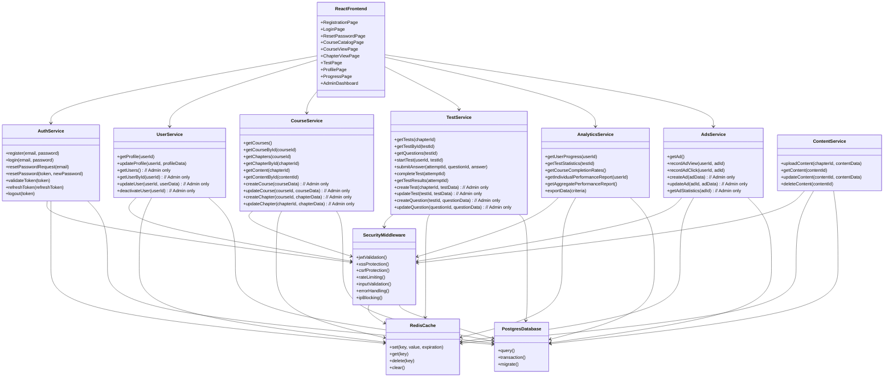

Имам един проект. Ето повече за него, зато започнем първо с идеята:

# Интерактивна онлайн система за самостоятелно offline обучение

## Описание на идеята

Искам да създам интерактивна онлайн система за самостоятелно offile обучение, която да може да се използва от крайни потребители.  
Ето и кратко описание на функционалността на системата:

1. Регистриране на потребител. Потребителя трябва да може да се регистрира само по email адрес и парола.
2. Вписване на потребител. Потребителя трябва да може да се вписва с вече регистрираните email адрес и парола.
3. Рестартиране на паролата. Потребителя трябва да може да си рестартира паролата, като при заявка системата трябва да изпраща линк за рестартиране на паролата на потребител. При натискане на линка, потребителя трябва да е препратен към страницата за въвеждането на нова парола.
4. Създаден admin потребител (искам да се създаде ръчно, не искам да имам endpoint който да прави това - поне на този етап)
5. Вписване с admin потребителя.
6. Тестове които да проверят до колко заучения материал от крайния потребител е запомнен. Крайния потребител трябва да може да решава тестове. Системата трябва да може да събира информация от решените тестове и да генерира отчет. Също в бъдеще тази събрана информация ще може да се използва за анализ и евентуално изследване с цел публикация.
7. Реклама. Системата трябва да има механизъм по който да се показват рекламни материали, ако някоя фирма реши да спонсорира дейността на системата. За целта трябва да се направи механизъм, по който рекламите, дан е се скриват от adblocker-ите (евентуално съм си мислил за hardcoded картинки, не знам дали има други подходи - това трябва да се провери)
8. Следене на прогреса на курса. Системата трябва да разполага с механизъм, с който да може да запомня до къде е стигнал крайния потребител. Не съм измислил как точно ще се случва това. Предложи идея. Мислех си, например потребителя да клика на бутон - следваща глава. И с това кликване да се запазва прогреса на курса.

Ще използваме VPS с тези параметри:  
6 vCPU Cores
12 GB RAM
200 GB SSD
or 100 GB NVMe
32 TB Traffic
Unlimited Incoming

За BE:
Искам да ползвам NestJS с Postgres за база от данни.
Кеширане с Redis.
Docker контейнеризация.

За FE:
Мисля да ползвам Codux, което прави React проект.

Вече имам проект, който да изпраща съдържание към база.
Вече имам друг проект, който да връща поискано съдържание от базата към потребителя с REST заявки.
Тоест съдържанието ще се обработва от различен проект. По този начин, ще имам повече сигурност и добра концептуална структура.

Сигурност:
Искам да добавя всички популярни механизми за сигурност при работата с endpoins. Например:

- JWT токени за влизане в системата
- HTTPS
- CORS
- CSRF защита
- XSS защита
- SQL injection защита
- Input validation
- Error handling
- Logging
- Rate limiting
- IP blocking
- Password hashing
- Управление на сесиите - Автоматично прекратяване на неактивни сесии, лимит на паралелни сесии
- Content Security Policy (CSP) - Предотвратява инжектиране на зловреден скрипт
- HTTP Security Headers - X-Content-Type-Options, X-Frame-Options, Strict-Transport-Security
- Криптиране на данните в покой - Особено за чувствителна информация
- Сигурна конфигурация на cookies - HttpOnly, Secure, SameSite флагове
- Input sanitization
- Input validation
- Input normalization
- Input validation

Архитектура:

# Архитектура на интерактивна онлайн система за самостоятелно обучение

## Обща системна архитектура


## Структура на базата данни (ER диаграма)


## Компонентна диаграма на системата



## Сигурност и защитни механизми


## Разпределение на ресурсите на VPS


## Подробно описание на архитектурата

### 1. Основна архитектура

Предложената архитектура е базирана на **микросервисен подход**, но e опростена и оптимизирана за посочените VPS ресурси. Основните компоненти са:

- **Nginx Gateway** - служи като входна точка към системата, осигурява SSL терминиране, балансиране на натоварването и базова защита от атаки
- **React Frontend** - изграден с Codux, респонсивен и оптимизиран за различни устройства
- **Backend микросервиси** - изградени с NestJS:
  - **Auth Service** - управлява всички процеси по автентикация
  - **User Service** - управлява потребителски данни и профили
  - **Course Service** - управлява курсове, глави и учебно съдържание
  - **Test Service** - управлява тестове, въпроси и отговори
  - **Analytics Service** - събира и анализира данни от използването на системата
  - **Ads Service** - управлява показването на реклами
- **Content Service** - отделен проект, който управлява съдържанието
- **БД слой** - PostgreSQL за постоянно съхранение и Redis за кеширане
- **Admin Panel** - за управление на системата
- **Мониторинг** - Prometheus и Grafana за наблюдение на производителността

### 2. База данни и модел на данните

Базата данни е проектирана с мисъл за:

- **Нормализация** - за намаляване на дублирането
- **Индексиране** - за оптимално търсене
- **Връзки между таблиците** - за поддържане на интегритет на данните
- **JSON полета** - за гъвкавост при необходимост
- **Времеви маркери** - за проследяване на създаване и промени

Основни таблици включват:

- **User** - съхранява основна потребителска информация
- **UserProfile** - разширена информация за потребителя
- **Course**, **Chapter**, **Content** - учебно съдържание
- **Test**, **Question**, **UserTestAttempt**, **UserAnswer** - тестове и отговори
- **Advertisement**, **UserAdView** - рекламна система
- **UserProgress** - проследяване на прогреса на потребителя
- **PasswordReset**, **Session** - управление на сесии и рестартиране на пароли

### 3. Сигурност

Архитектурата включва многопластов подход към сигурността:

- **Транспортен слой**: HTTPS с модерно шифроване
- **Автентикация**: JWT токени с кратък срок на валидност
- **Оторизация**: Ролеви модел (потребител/администратор)
- **Защита от атаки**: XSS, CSRF, SQL Injection, Rate Limiting
- **Защита на входните данни**: Валидация, нормализация, дезинфекция
- **Защита на паролите**: Хеширане със соли и pepper
- **Сесийна сигурност**: Управление на сесии, автоматично излизане при неактивност
- **Мониторинг и логване**: Проследяване на подозрителни дейности, блокиране на IP адреси

### 4. Реклами без adblocker блокиране

За реализация на рекламите, които да не се блокират от adblocker-и, препоръчвам:

1. **Вградени картинки от същия домейн** - adblocker-ите най-често блокират външни домейни
2. **Динамично генериране на имена на CSS класове** - избягва блокиране базирано на класове
3. **Вградени картинки с Base64 кодиране** - трудно се блокират
4. **Сървърно-рендерирани реклами** - интегрирани директно в HTML
5. **Избягване на ключови думи** като "ad", "banner", "sponsor" в CSS и HTML

### 5. Проследяване на прогреса

За проследяване на прогреса на потребителя предлагам:

1. **Автоматично проследяване на прегледаното съдържание** - системата да отбелязва автоматично, когато потребителят достигне до края на страницата
2. **Бутон "Маркирай като прочетено"** - за случаите, когато потребителят иска да отбележи ръчно
3. **Бутон "Следваща глава"** - както споменахте, да записва прогреса при преминаване
4. **Проследяване на времето прекарано на страницата** - за по-точна метрика
5. **Тестове за валидиране на знания** - за да се гарантира, че потребителят не само е преминал, но и е усвоил материала

### 6. Мащабируемост и разширяемост

Архитектурата е проектирана с мисъл за бъдещо разширяване:

1. **Микросервисна архитектура** - позволява добавяне на нови услуги без да се засягат съществуващите
2. **Контейнеризация с Docker** - лесно мащабиране на отделни компоненти
3. **Кеширане с Redis** - подобряване на производителността
4. **API-first подход** - лесно интегриране с мобилни приложения в бъдеще
5. **Опашки за обработка на тежки задачи** - при нужда от генериране на сложни отчети
6. **Разделение на съдържанието в отделен проект** - както сте посочили, подобрява сигурността и концептуалната структура

### 7. Оптимизация за VPS ресурси

За оптимално използване на посочените ресурси (6 vCPU, 12GB RAM, 200GB SSD):

1. **Балансирано разпределение на CPU ядрата** - повече ресурси за DB и backend
2. **Кеширане за намаляване на повторни DB заявки**
3. **Оптимизация на индексите в PostgreSQL**
4. **Компресия на статично съдържание**
5. **Lazy loading на съдържание в React**
6. **Автоматично скалиране на услугите според натоварването**
7. **Мониторинг на ресурси и ранно предупреждение при достигане на лимити**

## Заключение

Предложената архитектура осигурява балансирано решение, което:

- Отговаря на всички посочени функционални изисквания
- Интегрира всички изисквани механизми за сигурност
- Ефективно използва ограничените ресурси на VPS
- Осигурява лесна мащабируемост и разширяемост в бъдеще
- Следва съвременните добри практики за разработка

Архитектурата е проектирана да започне с минимално необходимите компоненти за VPS, но да позволява поетапно разширяване с нови функционалности или скалиране към по-голяма инфраструктура, ако се появи такава нужда в бъдеще.

Development план:

# План за разработка на интерактивна онлайн система за обучение

## Фаза 1: Подготовка на локална среда за разработка

1. Настройка на локална среда за разработка с Docker Compose
2. Създаване на Docker контейнери за:
   - NestJS микросервиси
   - PostgreSQL база данни
   - Redis кеш
   - Nginx за локално тестване
3. Настройка на VS Code с необходимите разширения
4. Създаване на Git хранилище и структура на проекта
5. Настройка на ESLint и Prettier за поддържане на код стандарти

## Фаза 2: Разработка на базата данни

6. Създаване на миграционни скриптове за PostgreSQL
7. Имплементиране на моделите и релациите в базата данни
8. Настройка на Redis за кеширане
9. Тестване и оптимизация на базата данни
10. Създаване на скриптове за обновяване и връщане към предишни версии на базата

## Фаза 3: Разработка на Backend микросервиси

11. Разработка на Auth Service
    - Имплементация на регистрация, вписване и обновяване на парола
    - JWT токен автентикация
    - Middleware за защита на маршрутите
12. Разработка на User Service
    - CRUD операции за потребители
    - Профилни данни
    - Потребителски настройки
13. Разработка на Course Service
    - CRUD операции за курсове и глави
    - API за извличане на структурирано съдържание
14. Разработка на Test Service
    - CRUD операции за тестове и въпроси
    - API за решаване на тестове и записване на резултати
15. Разработка на Analytics Service
    - Събиране на данни
    - Генериране на отчети
16. Разработка на Ads Service
    - Показване на реклами
    - Проследяване на показвания и кликвания
17. Имплементация на Content Service за интеграция с вашия съществуващ проект
18. Добавяне на междинен слой за сигурност към всички микросервиси

## Фаза 4: Разработка на Frontend с Codux/React

19. Създаване на структура на потребителския интерфейс
20. Разработка на компоненти за автентикация
    - Регистрационна форма
    - Форма за вписване
    - Форма за рестартиране на парола
21. Разработка на основни компоненти
    - Навигация и меню
    - Списък с курсове
    - Преглед на съдържание
    - Решаване на тест
    - Потребителски профил
22. Разработка на Admin панел
    - Табло за управление
    - Управление на потребители
    - Управление на курсове и съдържание
    - Управление на тестове
    - Преглед на аналитични данни
    - Управление на реклами
23. Имплементация на проследяване на прогреса
24. Имплементация на система за показване на реклами (защитена от adblocker)
25. Оптимизация на производителността и UX

## Фаза 5: Интеграция и тестване

26. Интеграция на всички микросервиси
27. Настройка на комуникацията между микросервисите
28. Интеграция на Frontend с Backend API
29. Разработка на компонентни тестове за Frontend
30. Разработка на unit тестове за Backend микросервиси
31. Разработка на интеграционни тестове
32. Тестване на производителността
33. Тестване на сигурността
    - Penetration тестове
    - Тестове за уязвимост
    - Тестване на защитите срещу XSS, CSRF, SQL Injection и др.
34. Тестване на потребителското преживяване

## Фаза 6: Оптимизация и подготовка за внедряване

35. Оптимизация на SQL заявките
36. Настройка на кеширането
37. Оптимизация на свалянето на статично съдържание
38. Настройка на логване и мониторинг
39. Настройка на бекъп стратегия
40. Създаване на документация за разработчици
41. Създаване на документация за потребители
42. Финална проверка на сигурността

## Фаза 7: Подготовка за разгръщане на VPS

43. Подготовка на Docker Compose файлове за продукционна среда
44. Настройка на CI/CD процес
45. Създаване на скриптове за автоматично разгръщане
46. Настройка на SSL/TLS сертификати
47. Разработка на стратегия за миграция на данни
48. Разработка на план за възстановяване при аварии
49. Настройка на автоматични бекъпи
50. Подготовка на скриптове за мониторинг

## Фаза 8: Разгръщане и внедряване

51. Подготовка на VPS сървъра
52. Настройка на операционната система и защитна стена
53. Инсталиране на Docker и необходими зависимости
54. Създаване на администраторски потребител
55. Разгръщане на микросервисите
56. Разгръщане на базата данни
57. Разгръщане на кеш сървъра
58. Разгръщане на Frontend
59. Конфигуриране на Nginx и SSL/TLS
60. Тестване на внедрената система
61. Мониторинг на производителността след разгръщане
62. Оптимизации на базата на събраните данни от мониторинга

## Фаза 9: Последващо развитие

63. Събиране на обратна връзка от потребители
64. Планиране на нови функционалности
65. Интегриране на допълнителни микросервиси при нужда
66. Оптимизация на мащабируемостта според натоварването
67. Периодични обновления за сигурност
68. Развитие на аналитичната платформа за изследователски цели

Този план позволява методично и структурирано разработване на системата, като първо се фокусира върху локалната разработка и тестване, а след това преминава към разгръщане и внедряване. С използването на Docker контейнеризация, същата система, която разработвате локално, може лесно да бъде преместена на VPS сървъра, което минимизира проблемите при внедряване.

Ето и самия проект до момента:
docker-compose.override.yml
# Override за локална разработка
services:
  db:
    restart: unless-stopped
    volumes:
      - ./db/logs:/var/log/postgresql
    command: ['postgres', '-c', 'log_statement=all', '-c', 'log_connections=on', '-c', 'log_disconnections=on']

  redis:
    restart: unless-stopped
    volumes:
      - ./redis/logs:/data/logs

  auth-service:
    restart: unless-stopped
    environment:
      DEBUG: 'true'
      LOG_LEVEL: 'debug'
    volumes:
      - ./services/auth:/app
      - /app/node_modules
      - ./services/auth/logs:/app/logs
    working_dir: /app
    command: sh -c "ls -la && npm run start:dev"

  user-service:
    restart: unless-stopped
    environment:
      DEBUG: 'true'
      LOG_LEVEL: 'debug'
    volumes:
      - ./services/user:/app
      - /app/node_modules
      - ./services/user/logs:/app/logs

  course-service:
    restart: unless-stopped
    environment:
      DEBUG: 'true'
      LOG_LEVEL: 'debug'
    volumes:
      - ./services/course:/app
      - /app/node_modules
      - ./services/course/logs:/app/logs

  test-service:
    restart: unless-stopped
    environment:
      DEBUG: 'true'
      LOG_LEVEL: 'debug'
    volumes:
      - ./services/test:/app
      - /app/node_modules
      - ./services/test/logs:/app/logs

  analytics-service:
    restart: unless-stopped
    environment:
      DEBUG: 'true'
      LOG_LEVEL: 'debug'
    volumes:
      - ./services/analytics:/app
      - /app/node_modules
      - ./services/analytics/logs:/app/logs

  ads-service:
    restart: unless-stopped
    environment:
      DEBUG: 'true'
      LOG_LEVEL: 'debug'
    volumes:
      - ./services/ads:/app
      - /app/node_modules
      - ./services/ads/logs:/app/logs

  frontend:
    restart: unless-stopped
    environment:
      NODE_ENV: development
      CHOKIDAR_USEPOLLING: 'true'
      REACT_APP_API_URL: http://localhost:8080
    volumes:
      - ./frontend:/app
      - /app/node_modules

  nginx:
    restart: unless-stopped
    volumes:
      - ./nginx/logs:/var/log/nginx


.env.example
### Съдържание на .env файл ###


### Край на .env файл ###

.gitignore
# Logs
logs
*.log
npm-debug.log*
yarn-debug.log*
yarn-error.log*
lerna-debug.log*
pnpm-debug.log*

# Diagnostic reports
report.[0-9]*.[0-9]*.[0-9]*.[0-9]*.json

# Runtime data
pids
*.pid
*.seed
*.pid.lock

# Directory for instrumented libs generated by jscoverage/JSCover
lib-cov

# Coverage directory used by tools like istanbul
coverage
*.lcov

# nyc test coverage
.nyc_output

# Grunt intermediate storage
.grunt

# Bower dependency directory
bower_components

# Node.js dependency directories
node_modules/
jspm_packages/

# TypeScript compiled files
dist/
build/

# Snowpack dependency directory
web_modules/

# TypeScript cache
*.tsbuildinfo

# Optional npm cache directory
.npm

# Optional eslint cache
.eslintcache

# Optional stylelint cache
.stylelintcache

# Microbundle cache
.rpt2_cache/
.rts2_cache_cjs/
.rts2_cache_es/
.rts2_cache_umd/

# Optional REPL history
.node_repl_history

# Output of 'npm pack'
*.tgz

# Yarn Integrity file
.yarn-integrity

# dotenv environment variables file
# .env
# .env.development.local
# .env.test.local
# .env.production.local
# .env.local

# parcel-bundler cache
.cache
.parcel-cache

# Next.js build output
.next
out

# Nuxt.js build / generate output
.nuxt
dist

# Gatsby files
.cache/
public

# vuepress build output
.vuepress/dist

# vuepress v2.x temp and cache directory
.temp
.cache

# Serverless directories
.serverless/

# FuseBox cache
.fusebox/

# DynamoDB Local files
.dynamodb/

# TernJS port file
.tern-port

# Stores VSCode versions used for testing VSCode extensions
.vscode-test

# yarn v2
.yarn/cache
.yarn/unplugged
.yarn/build-state.yml
.yarn/install-state.gz
.pnp.*

# Docker volumes
postgres_data/
redis_data/

# IDE
.idea
.vscode/*
!.vscode/extensions.json
!.vscode/settings.json
!.vscode/tasks.json
!.vscode/launch.json

# OS specific files
.DS_Store
Thumbs.db

# Database
*.sqlite
*.sqlite3

# Temporary files
*.tmp
*.temp

# Debug files
debug.log
*.debug

# Backup files
*.bak
*.backup

# Binary files for plugins
*.exe
*.dll
*.so
*.dylib


services
services/auth
services/auth/Dockerfile
# services/auth/Dockerfile.dev
FROM node:20-alpine

WORKDIR /app

COPY package*.json ./

RUN npm install

# В режим на разработка не копираме файловете, 
# вместо това ще ги монтираме от локалната система
# COPY . .

EXPOSE 3000

CMD ["npm", "run", "start:dev"]

services/auth/src
services/auth/src/app.controller.ts
import { Controller, Get } from '@nestjs/common';
import { AppService } from './app.service';

@Controller()
export class AppController {
  constructor(private readonly appService: AppService) {}

  @Get()
  getHello(): string {
    return this.appService.getHello();
  }
}


services/auth/src/app.module.ts
import { Module } from '@nestjs/common';
import { ConfigModule, ConfigService } from '@nestjs/config';
import { TypeOrmModule } from '@nestjs/typeorm';
import { AppController } from './app.controller';
import { AppService } from './app.service';
import { AuthModule } from './auth/auth.module';
import { PasswordReset } from './auth/entities/password-reset.entity';
import { Session } from './auth/entities/session.entity';
import appConfig from './config/app.config';
import { User } from './users/entities/user.entity';

@Module({
  imports: [
    ConfigModule.forRoot({
      isGlobal: true,
      load: [appConfig],
    }),
    TypeOrmModule.forRootAsync({
      imports: [ConfigModule],
      inject: [ConfigService],
      useFactory: (configService: ConfigService) => ({
        type: 'postgres',
        host: configService.get('database.host'),
        port: configService.get('database.port'),
        username: configService.get('database.username'),
        password: configService.get('database.password'),
        database: configService.get('database.database'),
        entities: [User, PasswordReset, Session],
        synchronize: configService.get('NODE_ENV') === 'development',
        logging: configService.get('NODE_ENV') === 'development',
      }),
    }),
    AuthModule,
  ],
  controllers: [AppController],
  providers: [AppService],
})
export class AppModule {}


services/auth/src/app.service.ts
import { Injectable } from '@nestjs/common';

@Injectable()
export class AppService {
  getHello(): string {
    return 'Hello World!';
  }
}


services/auth/src/main.ts
import { ValidationPipe } from '@nestjs/common';
import { NestFactory } from '@nestjs/core';
import { AppModule } from './app.module';

async function bootstrap() {
  const app = await NestFactory.create(AppModule);
  app.useGlobalPipes(new ValidationPipe());
  await app.listen(process.env.PORT || 3000);
}
bootstrap().catch((err) => {
  console.error('Error starting server:', err);
  process.exit(1);
});


services/auth/src/app.controller.spec.ts
import { Test, TestingModule } from '@nestjs/testing';
import { AppController } from './app.controller';
import { AppService } from './app.service';

describe('AppController', () => {
  let appController: AppController;

  beforeEach(async () => {
    const app: TestingModule = await Test.createTestingModule({
      controllers: [AppController],
      providers: [AppService],
    }).compile();

    appController = app.get<AppController>(AppController);
  });

  describe('root', () => {
    it('should return "Hello World!"', () => {
      expect(appController.getHello()).toBe('Hello World!');
    });
  });
});


services/auth/src/config
services/auth/src/config/app.config.ts
export default () => ({
  port: parseInt(process.env.PORT || '3001', 10),
  database: {
    host: process.env.DATABASE_HOST || 'localhost',
    port: parseInt(process.env.DATABASE_PORT || '5433', 10),
    username: process.env.DATABASE_USERNAME || 'postgres',
    password: process.env.DATABASE_PASSWORD || 'postgres',
    database: process.env.DATABASE_NAME || 'learning_platform',
  },
  jwt: {
    secret: process.env.JWT_SECRET || 'testSecretKey',
    expiresIn: process.env.JWT_EXPIRES_IN || '1h',
    refreshExpiresIn: process.env.JWT_REFRESH_EXPIRES_IN || '7d',
  },
  redis: {
    host: process.env.REDIS_HOST || 'localhost',
    port: parseInt(process.env.REDIS_PORT || '6379', 10),
    password: process.env.REDIS_PASSWORD || 'redis_password',
  },
});


services/auth/src/common
services/auth/src/common/entities
services/auth/src/common/entities/base.entity.ts
import {
  CreateDateColumn,
  PrimaryGeneratedColumn,
  UpdateDateColumn,
} from 'typeorm';

export abstract class BaseEntity {
  @PrimaryGeneratedColumn()
  id: number;

  @CreateDateColumn({ name: 'created_at' })
  createdAt: Date;

  @UpdateDateColumn({ name: 'updated_at' })
  updatedAt: Date;
}


services/auth/src/users
services/auth/src/users/entities
services/auth/src/users/entities/user.entity.ts
import { Column, Entity, Index, OneToMany } from 'typeorm';
import { PasswordReset } from '../../auth/entities/password-reset.entity';
import { Session } from '../../auth/entities/session.entity';
import { BaseEntity } from '../../common/entities/base.entity';

@Entity('users')
export class User extends BaseEntity {
  @Column({ length: 255, unique: true })
  @Index('idx_user_email')
  email: string;

  @Column({ name: 'password_hash', length: 255 })
  passwordHash: string;

  @Column({ length: 255 })
  salt: string;

  @Column({ length: 50, default: 'user' })
  role: string;

  @Column({ name: 'is_active', default: true })
  isActive: boolean;

  @Column({ name: 'failed_login_attempts', default: 0 })
  failedLoginAttempts: number;

  @Column({ name: 'last_login', nullable: true, type: 'timestamp' })
  lastLogin: Date | null;

  @OneToMany(() => PasswordReset, (passwordReset) => passwordReset.user)
  passwordResets: PasswordReset[];

  @OneToMany(() => Session, (session) => session.user)
  sessions: Session[];
}


services/auth/src/auth
services/auth/src/auth/auth.controller.ts
import {
  Body,
  Controller,
  Get,
  HttpCode,
  HttpStatus,
  Post,
  Request,
  UseGuards,
} from '@nestjs/common';
import { AuthService } from './auth.service';
import { LoginDto } from './dto/login.dto';
import { RegisterDto } from './dto/register.dto';
import { ResetPasswordRequestDto } from './dto/reset-password-request.dto';
import { ResetPasswordDto } from './dto/reset-password.dto';
import { JwtAuthGuard } from './guards/jwt-auth.guard';

// Дефиниция на интерфейс за Request с типизация
interface RequestWithUser {
  user: {
    id: number;
    email: string;
    role: string;
  };
  headers: {
    authorization?: string;
  };
}

@Controller('auth')
export class AuthController {
  constructor(private readonly authService: AuthService) {}

  @Get('health')
  healthCheck(): { status: string } {
    return { status: 'ok' };
  }

  @Post('register')
  async register(@Body() registerDto: RegisterDto) {
    const { user, token } = await this.authService.register(registerDto);
    return {
      id: user.id,
      email: user.email,
      role: user.role,
      accessToken: token,
    };
  }

  @Post('login')
  @HttpCode(HttpStatus.OK)
  async login(@Body() loginDto: LoginDto) {
    const { user, token } = await this.authService.login(loginDto);
    return {
      id: user.id,
      email: user.email,
      role: user.role,
      accessToken: token,
    };
  }

  @Post('reset-password-request')
  @HttpCode(HttpStatus.OK)
  async resetPasswordRequest(
    @Body() resetPasswordRequestDto: ResetPasswordRequestDto,
  ) {
    await this.authService.resetPasswordRequest(resetPasswordRequestDto);
    return {
      message:
        'Ако имейлът съществува, ще получите линк за рестартиране на паролата.',
    };
  }

  @Post('reset-password')
  @HttpCode(HttpStatus.OK)
  async resetPassword(@Body() resetPasswordDto: ResetPasswordDto) {
    await this.authService.resetPassword(resetPasswordDto);
    return {
      message: 'Паролата беше успешно променена.',
    };
  }

  @UseGuards(JwtAuthGuard)
  @Post('logout')
  @HttpCode(HttpStatus.OK)
  async logout(@Request() req: RequestWithUser) {
    const token = req.headers.authorization?.split(' ')[1] || '';
    await this.authService.logout(token);
    return {
      message: 'Успешно излизане от системата.',
    };
  }

  @UseGuards(JwtAuthGuard)
  @Get('profile')
  getProfile(@Request() req: RequestWithUser) {
    const user = req.user;
    return {
      id: user.id,
      email: user.email,
      role: user.role,
    };
  }
}


services/auth/src/auth/auth.service.spec.ts
// services/auth/src/auth/auth.service.spec.ts
import { BadRequestException, UnauthorizedException } from '@nestjs/common';
import { ConfigService } from '@nestjs/config';
import { JwtService } from '@nestjs/jwt';
import { Test, TestingModule } from '@nestjs/testing';
import { getRepositoryToken } from '@nestjs/typeorm';
import * as bcrypt from 'bcrypt';
import { Repository } from 'typeorm';
import { User } from '../users/entities/user.entity';
import { AuthService } from './auth.service';
import { PasswordReset } from './entities/password-reset.entity';
import { Session } from './entities/session.entity';

// Mock bcrypt
jest.mock('bcrypt', () => ({
  genSalt: jest.fn().mockResolvedValue('mockedSalt'),
  hash: jest.fn().mockResolvedValue('hashedPassword'),
  compare: jest.fn(),
}));

describe('AuthService', () => {
  let service: AuthService;
  let userRepository: Repository<User>;
  // Дефинирай тези променливи но ги не маркирай с eslint no-unused-vars
  /* eslint-disable @typescript-eslint/no-unused-vars */
  let passwordResetRepository: Repository<PasswordReset>;
  let sessionRepository: Repository<Session>;
  /* eslint-enable @typescript-eslint/no-unused-vars */
  let jwtService: JwtService;

  beforeEach(async () => {
    const module: TestingModule = await Test.createTestingModule({
      providers: [
        AuthService,
        {
          provide: getRepositoryToken(User),
          useValue: {
            findOne: jest.fn(),
            create: jest.fn(),
            save: jest.fn(),
          },
        },
        {
          provide: getRepositoryToken(PasswordReset),
          useValue: {
            findOne: jest.fn(),
            create: jest.fn(),
            save: jest.fn(),
          },
        },
        {
          provide: getRepositoryToken(Session),
          useValue: {
            delete: jest.fn(),
          },
        },
        {
          provide: JwtService,
          useValue: {
            sign: jest.fn(() => 'jwt-token'),
            verify: jest.fn(),
          },
        },
        {
          provide: ConfigService,
          useValue: {
            get: jest.fn(),
          },
        },
      ],
    }).compile();

    service = module.get<AuthService>(AuthService);
    userRepository = module.get<Repository<User>>(getRepositoryToken(User));
    passwordResetRepository = module.get<Repository<PasswordReset>>(
      getRepositoryToken(PasswordReset),
    );
    sessionRepository = module.get<Repository<Session>>(
      getRepositoryToken(Session),
    );
    jwtService = module.get<JwtService>(JwtService);
  });

  it('should be defined', () => {
    expect(service).toBeDefined();
  });

  describe('register', () => {
    it('should register a new user successfully', async () => {
      // Arrange
      const registerDto = {
        email: 'test@example.com',
        password: 'StrongP@ss1',
      };

      jest
        .spyOn(userRepository, 'findOne')
        .mockImplementation(() => Promise.resolve(null));

      jest.spyOn(userRepository, 'create').mockImplementation(
        () =>
          ({
            id: 1,
            email: registerDto.email,
            passwordHash: 'hashedPassword',
            salt: 'mockedSalt',
            role: 'user',
            isActive: true,
            failedLoginAttempts: 0,
            lastLogin: null,
          }) as User,
      );

      jest
        .spyOn(userRepository, 'save')
        .mockImplementation((user) => Promise.resolve(user as User));

      jest.spyOn(jwtService, 'sign').mockImplementation(() => 'jwt-token');

      // Act
      const result = await service.register(registerDto);

      // Assert
      expect(result).toHaveProperty('user');
      expect(result).toHaveProperty('token');
      expect(result.user.email).toBe(registerDto.email);
      expect(result.token).toBe('jwt-token');
      expect(bcrypt.genSalt).toHaveBeenCalled();
      expect(bcrypt.hash).toHaveBeenCalledWith(
        registerDto.password,
        'mockedSalt',
      );
      expect(userRepository.save).toHaveBeenCalled();
      expect(jwtService.sign).toHaveBeenCalled();
    });

    it('should throw BadRequestException if user already exists', async () => {
      // Arrange
      const registerDto = {
        email: 'existing@example.com',
        password: 'StrongP@ss1',
      };

      jest.spyOn(userRepository, 'findOne').mockImplementation(() =>
        Promise.resolve({
          id: 1,
          email: registerDto.email,
        } as User),
      );

      // Act & Assert
      await expect(async () => {
        await service.register(registerDto);
      }).rejects.toThrow(BadRequestException);

      expect(userRepository.findOne).toHaveBeenCalledWith({
        where: { email: registerDto.email },
      });
    });
  });

  describe('login', () => {
    it('should login successfully and return token', async () => {
      // Arrange
      const loginDto = {
        email: 'test@example.com',
        password: 'StrongP@ss1',
      };

      const user = {
        id: 1,
        email: loginDto.email,
        passwordHash: 'hashedPassword',
        salt: 'mockedSalt',
        role: 'user',
        isActive: true,
        failedLoginAttempts: 0,
        lastLogin: null,
      } as User;

      jest
        .spyOn(userRepository, 'findOne')
        .mockImplementation(() => Promise.resolve(user));

      jest
        .spyOn(bcrypt, 'compare')
        .mockImplementation(() => Promise.resolve(true));

      jest.spyOn(userRepository, 'save').mockImplementation((updatedUser) =>
        Promise.resolve({
          ...user,
          ...updatedUser,
          failedLoginAttempts: 0,
          lastLogin: expect.any(Date),
        } as User),
      );

      jest.spyOn(jwtService, 'sign').mockImplementation(() => 'jwt-token');

      // Act
      const result = await service.login(loginDto);

      // Assert
      expect(result).toHaveProperty('user');
      expect(result).toHaveProperty('token');
      expect(result.user.email).toBe(loginDto.email);
      expect(result.token).toBe('jwt-token');
      expect(userRepository.save).toHaveBeenCalled();
      expect(jwtService.sign).toHaveBeenCalled();
    });

    it('should throw UnauthorizedException if user not found', async () => {
      // Arrange
      const loginDto = {
        email: 'nonexistent@example.com',
        password: 'StrongP@ss1',
      };

      jest
        .spyOn(userRepository, 'findOne')
        .mockImplementation(() => Promise.resolve(null));

      // Act & Assert
      await expect(async () => {
        await service.login(loginDto);
      }).rejects.toThrow(UnauthorizedException);
    });

    it('should throw UnauthorizedException if account is not active', async () => {
      // Arrange
      const loginDto = {
        email: 'inactive@example.com',
        password: 'StrongP@ss1',
      };

      jest.spyOn(userRepository, 'findOne').mockImplementation(() =>
        Promise.resolve({
          id: 1,
          email: loginDto.email,
          passwordHash: 'hashedPassword',
          salt: 'mockedSalt',
          role: 'user',
          isActive: false,
          failedLoginAttempts: 0,
          lastLogin: null,
        } as User),
      );

      // Act & Assert
      await expect(async () => {
        await service.login(loginDto);
      }).rejects.toThrow(UnauthorizedException);
    });

    it('should throw UnauthorizedException if password is invalid', async () => {
      // Arrange
      const loginDto = {
        email: 'test@example.com',
        password: 'WrongP@ss1',
      };

      const user = {
        id: 1,
        email: loginDto.email,
        passwordHash: 'hashedPassword',
        salt: 'mockedSalt',
        role: 'user',
        isActive: true,
        failedLoginAttempts: 0,
        lastLogin: null,
      } as User;

      jest
        .spyOn(userRepository, 'findOne')
        .mockImplementation(() => Promise.resolve(user));

      jest
        .spyOn(bcrypt, 'compare')
        .mockImplementation(() => Promise.resolve(false));

      jest.spyOn(userRepository, 'save').mockImplementation((updatedUser) =>
        Promise.resolve({
          ...user,
          ...updatedUser,
          failedLoginAttempts: 1,
        } as User),
      );

      // Act & Assert
      await expect(async () => {
        await service.login(loginDto);
      }).rejects.toThrow(UnauthorizedException);

      expect(userRepository.save).toHaveBeenCalledWith(
        expect.objectContaining({
          failedLoginAttempts: 1,
        }),
      );
    });

    it('should lock account after 5 failed login attempts', async () => {
      // Arrange
      const loginDto = {
        email: 'test@example.com',
        password: 'WrongP@ss1',
      };

      const user = {
        id: 1,
        email: loginDto.email,
        passwordHash: 'hashedPassword',
        salt: 'mockedSalt',
        role: 'user',
        isActive: true,
        failedLoginAttempts: 4,
        lastLogin: null,
      } as User;

      jest
        .spyOn(userRepository, 'findOne')
        .mockImplementation(() => Promise.resolve(user));

      jest
        .spyOn(bcrypt, 'compare')
        .mockImplementation(() => Promise.resolve(false));

      jest.spyOn(userRepository, 'save').mockImplementation((updatedUser) =>
        Promise.resolve({
          ...user,
          ...updatedUser,
          failedLoginAttempts: 5,
          isActive: false,
        } as User),
      );

      // Act & Assert
      await expect(async () => {
        await service.login(loginDto);
      }).rejects.toThrow(UnauthorizedException);

      expect(userRepository.save).toHaveBeenCalledWith(
        expect.objectContaining({
          failedLoginAttempts: 5,
          isActive: false,
        }),
      );
    });
  });

  // Можете да добавите още тестове за останалите методи
});


services/auth/src/auth/auth.module.ts
import { Module } from '@nestjs/common';
import { ConfigModule, ConfigService } from '@nestjs/config';
import { JwtModule } from '@nestjs/jwt';
import { PassportModule } from '@nestjs/passport';
import { TypeOrmModule } from '@nestjs/typeorm';
import { User } from '../users/entities/user.entity';
import { AuthController } from './auth.controller';
import { AuthService } from './auth.service';
import { PasswordReset } from './entities/password-reset.entity';
import { Session } from './entities/session.entity';
import { JwtStrategy } from './strategies/jwt.strategy';

@Module({
  imports: [
    PassportModule.register({ defaultStrategy: 'jwt' }),
    JwtModule.registerAsync({
      imports: [ConfigModule],
      inject: [ConfigService],
      useFactory: (configService: ConfigService) => {
        const secret = configService.get<string>('jwt.secret');
        if (!secret) {
          throw new Error('JWT secret is not defined');
        }
        return {
          secret,
          signOptions: {
            expiresIn: configService.get('jwt.expiresIn', '1h'),
          },
        };
      },
    }),
    TypeOrmModule.forFeature([User, PasswordReset, Session]),
  ],
  controllers: [AuthController],
  providers: [AuthService, JwtStrategy],
  exports: [AuthService, JwtStrategy],
})
export class AuthModule {}


services/auth/src/auth/auth.service.ts
import {
  BadRequestException,
  Injectable,
  UnauthorizedException,
} from '@nestjs/common';
import { ConfigService } from '@nestjs/config';
import { JwtService } from '@nestjs/jwt';
import { InjectRepository } from '@nestjs/typeorm';
import * as bcrypt from 'bcrypt';
import { Repository } from 'typeorm';
import { v4 as uuidv4 } from 'uuid';
import { User } from '../users/entities/user.entity';
import { LoginDto } from './dto/login.dto';
import { RegisterDto } from './dto/register.dto';
import { ResetPasswordRequestDto } from './dto/reset-password-request.dto';
import { ResetPasswordDto } from './dto/reset-password.dto';
import { PasswordReset } from './entities/password-reset.entity';
import { Session } from './entities/session.entity';

// Интерфейс за JWT payload
interface JwtPayload {
  sub: number;
  email: string;
  role: string;
}

@Injectable()
export class AuthService {
  constructor(
    @InjectRepository(User)
    private usersRepository: Repository<User>,
    @InjectRepository(PasswordReset)
    private passwordResetRepository: Repository<PasswordReset>,
    @InjectRepository(Session)
    private sessionRepository: Repository<Session>,
    private jwtService: JwtService,
    private configService: ConfigService,
  ) {}

  async register(
    registerDto: RegisterDto,
  ): Promise<{ user: User; token: string }> {
    const { email, password } = registerDto;

    // Проверка за съществуващ потребител
    const existingUser = await this.usersRepository.findOne({
      where: { email },
    });
    if (existingUser) {
      throw new BadRequestException('Потребител с този имейл вече съществува');
    }

    // Хеширане на паролата
    const salt = await bcrypt.genSalt();
    const passwordHash = await bcrypt.hash(password, salt);

    // Създаване на потребител
    const user = this.usersRepository.create({
      email,
      passwordHash,
      salt,
      role: 'user',
      isActive: true,
      failedLoginAttempts: 0,
      lastLogin: null,
    });

    await this.usersRepository.save(user);

    // Генериране на JWT токен
    const token = this.generateToken(user);

    return { user, token };
  }

  async login(loginDto: LoginDto): Promise<{ user: User; token: string }> {
    const { email, password } = loginDto;

    // Намиране на потребителя
    const user = await this.usersRepository.findOne({ where: { email } });
    if (!user) {
      throw new UnauthorizedException('Невалиден имейл или парола');
    }

    // Проверка дали акаунтът е активен
    if (!user.isActive) {
      throw new UnauthorizedException('Акаунтът е деактивиран');
    }

    // Валидиране на паролата
    const isPasswordValid = await bcrypt.compare(password, user.passwordHash);
    if (!isPasswordValid) {
      // Увеличаване на броя неуспешни опити
      user.failedLoginAttempts += 1;

      // Заключване на акаунта след 5 неуспешни опита
      if (user.failedLoginAttempts >= 5) {
        user.isActive = false;
      }

      await this.usersRepository.save(user);
      throw new UnauthorizedException('Невалиден имейл или парола');
    }

    // Нулиране на неуспешните опити и актуализиране на времето на последно влизане
    user.failedLoginAttempts = 0;
    user.lastLogin = new Date();
    await this.usersRepository.save(user);

    // Генериране на JWT токен
    const token = this.generateToken(user);

    return { user, token };
  }

  async resetPasswordRequest(
    resetPasswordRequestDto: ResetPasswordRequestDto,
  ): Promise<void> {
    const { email } = resetPasswordRequestDto;

    // Намиране на потребителя
    const user = await this.usersRepository.findOne({ where: { email } });
    if (!user) {
      // За сигурност, не разкриваме дали имейлът съществува
      return;
    }

    // Генериране на токен за рестартиране на паролата
    const token = uuidv4();
    const expiresAt = new Date();
    expiresAt.setHours(expiresAt.getHours() + 24); // Валиден за 24 часа

    // Съхраняване на токена
    const passwordReset = this.passwordResetRepository.create({
      userId: user.id,
      token,
      used: false,
      expiresAt,
    });
    await this.passwordResetRepository.save(passwordReset);

    // Тук бихме изпратили имейл с линк за рестартиране на паролата
    // TODO: Имплементирайте изпращане на имейл
    console.log(`Токен за рестартиране на парола: ${token}`);
  }

  async resetPassword(resetPasswordDto: ResetPasswordDto): Promise<void> {
    const { token, newPassword } = resetPasswordDto;

    // Намиране на валиден токен за рестартиране на парола
    const passwordReset = await this.passwordResetRepository.findOne({
      where: { token, used: false },
      relations: ['user'],
    });

    if (!passwordReset || passwordReset.expiresAt < new Date()) {
      throw new BadRequestException('Невалиден или изтекъл токен');
    }

    const user = passwordReset.user;

    // Хеширане на новата парола
    const salt = await bcrypt.genSalt();
    const passwordHash = await bcrypt.hash(newPassword, salt);

    // Актуализиране на паролата на потребителя
    user.passwordHash = passwordHash;
    user.salt = salt;
    await this.usersRepository.save(user);

    // Маркиране на токена като използван
    passwordReset.used = true;
    await this.passwordResetRepository.save(passwordReset);

    // Премахване на всички сесии на потребителя за по-голяма сигурност
    await this.sessionRepository.delete({ userId: user.id });
  }

  async validateUser(email: string, password: string): Promise<User | null> {
    const user = await this.usersRepository.findOne({ where: { email } });
    if (!user || !user.isActive) {
      return null;
    }

    const isPasswordValid = await bcrypt.compare(password, user.passwordHash);
    if (!isPasswordValid) {
      return null;
    }

    return user;
  }

  async validateToken(token: string): Promise<User | null> {
    try {
      const payload = this.jwtService.verify(token);
      const user = await this.usersRepository.findOne({
        where: { id: payload.sub },
      });
      return user;
      // eslint-disable-next-line @typescript-eslint/no-unused-vars
    } catch (_) {
      // Intentionally ignoring error
      return null;
    }
  }

  generateToken(user: User): string {
    const payload: JwtPayload = {
      email: user.email,
      sub: user.id,
      role: user.role,
    };
    return this.jwtService.sign(payload);
  }

  async logout(token: string): Promise<void> {
    // Намиране и изтриване на сесията
    await this.sessionRepository.delete({ token });
  }
}


services/auth/src/auth/entities
services/auth/src/auth/entities/password-reset.entity.ts
import { Column, Entity, Index, JoinColumn, ManyToOne } from 'typeorm';
import { BaseEntity } from '../../common/entities/base.entity';
import { User } from '../../users/entities/user.entity';

@Entity('password_resets')
export class PasswordReset extends BaseEntity {
  @Column({ name: 'user_id' })
  @Index('idx_password_reset_user_id')
  userId: number;

  @ManyToOne(() => User, (user) => user.passwordResets, { onDelete: 'CASCADE' })
  @JoinColumn({ name: 'user_id' })
  user: User;

  @Column({ length: 255 })
  @Index('idx_password_reset_token')
  token: string;

  @Column({ default: false })
  used: boolean;

  @Column({ name: 'expires_at', type: 'timestamp' })
  expiresAt: Date;
}


services/auth/src/auth/entities/session.entity.ts
import { Column, Entity, Index, JoinColumn, ManyToOne } from 'typeorm';
import { BaseEntity } from '../../common/entities/base.entity';
import { User } from '../../users/entities/user.entity';

@Entity('sessions')
export class Session extends BaseEntity {
  @Column({ name: 'user_id' })
  @Index('idx_session_user_id')
  userId: number;

  @ManyToOne(() => User, (user) => user.sessions, { onDelete: 'CASCADE' })
  @JoinColumn({ name: 'user_id' })
  user: User;

  @Column({ length: 255 })
  @Index('idx_session_token')
  token: string;

  @Column({ name: 'ip_address', type: 'varchar', length: 45, nullable: true })
  ipAddress: string | null;

  @Column({ name: 'user_agent', type: 'text', nullable: true })
  userAgent: string | null;

  @Column({ name: 'expires_at', type: 'timestamp' })
  expiresAt: Date;

  @Column({
    name: 'last_active',
    type: 'timestamp',
    default: () => 'CURRENT_TIMESTAMP',
  })
  lastActive: Date;
}


services/auth/src/auth/dto
services/auth/src/auth/dto/register.dto.ts
import { IsEmail, IsNotEmpty, Matches, MinLength } from 'class-validator';

export class RegisterDto {
  @IsEmail({}, { message: 'Моля, въведете валиден имейл адрес' })
  email: string;

  @IsNotEmpty({ message: 'Паролата е задължителна' })
  @MinLength(8, { message: 'Паролата трябва да бъде поне 8 символа' })
  @Matches(/((?=.*\d)|(?=.*\W+))(?![.\n])(?=.*[A-Z])(?=.*[a-z]).*$/, {
    message:
      'Паролата трябва да съдържа главна буква, малка буква и цифра/специален символ',
  })
  password: string;
}


services/auth/src/auth/dto/login.dto.ts
import { IsEmail, IsNotEmpty } from 'class-validator';

export class LoginDto {
  @IsEmail({}, { message: 'Моля, въведете валиден имейл адрес' })
  email: string;

  @IsNotEmpty({ message: 'Паролата е задължителна' })
  password: string;
}


services/auth/src/auth/dto/reset-password-request.dto.ts
import { IsEmail } from 'class-validator';

export class ResetPasswordRequestDto {
  @IsEmail({}, { message: 'Моля, въведете валиден имейл адрес' })
  email: string;
}


services/auth/src/auth/dto/reset-password.dto.ts
import { IsNotEmpty, Matches, MinLength } from 'class-validator';

export class ResetPasswordDto {
  @IsNotEmpty({ message: 'Токенът е задължителен' })
  token: string;

  @IsNotEmpty({ message: 'Новата парола е задължителна' })
  @MinLength(8, { message: 'Паролата трябва да бъде поне 8 символа' })
  @Matches(/((?=.*\d)|(?=.*\W+))(?![.\n])(?=.*[A-Z])(?=.*[a-z]).*$/, {
    message:
      'Паролата трябва да съдържа главна буква, малка буква и цифра/специален символ',
  })
  newPassword: string;
}


services/auth/src/auth/strategies
services/auth/src/auth/strategies/jwt.strategy.ts
import { Injectable, UnauthorizedException } from '@nestjs/common';
import { ConfigService } from '@nestjs/config';
import { PassportStrategy } from '@nestjs/passport';
import { InjectRepository } from '@nestjs/typeorm';
import { ExtractJwt, Strategy } from 'passport-jwt';
import { Repository } from 'typeorm';
import { User } from '../../users/entities/user.entity';

@Injectable()
export class JwtStrategy extends PassportStrategy(Strategy) {
  constructor(
    private readonly configService: ConfigService,
    @InjectRepository(User)
    private readonly userRepository: Repository<User>,
  ) {
    const secretKey = configService.get<string>('jwt.secret');
    if (!secretKey) {
      throw new Error('JWT secret key is not defined');
    }

    super({
      jwtFromRequest: ExtractJwt.fromAuthHeaderAsBearerToken(),
      ignoreExpiration: false,
      secretOrKey: secretKey,
    });
  }

  async validate(payload: { sub: number; email: string }): Promise<User> {
    const user = await this.userRepository.findOne({
      where: { id: payload.sub },
    });
    if (!user || !user.isActive) {
      throw new UnauthorizedException('Невалиден потребител или токен');
    }
    return user;
  }
}


services/auth/src/auth/guards
services/auth/src/auth/guards/jwt-auth.guard.ts
import {
  ExecutionContext,
  Injectable,
  UnauthorizedException,
} from '@nestjs/common';
import { AuthGuard } from '@nestjs/passport';
import { Observable } from 'rxjs';

@Injectable()
export class JwtAuthGuard extends AuthGuard('jwt') {
  canActivate(
    context: ExecutionContext,
  ): boolean | Promise<boolean> | Observable<boolean> {
    return super.canActivate(context);
  }

  handleRequest(err: any, user: any): any {
    if (err || !user) {
      throw err || new UnauthorizedException('Не сте оторизиран');
    }
    return user;
  }
}


services/auth/src/auth/guards/roles.guard.ts
import { CanActivate, ExecutionContext, Injectable } from '@nestjs/common';
import { Reflector } from '@nestjs/core';

interface RequestWithUser {
  user: {
    role: string;
  };
}

@Injectable()
export class RolesGuard implements CanActivate {
  constructor(private reflector: Reflector) {}

  canActivate(context: ExecutionContext): boolean {
    const roles = this.reflector.get<string[]>('roles', context.getHandler());
    if (!roles) {
      return true;
    }
    const request = context.switchToHttp().getRequest<RequestWithUser>();
    const user = request.user;
    return roles.includes(user.role);
  }
}


services/auth/src/auth/decorators
services/auth/src/auth/decorators/roles.decorator.ts
import { SetMetadata } from '@nestjs/common';

export const Roles = (...roles: string[]) => SetMetadata('roles', roles);


services/auth/test
services/auth/test/jest-e2e.json
{
  "moduleFileExtensions": ["js", "json", "ts"],
  "rootDir": ".",
  "testEnvironment": "node",
  "testRegex": ".e2e-spec.ts$",
  "transform": {
    "^.+\\.(t|j)s$": "ts-jest"
  }
}


services/auth/test/app.e2e-spec.ts
// services/auth/test/app.e2e-spec.ts
import { INestApplication } from '@nestjs/common';
import { ConfigModule } from '@nestjs/config';
import { Test, TestingModule } from '@nestjs/testing';
import { TypeOrmModule } from '@nestjs/typeorm';
import * as request from 'supertest';
import { AuthModule } from '../src/auth/auth.module';
import { PasswordReset } from '../src/auth/entities/password-reset.entity';
import { Session } from '../src/auth/entities/session.entity';
import appConfig from '../src/config/app.config';
import { User } from '../src/users/entities/user.entity';
import { AppController } from './../src/app.controller';
import { AppService } from './../src/app.service';

describe('AppController (e2e)', () => {
  let app: INestApplication;

  // Увеличаваме таймаута до 30 секунди
  jest.setTimeout(30000);

  beforeEach(async () => {
    const moduleFixture: TestingModule = await Test.createTestingModule({
      imports: [
        // Настройка на ConfigModule
        ConfigModule.forRoot({
          isGlobal: true,
          load: [appConfig],
        }),
        // Директна TypeORM конфигурация за тестовата база данни
        TypeOrmModule.forRoot({
          type: 'postgres',
          host: 'localhost',
          port: 5433, // Порт, мапиран в docker-compose.test.yml
          username: 'test_user', // Потребител от docker-compose.test.yml
          password: 'test_password', // Парола от docker-compose.test.yml
          database: 'test_db', // База данни от docker-compose.test.yml
          entities: [User, PasswordReset, Session],
          synchronize: true, // Разрешаваме синхронизация за тестовете
          logging: false, // Изключваме logging за по-чисти тестови резултати
        }),
        // Импортираме AuthModule за достъп до всички необходими услуги
        AuthModule,
      ],
      controllers: [AppController],
      providers: [AppService],
    }).compile();

    app = moduleFixture.createNestApplication();
    await app.init();
  });

  // Почистване след всички тестове
  afterAll(async () => {
    await app.close();
  });

  // Базов тест за проверка на работоспособност
  it('/ (GET)', () => {
    return request(app.getHttpServer())
      .get('/')
      .expect(200)
      .expect('Hello World!');
  });
});


services/auth/.prettierrc
[Бинарно или не-текстово съдържание не е показано]

services/auth/eslint.config.mjs
[Бинарно или не-текстово съдържание не е показано]

services/auth/nest-cli.json
{
  "$schema": "https://json.schemastore.org/nest-cli",
  "collection": "@nestjs/schematics",
  "sourceRoot": "src",
  "compilerOptions": {
    "deleteOutDir": true
  }
}


services/auth/package.json
{
  "name": "auth",
  "version": "0.0.1",
  "description": "",
  "author": "",
  "private": true,
  "license": "UNLICENSED",
  "scripts": {
    "build": "nest build",
    "format": "prettier --write \"src/**/*.ts\" \"test/**/*.ts\"",
    "start": "nest start",
    "start:dev": "nest start --watch",
    "start:debug": "nest start --debug --watch",
    "start:prod": "node dist/main",
    "lint": "eslint \"{src,apps,libs,test}/**/*.ts\" --fix",
    "test": "jest",
    "test:watch": "jest --watch",
    "test:cov": "jest --coverage",
    "test:debug": "node --inspect-brk -r tsconfig-paths/register -r ts-node/register node_modules/.bin/jest --runInBand",
    "test:e2e": "cross-env jest --config ./test/jest-e2e.json --detectOpenHandles --forceExit"
  },
  "dependencies": {
    "@nestjs/common": "^11.0.1",
    "@nestjs/config": "^4.0.2",
    "@nestjs/core": "^11.0.1",
    "@nestjs/jwt": "^11.0.0",
    "@nestjs/passport": "^11.0.5",
    "@nestjs/platform-express": "^11.0.1",
    "@nestjs/typeorm": "^11.0.0",
    "bcrypt": "^5.1.1",
    "class-transformer": "^0.5.1",
    "class-validator": "^0.14.2",
    "passport": "^0.7.0",
    "passport-jwt": "^4.0.1",
    "passport-local": "^1.0.0",
    "pg": "^8.15.6",
    "redis": "^4.7.1",
    "reflect-metadata": "^0.2.2",
    "rxjs": "^7.8.1",
    "typeorm": "^0.3.23",
    "uuid": "^11.1.0"
  },
  "devDependencies": {
    "@eslint/eslintrc": "^3.2.0",
    "@eslint/js": "^9.18.0",
    "@nestjs/cli": "^11.0.0",
    "@nestjs/schematics": "^11.0.0",
    "@nestjs/testing": "^11.0.1",
    "@swc/cli": "^0.6.0",
    "@swc/core": "^1.10.7",
    "@types/bcrypt": "^5.0.2",
    "@types/express": "^5.0.0",
    "@types/jest": "^29.5.14",
    "@types/node": "^22.10.7",
    "@types/passport-jwt": "^4.0.1",
    "@types/passport-local": "^1.0.38",
    "@types/supertest": "^6.0.2",
    "@types/uuid": "^10.0.0",
    "cross-env": "^7.0.3",
    "eslint": "^9.18.0",
    "eslint-config-prettier": "^10.0.1",
    "eslint-plugin-prettier": "^5.2.2",
    "globals": "^16.0.0",
    "jest": "^29.7.0",
    "prettier": "^3.4.2",
    "source-map-support": "^0.5.21",
    "supertest": "^7.0.0",
    "ts-jest": "^29.2.5",
    "ts-loader": "^9.5.2",
    "ts-node": "^10.9.2",
    "tsconfig-paths": "^4.2.0",
    "typescript": "^5.7.3",
    "typescript-eslint": "^8.20.0"
  },
  "jest": {
    "moduleFileExtensions": [
      "js",
      "json",
      "ts"
    ],
    "rootDir": "src",
    "testRegex": ".*\\.spec\\.ts$",
    "transform": {
      "^.+\\.(t|j)s$": "ts-jest"
    },
    "collectCoverageFrom": [
      "**/*.(t|j)s"
    ],
    "coverageDirectory": "../coverage",
    "testEnvironment": "node"
  }
}


services/auth/tsconfig.build.json
{
  "extends": "./tsconfig.json",
  "exclude": ["node_modules", "test", "dist", "**/*spec.ts"]
}


services/auth/tsconfig.json
{
  "compilerOptions": {
    "module": "commonjs",
    "declaration": true,
    "removeComments": true,
    "emitDecoratorMetadata": true,
    "experimentalDecorators": true,
    "allowSyntheticDefaultImports": true,
    "target": "ES2023",
    "sourceMap": true,
    "outDir": "./dist",
    "baseUrl": "./",
    "incremental": true,
    "skipLibCheck": true,
    "strictNullChecks": true,
    "forceConsistentCasingInFileNames": true,
    "noImplicitAny": false,
    "strictBindCallApply": false,
    "noFallthroughCasesInSwitch": false
  }
}


services/auth/.gitignore
# compiled output
/dist
/node_modules
/build

# Logs
logs
*.log
npm-debug.log*
pnpm-debug.log*
yarn-debug.log*
yarn-error.log*
lerna-debug.log*

# OS
.DS_Store

# Tests
/coverage
/.nyc_output

# IDEs and editors
/.idea
.project
.classpath
.c9/
*.launch
.settings/
*.sublime-workspace

# IDE - VSCode
.vscode/*
!.vscode/settings.json
!.vscode/tasks.json
!.vscode/launch.json
!.vscode/extensions.json

# dotenv environment variable files
.env
.env.development.local
.env.test.local
.env.production.local
.env.local

# temp directory
.temp
.tmp

# Runtime data
pids
*.pid
*.seed
*.pid.lock

# Diagnostic reports (https://nodejs.org/api/report.html)
report.[0-9]*.[0-9]*.[0-9]*.[0-9]*.json


services/auth/.env
### Съдържание на .env файл ###
# services/auth/.env
# Database
DATABASE_HOST=localhost
DATABASE_PORT=5433
DATABASE_USERNAME=postgres
DATABASE_PASSWORD=postgres
DATABASE_NAME=learning_platform

# JWT
JWT_SECRET=your_jwt_secret_key_here
JWT_EXPIRES_IN=1h
JWT_REFRESH_EXPIRES_IN=7d

# Redis
REDIS_HOST=localhost
REDIS_PORT=6379
REDIS_PASSWORD=redis_password

# App
PORT=3001
NODE_ENV=development

### Край на .env файл ###

services/auth/logs
services/auth/auth-health.test.ps1
<#
Auth Service Health Check Test

This test verifies that the auth service health check endpoint is working correctly.
It sends a GET request to /auth/health and expects a 200 OK response with {"status":"ok"}
#>

function Test-AuthHealthCheck {
    [CmdletBinding()]
    param()
    
    $testName = "Auth Service Health Check"
    $description = "Verifies that the auth service health check endpoint is working"
    $baseUrl = "http://localhost:3001"
    $endpoint = "/auth/health"
    $testOutput = @()
    $testResult = $false

    try {
        Write-Host "Running $testName..." -ForegroundColor $infoColor
        Write-Host "  $description" -ForegroundColor $infoColor
        
        $testOutput += "Testing endpoint: ${baseUrl}${endpoint}"
        
        # Make the HTTP request
        $response = Invoke-RestMethod -Uri "${baseUrl}${endpoint}" -Method Get -ErrorAction Stop
        
        # Check if the response is as expected
        if ($response.status -eq "ok") {
            $testOutput += "✓ Health check successful. Status: $($response.status)"
            $testResult = $true
        } else {
            $testOutput += "✗ Health check failed. Unexpected response: $($response | ConvertTo-Json -Depth 10)"
        }
    }
    catch {
        $errorMsg = $_.Exception.Message
        $testOutput += "✗ Error occurred: $errorMsg"
        if ($_.Exception.Response) {
            $reader = New-Object System.IO.StreamReader($_.Exception.Response.GetResponseStream())
            $reader.BaseStream.Position = 0
            $reader.DiscardBufferedData()
            $responseBody = $reader.ReadToEnd()
            $testOutput += "Response body: $responseBody"
        }
    }

    # Output test results
    $testOutput | ForEach-Object { Write-Host $_ }
    
    if ($testResult) {
        Write-Host "$testName PASSED" -ForegroundColor $successColor
    } else {
        Write-Host "$testName FAILED" -ForegroundColor $errorColor
    }
    
    return $testResult
}


services/user
services/user/Dockerfile
FROM node:20-alpine

WORKDIR /app

# За неразработени сървиси или за първоначално стартиране
# Създаваме минимално приложение
RUN echo '{ \
  "name": "microservice", \
  "version": "0.1.0", \
  "scripts": { \
    "start": "node server.js", \
    "start:dev": "node server.js" \
  } \
}' > package.json

RUN echo 'console.log("Service running on port 3000");\
const http = require("http");\
http.createServer((req, res) => {\
  res.writeHead(200, {"Content-Type": "application/json"});\
  res.end(JSON.stringify({status: "ok", service: "placeholder"}));\
}).listen(3000);' > server.js

EXPOSE 3000

CMD ["npm", "run", "start:dev"]

services/user/src
services/user/src/entities
services/user/src/entities/user-profile.entity.ts
import { BaseEntity } from '@shared/entities/base.entity';
import { Column, Entity, Index, JoinColumn, OneToOne } from 'typeorm';
import { User } from './user.entity';

@Entity('user_profiles')
export class UserProfile extends BaseEntity {
  @Column({ name: 'user_id', unique: true })
  @Index('idx_user_profile_user_id')
  userId: number;

  @OneToOne(() => User, { onDelete: 'CASCADE' })
  @JoinColumn({ name: 'user_id' })
  user: User;

  @Column({ name: 'first_name', length: 100, nullable: true })
  firstName: string | null;

  @Column({ name: 'last_name', length: 100, nullable: true })
  lastName: string | null;

  @Column({ name: 'avatar_url', length: 255, nullable: true })
  avatarUrl: string | null;

  @Column({ type: 'jsonb', nullable: true })
  preferences: Record<string, any> | null;
}


services/user/logs
services/user/server.js
console.log('Service running on port 3000');
const http = require('http');
http
  .createServer((req, res) => {
    if (req.url === '/health') {
      res.writeHead(200, { 'Content-Type': 'application/json' });
      res.end(JSON.stringify({ status: 'ok' }));
      return;
    }

    // Съществуващ код за други маршрути
    res.writeHead(200, { 'Content-Type': 'application/json' });
    res.end(JSON.stringify({ status: 'ok', service: 'placeholder' }));
  })
  .listen(3000);


services/user/package.json
{
  "name": "microservice",
  "version": "0.1.0",
  "scripts": {
    "start": "node server.js",
    "start:dev": "node server.js"
  },
  "dependencies": {
    "express": "^4.18.2"
  }
}


services/course
services/course/Dockerfile
FROM node:20-alpine

WORKDIR /app

# За неразработени сървиси или за първоначално стартиране
# Създаваме минимално приложение
RUN echo '{ \
  "name": "microservice", \
  "version": "0.1.0", \
  "scripts": { \
    "start": "node server.js", \
    "start:dev": "node server.js" \
  } \
}' > package.json

RUN echo 'console.log("Service running on port 3000");\
const http = require("http");\
http.createServer((req, res) => {\
  res.writeHead(200, {"Content-Type": "application/json"});\
  res.end(JSON.stringify({status: "ok", service: "placeholder"}));\
}).listen(3000);' > server.js

EXPOSE 3000

CMD ["npm", "run", "start:dev"]

services/course/src
services/course/src/entities
services/course/src/entities/course.entity.ts
import { BaseEntity } from '@shared/entities/base.entity';
import { Column, Entity, OneToMany } from 'typeorm';
import { Chapter } from './chapter.entity';

@Entity('courses')
export class Course extends BaseEntity {
  @Column({ length: 255 })
  title: string;

  @Column({ type: 'text', nullable: true })
  description: string | null;

  @Column({ name: 'cover_image_url', length: 255, nullable: true })
  coverImageUrl: string | null;

  @Column({ type: 'jsonb', nullable: true })
  metadata: Record<string, any> | null;

  @Column({ name: 'is_active', default: true })
  isActive: boolean;

  @OneToMany(() => Chapter, (chapter) => chapter.course)
  chapters: Chapter[];
}


services/course/src/entities/chapter.entity.ts
import { BaseEntity } from '@shared/entities/base.entity';
import { Column, Entity, Index, JoinColumn, ManyToOne, OneToMany } from 'typeorm';
import { Content } from './content.entity';
import { Course } from './course.entity';

@Entity('chapters')
export class Chapter extends BaseEntity {
  @Column({ name: 'course_id' })
  @Index('idx_chapter_course_id')
  courseId: number;

  @ManyToOne(() => Course, (course) => course.chapters, { onDelete: 'CASCADE' })
  @JoinColumn({ name: 'course_id' })
  course: Course;

  @Column({ length: 255 })
  title: string;

  @Column({ type: 'text', nullable: true })
  description: string | null;

  @Column({ default: 0 })
  order: number;

  @OneToMany(() => Content, (content) => content.chapter)
  contents: Content[];
}


services/course/src/entities/content.entity.ts
import { BaseEntity } from '@shared/entities/base.entity';
import { Column, Entity, Index, JoinColumn, ManyToOne } from 'typeorm';
import { Chapter } from './chapter.entity';

@Entity('contents')
export class Content extends BaseEntity {
  @Column({ name: 'chapter_id' })
  @Index('idx_content_chapter_id')
  chapterId: number;

  @ManyToOne(() => Chapter, (chapter) => chapter.contents, { onDelete: 'CASCADE' })
  @JoinColumn({ name: 'chapter_id' })
  chapter: Chapter;

  @Column({ length: 255 })
  title: string;

  @Column({ type: 'text' })
  content: string;

  @Column({ name: 'content_type', length: 50, default: 'text' })
  contentType: string;

  @Column({ default: 0 })
  order: number;
}


services/course/src/entities/user-progress.entity.ts
import { User } from '@auth/entities/user.entity';
import { BaseEntity } from '@shared/entities/base.entity';
import { Column, Entity, Index, JoinColumn, ManyToOne } from 'typeorm';
import { Chapter } from './chapter.entity';
import { Content } from './content.entity';

@Entity('user_progress')
export class UserProgress extends BaseEntity {
  @Column({ name: 'user_id' })
  @Index('idx_user_progress_user_id')
  userId: number;

  @ManyToOne(() => User, { onDelete: 'CASCADE' })
  @JoinColumn({ name: 'user_id' })
  user: User;

  @Column({ name: 'chapter_id' })
  @Index('idx_user_progress_chapter_id')
  chapterId: number;

  @ManyToOne(() => Chapter, { onDelete: 'CASCADE' })
  @JoinColumn({ name: 'chapter_id' })
  chapter: Chapter;

  @Column({ name: 'content_id', nullable: true })
  contentId: number | null;

  @ManyToOne(() => Content, { onDelete: 'SET NULL', nullable: true })
  @JoinColumn({ name: 'content_id' })
  content: Content | null;

  @Column({ default: false })
  completed: boolean;

  @Column({ name: 'progress_percentage', default: 0 })
  progressPercentage: number;

  @Column({ name: 'last_accessed', type: 'timestamp', default: () => 'CURRENT_TIMESTAMP' })
  lastAccessed: Date;
}


services/course/src/modules
services/course/src/modules/courses
services/course/src/modules/courses/courses.service.ts
import { Injectable } from '@nestjs/common';
import { InjectRepository } from '@nestjs/typeorm';
import { CacheService } from '@shared/modules/cache/cache.service';
import { Repository } from 'typeorm';
import { Course } from '../../entities/course.entity';

@Injectable()
export class CoursesService {
  constructor(
    @InjectRepository(Course)
    private coursesRepository: Repository<Course>,
    private cacheService: CacheService,
  ) {}

  async findAll(): Promise<Course[]> {
    const cacheKey = this.cacheService.generateKey('courses', 'all');

    return this.cacheService.getOrSet(
      cacheKey,
      () =>
        this.coursesRepository.find({
          where: { isActive: true },
          order: { title: 'ASC' },
        }),
      3600, // TTL: 1 час
    );
  }

  async findOne(id: number): Promise<Course> {
    const cacheKey = this.cacheService.generateKey('courses', id.toString());

    return this.cacheService.getOrSet(
      cacheKey,
      () =>
        this.coursesRepository.findOneOrFail({
          where: { id, isActive: true },
          relations: ['chapters'],
        }),
      3600, // TTL: 1 час
    );
  }

  async create(courseData: Partial<Course>): Promise<Course> {
    const course = this.coursesRepository.create(courseData);
    await this.coursesRepository.save(course);

    // Инвалидиране на кеша
    await this.cacheService.delete(this.cacheService.generateKey('courses', 'all'));

    return course;
  }

  async update(id: number, courseData: Partial<Course>): Promise<Course> {
    await this.coursesRepository.update(id, courseData);

    // Инвалидиране на съответните кеш записи
    await this.cacheService.delete(this.cacheService.generateKey('courses', id.toString()));
    await this.cacheService.delete(this.cacheService.generateKey('courses', 'all'));

    return this.findOne(id);
  }

  async remove(id: number): Promise<void> {
    await this.coursesRepository.delete(id);

    // Инвалидиране на съответните кеш записи
    await this.cacheService.delete(this.cacheService.generateKey('courses', id.toString()));
    await this.cacheService.delete(this.cacheService.generateKey('courses', 'all'));
  }
}


services/course/logs
services/course/server.js
console.log('Service running on port 3000');
const http = require('http');
http
  .createServer((req, res) => {
    res.writeHead(200, { 'Content-Type': 'application/json' });
    res.end(
      JSON.stringify({
        status: 'ok',
        service: 'placeholder',
        message: 'This is a temporary service placeholder.',
      }),
    );
  })
  .listen(3000);


services/course/package.json
{
  "name": "microservice",
  "version": "0.1.0",
  "scripts": {
    "start": "node server.js",
    "start:dev": "node server.js"
  },
  "dependencies": {
    "express": "^4.18.2"
  }
}


services/test
services/test/Dockerfile
FROM node:20-alpine

WORKDIR /app

# За неразработени сървиси или за първоначално стартиране
# Създаваме минимално приложение
RUN echo '{ \
  "name": "microservice", \
  "version": "0.1.0", \
  "scripts": { \
    "start": "node server.js", \
    "start:dev": "node server.js" \
  } \
}' > package.json

RUN echo 'console.log("Service running on port 3000");\
const http = require("http");\
http.createServer((req, res) => {\
  res.writeHead(200, {"Content-Type": "application/json"});\
  res.end(JSON.stringify({status: "ok", service: "placeholder"}));\
}).listen(3000);' > server.js

EXPOSE 3000

CMD ["npm", "run", "start:dev"]

services/test/src
services/test/src/entities
services/test/src/entities/test.entity.ts
import { Chapter } from '@course/entities/chapter.entity';
import { BaseEntity } from '@shared/entities/base.entity';
import { Column, Entity, Index, JoinColumn, ManyToOne, OneToMany } from 'typeorm';
import { Question } from './question.entity';

@Entity('tests')
export class Test extends BaseEntity {
  @Column({ name: 'chapter_id' })
  @Index('idx_test_chapter_id')
  chapterId: number;

  @ManyToOne(() => Chapter, { onDelete: 'CASCADE' })
  @JoinColumn({ name: 'chapter_id' })
  chapter: Chapter;

  @Column({ length: 255 })
  title: string;

  @Column({ type: 'text', nullable: true })
  description: string | null;

  @Column({ name: 'time_limit', nullable: true })
  timeLimit: number | null;

  @Column({ name: 'passing_score', default: 60 })
  passingScore: number;

  @OneToMany(() => Question, (question) => question.test)
  questions: Question[];
}


services/test/src/entities/question.entity.ts
import { BaseEntity } from '@shared/entities/base.entity';
import { Column, Entity, Index, JoinColumn, ManyToOne } from 'typeorm';
import { Test } from './test.entity';

@Entity('questions')
export class Question extends BaseEntity {
  @Column({ name: 'test_id' })
  @Index('idx_question_test_id')
  testId: number;

  @ManyToOne(() => Test, (test) => test.questions, { onDelete: 'CASCADE' })
  @JoinColumn({ name: 'test_id' })
  test: Test;

  @Column({ name: 'question_text', type: 'text' })
  questionText: string;

  @Column({ name: 'question_type', length: 50, default: 'single_choice' })
  questionType: string;

  @Column({ type: 'jsonb' })
  options: any[];

  @Column({ name: 'correct_answers', type: 'jsonb' })
  correctAnswers: any[];

  @Column({ default: 1 })
  points: number;
}


services/test/src/entities/user-test-attempt.entity.ts
import { User } from '@auth/entities/user.entity';
import { BaseEntity } from '@shared/entities/base.entity';
import { Column, Entity, Index, JoinColumn, ManyToOne, OneToMany } from 'typeorm';
import { Test } from './test.entity';
import { UserAnswer } from './user-answer.entity';

@Entity('user_test_attempts')
export class UserTestAttempt extends BaseEntity {
  @Column({ name: 'user_id' })
  @Index('idx_user_test_attempts_user_id')
  userId: number;

  @ManyToOne(() => User, { onDelete: 'CASCADE' })
  @JoinColumn({ name: 'user_id' })
  user: User;

  @Column({ name: 'test_id' })
  @Index('idx_user_test_attempts_test_id')
  testId: number;

  @ManyToOne(() => Test, { onDelete: 'CASCADE' })
  @JoinColumn({ name: 'test_id' })
  test: Test;

  @Column({ default: 0 })
  score: number;

  @Column({ default: false })
  passed: boolean;

  @Column({ name: 'time_spent', default: 0 })
  timeSpent: number;

  @Column({ name: 'started_at', type: 'timestamp', default: () => 'CURRENT_TIMESTAMP' })
  startedAt: Date;

  @Column({ name: 'completed_at', type: 'timestamp', nullable: true })
  completedAt: Date | null;

  @OneToMany(() => UserAnswer, (answer) => answer.attempt)
  answers: UserAnswer[];
}


services/test/src/entities/user-answer.entity.ts
import { BaseEntity } from '@shared/entities/base.entity';
import { Column, Entity, Index, JoinColumn, ManyToOne } from 'typeorm';
import { Question } from './question.entity';
import { UserTestAttempt } from './user-test-attempt.entity';

@Entity('user_answers')
export class UserAnswer extends BaseEntity {
  @Column({ name: 'attempt_id' })
  @Index('idx_user_answers_attempt_id')
  attemptId: number;

  @ManyToOne(() => UserTestAttempt, (attempt) => attempt.answers, { onDelete: 'CASCADE' })
  @JoinColumn({ name: 'attempt_id' })
  attempt: UserTestAttempt;

  @Column({ name: 'question_id' })
  @Index('idx_user_answers_question_id')
  questionId: number;

  @ManyToOne(() => Question, { onDelete: 'CASCADE' })
  @JoinColumn({ name: 'question_id' })
  question: Question;

  @Column({ name: 'selected_answers', type: 'jsonb' })
  selectedAnswers: any[];

  @Column({ name: 'is_correct', default: false })
  isCorrect: boolean;

  @Column({ name: 'points_earned', default: 0 })
  pointsEarned: number;
}


services/test/logs
services/test/server.js
console.log('Service running on port 3000');
const http = require('http');
http
  .createServer((req, res) => {
    if (req.url === '/health') {
      res.writeHead(200, { 'Content-Type': 'application/json' });
      res.end(JSON.stringify({ status: 'ok' }));
      return;
    }

    // Съществуващ код за други маршрути
    res.writeHead(200, { 'Content-Type': 'application/json' });
    res.end(JSON.stringify({ status: 'ok', service: 'placeholder' }));
  })
  .listen(3000);


services/test/package.json
{
  "name": "microservice",
  "version": "0.1.0",
  "scripts": {
    "start": "node server.js",
    "start:dev": "node server.js"
  },
  "dependencies": {
    "express": "^4.18.2"
  }
}


services/analytics
services/analytics/Dockerfile
FROM node:20-alpine

WORKDIR /app

# За неразработени сървиси или за първоначално стартиране
# Създаваме минимално приложение
RUN echo '{ \
  "name": "microservice", \
  "version": "0.1.0", \
  "scripts": { \
    "start": "node server.js", \
    "start:dev": "node server.js" \
  } \
}' > package.json

RUN echo 'console.log("Service running on port 3000");\
const http = require("http");\
http.createServer((req, res) => {\
  res.writeHead(200, {"Content-Type": "application/json"});\
  res.end(JSON.stringify({status: "ok", service: "placeholder"}));\
}).listen(3000);' > server.js

EXPOSE 3000

CMD ["npm", "run", "start:dev"]

services/analytics/logs
services/analytics/server.js
console.log('Service running on port 3000');
const http = require('http');
http
  .createServer((req, res) => {
    if (req.url === '/health') {
      res.writeHead(200, { 'Content-Type': 'application/json' });
      res.end(JSON.stringify({ status: 'ok' }));
      return;
    }

    // Съществуващ код за други маршрути
    res.writeHead(200, { 'Content-Type': 'application/json' });
    res.end(JSON.stringify({ status: 'ok', service: 'placeholder' }));
  })
  .listen(3000);


services/analytics/package.json
{
  "name": "microservice",
  "version": "0.1.0",
  "scripts": {
    "start": "node server.js",
    "start:dev": "node server.js"
  },
  "dependencies": {
    "express": "^4.18.2"
  }
}


services/ads
services/ads/Dockerfile
FROM node:20-alpine

WORKDIR /app

# За неразработени сървиси или за първоначално стартиране
# Създаваме минимално приложение
RUN echo '{ \
  "name": "microservice", \
  "version": "0.1.0", \
  "scripts": { \
    "start": "node server.js", \
    "start:dev": "node server.js" \
  } \
}' > package.json

RUN echo 'console.log("Service running on port 3000");\
const http = require("http");\
http.createServer((req, res) => {\
  res.writeHead(200, {"Content-Type": "application/json"});\
  res.end(JSON.stringify({status: "ok", service: "placeholder"}));\
}).listen(3000);' > server.js

EXPOSE 3000

CMD ["npm", "run", "start:dev"]

services/ads/src
services/ads/src/entities
services/ads/src/entities/advertisement.entity.ts
import { BaseEntity } from '@shared/entities/base.entity';
import { Column, Entity, Index, OneToMany } from 'typeorm';
import { UserAdView } from './user-ad-view.entity';

@Entity('advertisements')
export class Advertisement extends BaseEntity {
  @Column({ length: 255 })
  title: string;

  @Column({ type: 'text', nullable: true })
  description: string | null;

  @Column({ name: 'image_url', length: 255 })
  imageUrl: string;

  @Column({ name: 'target_url', length: 255 })
  targetUrl: string;

  @Column({ name: 'start_date', type: 'timestamp' })
  @Index('idx_advertisement_dates')
  startDate: Date;

  @Column({ name: 'end_date', type: 'timestamp' })
  @Index('idx_advertisement_dates')
  endDate: Date;

  @Column({ name: 'is_active', default: true })
  @Index('idx_advertisement_is_active')
  isActive: boolean;

  @Column({ default: 0 })
  impressions: number;

  @Column({ default: 0 })
  clicks: number;

  @OneToMany(() => UserAdView, (view) => view.ad)
  views: UserAdView[];
}


services/ads/src/entities/user-ad-view.entity.ts
import { User } from '@auth/entities/user.entity';
import { BaseEntity } from '@shared/entities/base.entity';
import { Column, Entity, Index, JoinColumn, ManyToOne } from 'typeorm';
import { Advertisement } from './advertisement.entity';

@Entity('user_ad_views')
export class UserAdView extends BaseEntity {
  @Column({ name: 'user_id' })
  @Index('idx_user_ad_views_user_id')
  userId: number;

  @ManyToOne(() => User, { onDelete: 'CASCADE' })
  @JoinColumn({ name: 'user_id' })
  user: User;

  @Column({ name: 'ad_id' })
  @Index('idx_user_ad_views_ad_id')
  adId: number;

  @ManyToOne(() => Advertisement, (ad) => ad.views, { onDelete: 'CASCADE' })
  @JoinColumn({ name: 'ad_id' })
  ad: Advertisement;

  @Column({ default: false })
  clicked: boolean;

  @Column({ name: 'viewed_at', type: 'timestamp', default: () => 'CURRENT_TIMESTAMP' })
  viewedAt: Date;
}


services/ads/logs
services/ads/package.json
{
  "name": "microservice",
  "version": "0.1.0",
  "scripts": {
    "start": "node server.js",
    "start:dev": "node server.js"
  },
  "dependencies": {
    "express": "^4.18.2"
  }
}


services/ads/server.js
console.log('Service running on port 3000');
const http = require('http');
http
  .createServer((req, res) => {
    if (req.url === '/health') {
      res.writeHead(200, { 'Content-Type': 'application/json' });
      res.end(JSON.stringify({ status: 'ok' }));
      return;
    }

    // Съществуващ код за други маршрути
    res.writeHead(200, { 'Content-Type': 'application/json' });
    res.end(JSON.stringify({ status: 'ok', service: 'placeholder' }));
  })
  .listen(3000);


services/shared
services/shared/src
services/shared/src/entities
services/shared/src/entities/base.entity.ts
import { CreateDateColumn, PrimaryGeneratedColumn, UpdateDateColumn } from 'typeorm';

export abstract class BaseEntity {
  @PrimaryGeneratedColumn()
  id: number;

  @CreateDateColumn({ name: 'created_at' })
  createdAt: Date;

  @UpdateDateColumn({ name: 'updated_at' })
  updatedAt: Date;
}


services/shared/src/modules
services/shared/src/modules/cache
services/shared/src/modules/cache/cache.module.ts
import { CacheModule as NestCacheModule } from '@nestjs/cache-manager';
import { Module } from '@nestjs/common';
import { ConfigModule, ConfigService } from '@nestjs/config';
import * as redisStore from 'cache-manager-redis-store';
import { CacheService } from './cache.service';

@Module({
  imports: [
    NestCacheModule.registerAsync({
      imports: [ConfigModule],
      inject: [ConfigService],
      useFactory: async (configService: ConfigService) => ({
        store: redisStore,
        host: configService.get<string>('REDIS_HOST', 'redis'),
        port: configService.get<number>('REDIS_PORT', 6379),
        password: configService.get<string>('REDIS_PASSWORD', ''),
        ttl: configService.get<number>('CACHE_TTL', 60 * 60), // По подразбиране 1 час
        max: configService.get<number>('CACHE_MAX_ITEMS', 10000),
        isGlobal: true,
      }),
    }),
  ],
  providers: [CacheService],
  exports: [CacheService],
})
export class CacheModule {}


services/shared/src/modules/cache/cache.service.ts
import { CACHE_MANAGER } from '@nestjs/cache-manager';
import { Inject, Injectable } from '@nestjs/common';
import { Cache } from 'cache-manager';

@Injectable()
export class CacheService {
  constructor(@Inject(CACHE_MANAGER) private cacheManager: Cache) {}

  async get<T>(key: string): Promise<T | undefined> {
    return this.cacheManager.get<T>(key);
  }

  async set<T>(key: string, value: T, ttl?: number): Promise<void> {
    await this.cacheManager.set(key, value, ttl);
  }

  async delete(key: string): Promise<void> {
    await this.cacheManager.del(key);
  }

  async reset(): Promise<void> {
    await this.cacheManager.reset();
  }

  // Добавяне на помощни методи, които улесняват работата с кеша

  async getOrSet<T>(key: string, factory: () => Promise<T>, ttl?: number): Promise<T> {
    const cachedValue = await this.get<T>(key);
    if (cachedValue !== undefined) {
      return cachedValue;
    }

    const value = await factory();
    await this.set(key, value, ttl);
    return value;
  }

  generateKey(...parts: (string | number)[]): string {
    return parts.join(':');
  }

  // Методи за работа с групи ключове
  async deleteByPrefix(prefix: string): Promise<void> {
    // Забележка: Това изисква достъп до Redis клиент или специфична имплементация
    // Като алтернатива, можете да поддържате списък с ключове по префикс
    // Тук е само примерна имплементация
    const client = (this.cacheManager as any).store.getClient?.();
    if (client) {
      const keys = await client.keys(`${prefix}*`);
      if (keys.length > 0) {
        await client.del(keys);
      }
    }
  }
}


services/shared/src/modules/database
services/shared/src/modules/database/migration.service.ts
import { Injectable, Logger } from '@nestjs/common';
import { ConfigService } from '@nestjs/config';
import { DataSource } from 'typeorm';

@Injectable()
export class MigrationService {
  private readonly logger = new Logger(MigrationService.name);

  constructor(private readonly dataSource: DataSource, private readonly configService: ConfigService) {}

  async runMigrations(): Promise<void> {
    // Проверка дали трябва автоматично да се изпълнят миграциите
    const autoMigrate = this.configService.get<boolean>('DATABASE_AUTO_MIGRATE', false);

    if (autoMigrate) {
      this.logger.log('Автоматично изпълнение на миграциите...');

      try {
        const migrations = await this.dataSource.runMigrations();
        this.logger.log(`Успешно изпълнени ${migrations.length} миграции`);
      } catch (error) {
        this.logger.error('Грешка при изпълнение на миграциите', error);
        throw error;
      }
    } else {
      this.logger.log('Автоматичното изпълнение на миграциите е изключено');
    }
  }
}


frontend
frontend/Dockerfile
FROM node:20-alpine

WORKDIR /app

# За неразработен frontend или за първоначално стартиране
RUN echo '{ \
  "name": "frontend", \
  "version": "0.1.0", \
  "scripts": { \
    "start": "node server.js" \
  } \
}' > package.json

RUN echo 'console.log("Frontend running on port 3000");\
const http = require("http");\
http.createServer((req, res) => {\
  res.writeHead(200, {"Content-Type": "text/html"});\
  res.end("<html><body><h1>Frontend Placeholder</h1><p>This is a temporary frontend.</p></body></html>");\
}).listen(3000);' > server.js

EXPOSE 3000

CMD ["npm", "start"]

frontend/package.json
{
  "name": "frontend",
  "version": "0.1.0",
  "private": true,
  "scripts": {
    "start": "node server.js"
  },
  "dependencies": {
    "express": "^4.18.2"
  }
}


frontend/server.js
console.log('Frontend running on port 3000');
const http = require('http');
http
  .createServer((req, res) => {
    res.writeHead(200, { 'Content-Type': 'text/html' });
    res.end(`
    <!DOCTYPE html>
    <html>
      <head>
        <title>Learning Platform</title>
        <style>
          body { font-family: Arial, sans-serif; margin: 0; padding: 20px; }
          h1 { color: #333; }
          .container { max-width: 800px; margin: 0 auto; }
        </style>
      </head>
      <body>
        <div class="container">
          <h1>Learning Platform Frontend</h1>
          <p>This is a temporary frontend placeholder.</p>
        </div>
      </body>
    </html>
  `);
  })
  .listen(3000);


nginx
nginx/Dockerfile
FROM nginx:1.25-alpine

# Проверка дали nginx.conf съществува, ако не - създаване на прост такъв
RUN [ -f /etc/nginx/nginx.conf ] || echo 'events {\n  worker_connections 1024;\n}\n\nhttp {\n  server {\n    listen 80;\n    location / {\n      return 200 "Nginx placeholder running";\n    }\n  }\n}' > /etc/nginx/nginx.conf

EXPOSE 80

CMD ["nginx", "-g", "daemon off;"]

nginx/nginx.conf
events {
  worker_connections 1024;
}

http {
  include       /etc/nginx/mime.types;
  default_type  application/octet-stream;

  log_format  main  '$remote_addr - $remote_user [$time_local] "$request" '
                    '$status $body_bytes_sent "$http_referer" '
                    '"$http_user_agent" "$http_x_forwarded_for"';

  access_log  /var/log/nginx/access.log  main;
  error_log   /var/log/nginx/error.log;

  sendfile        on;
  keepalive_timeout  65;

  server {
    listen 80;
    server_name localhost;

    location / {
      proxy_pass http://frontend:3000;
      proxy_set_header Host $host;
      proxy_set_header X-Real-IP $remote_addr;
    }

    location /api/auth {
      proxy_pass http://auth-service:3000;
      proxy_set_header Host $host;
      proxy_set_header X-Real-IP $remote_addr;
    }

    location /api/user {
      proxy_pass http://user-service:3000;
      proxy_set_header Host $host;
      proxy_set_header X-Real-IP $remote_addr;
    }

    location /api/course {
      proxy_pass http://course-service:3000;
      proxy_set_header Host $host;
      proxy_set_header X-Real-IP $remote_addr;
    }

    location /api/test {
      proxy_pass http://test-service:3000;
      proxy_set_header Host $host;
      proxy_set_header X-Real-IP $remote_addr;
    }

    location /api/analytics {
      proxy_pass http://analytics-service:3000;
      proxy_set_header Host $host;
      proxy_set_header X-Real-IP $remote_addr;
    }

    location /api/ads {
      proxy_pass http://ads-service:3000;
      proxy_set_header Host $host;
      proxy_set_header X-Real-IP $remote_addr;
    }
  }
}

nginx/logs
nginx/logs/error.log
[Бинарно или не-текстово съдържание не е показано]

nginx/logs/access.log
[Бинарно или не-текстово съдържание не е показано]

db
db/init.sql


db/migrations
db/migrations/package.json
{
  "name": "learning-platform-migrations",
  "version": "1.0.0",
  "description": "Migrations for Learning Platform",
  "scripts": {
    "typeorm": "typeorm-ts-node-commonjs",
    "migration:generate": "npm run typeorm migration:generate -- -d ./typeorm.config.ts",
    "migration:create": "npm run typeorm migration:create",
    "migration:run": "npm run typeorm migration:run -- -d ./typeorm.config.ts",
    "migration:revert": "npm run typeorm migration:revert -- -d ./typeorm.config.ts",
    "migration:show": "npm run typeorm migration:show -- -d ./typeorm.config.ts",
    "schema:sync": "npm run typeorm schema:sync -- -d ./typeorm.config.ts",
    "schema:log": "npm run typeorm schema:log -- -d ./typeorm.config.ts",
    "schema:drop": "npm run typeorm schema:drop -- -d ./typeorm.config.ts",
    "test": "jest --config=jest.config.js --detectOpenHandles --forceExit",
    "test:watch": "jest --config=jest.config.js --watch",
    "test:connection": "ts-node tests/db-migration-connection-test.ts",
    "test:docker": "sh ../../db/scripts/run-docker-tests.sh",
    "test:local": "cd ../../ && ./db/scripts/run-local-tests.sh",
    "test:all": "npm run test && npm run test:connection"
  },
  "dependencies": {
    "@nestjs/typeorm": "^11.0.0",
    "dotenv": "^16.5.0",
    "pg": "^8.15.6",
    "typeorm": "^0.3.22"
  },
  "devDependencies": {
    "@types/jest": "^29.5.14",
    "@types/node": "^22.15.12",
    "cross-env": "^7.0.3",
    "jest": "^29.7.0",
    "testcontainers": "^10.26.0",
    "ts-jest": "^29.3.2",
    "ts-node": "^10.9.2",
    "typescript": "^5.8.3"
  }
}


db/migrations/typeorm.config.ts
import * as dotenv from 'dotenv';
import { DataSource } from 'typeorm';
import { CreateInitialSchema1683456789000 } from './migrations/1683456789000-CreateInitialSchema';
import { AddAdditionalIndices1683456789001 } from './migrations/1683456789001-AddAdditionalIndices';

dotenv.config();

export const AppDataSource = new DataSource({
  type: 'postgres',
  host: process.env.DB_HOST || 'localhost',
  port: parseInt(process.env.DB_PORT || '5433', 10),
  username: process.env.DB_USER || 'postgres',
  password: process.env.DB_PASSWORD || 'postgres123',
  database: process.env.DB_NAME || 'learning_platform',
  synchronize: false,
  logging: process.env.NODE_ENV !== 'production',
  entities: [],
  migrations: [CreateInitialSchema1683456789000, AddAdditionalIndices1683456789001],
  migrationsTableName: 'migrations_history',
  ssl: process.env.NODE_ENV === 'production' ? { rejectUnauthorized: false } : false,
});


db/migrations/tests
db/migrations/tests/migrations.spec.ts
import { GenericContainer, StartedTestContainer, Wait } from 'testcontainers';
import { DataSource } from 'typeorm';
import { CreateInitialSchema1683456789000 } from '../migrations/1683456789000-CreateInitialSchema';
import { AddAdditionalIndices1683456789001 } from '../migrations/1683456789001-AddAdditionalIndices';

describe('Database Migrations', () => {
  let container: StartedTestContainer;
  let dataSource: DataSource;

  // Увеличаваме таймаута до 2 минути (120000 ms)
  jest.setTimeout(120000);

  beforeAll(async () => {
    console.log('Starting PostgreSQL container...');

    try {
      // Създаване и стартиране на PostgreSQL контейнер с подобрени настройки
      container = await new GenericContainer('postgres:15')
        .withEnvironment({
          POSTGRES_DB: 'test_db',
          POSTGRES_USER: 'test_user',
          POSTGRES_PASSWORD: 'test_password',
        })
        .withExposedPorts(5432)
        .withWaitStrategy(
          Wait.forAll([
            Wait.forLogMessage(/database system is ready to accept connections/),
            Wait.forListeningPorts(), // Без аргументи в актуалната версия
          ]),
        )
        .withCommand([
          'postgres',
          '-c',
          'max_connections=100',
          '-c',
          'shared_buffers=256MB',
          '-c',
          'log_statement=all',
          '-c',
          'idle_in_transaction_session_timeout=5000', // Настройка за по-бързо затваряне на неактивни транзакции
        ])
        .withStartupTimeout(60000) // 60 секунди таймаут
        .start();

      // Показване на информация за контейнера за диагностика
      console.log(`Container started: ${container.getId()}`);
      console.log(`Host: ${container.getHost()}, Port: ${container.getMappedPort(5432)}`);

      // Изчакване допълнително, за да сме сигурни, че PostgreSQL е готов
      console.log('Waiting additional time for PostgreSQL to be fully ready...');
      await new Promise((resolve) => setTimeout(resolve, 5000));

      // Конфигурация за TypeORM DataSource с подобрени настройки за връзка
      console.log('Connecting to test database...');
      dataSource = new DataSource({
        type: 'postgres',
        host: container.getHost(),
        port: container.getMappedPort(5432),
        username: 'test_user',
        password: 'test_password',
        database: 'test_db',
        synchronize: false,
        logging: true,
        connectTimeoutMS: 60000, // Добавяме таймаут за връзка
        extra: {
          connectionTimeoutMillis: 60000, // Таймаут на pg клиента
          max: 5, // Ограничаваме броя на връзките
          application_name: 'migration-test', // За по-добро проследяване
          idle_in_transaction_session_timeout: 5000, // таймаут за неактивни транзакции
          statement_timeout: 10000, // таймаут за заявки
          pool: {
            idleTimeoutMillis: 1000, // по-бързо затваряне на неизползвани връзки
            max: 5,
            allowExitOnIdle: true, // разрешаване на програмата да приключи дори при наличие на idle връзки
          },
        },
        entities: [],
        migrations: [CreateInitialSchema1683456789000, AddAdditionalIndices1683456789001],
        migrationsTableName: 'migrations_history_test',
      });

      // Инициализираме връзката с базата
      await dataSource.initialize();
      console.log('Connection to the test database was successful!');
    } catch (error) {
      console.error('Error during setup:', error);

      // Ако контейнерът е стартиран, показваме логовете
      if (container) {
        try {
          const logs = await container.logs();
          console.log('Container logs:', logs);
        } catch (logError) {
          console.error('Failed to fetch container logs:', logError);
        }
      }

      throw error;
    }
  });

  // Подобрено почистване след всички тестове
  afterAll(async () => {
    // Първо затваряме връзката с базата данни
    if (dataSource?.isInitialized) {
      console.log('Closing database connection...');
      try {
        await dataSource.destroy();
        console.log('Database connection closed successfully');
      } catch (error) {
        console.error('Error closing database connection:', error);
      }
    }

    // Изчакваме малко, за да може да се затворят всички висящи връзки
    console.log('Waiting for connections to close completely...');
    await new Promise((resolve) => setTimeout(resolve, 1000));

    // Спираме контейнера
    if (container) {
      console.log('Stopping container...');
      try {
        await container.stop();
        console.log('Container stopped successfully!');
      } catch (error) {
        console.error('Error stopping container:', error);
      }
    }

    // За по-сигурно затваряме и pg pool връзките глобално
    try {
      // @ts-ignore - достъпваме вътрешен обект
      const pgPool = require('pg/lib/native/index').Pool;
      const pools = pgPool?._pools || [];
      if (pools.length) {
        console.log(`Closing ${pools.length} postgres pools...`);

        // Дефинираме интерфейс за пула
        interface PgPool {
          end: () => void;
        }

        pools.forEach((p: PgPool) => p.end());
      }
    } catch (e) {
      console.log('No pg pools to clean');
    }
  });

  it('трябва да изпълни миграциите успешно', async () => {
    try {
      // Изпълняване на всички pending миграции
      console.log('Running migrations...');
      const migrations = await dataSource.runMigrations({ transaction: 'each' });
      console.log(`Applied ${migrations.length} migrations successfully`);

      // Проверка на приложените миграции
      const appliedMigrations = await dataSource.query(`SELECT * FROM migrations_history_test ORDER BY timestamp DESC`);
      console.log('Applied migrations:', appliedMigrations);

      expect(appliedMigrations.length).toBe(2);
      expect(appliedMigrations[0].name).toBe('AddAdditionalIndices1683456789001');
      expect(appliedMigrations[1].name).toBe('CreateInitialSchema1683456789000');
    } catch (error) {
      console.error('Error running migrations:', error);
      throw error;
    }
  });

  it('трябва да revert-не миграциите успешно', async () => {
    try {
      // Revert на последната миграция
      console.log('Reverting last migration...');
      await dataSource.undoLastMigration({ transaction: 'each' });
      console.log('Last migration reverted successfully');

      // Проверка на останалите миграции
      const remainingMigrations = await dataSource.query(
        `SELECT * FROM migrations_history_test ORDER BY timestamp DESC`,
      );
      console.log('Remaining migrations after revert:', remainingMigrations);

      expect(remainingMigrations.length).toBe(1);
      expect(remainingMigrations[0].name).toBe('CreateInitialSchema1683456789000');
    } catch (error) {
      console.error('Error reverting migration:', error);
      throw error;
    }
  });
});


db/migrations/tests/db-migration-connection-test.ts
import { DataSource } from 'typeorm';
import { CreateInitialSchema1683456789000 } from '../migrations/1683456789000-CreateInitialSchema';
import { AddAdditionalIndices1683456789001 } from '../migrations/1683456789001-AddAdditionalIndices';

async function testMigrationLoading() {
  try {
    // Конфигуриране на връзката с реалната база данни
    const dataSource = new DataSource({
      type: 'postgres',
      host: 'localhost',
      port: 5433,
      username: 'postgres',
      password: 'postgres123',
      database: 'learning_platform',
      synchronize: false,
      logging: true,
      entities: [],
      migrations: [CreateInitialSchema1683456789000, AddAdditionalIndices1683456789001],
      migrationsTableName: 'migrations_history_test',
    });

    console.log('Опит за свързване с базата данни...');
    await dataSource.initialize();
    console.log('Връзката с базата данни е успешна!');

    console.log('Опит за извличане на миграциите...');
    const migrations = dataSource.migrations;
    console.log(`Намерени са ${migrations.length} миграции:`);
    migrations.forEach((m) => console.log(`- ${m.name || m.constructor.name}`));

    // Правилно затваряне на връзката
    await dataSource.destroy();
    process.exit(0);
  } catch (error) {
    console.error('Грешка:', error);
    process.exit(1);
  }
}

// Стартиране на тестовата функция
testMigrationLoading();


db/migrations/jest.config.js
module.exports = {
  preset: 'ts-jest',
  testEnvironment: 'node',
  testMatch: ['**/tests/**/*.spec.ts'],
  transform: {
    '^.+\\.tsx?$': 'ts-jest',
  },
  moduleFileExtensions: ['ts', 'js', 'json'],
  testPathIgnorePatterns: ['/node_modules/'],
  collectCoverage: true,
  coverageDirectory: 'coverage',
  collectCoverageFrom: ['migrations/**/*.ts'],
  // Добави тези опции:
  testTimeout: 120000, // увеличаваме таймаута
  detectOpenHandles: true, // автоматично включва тази опция
  forceExit: true, // принудително излизане след тестовете
};


db/migrations/tsconfig.test.json
{
  "extends": "./tsconfig.json",
  "compilerOptions": {
    "types": [
      "node",
      "jest"
    ],
    "esModuleInterop": true
  },
  "include": [
    "tests/**/*.ts",
    "migrations/**/*.ts",
    "typeorm.config.ts"
  ]
}

db/migrations/tsconfig.json
{
  "compilerOptions": {
    "target": "es2018",
    "module": "commonjs",
    "moduleResolution": "node",
    "declaration": true,
    "outDir": "./dist",
    "strict": true,
    "esModuleInterop": true,
    "skipLibCheck": true,
    "forceConsistentCasingInFileNames": true,
    "removeComments": true,
    "resolveJsonModule": true,
    "baseUrl": ".",
    "paths": {
      "@/*": [
        "./*"
      ]
    },
    "types": [
      "node",
      "jest"
    ] // Добавете това
  },
  "include": [
    "migrations/**/*.ts",
    "typeorm.config.ts",
    "tests/**/*.ts" // Добавете това
  ],
  "exclude": [
    "node_modules"
  ]
}

db/migrations/.env
### Съдържание на .env файл ###
TEST_DB_HOST=localhost
TEST_DB_PORT=5433
TEST_DB_USER=test_user
TEST_DB_PASSWORD=test_password
TEST_DB_NAME=test_db

### Край на .env файл ###

db/migrations/.env.test
### Съдържание на .env файл ###
TEST_DB_HOST=localhost
TEST_DB_PORT=5433
TEST_DB_USER=test_user
TEST_DB_PASSWORD=test_password
TEST_DB_NAME=test_db

### Край на .env файл ###

db/migrations/migrations
db/migrations/migrations/1683456789000-CreateInitialSchema.ts
// db/migrations/migrations/1683456789000-CreateInitialSchema.ts
import { MigrationInterface, QueryRunner } from 'typeorm';

export class CreateInitialSchema1683456789000 implements MigrationInterface {
  name = 'CreateInitialSchema1683456789000';

  public async up(queryRunner: QueryRunner): Promise<void> {
    // Създаване на таблица Users
    await queryRunner.query(`
      CREATE TABLE "users" (
        "id" SERIAL PRIMARY KEY,
        "email" VARCHAR(255) NOT NULL UNIQUE,
        "password_hash" VARCHAR(255) NOT NULL,
        "salt" VARCHAR(255) NOT NULL,
        "role" VARCHAR(50) NOT NULL DEFAULT 'user',
        "is_active" BOOLEAN NOT NULL DEFAULT true,
        "failed_login_attempts" INTEGER NOT NULL DEFAULT 0,
        "last_login" TIMESTAMP,
        "created_at" TIMESTAMP NOT NULL DEFAULT now(),
        "updated_at" TIMESTAMP NOT NULL DEFAULT now()
      )
    `);

    // Създаване на таблица UserProfiles
    await queryRunner.query(`
      CREATE TABLE "user_profiles" (
        "id" SERIAL PRIMARY KEY,
        "user_id" INTEGER NOT NULL UNIQUE,
        "first_name" VARCHAR(100),
        "last_name" VARCHAR(100),
        "avatar_url" VARCHAR(255),
        "preferences" JSONB,
        "created_at" TIMESTAMP NOT NULL DEFAULT now(),
        "updated_at" TIMESTAMP NOT NULL DEFAULT now(),
        CONSTRAINT "fk_user_profiles_user" FOREIGN KEY ("user_id") REFERENCES "users" ("id") ON DELETE CASCADE
      )
    `);

    // Създаване на таблица Courses
    await queryRunner.query(`
      CREATE TABLE "courses" (
        "id" SERIAL PRIMARY KEY,
        "title" VARCHAR(255) NOT NULL,
        "description" TEXT,
        "cover_image_url" VARCHAR(255),
        "metadata" JSONB,
        "is_active" BOOLEAN NOT NULL DEFAULT true,
        "created_at" TIMESTAMP NOT NULL DEFAULT now(),
        "updated_at" TIMESTAMP NOT NULL DEFAULT now()
      )
    `);

    // Създаване на таблица Chapters
    await queryRunner.query(`
      CREATE TABLE "chapters" (
        "id" SERIAL PRIMARY KEY,
        "course_id" INTEGER NOT NULL,
        "title" VARCHAR(255) NOT NULL,
        "description" TEXT,
        "order" INTEGER NOT NULL DEFAULT 0,
        "created_at" TIMESTAMP NOT NULL DEFAULT now(),
        "updated_at" TIMESTAMP NOT NULL DEFAULT now(),
        CONSTRAINT "fk_chapters_course" FOREIGN KEY ("course_id") REFERENCES "courses" ("id") ON DELETE CASCADE
      )
    `);

    // Създаване на таблица Contents
    await queryRunner.query(`
      CREATE TABLE "contents" (
        "id" SERIAL PRIMARY KEY,
        "chapter_id" INTEGER NOT NULL,
        "title" VARCHAR(255) NOT NULL,
        "content" TEXT NOT NULL,
        "content_type" VARCHAR(50) NOT NULL DEFAULT 'text',
        "order" INTEGER NOT NULL DEFAULT 0,
        "created_at" TIMESTAMP NOT NULL DEFAULT now(),
        "updated_at" TIMESTAMP NOT NULL DEFAULT now(),
        CONSTRAINT "fk_contents_chapter" FOREIGN KEY ("chapter_id") REFERENCES "chapters" ("id") ON DELETE CASCADE
      )
    `);

    // Създаване на таблица UserProgress
    await queryRunner.query(`
      CREATE TABLE "user_progress" (
        "id" SERIAL PRIMARY KEY,
        "user_id" INTEGER NOT NULL,
        "chapter_id" INTEGER NOT NULL,
        "content_id" INTEGER,
        "completed" BOOLEAN NOT NULL DEFAULT false,
        "progress_percentage" INTEGER NOT NULL DEFAULT 0,
        "last_accessed" TIMESTAMP NOT NULL DEFAULT now(),
        "created_at" TIMESTAMP NOT NULL DEFAULT now(),
        "updated_at" TIMESTAMP NOT NULL DEFAULT now(),
        CONSTRAINT "fk_user_progress_user" FOREIGN KEY ("user_id") REFERENCES "users" ("id") ON DELETE CASCADE,
        CONSTRAINT "fk_user_progress_chapter" FOREIGN KEY ("chapter_id") REFERENCES "chapters" ("id") ON DELETE CASCADE,
        CONSTRAINT "fk_user_progress_content" FOREIGN KEY ("content_id") REFERENCES "contents" ("id") ON DELETE SET NULL
      )
    `);

    // Създаване на таблица Tests
    await queryRunner.query(`
      CREATE TABLE "tests" (
        "id" SERIAL PRIMARY KEY,
        "chapter_id" INTEGER NOT NULL,
        "title" VARCHAR(255) NOT NULL,
        "description" TEXT,
        "time_limit" INTEGER,
        "passing_score" INTEGER NOT NULL DEFAULT 60,
        "created_at" TIMESTAMP NOT NULL DEFAULT now(),
        "updated_at" TIMESTAMP NOT NULL DEFAULT now(),
        CONSTRAINT "fk_tests_chapter" FOREIGN KEY ("chapter_id") REFERENCES "chapters" ("id") ON DELETE CASCADE
      )
    `);

    // Създаване на таблица Questions
    await queryRunner.query(`
      CREATE TABLE "questions" (
        "id" SERIAL PRIMARY KEY,
        "test_id" INTEGER NOT NULL,
        "question_text" TEXT NOT NULL,
        "question_type" VARCHAR(50) NOT NULL DEFAULT 'single_choice',
        "options" JSONB NOT NULL,
        "correct_answers" JSONB NOT NULL,
        "points" INTEGER NOT NULL DEFAULT 1,
        "created_at" TIMESTAMP NOT NULL DEFAULT now(),
        "updated_at" TIMESTAMP NOT NULL DEFAULT now(),
        CONSTRAINT "fk_questions_test" FOREIGN KEY ("test_id") REFERENCES "tests" ("id") ON DELETE CASCADE
      )
    `);

    // Създаване на таблица UserTestAttempts
    await queryRunner.query(`
      CREATE TABLE "user_test_attempts" (
        "id" SERIAL PRIMARY KEY,
        "user_id" INTEGER NOT NULL,
        "test_id" INTEGER NOT NULL,
        "score" INTEGER NOT NULL DEFAULT 0,
        "passed" BOOLEAN NOT NULL DEFAULT false,
        "time_spent" INTEGER NOT NULL DEFAULT 0,
        "started_at" TIMESTAMP NOT NULL DEFAULT now(),
        "completed_at" TIMESTAMP,
        CONSTRAINT "fk_user_test_attempts_user" FOREIGN KEY ("user_id") REFERENCES "users" ("id") ON DELETE CASCADE,
        CONSTRAINT "fk_user_test_attempts_test" FOREIGN KEY ("test_id") REFERENCES "tests" ("id") ON DELETE CASCADE
      )
    `);

    // Създаване на таблица UserAnswers
    await queryRunner.query(`
      CREATE TABLE "user_answers" (
        "id" SERIAL PRIMARY KEY,
        "attempt_id" INTEGER NOT NULL,
        "question_id" INTEGER NOT NULL,
        "selected_answers" JSONB NOT NULL,
        "is_correct" BOOLEAN NOT NULL DEFAULT false,
        "points_earned" INTEGER NOT NULL DEFAULT 0,
        "created_at" TIMESTAMP NOT NULL DEFAULT now(),
        CONSTRAINT "fk_user_answers_attempt" FOREIGN KEY ("attempt_id") REFERENCES "user_test_attempts" ("id") ON DELETE CASCADE,
        CONSTRAINT "fk_user_answers_question" FOREIGN KEY ("question_id") REFERENCES "questions" ("id") ON DELETE CASCADE
      )
    `);

    // Създаване на таблица Advertisements
    await queryRunner.query(`
      CREATE TABLE "advertisements" (
        "id" SERIAL PRIMARY KEY,
        "title" VARCHAR(255) NOT NULL,
        "description" TEXT,
        "image_url" VARCHAR(255) NOT NULL,
        "target_url" VARCHAR(255) NOT NULL,
        "start_date" TIMESTAMP NOT NULL,
        "end_date" TIMESTAMP NOT NULL,
        "is_active" BOOLEAN NOT NULL DEFAULT true,
        "impressions" INTEGER NOT NULL DEFAULT 0,
        "clicks" INTEGER NOT NULL DEFAULT 0,
        "created_at" TIMESTAMP NOT NULL DEFAULT now(),
        "updated_at" TIMESTAMP NOT NULL DEFAULT now()
      )
    `);

    // Създаване на таблица UserAdViews
    await queryRunner.query(`
      CREATE TABLE "user_ad_views" (
        "id" SERIAL PRIMARY KEY,
        "user_id" INTEGER NOT NULL,
        "ad_id" INTEGER NOT NULL,
        "clicked" BOOLEAN NOT NULL DEFAULT false,
        "viewed_at" TIMESTAMP NOT NULL DEFAULT now(),
        CONSTRAINT "fk_user_ad_views_user" FOREIGN KEY ("user_id") REFERENCES "users" ("id") ON DELETE CASCADE,
        CONSTRAINT "fk_user_ad_views_ad" FOREIGN KEY ("ad_id") REFERENCES "advertisements" ("id") ON DELETE CASCADE
      )
    `);

    // Създаване на таблица PasswordResets
    await queryRunner.query(`
      CREATE TABLE "password_resets" (
        "id" SERIAL PRIMARY KEY,
        "user_id" INTEGER NOT NULL,
        "token" VARCHAR(255) NOT NULL,
        "used" BOOLEAN NOT NULL DEFAULT false,
        "expires_at" TIMESTAMP NOT NULL,
        "created_at" TIMESTAMP NOT NULL DEFAULT now(),
        CONSTRAINT "fk_password_resets_user" FOREIGN KEY ("user_id") REFERENCES "users" ("id") ON DELETE CASCADE
      )
    `);

    // Създаване на таблица Sessions
    await queryRunner.query(`
      CREATE TABLE "sessions" (
        "id" SERIAL PRIMARY KEY,
        "user_id" INTEGER NOT NULL,
        "token" VARCHAR(255) NOT NULL,
        "ip_address" VARCHAR(45),
        "user_agent" TEXT,
        "expires_at" TIMESTAMP NOT NULL,
        "created_at" TIMESTAMP NOT NULL DEFAULT now(),
        "last_active" TIMESTAMP NOT NULL DEFAULT now(),
        CONSTRAINT "fk_sessions_user" FOREIGN KEY ("user_id") REFERENCES "users" ("id") ON DELETE CASCADE
      )
    `);

    // Създаване на индекси за оптимизация на заявките
    await queryRunner.query(`CREATE INDEX "idx_user_email" ON "users" ("email")`);
    await queryRunner.query(`CREATE INDEX "idx_user_profile_user_id" ON "user_profiles" ("user_id")`);
    await queryRunner.query(`CREATE INDEX "idx_chapter_course_id" ON "chapters" ("course_id")`);
    await queryRunner.query(`CREATE INDEX "idx_content_chapter_id" ON "contents" ("chapter_id")`);
    await queryRunner.query(`CREATE INDEX "idx_user_progress_user_id" ON "user_progress" ("user_id")`);
    await queryRunner.query(`CREATE INDEX "idx_user_progress_chapter_id" ON "user_progress" ("chapter_id")`);
    await queryRunner.query(`CREATE INDEX "idx_test_chapter_id" ON "tests" ("chapter_id")`);
    await queryRunner.query(`CREATE INDEX "idx_question_test_id" ON "questions" ("test_id")`);
    await queryRunner.query(`CREATE INDEX "idx_user_test_attempts_user_id" ON "user_test_attempts" ("user_id")`);
    await queryRunner.query(`CREATE INDEX "idx_user_test_attempts_test_id" ON "user_test_attempts" ("test_id")`);
    await queryRunner.query(`CREATE INDEX "idx_user_answers_attempt_id" ON "user_answers" ("attempt_id")`);
    await queryRunner.query(`CREATE INDEX "idx_user_answers_question_id" ON "user_answers" ("question_id")`);
    await queryRunner.query(`CREATE INDEX "idx_advertisement_is_active" ON "advertisements" ("is_active")`);
    await queryRunner.query(`CREATE INDEX "idx_advertisement_dates" ON "advertisements" ("start_date", "end_date")`);
    await queryRunner.query(`CREATE INDEX "idx_user_ad_views_user_id" ON "user_ad_views" ("user_id")`);
    await queryRunner.query(`CREATE INDEX "idx_user_ad_views_ad_id" ON "user_ad_views" ("ad_id")`);
    await queryRunner.query(`CREATE INDEX "idx_password_reset_token" ON "password_resets" ("token")`);
    await queryRunner.query(`CREATE INDEX "idx_password_reset_user_id" ON "password_resets" ("user_id")`);
    await queryRunner.query(`CREATE INDEX "idx_session_token" ON "sessions" ("token")`);
    await queryRunner.query(`CREATE INDEX "idx_session_user_id" ON "sessions" ("user_id")`);

    // Създаване на админ потребител (закоментирано, ще се създаде ръчно по-късно)
    /*
    await queryRunner.query(`
      INSERT INTO "users" ("email", "password_hash", "salt", "role", "is_active")
      VALUES ('admin@example.com', 'HASH_PLACEHOLDER', 'SALT_PLACEHOLDER', 'admin', true)
    `);
    */
  }

  public async down(queryRunner: QueryRunner): Promise<void> {
    // Изтриване на таблиците в обратен ред
    await queryRunner.query(`DROP TABLE IF EXISTS "sessions" CASCADE`);
    await queryRunner.query(`DROP TABLE IF EXISTS "password_resets" CASCADE`);
    await queryRunner.query(`DROP TABLE IF EXISTS "user_ad_views" CASCADE`);
    await queryRunner.query(`DROP TABLE IF EXISTS "advertisements" CASCADE`);
    await queryRunner.query(`DROP TABLE IF EXISTS "user_answers" CASCADE`);
    await queryRunner.query(`DROP TABLE IF EXISTS "user_test_attempts" CASCADE`);
    await queryRunner.query(`DROP TABLE IF EXISTS "questions" CASCADE`);
    await queryRunner.query(`DROP TABLE IF EXISTS "tests" CASCADE`);
    await queryRunner.query(`DROP TABLE IF EXISTS "user_progress" CASCADE`);
    await queryRunner.query(`DROP TABLE IF EXISTS "contents" CASCADE`);
    await queryRunner.query(`DROP TABLE IF EXISTS "chapters" CASCADE`);
    await queryRunner.query(`DROP TABLE IF EXISTS "courses" CASCADE`);
    await queryRunner.query(`DROP TABLE IF EXISTS "user_profiles" CASCADE`);
    await queryRunner.query(`DROP TABLE IF EXISTS "users" CASCADE`);
  }
}


db/migrations/migrations/1683456789001-AddAdditionalIndices.ts
import { MigrationInterface, QueryRunner } from 'typeorm';

export class AddAdditionalIndices1683456789001 implements MigrationInterface {
  public async up(queryRunner: QueryRunner): Promise<void> {
    // Добавяне на комбиниран индекс за потребителски прогрес
    await queryRunner.query(`
      CREATE INDEX idx_user_progress_user_chapter ON user_progress (user_id, chapter_id)
    `);

    // Добавяне на индекс за търсене на съдържание
    await queryRunner.query(`
      CREATE INDEX idx_content_title_text ON contents USING gin(to_tsvector('simple', title || ' ' || content))
    `);

    // Добавяне на комбиниран индекс за тестови опити
    await queryRunner.query(`
      CREATE INDEX idx_user_test_attempts_user_test ON user_test_attempts (user_id, test_id)
    `);

    // Добавяне на индекс за търсене на курсове
    await queryRunner.query(`
      CREATE INDEX idx_course_title_description ON courses USING gin(to_tsvector('simple', title || ' ' || COALESCE(description, '')))
    `);

    // Индекс за статистики на реклами
    await queryRunner.query(`
      CREATE INDEX idx_advertisement_status ON advertisements (is_active, start_date, end_date)
    `);

    // Индекс за поглеждане на реклами от потребители
    await queryRunner.query(`
      CREATE INDEX idx_user_ad_views_user_viewed ON user_ad_views (user_id, viewed_at)
    `);
  }

  public async down(queryRunner: QueryRunner): Promise<void> {
    await queryRunner.query(`DROP INDEX IF EXISTS idx_user_progress_user_chapter`);
    await queryRunner.query(`DROP INDEX IF EXISTS idx_content_title_text`);
    await queryRunner.query(`DROP INDEX IF EXISTS idx_user_test_attempts_user_test`);
    await queryRunner.query(`DROP INDEX IF EXISTS idx_course_title_description`);
    await queryRunner.query(`DROP INDEX IF EXISTS idx_advertisement_status`);
    await queryRunner.query(`DROP INDEX IF EXISTS idx_user_ad_views_user_viewed`);
  }
}


db/optimization
db/optimization/query-analysis.sql
-- Анализира всички таблици
ANALYZE;

-- Включване на времето за изпълнение на заявките
\timing on

-- Проверка за бавни заявки от потребителските прогреси
EXPLAIN ANALYZE
SELECT up.*, c.title as chapter_title, co.title as content_title
FROM user_progress up
JOIN chapters c ON up.chapter_id = c.id
LEFT JOIN contents co ON up.content_id = co.id
WHERE up.user_id = 1
ORDER BY c.order, co.order;

-- Оптимизирана версия:
EXPLAIN ANALYZE
SELECT up.*, c.title as chapter_title, co.title as content_title
FROM user_progress up
JOIN chapters c ON up.chapter_id = c.id
LEFT JOIN contents co ON up.content_id = co.id
WHERE up.user_id = 1
ORDER BY c.order, co.order;

-- Проверка за бавни заявки при вземане на тестове с въпроси
EXPLAIN ANALYZE
SELECT t.*, q.*
FROM tests t
JOIN questions q ON q.test_id = t.id
WHERE t.chapter_id = 1
ORDER BY q.id;

-- Оптимизирана версия:
EXPLAIN ANALYZE
SELECT t.*, q.*
FROM tests t
JOIN questions q ON q.test_id = t.id
WHERE t.chapter_id = 1
ORDER BY q.id;

-- Препоръки за партициониране на големи таблици
-- Например, партициониране на user_answers по месеци:

/*
CREATE TABLE user_answers_partitioned (
    id SERIAL,
    attempt_id INTEGER NOT NULL,
    question_id INTEGER NOT NULL,
    selected_answers JSONB NOT NULL,
    is_correct BOOLEAN NOT NULL DEFAULT false,
    points_earned INTEGER NOT NULL DEFAULT 0,
    created_at TIMESTAMP NOT NULL DEFAULT now()
) PARTITION BY RANGE (created_at);

CREATE TABLE user_answers_y2023m01 PARTITION OF user_answers_partitioned
    FOR VALUES FROM ('2023-01-01') TO ('2023-02-01');

CREATE TABLE user_answers_y2023m02 PARTITION OF user_answers_partitioned
    FOR VALUES FROM ('2023-02-01') TO ('2023-03-01');

-- и т.н. за всеки месец
*/

-- Потребителски дефинирани индекси за специфични заявки
-- Например, индекс за търсене в JSON полета:

/*
CREATE INDEX idx_question_options ON questions USING gin(options);
CREATE INDEX idx_question_correct_answers ON questions USING gin(correct_answers);
*/

-- Настройка на автовакуум за често променящи се таблици
/*
ALTER TABLE user_progress SET (
    autovacuum_vacuum_scale_factor = 0.05,
    autovacuum_analyze_scale_factor = 0.025
);
*/

db/scripts
db/scripts/manage-migrations.sh
#!/bin/bash
# db/scripts/manage-migrations.sh

# Цветове за терминала
RED='\033[0;31m'
GREEN='\033[0;32m'
YELLOW='\033[0;33m'
BLUE='\033[0;34m'
NC='\033[0m' # No Color

# Функция за показване на помощна информация
show_help() {
    echo -e "${BLUE}Управление на миграциите за Учебната платформа${NC}"
    echo
    echo "Употреба:"
    echo "  $0 [команда] [опции]"
    echo
    echo "Команди:"
    echo "  generate [име]     Генерира нова миграция с даденото име"
    echo "  run                Изпълнява всички неприложени миграции"
    echo "  revert             Връща последната миграция"
    echo "  revert-all         Връща всички миграции"
    echo "  status             Показва статуса на миграциите"
    echo "  create-admin       Създава администраторски потребител"
    echo "  backup             Създава резервно копие на базата данни"
    echo "  restore [файл]     Възстановява базата данни от резервно копие"
    echo "  help               Показва тази помощна информация"
    echo
    echo "Примери:"
    echo "  $0 generate AddUserRoles"
    echo "  $0 run"
    echo "  $0 revert"
    echo "  $0 backup"
    echo "  $0 restore backup-2023-05-01.sql"
    echo
}

# Функция за генериране на миграция
generate_migration() {
    if [ -z "$1" ]; then
        echo -e "${RED}Грешка: Липсва име на миграцията${NC}"
        echo "Пример: $0 generate AddUserRoles"
        exit 1
    fi

    echo -e "${YELLOW}Генериране на миграция: $1...${NC}"
    cd db/migrations && npm run migration:create -- src/migrations/$1
    if [ $? -eq 0 ]; then
        echo -e "${GREEN}Миграцията е генерирана успешно!${NC}"
    else
        echo -e "${RED}Грешка при генериране на миграцията!${NC}"
        exit 1
    fi
}

# Функция за изпълнение на миграции
run_migrations() {
    echo -e "${YELLOW}Изпълнение на миграции...${NC}"
    cd db/migrations && npm run migration:run
    if [ $? -eq 0 ]; then
        echo -e "${GREEN}Миграциите са изпълнени успешно!${NC}"
    else
        echo -e "${RED}Грешка при изпълнение на миграциите!${NC}"
        exit 1
    fi
}

# Функция за връщане на последната миграция
revert_migration() {
    echo -e "${YELLOW}Връщане на последната миграция...${NC}"
    cd db/migrations && npm run migration:revert
    if [ $? -eq 0 ]; then
        echo -e "${GREEN}Миграцията е върната успешно!${NC}"
    else
        echo -e "${RED}Грешка при връщане на миграцията!${NC}"
        exit 1
    fi
}

# Функция за връщане на всички миграции
revert_all_migrations() {
    echo -e "${YELLOW}Връщане на всички миграции...${NC}"
    echo -e "${RED}ВНИМАНИЕ: Това ще изтрие всички данни от базата данни!${NC}"
    read -p "Сигурни ли сте? (y/n) " -n 1 -r
    echo
    if [[ $REPLY =~ ^[Yy]$ ]]; then
        MIGRATION_COUNT=$(cd db/migrations && npm run migration:show | grep -c "\[X\]")
        for (( i=0; i<$MIGRATION_COUNT; i++ )); do
            cd db/migrations && npm run migration:revert
            if [ $? -ne 0 ]; then
                echo -e "${RED}Грешка при връщане на миграциите!${NC}"
                exit 1
            fi
        done
        echo -e "${GREEN}Всички миграции са върнати успешно!${NC}"
    else
        echo -e "${YELLOW}Операцията е отменена.${NC}"
    fi
}

# Функция за показване на статус на миграциите
show_migration_status() {
    echo -e "${YELLOW}Статус на миграциите:${NC}"
    cd db/migrations && npm run migration:show
}

# Функция за създаване на администраторски потребител
create_admin_user() {
    echo -e "${YELLOW}Създаване на администраторски потребител...${NC}"
    read -p "Имейл: " admin_email
    read -s -p "Парола: " admin_password
    echo
    
    if [ -z "$admin_email" ] || [ -z "$admin_password" ]; then
        echo -e "${RED}Грешка: Имейлът и паролата са задължителни!${NC}"
        exit 1
    fi

    # Тук трябва да се добави логика за хеширане на паролата и вмъкване на потребителя в базата данни
    # За опростяване, ще използваме директна SQL заявка
    
    # Хеширане на паролата (примерно)
    hashed_password=$(echo -n "$admin_password" | shasum -a 256 | awk '{print $1}')
    salt=$(cat /dev/urandom | LC_ALL=C tr -dc 'a-zA-Z0-9' | fold -w 16 | head -n 1)
    
    # Вмъкване на администраторския потребител
    psql -h $DB_HOST -U $DB_USER -d $DB_NAME -c "INSERT INTO users (email, password_hash, salt, role, is_active) VALUES ('$admin_email', '$hashed_password', '$salt', 'admin', true);"
    
    if [ $? -eq 0 ]; then
        echo -e "${GREEN}Администраторският потребител е създаден успешно!${NC}"
    else
        echo -e "${RED}Грешка при създаване на администраторския потребител!${NC}"
        exit 1
    fi
}

# Функция за създаване на резервно копие на базата данни
backup_database() {
    echo -e "${YELLOW}Създаване на резервно копие на базата данни...${NC}"
    
    # Създаване на директория за резервни копия, ако не съществува
    mkdir -p db/backups
    
    # Създаване на име на файла с дата и час
    backup_file="db/backups/backup-$(date +%Y-%m-%d_%H-%M-%S).sql"
    
    # Създаване на резервно копие
    pg_dump -h $DB_HOST -U $DB_USER -d $DB_NAME -F p -f "$backup_file"
    
    if [ $? -eq 0 ]; then
        echo -e "${GREEN}Резервното копие е създадено успешно: $backup_file${NC}"
    else
        echo -e "${RED}Грешка при създаване на резервното копие!${NC}"
        exit 1
    fi
}

# Функция за възстановяване на базата данни от резервно копие
restore_database() {
    if [ -z "$1" ]; then
        echo -e "${RED}Грешка: Липсва файл за възстановяване${NC}"
        echo "Пример: $0 restore db/backups/backup-2023-05-01.sql"
        exit 1
    fi

    if [ ! -f "$1" ]; then
        echo -e "${RED}Грешка: Файлът не съществува: $1${NC}"
        exit 1
    fi

    echo -e "${YELLOW}Възстановяване на базата данни от резервно копие: $1...${NC}"
    echo -e "${RED}ВНИМАНИЕ: Това ще презапише текущата база данни!${NC}"
    read -p "Сигурни ли сте? (y/n) " -n 1 -r
    echo
    if [[ $REPLY =~ ^[Yy]$ ]]; then
        # Изчистване на текущата база данни
        psql -h $DB_HOST -U $DB_USER -d $DB_NAME -c "DROP SCHEMA public CASCADE; CREATE SCHEMA public;"
        
        # Възстановяване от резервно копие
        psql -h $DB_HOST -U $DB_USER -d $DB_NAME -f "$1"
        
        if [ $? -eq 0 ]; then
            echo -e "${GREEN}Базата данни е възстановена успешно!${NC}"
        else
            echo -e "${RED}Грешка при възстановяване на базата данни!${NC}"
            exit 1
        fi
    else
        echo -e "${YELLOW}Операцията е отменена.${NC}"
    fi
}

# Зареждане на променливи от средата
source .env

# Основна логика
case "$1" in
    generate)
        generate_migration "$2"
        ;;
    run)
        run_migrations
        ;;
    revert)
        revert_migration
        ;;
    revert-all)
        revert_all_migrations
        ;;
    status)
        show_migration_status
        ;;
    create-admin)
        create_admin_user
        ;;
    backup)
        backup_database
        ;;
    restore)
        restore_database "$2"
        ;;
    help|*)
        show_help
        ;;
esac

exit 0

db/scripts/run-migrations-tests.sh
#!/bin/bash

# Цветове за терминала
GREEN='\033[0;32m'
RED='\033[0;31m'
YELLOW='\033[0;33m'
NC='\033[0m' # No Color

echo -e "${YELLOW}Стартиране на тестове за миграциите с testcontainers...${NC}"

# Проверка дали Docker е стартиран
if ! docker info > /dev/null 2>&1; then
  echo -e "${RED}Docker не е стартиран! Моля, стартирайте Docker и опитайте отново.${NC}"
  exit 1
fi

# Преминаване към директория с миграциите
cd db/migrations

# Изпълнение на тестовете
echo -e "${YELLOW}Изпълнение на тестовете с тест контейнери...${NC}"
npm test

# Проверка на резултат
if [ $? -eq 0 ]; then
  echo -e "${GREEN}Тестовете за миграции са успешни!${NC}"
  exit 0
else
  echo -e "${RED}Тестовете за миграции се провалиха!${NC}"
  exit 1
fi

db/scripts/run-docker-tests.sh
#!/bin/bash

# Цветове за терминала
GREEN='\033[0;32m'
RED='\033[0;31m'
YELLOW='\033[0;33m'
NC='\033[0m' # No Color

echo -e "${YELLOW}Стартиране на тестове за миграциите с Docker...${NC}"

# Уверяваме се, че сме в кореновата директория на проекта
cd "$(dirname "$0")/../.."

# Спиране на съществуващи контейнери, които могат да използват порт 5432
docker-compose -f docker-compose.test.yml down

# Стартиране на тестовата база данни
echo -e "${YELLOW}Стартиране на тестова PostgreSQL база данни...${NC}"
docker-compose -f docker-compose.test.yml up -d test-db

# Изчакване базата данни да стане готова
echo -e "${YELLOW}Изчакване базата данни да стане готова...${NC}"
until docker exec $(docker ps -q -f name=test-db) pg_isready -U test_user -h localhost -d test_db; do
  echo "."
  sleep 2
done

echo -e "${GREEN}Базата данни е готова за тестване!${NC}"

# Показване на информация за контейнера
echo -e "${YELLOW}Информация за контейнера:${NC}"
docker ps -f name=test-db

# Изпълнение на тестовете
echo -e "${YELLOW}Изпълнение на тестовете...${NC}"
cd db/migrations
npm test
TEST_RESULT=$?

# Спиране на контейнера
cd ../..
echo -e "${YELLOW}Почистване на ресурсите...${NC}"
docker-compose -f docker-compose.test.yml down

# Връщане на резултата от тестовете
if [ $TEST_RESULT -eq 0 ]; then
  echo -e "${GREEN}Тестовете за миграции са успешни!${NC}"
  exit 0
else
  echo -e "${RED}Тестовете за миграции се провалиха!${NC}"
  exit 1
fi

db/scripts/run-local-tests.sh
#!/bin/bash

# Цветове за терминала
GREEN='\033[0;32m'
RED='\033[0;31m'
YELLOW='\033[0;33m'
NC='\033[0m' # No Color

echo -e "${YELLOW}Стартиране на тестове за миграциите с реалната база данни...${NC}"

# Преминаване към директория с миграциите
cd db/migrations

# Проверка дали PostgreSQL работи
echo -e "${YELLOW}Проверка дали PostgreSQL работи...${NC}"
if docker ps | grep -q learning-platform-db; then
echo -e "${GREEN}PostgreSQL контейнерът е стартиран!${NC}"
else
echo -e "${RED}PostgreSQL контейнерът не е стартиран! Моля, стартирайте го с 'docker-compose up -d db'${NC}"
exit 1
fi

# Изпълнение на тестовете
echo -e "${YELLOW}Изпълнение на тестовете...${NC}"
npm test
TEST_RESULT=$?

# Връщане на резултата от тестовете
if [ $TEST_RESULT -eq 0 ]; then
echo -e "${GREEN}Тестовете за миграции са успешни!${NC}"
exit 0
else
echo -e "${RED}Тестовете за миграции се провалиха!${NC}"
exit 1
fi

db/logs
.eslintrc.js
module.exports = {
  parser: '@typescript-eslint/parser',
  parserOptions: {
    project: 'tsconfig.json',
    tsconfigRootDir: __dirname,
    sourceType: 'module',
  },
  plugins: ['@typescript-eslint/eslint-plugin'],
  extends: [
    'plugin:@typescript-eslint/recommended',
    'plugin:prettier/recommended',
  ],
  root: true,
  env: {
    node: true,
    jest: true,
  },
  ignorePatterns: ['.eslintrc.js'],
  rules: {
    '@typescript-eslint/interface-name-prefix': 'off',
    '@typescript-eslint/explicit-function-return-type': 'off',
    '@typescript-eslint/explicit-module-boundary-types': 'off',
    '@typescript-eslint/no-explicit-any': 'error',
    'no-console': 'warn',
    'max-len': ['error', { code: 120 }],
    'no-unused-vars': 'off',
    '@typescript-eslint/no-unused-vars': ['error', { argsIgnorePattern: '^_' }],
    'eqeqeq': ['error', 'always'],
    'prefer-const': 'error',
    'no-var': 'error',
    'arrow-parens': ['error', 'always'],
    'object-curly-spacing': ['error', 'always'],
    'quotes': ['error', 'single', { avoidEscape: true }],
    'no-trailing-spaces': 'error',
  },
};

.prettierrc
[Бинарно или не-текстово съдържание не е показано]

docker-compose.test.yml
services:
  # Test database connection
  test-db:
    image: postgres:15
    environment:
      POSTGRES_USER: test_user
      POSTGRES_PASSWORD: test_password
      POSTGRES_DB: test_db
    ports:
      - '5433:5432' # Добавете това
    healthcheck:
      test: ['CMD-SHELL', 'pg_isready -U test_user -d test_db']
      interval: 10s
      timeout: 5s
      retries: 5
      start_period: 15s
    command: ['postgres', '-c', 'log_statement=all']

  # Test Redis connection
  test-redis:
    image: redis:7-alpine
    command: redis-server --requirepass test_redis_password
    healthcheck:
      test: ['CMD', 'redis-cli', 'ping']
      interval: 10s
      timeout: 5s
      retries: 5
      start_period: 15s


TESTS.md
# Тестове на "Интерактивна онлайн система за самостоятелно обучение"

В този документ ще намерите информация за различните тестове на системата, тяхното предназначение и как да ги изпълнявате.

## Съдържание

1. [Регресионно тестване](#регресионно-тестване)
2. [Тест на средата за разработка](#тест-на-средата-за-разработка-validate-docker-infrastructureps1)
3. [Тестове на миграциите на базата данни](#тестове-на-миграциите-на-базата-данни)
4. [Тестове на микросервисите](#тестове-на-микросервисите)
5. [Детайлни тестови сценарии](#детайлни-тестови-сценарии)

## Регресионно тестване

### Общ преглед

Регресионният тестов набор (`regression-suite.ps1`) е централизирано място за изпълнение на всички основни тестове на системата. Той включва:

- Тестове за валидиране на средата за разработка
- Тестове за базата данни и миграции
- Интеграционни тестове

### Как да използвате регресионния тестов набор

```powershell
# Изпълнете всички тестове
.\regression-suite.ps1

# Изпълнете конкретен тест
.\regression-suite.ps1 -TestName "TestDevelopmentEnvironment"

# Генерирайте HTML отчет
.\regression-suite.ps1 -GenerateReport
```

### Налични тестове

| Име на тест | Описание | Зависимости |
|-------------|----------|--------------|
| `TestDevelopmentEnvironment` | Валидира конфигурацията на средата за разработка | Docker, Docker Compose |
| `TestDatabaseMigrations` | Тества връзката с базата данни и зареждането на миграции | PostgreSQL, Redis |
| `TestAuthService` | Валидира процеса на автентикация и JWT токени | Keycloak, Redis |
| `TestUserService` | Тества CRUD операции за потребителски профили | PostgreSQL, Redis |
| `TestCourseService` | Проверява управлението на курсове и учебни модули | PostgreSQL, Elasticsearch |
| `TestTestService` | Валидира генерирането и изпълнението на тестове | PostgreSQL, Redis |
| `TestAnalyticsService` | Тества събирането и визуализацията на аналитични данни | PostgreSQL, Prometheus |
| `TestAdsService` | Проверява интеграцията с рекламни платформи | Google Ads API, Meta Ads API |

### Генериране на отчети

След изпълнение на тестовете, може да генерирате HTML отчет, който включва:

- Обобщение на резултатите от тестовете
- Детайли за всеки тест
- Време на изпълнение
- Грешки и предупреждения (ако има такива)

## Тест на средата за разработка (`validate-docker-infrastructure.ps1`)

Този тест е част от регресионния тестов набор и може да бъде изпълнен както самостоятелно, така и като част от цялостното тестване.

### Предназначение

Този скрипт проверява дали локалната среда за разработка е правилно настроена, като тества:

- Наличието на Docker и Docker Compose
- Правилната работа на Docker демона
- Валидността на Docker Compose конфигурацията
- Способността за стартиране и комуникация с PostgreSQL и Redis контейнери
- Основни операции с базата данни и кеша

Скриптът е проектиран да работи както на Windows, така и на Linux системи, използващи PowerShell или PowerShell Core.

### Как да изпълните теста

#### На Windows:

1. Уверете се, че Docker Desktop е стартиран
2. Отворете PowerShell терминал (може да изисква админ права)
3. Разрешете изпълнението на скриптове (по подразбиране Windows има ограничения за сигурност):
   ```powershell
   Set-ExecutionPolicy -ExecutionPolicy RemoteSigned -Scope CurrentUser
   ```
4. Навигирайте до папката на проекта
5. Изпълнете:
   ```powershell
   .\validate-docker-infrastructure..ps1
   ```

#### На Linux (не е тествано дали работи):

1. Инсталирайте PowerShell Core, ако още не е инсталиран:

   ```bash
   # На Debian/Ubuntu
   sudo apt-get update
   sudo apt-get install -y wget apt-transport-https software-properties-common
   wget -q "https://packages.microsoft.com/config/ubuntu/$(lsb_release -rs)/packages-microsoft-prod.deb"
   sudo dpkg -i packages-microsoft-prod.deb
   sudo apt-get update
   sudo apt-get install -y powershell
   ```

2. Направете скрипта изпълним:

   ```bash
   chmod +x validate-docker-infrastructure..ps1
   ```

3. Изпълнете скрипта:
   ```bash
   ./validate-docker-infrastructure..ps1
   # или
   pwsh validate-docker-infrastructure..ps1
   ```

### Очаквани резултати

При успешно изпълнение, тестът ще покаже:

- ✅ Docker е инсталиран
- ✅ Docker Compose е инсталиран
- ✅ Docker работи
- ✅ Docker Compose конфигурацията е валидна
- ✅ Контейнерите са здрави и готови за работа
- ✅ PostgreSQL работи правилно
- ✅ Redis работи правилно
- ✅ Всички тестове преминаха успешно

### Диагностика при грешки

Ако възникне проблем, скриптът ще:

1. Покаже детайлно съобщение за грешка
2. Изведе логове от контейнерите (ако е приложимо)
3. Автоматично почисти тестовите контейнери
4. Предложи възможни решения

### Типични проблеми и решения

| Проблем                       | Решение                                                         |
| ----------------------------- | --------------------------------------------------------------- |
| Docker не работи              | Стартирайте Docker Desktop (Windows) или Docker service (Linux) |
| Грешка при конфигурацията     | Проверете синтаксиса на docker-compose.yml файловете            |
| Контейнерите не стават здрави | Прегледайте логовете за възможни проблеми с мрежата или правата |
| Проблем с PostgreSQL          | Проверете дали порт 5432 не е зает от друго приложение          |
| Проблем с Redis               | Проверете дали порт 6379 не е зает от друго приложение          |

# Пълна обновена версия на секцията "Тестове на миграциите на базата данни"

````markdown
## Тестове на миграциите на базата данни

### Предназначение

Този тест фокусира вниманието си върху две ключови функционалности:

1. **Проверка на връзката с базата данни** - Тества дали е възможно да се осъществи успешна връзка с тестовата PostgreSQL база данни
2. **Зареждане на миграционни класове** - Проверява дали TypeORM може правилно да открие и зареди миграционните класове

За разлика от основните тестове на миграциите, този тест НЕ изпълнява самите миграции нагоре или надолу, а само валидира възможността за тяхното откриване и зареждане от TypeORM. Това е полезно за диагностика при проблеми с конфигурацията на TypeORM или с достъпа до базата данни.

### Налични миграционни тестове

Проектът включва следните миграционни тестове:

1. `CreateInitialSchema1683456789000` - Тества създаването на началната схема с всички таблици и връзки
2. `AddAdditionalIndices1683456789001` - Тества добавянето на допълнителни индекси за оптимизация на заявки

### Как да изпълните тестовете на миграциите

#### Използване на npm:

```bash
# Навигирайте до директорията с миграциите
cd db/migrations

# Изпълнете тестовете
npm test
```
````

#### Използване на Docker за тестване:

Можете да изпълните тестовете в изолирана Docker среда чрез следния скрипт:

```bash
# От основната директория на проекта
./db/scripts/run-docker-tests.sh
```

### Очаквани резултати

При успешно изпълнение, тестовете ще покажат:

```
PASS  tests/migrations.spec.ts
  Database Migrations
    ✓ should run migrations up successfully
    ✓ should run migrations down successfully
```

Допълнително, ще видите подробен лог на SQL заявките, изпълнени по време на теста.

### Диагностика при грешки

Ако срещнете проблеми с миграционните тестове:

1. **Проблеми с достъпа до тестовата база данни**:

   - Проверете дали тестовият Docker контейнер `test-db` е стартиран
   - Уверете се, че порт 5433 не е зает от друго приложение
   - Проверете дали настройките в `.env.test` са правилни

2. **Синтаксис грешки в SQL**:

   - Прегледайте внимателно логовете за конкретни SQL грешки
   - Коригирайте съответния миграционен файл

3. **Проблеми с PostgreSQL разширения**:
   - Някои миграции може да изискват специфични PostgreSQL разширения
   - Уверете се, че Docker образът включва необходимите разширения или модифицирайте миграциите да използват наличните функционалности (например, използвайте 'simple' вместо специфични езикови конфигурации за текстово търсене)

### Справяне с проблеми с отворени дръжки (Open Handles)

Когато тествате миграции с testcontainers, може да срещнете предупреждения за незатворени връзки. Ние сме адресирали този проблем с няколко техники:

1. **Използване на флага `--detectOpenHandles`**:

   ```bash
   npm test -- --detectOpenHandles
   ```

   или директно в package.json:

   ```json
   "test": "jest --config=jest.config.js --detectOpenHandles --forceExit"
   ```

2. **Подобрено затваряне на ресурсите**:

   - Добавяне на изчакване между затваряне на връзката с базата данни и спиране на контейнера
   - Експлицитно затваряне на PostgreSQL пулове
   - Оптимизирани настройки за по-бързо освобождаване на неактивни връзки

3. **Оптимизирани настройки на PostgreSQL контейнера**:

   ```typescript
   .withCommand([
     'postgres',
     '-c', 'max_connections=100',
     '-c', 'shared_buffers=256MB',
     '-c', 'log_statement=all',
     '-c', 'idle_in_transaction_session_timeout=5000' // За по-бързо затваряне на неактивни транзакции
   ])
   ```

4. **Настройки на връзката с базата данни**:

   ```typescript
   dataSource = new DataSource({
     // Основни настройки...
     extra: {
       connectionTimeoutMillis: 60000,
       max: 5,
       idle_in_transaction_session_timeout: 5000,
       statement_timeout: 10000,
       pool: {
         idleTimeoutMillis: 1000,
         max: 5,
         allowExitOnIdle: true, // Ключово за чисто приключване на тестовете
       },
     },
   });
   ```

5. **Правилно използване на API на `testcontainers`**:
   - За по-новите версии на testcontainers, използвайте `Wait.forListeningPorts()` без аргументи
   - Включете допълнително изчакване след стартиране на контейнера
   ```typescript
   .withWaitStrategy(
     Wait.forAll([
       Wait.forLogMessage(/database system is ready to accept connections/),
       Wait.forListeningPorts()
     ])
   )
   ```

Тези подобрения осигуряват стабилно изпълнение на тестовете без предупреждения за незатворени връзки или процеси.

### Добавяне на нови миграции и тестове

За да добавите нова миграция:

```bash
cd db/migrations
npm run migration:create -- ИмеНаМиграцията
```

Новата миграция автоматично ще бъде включена в тестовете.

### Тест за зареждане на миграции и връзка с базата данни (`db-migration-connection-test.ts`)

#### Предназначение

Този тест фокусира вниманието си върху две ключови функционалности:

1. **Проверка на връзката с базата данни** - Тества дали е възможно да се осъществи успешна връзка с тестовата PostgreSQL база данни
2. **Зареждане на миграционни класове** - Проверява дали TypeORM може правилно да открие и зареди миграционните класове

За разлика от основните тестове на миграциите, този тест НЕ изпълнява самите миграции нагоре или надолу, а само валидира възможността за тяхното откриване и зареждане от TypeORM. Това е полезно за диагностика при проблеми с конфигурацията на TypeORM или с достъпа до базата данни.

#### Как да изпълните теста

```bash
# Навигирайте до директорията с миграциите
cd db/migrations

# Изпълнете теста директно с ts-node
npx ts-node tests/db-migration-connection-test.ts
```

### Използване на специализирания скрипт за тестване (`run-migrations-tests.sh`)

#### Предназначение

Този скрипт осигурява бърз и директен начин за стартиране на тестовете на миграциите без необходимост от допълнителна конфигурация. За разлика от `run-docker-tests.sh`, този скрипт:

- Изпълнява тестовете директно в текущата среда (без Docker)
- Използва съществуващата конфигурация и настройки
- Предоставя прост интерфейс с минимални изисквания за настройка

Скриптът е особено полезен при:

- Бързи проверки на миграциите
- Когато Docker не е наличен или не е необходим
- Интеграция с CI/CD процеси, които контролират собствена среда

#### Как да изпълните скрипта

```bash
# От основната директория на проекта
./db/scripts/run-migrations-tests.sh

# Или от директорията на скриптовете
cd db/scripts
./run-migrations-tests.sh
```

## Тестове на микросервисите

### Тестове на микросервисите

| Име на тест | Предназначение | Зависимости |
|-------------|-----------------|--------------|
| `TestAuthService` | Валидира процеса на автентикация и JWT токени | Keycloak, Redis |
| `TestUserService` | Тества CRUD операции за потребителски профили | PostgreSQL, Redis |
| `TestCourseService` | Проверява управлението на курсове и учебни модули | PostgreSQL, Elasticsearch |
| `TestTestService` | Валидира генерирането и изпълнението на тестове | PostgreSQL, Redis |
| `TestAnalyticsService` | Тества събирането и визуализацията на аналитични данни | PostgreSQL, Prometheus |
| `TestAdsService` | Проверява интеграцията с рекламни платформи | Google Ads API, Meta Ads API |

**Пример за изпълнение:**
```powershell
./regression-suite.ps1 -TestName TestAuthService
```

## Unit тестове

_Тази секция ще бъде добавена с напредването на проекта_

## Интеграционни тестове

_Тази секция ще бъде добавена с напредването на проекта_

## End-to-End тестове

_Тази секция ще бъде добавена с напредването на проекта_

## Тестове за сигурност

_Тази секция ще бъде добавена с напредването на проекта_


validate-docker-infrastructure.ps1
#!/usr/bin/env pwsh

# Настройка на цветове
$colorSuccess = "Green"
$colorWarning = "Yellow"
$colorError = "Red"
$colorInfo = "Cyan"

function Show-Message {
  param (
    [string]$Message,
    [string]$ForegroundColor = "White",
    [switch]$NoNewLine
  )
  
  if ($NoNewLine) {
    Write-Host $Message -ForegroundColor $ForegroundColor -NoNewline
  }
  else {
    Write-Host $Message -ForegroundColor $ForegroundColor
  }
}

# Функция за проверка дали Docker демонът работи
function Test-DockerRunning {
  try {
    $pingResult = docker info 2>&1
    if ($pingResult -match "error during connect|cannot find the file specified|connection failed") {
      return $false
    }
    return $true
  }
  catch {
    return $false
  }
}

# Функция за проверка дали Docker е напълно готов за обработка на команди
function Test-DockerReady {
  param (
    [int]$MaxAttempts = 5,
    [int]$DelaySeconds = 2
  )
  
  Show-Message "Проверка дали Docker е напълно готов за работа..." $colorInfo
  for ($i = 1; $i -le $MaxAttempts; $i++) {
    try {
      # Опитваме се да изпълним проста команда
      $result = docker ps -q 2>&1
      if ($result -notmatch "error") {
        Show-Message "Docker е готов за употреба!" $colorSuccess
        return $true
      }
      Show-Message "." $colorInfo -NoNewLine
      Start-Sleep -Seconds $DelaySeconds
    }
    catch {
      Show-Message "." $colorInfo -NoNewLine
      Start-Sleep -Seconds $DelaySeconds
    }
  }
  Show-Message "" # Нов ред
  Show-Message "Docker все още не е напълно готов след $MaxAttempts опита" $colorWarning
  return $false
}

function Start-DockerDesktop {
  Show-Message "Опит за стартиране на Docker Desktop..." $colorInfo
  
  # Проверка на операционната система
  if ($IsWindows -or (-not $IsLinux -and -not $IsMacOS)) {
    # Windows пътища за Docker Desktop
    $dockerPaths = @(
      "C:\Program Files\Docker\Docker\Docker Desktop.exe",
      "${env:ProgramFiles}\Docker\Docker\Docker Desktop.exe",
      "${env:ProgramFiles(x86)}\Docker\Docker\Docker Desktop.exe"
    )
    
    # Опит за стартиране на Docker Desktop
    $started = $false
    foreach ($path in $dockerPaths) {
      if (Test-Path $path) {
        try {
          Start-Process $path
          $started = $true
          Show-Message "Docker Desktop е стартиран. Моля, изчакайте да се инициализира..." $colorInfo
          break
        }
        catch {
          $errorMsg = $_.Exception.Message
          # Избягваме директна интерполация с двоеточие
          Show-Message ("Неуспешен опит за стартиране на Docker Desktop от " + $path + " - " + $errorMsg) $colorWarning
        }
      }
    }
    
    if (-not $started) {
      Show-Message "Не успяхме автоматично да стартираме Docker Desktop. Моля, стартирайте го ръчно и опитайте отново." $colorError
      return $false
    }
    
    # Изчакване Docker Desktop да се стартира (максимум 120 секунди)
    Show-Message "Изчакване Docker Desktop да стане готов..." $colorInfo
    $maxWaitTime = 120
    $waitTime = 0
    $interval = 5
    
    while ($waitTime -lt $maxWaitTime) {
      Show-Message "." $colorInfo -NoNewLine
      Start-Sleep -Seconds $interval
      $waitTime += $interval
      
      if (Test-DockerRunning) {
        Show-Message "`nDocker демонът е стартиран!" $colorSuccess
        # Допълнително изчакване и проверка дали Docker е напълно готов
        Start-Sleep -Seconds 5
        $ready = Test-DockerReady -MaxAttempts 10 -DelaySeconds 3
        if ($ready) {
          return $true
        }
        else {
          Show-Message "Docker демонът е стартиран, но все още не е напълно готов. Ще продължим с повишено внимание." $colorWarning
          Start-Sleep -Seconds 5
          return $true
        }
      }
    }
    
    Show-Message "`nDocker Desktop не стана готов в рамките на $maxWaitTime секунди." $colorError
    return $false
  }
  elseif ($IsLinux) {
    # Linux
    Show-Message "Опит за стартиране на Docker service в Linux..." $colorInfo
    try {
      sudo systemctl start docker
      Start-Sleep -Seconds 5
      if (Test-DockerRunning) {
        Show-Message "Docker service е стартиран успешно!" $colorSuccess
        $ready = Test-DockerReady -MaxAttempts 5 -DelaySeconds 2
        return $ready
      }
      else {
        Show-Message "Docker service е стартиран, но не отговаря." $colorError
        return $false
      }
    }
    catch {
      $errorMsg = $_.Exception.Message
      # Избягваме директна интерполация с двоеточие
      Show-Message ("Неуспешен опит за стартиране на Docker service - " + $errorMsg) $colorError
      return $false
    }
  }
  elseif ($IsMacOS) {
    # macOS
    Show-Message "Опит за стартиране на Docker Desktop в macOS..." $colorInfo
    try {
      open -a "Docker Desktop"
      
      # Изчакване Docker Desktop да се стартира (максимум 120 секунди)
      Show-Message "Изчакване Docker Desktop да стане готов..." $colorInfo
      $maxWaitTime = 120
      $waitTime = 0
      $interval = 5
      
      while ($waitTime -lt $maxWaitTime) {
        Show-Message "." $colorInfo -NoNewLine
        Start-Sleep -Seconds $interval
        $waitTime += $interval
        
        if (Test-DockerRunning) {
          Show-Message "`nDocker Desktop е готов!" $colorSuccess
          $ready = Test-DockerReady -MaxAttempts 5 -DelaySeconds 2
          return $ready
        }
      }
      
      Show-Message "`nDocker Desktop не стана готов в рамките на $maxWaitTime секунди." $colorError
      return $false
    }
    catch {
      $errorMsg = $_.Exception.Message
      # Избягваме директна интерполация с двоеточие
      Show-Message ("Неуспешен опит за стартиране на Docker Desktop - " + $errorMsg) $colorError
      return $false
    }
  }
  
  return $false
}

# Функция за безопасно изпълнение на Docker команди с изчакване
function Invoke-DockerCommandSafely {
  param (
    [string]$Command,
    [string]$Description,
    [int]$MaxRetries = 10,
    [int]$RetryDelaySeconds = 3
  )
  
  Show-Message $Description $colorInfo
  
  $attempt = 1
  $success = $false
  
  while (-not $success -and $attempt -le $MaxRetries) {
    try {
      if ($attempt -gt 1) {
        Show-Message ("Опит #" + $attempt + "...") $colorWarning
        # Проверка дали Docker е готов преди повторен опит
        Test-DockerReady -MaxAttempts 2 -DelaySeconds 1 | Out-Null
      }
      
      $result = Invoke-Expression $Command 2>&1
      
      if ($result -match "error|cannot|failed") {
        # Обработка на грешки от командата
        if ($attempt -lt $MaxRetries) {
          Show-Message ("Получена грешка - " + $result) $colorWarning
          Show-Message ("Изчакване преди повторен опит " + $RetryDelaySeconds + " секунди...") $colorWarning
          Start-Sleep -Seconds $RetryDelaySeconds
        }
        else {
          # Последен опит неуспешен
          Show-Message ("Командата не успя след " + $MaxRetries + " опита - " + $result) $colorError
          return $false
        }
      }
      else {
        # Успешно изпълнена команда
        $success = $true
      }
    }
    catch {
      $errorMsg = $_.Exception.Message
      if ($attempt -lt $MaxRetries) {
        Show-Message ("Получена грешка - " + $errorMsg) $colorWarning
        Show-Message ("Изчакване преди повторен опит " + $RetryDelaySeconds + " секунди...") $colorWarning
        Start-Sleep -Seconds $RetryDelaySeconds
      }
      else {
        # Последен опит неуспешен
        Show-Message ("Командата не успя след " + $MaxRetries + " опита - " + $errorMsg) $colorError
        return $false
      }
    }
    
    $attempt++
  }
  
  if ($success) {
    return $true
  }
  else {
    return $false
  }
}

Show-Message "Стартиране на автоматично тестване и почистване на Docker среда..." $colorInfo

# Проверка за Docker
try {
  $dockerVersion = docker --version
  Show-Message "✅ Docker е инсталиран: $dockerVersion" $colorSuccess
}
catch {
  $errorMsg = $_.Exception.Message
  # Избягваме директна интерполация с двоеточие
  Show-Message ("❌ Docker не е инсталиран или не е достъпен в PATH! " + $errorMsg) $colorError
  exit 1
}

# Проверка за Docker Compose
try {
  $dockerComposeVersion = docker-compose --version
  Show-Message "✅ Docker Compose е инсталиран: $dockerComposeVersion" $colorSuccess
}
catch {
  $errorMsg = $_.Exception.Message
  # Избягваме директна интерполация с двоеточие
  Show-Message ("❌ Docker Compose не е инсталиран или не е достъпен в PATH! " + $errorMsg) $colorError
  exit 1
}

# Проверка дали Docker работи
if (Test-DockerRunning) {
  Show-Message "✅ Docker работи" $colorSuccess
  # Проверка дали Docker е напълно готов
  Test-DockerReady | Out-Null
}
else {
  Show-Message "❌ Docker не работи. Опит за автоматично стартиране..." $colorWarning
  
  $dockerStarted = Start-DockerDesktop
  if (-not $dockerStarted) {
    Show-Message "❌ Не може да се стартира Docker. Моля, стартирайте Docker Desktop ръчно и опитайте отново." $colorError
    exit 1
  }
}

# Повторна проверка дали Docker работи след опит за стартиране
if (-not (Test-DockerRunning)) {
  Show-Message "❌ Docker все още не работи след опит за стартиране. Моля, проверете дали Docker работи правилно." $colorError
  exit 1
}

# Тестване на конфигурацията
Show-Message "Тестване на Docker Compose конфигурацията..." $colorInfo
if (-not (Invoke-DockerCommandSafely -Command "docker-compose config" -Description "Проверка на Docker Compose конфигурацията..." -MaxRetries 5)) {
  Show-Message "❌ Проблем с Docker Compose конфигурацията." $colorError
  exit 1
}
Show-Message "✅ Docker Compose конфигурацията е валидна" $colorSuccess

# Пълно почистване на Docker ресурси - без потвърждение
Show-Message "`nЗапочване на пълно почистване на всички Docker ресурси..." $colorWarning

# Спиране на всички контейнери от docker-compose
if (-not (Invoke-DockerCommandSafely -Command "docker-compose down -v" -Description "Стъпка 1: Спиране на контейнери от docker-compose..." -MaxRetries 8)) {
  Show-Message "❌ Проблем при спиране на контейнерите" $colorError
  exit 1
}
Show-Message "✅ Контейнерите от docker-compose са спрени и томовете са премахнати" $colorSuccess

# Експлицитно почистване на build cache
if (-not (Invoke-DockerCommandSafely -Command "docker builder prune --force" -Description "Стъпка 2: Експлицитно изтриване на Docker Build Cache..." -MaxRetries 5)) {
  Show-Message "❌ Проблем при изтриване на Build Cache" $colorError
  exit 1
}
Show-Message "✅ Build Cache е премахнат" $colorSuccess

# Пълно почистване на всички останали неизползвани ресурси
if (-not (Invoke-DockerCommandSafely -Command "docker system prune -a --volumes --force" -Description "Стъпка 3: Премахване на всички останали неизползвани Docker ресурси..." -MaxRetries 5)) {
  Show-Message "❌ Проблем при премахване на неизползваните ресурси" $colorError
  exit 1
}
Show-Message "✅ Всички неизползвани Docker ресурси са премахнати" $colorSuccess

# Тестване с нови контейнери
Show-Message "`nСтартиране на нови контейнери за тестване..." $colorInfo

# Функция за проверка на контейнерите
function Test-MainContainers {
  param (
    [int]$MaxWaitSeconds = 180,  # Увеличено от 150 на 180
    [int]$WaitInterval = 2
  )
  
  # Стартиране на контейнерите
  if (-not (Invoke-DockerCommandSafely -Command "docker-compose up -d" -Description "Стартиране на контейнерите..." -MaxRetries 5)) {
    Show-Message "❌ Проблем при стартиране на контейнерите" $colorError
    return $false
  }
  
  # Динамично изчакване с показване на прогрес
  Show-Message "Изчакване контейнерите да стартират..." $colorWarning
  
  $totalWaitTime = 0
  $allRunning = $false
  
  while ($totalWaitTime -lt $MaxWaitSeconds) {
    Show-Message "." $colorWarning -NoNewLine
    
    # Получаване статуса на всички контейнери
    try {
      $psOutput = docker-compose ps 2>&1
      if ($psOutput -match "error|cannot|failed") {
        Show-Message ("`n❌ Грешка при проверка на контейнерите - " + $psOutput) $colorError
        return $false
      }
      
      # Проверка за състояние на контейнерите
      $healthCheck = docker ps --format "{{.Names}} {{.Status}}" 2>&1
      if ($healthCheck -match "error|cannot|failed") {
        Show-Message ("`n❌ Грешка при проверка на статуса на контейнерите - " + $healthCheck) $colorError
        return $false
      }
      
      # Търсене на неактивни контейнери
      $unhealthyCount = 0
      $platformContainerCount = 0
      foreach ($line in $healthCheck -split "`n") {
        if ($line -match "learning-platform") {
          $platformContainerCount++
          # Проверява се само дали контейнерът е стартиран
          if (-not ($line -match "running|Up")) {
            $unhealthyCount++
            Show-Message "`nКонтейнер $($line -split ' ')[0] не е в състояние 'running'" $colorWarning
          }
        }
      }
      
      if ($unhealthyCount -eq 0 -and $platformContainerCount -gt 0) {
        $allRunning = $true
        break
      }
    }
    catch {
      $errorMsg = $_.Exception.Message
      Show-Message ("`n❌ Грешка при проверка на контейнерите - " + $errorMsg) $colorError
      return $false
    }
    
    Start-Sleep -Seconds $WaitInterval
    $totalWaitTime += $WaitInterval
  }
  
  Write-Host ""  # Нов ред след точките
  
  if ($allRunning) {
    Show-Message "✅ Всички контейнери са стартирани успешно" $colorSuccess
    
    # Показване на детайли за контейнерите
    Show-Message "`nДетайли за контейнерите:" $colorInfo
    try {
      $containerDetails = docker ps --format "table {{.Names}}\t{{.Status}}\t{{.Ports}}" | Where-Object { $_ -like "*learning-platform*" }
      if (-not $containerDetails) {
        Show-Message "❌ Не може да се извлече информация за контейнерите." $colorError
        return $false
      }
      
      foreach ($line in $containerDetails) {
        Write-Host $line
      }
    }
    catch {
      $errorMsg = $_.Exception.Message
      Show-Message ("❌ Грешка при извличане на детайли за контейнерите - " + $errorMsg) $colorError
      return $false
    }
    
    # Тестване на базата данни
    Show-Message "`nТестване на PostgreSQL връзка..." $colorInfo
    $dbContainerName = "learning-platform-db"
    
    # Използваме функцията за безопасно изпълнение
    $pgSuccess = Invoke-DockerCommandSafely -Command "docker exec $dbContainerName pg_isready" -Description "Тестване на PostgreSQL..." -MaxRetries 5
    if ($pgSuccess) {
      Show-Message "✅ PostgreSQL работи правилно" $colorSuccess
    }
    else {
      Show-Message "❌ Проблем с PostgreSQL" $colorError
      return $false
    }
    
    # Тестване на Redis
    Show-Message "`nТестване на Redis команди..." $colorInfo
    $redisContainerName = "learning-platform-redis"
    
    # Използваме функцията за безопасно изпълнение
    $redisSuccess = Invoke-DockerCommandSafely -Command "docker exec $redisContainerName redis-cli ping" -Description "Тестване на Redis..." -MaxRetries 5
    if ($redisSuccess) {
      Show-Message "✅ Redis работи правилно" $colorSuccess
    }
    else {
      Show-Message "❌ Проблем с Redis" $colorError
      return $false
    }
    
    return $true
  }
  else {
    Show-Message "❌ Не всички контейнери са стартирани успешно в рамките на $MaxWaitSeconds секунди" $colorError
    
    # Показване на логовете, за да видим проблема
    Show-Message "`nЛогове от контейнерите:" $colorInfo
    try {
      $logOutput = docker-compose logs --tail=20 2>&1
      Write-Host $logOutput
    }
    catch {
      $errorMsg = $_.Exception.Message
      Show-Message ("❌ Грешка при извличане на логове - " + $errorMsg) $colorError
    }
    
    return $false
  }
}

# Главна логика за тестване
try {
  $success = Test-MainContainers
  
  if ($success) {
    Show-Message "`n✅ Всички тестове преминаха успешно!" $colorSuccess
    Show-Message "`nНовите контейнери са стартирани и работят правилно" $colorSuccess
    Show-Message "`nСега можете да продължите с разработка използвайки чиста Docker среда." $colorInfo
    exit 0
  }
  else {
    Show-Message "`n❌ Някои тестове не преминаха успешно." $colorError
    
    # Автоматично спиране на контейнерите при неуспех
    Show-Message "Спиране на неуспешните контейнери..." $colorInfo
    
    # Използваме функцията за безопасно изпълнение
    $downSuccess = Invoke-DockerCommandSafely -Command "docker-compose down" -Description "Спиране на контейнерите..." -MaxRetries 8
    if ($downSuccess) {
      Show-Message "✅ Контейнерите са спрени" $colorSuccess
    }
    else {
      Show-Message "❌ Не можаха да се спрат някои контейнери. Може да се наложи ръчно почистване." $colorWarning
    }
    
    Show-Message "`nМоля, проверете грешките и коригирайте конфигурацията преди да стартирате отново." $colorInfo
    exit 1
  }
}
catch {
  $errorMsg = $_.Exception.Message
  # Избягваме директна интерполация с двоеточие
  Show-Message ("❌ Неочаквана грешка при тестване на контейнерите - " + $errorMsg) $colorError
  Show-Message "Спиране на всички контейнери..." $colorInfo
  
  # Използваме функцията за безопасно изпълнение
  $downSuccess = Invoke-DockerCommandSafely -Command "docker-compose down" -Description "Спиране на контейнерите..." -MaxRetries 8
  if ($downSuccess) {
    Show-Message "✅ Контейнерите са спрени" $colorSuccess
  }
  else {
    Show-Message "❌ Не можаха да се спрат някои контейнери. Може да се наложи ръчно почистване." $colorWarning
  }
  
  exit 1
}

.env
### Съдържание на .env файл ###
# Database Configuration
DB_USER=postgres
DB_PASSWORD=postgres123
DB_NAME=learning_platform
DB_PORT=5432

# Redis Configuration
REDIS_PASSWORD=redis123
REDIS_PORT=6379

# JWT Configuration
JWT_SECRET=dev_jwt_secret_key_12345
JWT_EXPIRATION=24h
JWT_REFRESH_EXPIRATION=7d

# Application Configuration
NODE_ENV=development
PORT=3000
LOG_LEVEL=debug

# Email Configuration (за възстановяване на пароли)
SMTP_HOST=smtp.example.com
SMTP_PORT=587
SMTP_USER=your_smtp_user
SMTP_PASSWORD=your_smtp_password
SMTP_FROM=noreply@yourdomain.com

# Frontend Configuration
REACT_APP_API_URL=http://localhost:8080
REACT_APP_ENV=development

# Security
RATE_LIMIT_MAX=100
RATE_LIMIT_WINDOW_MS=900000

# File Upload
MAX_FILE_SIZE=5242880

### Край на .env файл ###

docker-compose.yml
services:
  # PostgreSQL база данни
  db:
    image: postgres:15
    container_name: learning-platform-db
    environment:
      POSTGRES_USER: ${DB_USER}
      POSTGRES_PASSWORD: ${DB_PASSWORD}
      POSTGRES_DB: ${DB_NAME}
    volumes:
      - postgres_data:/var/lib/postgresql/data
      - ./db/init.sql:/docker-entrypoint-initdb.d/init.sql
    ports:
      - '5433:5432'
    networks:
      - learning-network
    healthcheck:
      test: ['CMD-SHELL', 'pg_isready -U ${DB_USER} -d ${DB_NAME}']
      interval: 10s
      timeout: 5s
      retries: 5
      start_period: 15s

  # Redis кеш
  redis:
    image: redis:7-alpine
    container_name: learning-platform-redis
    command: redis-server --requirepass ${REDIS_PASSWORD}
    volumes:
      - redis_data:/data
    ports:
      - '6379:6379'
    networks:
      - learning-network
    healthcheck:
      test: ['CMD', 'redis-cli', 'ping']
      interval: 10s
      timeout: 5s
      retries: 5
      start_period: 15s

  # Auth Service
  auth-service:
    build:
      context: ./services/auth
      dockerfile: Dockerfile
    container_name: learning-platform-auth
    environment:
      NODE_ENV: development
      DATABASE_HOST: db
      DATABASE_PORT: 5432 # Вътрешен порт в контейнера
      DATABASE_USERNAME: ${DB_USER}
      DATABASE_PASSWORD: ${DB_PASSWORD}
      DATABASE_NAME: ${DB_NAME}
      REDIS_HOST: redis
      REDIS_PORT: 6379
      REDIS_PASSWORD: ${REDIS_PASSWORD}
      JWT_SECRET: ${JWT_SECRET}
      PORT: 3000
    ports:
      - '3001:3000'
    networks:
      - learning-network
    depends_on:
      db:
        condition: service_healthy
      redis:
        condition: service_healthy
    volumes:
      - ./services/auth:/app
      - /app/node_modules
    command: npm run start:dev
    healthcheck:
      test:
        [
          'CMD',
          'node',
          '-e',
          "require('http').get('http://localhost:3000/auth/health', (r) => r.statusCode !== 200 ? process.exit(1) : process.exit(0))",
        ]
      interval: 10s
      timeout: 5s
      retries: 5
      start_period: 15s

  # User Service
  user-service:
    build:
      context: ./services/user
      dockerfile: Dockerfile
    container_name: learning-platform-user
    environment:
      NODE_ENV: development
      DATABASE_URL: postgres://${DB_USER}:${DB_PASSWORD}@db:5432/${DB_NAME}
      REDIS_URL: redis://:${REDIS_PASSWORD}@redis:6379
      JWT_SECRET: ${JWT_SECRET}
    ports:
      - '3002:3000'
    networks:
      - learning-network
    depends_on:
      db:
        condition: service_healthy
      redis:
        condition: service_healthy
    volumes:
      - ./services/user:/app
      - /app/node_modules
    command: npm run start:dev

  # Course Service
  course-service:
    build:
      context: ./services/course
      dockerfile: Dockerfile
    container_name: learning-platform-course
    environment:
      NODE_ENV: development
      DATABASE_URL: postgres://${DB_USER}:${DB_PASSWORD}@db:5432/${DB_NAME}
      REDIS_URL: redis://:${REDIS_PASSWORD}@redis:6379
      JWT_SECRET: ${JWT_SECRET}
    ports:
      - '3003:3000'
    networks:
      - learning-network
    depends_on:
      db:
        condition: service_healthy
      redis:
        condition: service_healthy
    volumes:
      - ./services/course:/app
      - /app/node_modules
    command: npm run start:dev

  # Test Service
  test-service:
    build:
      context: ./services/test
      dockerfile: Dockerfile
    container_name: learning-platform-test
    environment:
      NODE_ENV: development
      DATABASE_URL: postgres://${DB_USER}:${DB_PASSWORD}@db:5432/${DB_NAME}
      REDIS_URL: redis://:${REDIS_PASSWORD}@redis:6379
      JWT_SECRET: ${JWT_SECRET}
    ports:
      - '3004:3000'
    networks:
      - learning-network
    depends_on:
      db:
        condition: service_healthy
      redis:
        condition: service_healthy
    volumes:
      - ./services/test:/app
      - /app/node_modules
    command: npm run start:dev

  # Analytics Service
  analytics-service:
    build:
      context: ./services/analytics
      dockerfile: Dockerfile
    container_name: learning-platform-analytics
    environment:
      NODE_ENV: development
      DATABASE_URL: postgres://${DB_USER}:${DB_PASSWORD}@db:5432/${DB_NAME}
      REDIS_URL: redis://:${REDIS_PASSWORD}@redis:6379
      JWT_SECRET: ${JWT_SECRET}
    ports:
      - '3005:3000'
    networks:
      - learning-network
    depends_on:
      db:
        condition: service_healthy
      redis:
        condition: service_healthy
    volumes:
      - ./services/analytics:/app
      - /app/node_modules
    command: npm run start:dev

  # Ads Service
  ads-service:
    build:
      context: ./services/ads
      dockerfile: Dockerfile
    container_name: learning-platform-ads
    environment:
      NODE_ENV: development
      DATABASE_URL: postgres://${DB_USER}:${DB_PASSWORD}@db:5432/${DB_NAME}
      REDIS_URL: redis://:${REDIS_PASSWORD}@redis:6379
      JWT_SECRET: ${JWT_SECRET}
    ports:
      - '3006:3000'
    networks:
      - learning-network
    depends_on:
      db:
        condition: service_healthy
      redis:
        condition: service_healthy
    volumes:
      - ./services/ads:/app
      - /app/node_modules
    command: npm run start:dev

  # Frontend
  frontend:
    build:
      context: ./frontend
      dockerfile: Dockerfile
    container_name: learning-platform-frontend
    environment:
      NODE_ENV: development
      REACT_APP_API_URL: http://nginx:8080
    ports:
      - '3000:3000'
    networks:
      - learning-network
    volumes:
      - ./frontend:/app
      - /app/node_modules
    command: npm start
    healthcheck:
      test: ["CMD", "curl", "-f", "http://localhost:3000"]
      interval: 10s
      timeout: 5s
      retries: 3
      start_period: 15s

  # Nginx Gateway
  nginx:
    build:
      context: ./nginx
      dockerfile: Dockerfile
    container_name: learning-platform-nginx
    ports:
      - '8080:80'
    networks:
      - learning-network
    depends_on:
      - auth-service
      - user-service
      - course-service
      - test-service
      - analytics-service
      - ads-service
      - frontend
    volumes:
      - ./nginx/nginx.conf:/etc/nginx/nginx.conf:ro

networks:
  learning-network:
    driver: bridge

volumes:
  postgres_data:
  redis_data:


redis
redis/logs
regression-suite.ps1
<#
Regression Test Suite for QA-4-Free

This script serves as a central location to run all regression tests for the QA-4-Free project.
Each test should be implemented as a separate function and called from the main execution block.

To run all tests:
    .\regression-suite.ps1

To run a specific test:
    .\regression-suite.ps1 -TestName "TestDevelopmentEnvironment"

To generate an HTML report:
    .\regression-suite.ps1 -GenerateReport
#>

param(
  [string]$TestName = "",
  [switch]$GenerateReport = $false
)

# Create reports directory if it doesn't exist
$reportsDir = "$PSScriptRoot\test-reports"
if (-not (Test-Path $reportsDir)) {
  New-Item -ItemType Directory -Path $reportsDir | Out-Null
}

# Generate timestamp for report
$timestamp = Get-Date -Format "yyyyMMdd_HHmmss"
$reportFile = "$reportsDir\test_report_$timestamp.html"

$ErrorActionPreference = "Stop"

# Colors for console output
$successColor = "Green"
$errorColor = "Red"
$infoColor = "Cyan"

# Test counters and results
$testCount = 0
$passedTests = 0
$failedTests = 0
$testResults = @()
$testStartTime = Get-Date

# HTML Report template
$htmlHeader = @"
<!DOCTYPE html>
<html>
<head>
    <title>QA-4-Free Test Report - $timestamp</title>
    <style>
        body { font-family: Arial, sans-serif; margin: 20px; }
        .test { margin-bottom: 15px; padding: 10px; border-radius: 5px; }
        .passed { background-color: #e6ffe6; border-left: 5px solid #4CAF50; }
        .failed { background-color: #ffe6e6; border-left: 5px solid #f44336; }
        .summary { padding: 15px; margin: 20px 0; border-radius: 5px; background-color: #f5f5f5; }
        .timestamp { color: #666; font-size: 0.9em; }
        pre { background-color: #f8f8f8; padding: 10px; border-radius: 3px; overflow-x: auto; }
        h1 { color: #333; }
        h2 { color: #444; }
    </style>
</head>
<body>
    <h1>QA-4-Free Test Report</h1>
    <div class="timestamp">Generated on: $(Get-Date -Format 'yyyy-MM-dd HH:mm:ss')</div>
"@

$htmlFooter = @"
</body>
</html>
"@

function Write-TestHeader {
  param(
    [string]$testName,
    [string]$description
  )
    
  Write-Host "`n=== $testName ===" -ForegroundColor $infoColor
  Write-Host "$description" -ForegroundColor $infoColor
  $script:testCount++
}

function Write-TestResult {
  param(
    [bool]$success,
    [string]$testName,
    [string]$details = ""
  )
    
  $result = @{
    Name      = $testName
    Success   = $success
    Timestamp = Get-Date -Format 'yyyy-MM-dd HH:mm:ss'
    Details   = $details
  }
    
  $script:testResults += $result
    
  if ($success) {
    Write-Host "[PASS] $testName" -ForegroundColor $successColor
    $script:passedTests++
  }
  else {
    Write-Host "[FAIL] $testName" -ForegroundColor $errorColor
    if ($details) {
      Write-Host "  Details: $details" -ForegroundColor $errorColor
    }
    $script:failedTests++
  }
}

function Test-DevelopmentEnvironment {
  $testName = "Development Environment Test"
  $description = "Validates that the development environment is properly configured with all required services"
  $testOutput = ""
  $testPassed = $false
    
  Write-TestHeader -testName $testName -description $description
    
  try {
    # Check if the test script exists
    $testScript = ".\validate-docker-infrastructure.ps1"
    if (-not (Test-Path $testScript)) {
      $errorMsg = "Test script not found at $testScript"
      Write-Host "Error: $errorMsg" -ForegroundColor $errorColor
      Write-TestResult -success $false -testName $testName -details $errorMsg
      return $false
    }
        
    # Run the test script and capture output
    $output = & $testScript 2>&1 | Out-String
    $testOutput = $output.Trim()
        
    # Display the output
    Write-Host $output
        
    # Check if the output contains success message or the test completed without errors
    if ($output -match "✅ Всички тестове преминаха успешно" -or 
            ($LASTEXITCODE -eq 0 -and -not ($output -match "error" -or $output -match "failed" -or $output -match "грешка"))) {
      $testPassed = $true
      Write-TestResult -success $true -testName $testName -details $testOutput
    }
    else {
      Write-TestResult -success $false -testName $testName -details $testOutput
    }
        
    return $testPassed
  }
  catch {
    Write-Host "Error during test execution: $_" -ForegroundColor $errorColor
    Write-TestResult -success $false -testName $testName
    return $false
  }
}

function Test-DatabaseMigrations {
  $testName = "Database Migrations Test"
  $description = "Validates database connection and migration loading"
  $testOutput = ""
  $testPassed = $false
  
  Write-TestHeader -testName $testName -description $description
  
  try {
    # Store the original location
    $originalLocation = Get-Location
      
    try {
      # Change to the migrations directory
      $migrationsPath = Join-Path -Path $PSScriptRoot -ChildPath "db\migrations"
      Write-Host "Changing to directory: $migrationsPath"
      Set-Location -Path $migrationsPath -ErrorAction Stop
          
      # Run the tests using npm test which uses Jest
      Write-Host "Running database migration tests..."
      $testOutput = npm test 2>&1 | Out-String
          
      # Display the test output
      Write-Host $testOutput
          
      # Check the exit code
      if ($LASTEXITCODE -ne 0) {
        throw "Database migration tests failed with exit code $LASTEXITCODE"
      }
          
      # Check if the output indicates success
      if ($testOutput -match "PASS" -or $testOutput -match "Tests:.*passed") {
        Write-Host "Database migration tests completed successfully" -ForegroundColor Green
        $testPassed = $true
        Write-TestResult -success $true -testName $testName -details $testOutput
      }
      else {
        throw "Database migration tests did not complete successfully"
      }
    }
    finally {
      # Always return to the original directory
      Set-Location -Path $originalLocation -ErrorAction SilentlyContinue
    }
    
    return $testPassed
  }
  catch {
    Write-Host "Error during database migration test: $_" -ForegroundColor $errorColor
    Write-TestResult -success $false -testName $testName -details $_
    return $false
  }
}

function New-TestReport {
  $htmlContent = $htmlHeader
    
  # Add summary section
  $executionTime = (Get-Date) - $testStartTime
  $executionTimeFormatted = "{0:hh\:mm\:ss\.fff}" -f [timespan]::fromseconds($executionTime.TotalSeconds)
    
  $statusHtml = if ($failedTests -eq 0) { 
    '<span style="color: #4CAF50;">All tests passed</span>' 
  } else { 
    '<span style="color: #f44336;">Some tests failed</span>' 
  }
  
  $htmlContent += @"
    <div class="summary">
        <h2>Test Summary</h2>
        <p>Total tests: $testCount</p>
        <p>Passed: <span style="color: #4CAF50;">$passedTests</span></p>
        <p>Failed: <span style="color: #f44336;">$failedTests</span></p>
        <p>Duration: $executionTimeFormatted</p>
        <p>Status: $statusHtml</p>
    </div>
"@ -replace "`r`n","`n" -replace "`n","`r`n"

  # Add test results
  $htmlContent += "<h2>Test Results</h2>"
    
  foreach ($result in $testResults) {
    $statusClass = if ($result.Success) { "passed" } else { "failed" }
    $statusText = if ($result.Success) { "PASS" } else { "FAIL" }
    $statusColor = if ($result.Success) { "#4CAF50" } else { "#f44336" }
        
    $htmlContent += @"
        <div class="test $statusClass">
            <h3>$($result.Name) <span style="color: $statusColor;">[$statusText]</span></h3>
            <div class="timestamp">$($result.Timestamp)</div>
"@ -replace "`r`n","`n" -replace "`n","`r`n"
        
    if (-not [string]::IsNullOrEmpty($result.Details)) {
      $details = $result.Details -replace "`r?`n", "<br/>"
      $htmlContent += @"
            <div class="details">
                <h4>Details:</h4>
                <pre>$details</pre>
            </div>
"@ -replace "`r`n","`n" -replace "`n","`r`n"
    }
        
    $htmlContent += "</div>"
  }
    
  $htmlContent += $htmlFooter
    
  $htmlContent | Out-File -FilePath $reportFile -Encoding utf8
    
  Write-Host "`nReport generated: $reportFile" -ForegroundColor $infoColor
  return $reportFile
}

# Main execution
Write-Host "`n=== QA-4-Free Regression Test Suite ===`n" -ForegroundColor "Magenta"
Write-Host "Report will be saved to: $reportFile" -ForegroundColor $infoColor

try {
  # Import test modules
  Import-Module "$PSScriptRoot\services\auth\auth-health.test.ps1" -Force -ErrorAction Stop

  # Define available tests with their names, descriptions, and function references
  $testDefinitions = @(
    @{
      Name        = "TestDevelopmentEnvironment"
      Description = "Validate development environment configuration"
      Function    = ${function:Test-DevelopmentEnvironment}
    },
    @{
      Name        = "TestDatabaseMigrations"
      Description = "Test database migrations and connection"
      Function    = ${function:Test-DatabaseMigrations}
    },
    @{
      Name        = "TestAuthHealthCheck"
      Description = "Verify auth service health check endpoint"
      Function    = ${function:Test-AuthHealthCheck}
    }
  )
  
  # Initialize test results
  $testResults = @()
  $testCount = 0
  $passedTests = 0
  $failedTests = 0

  # Run specific test if specified
  if ($TestName -ne "") {
    $testToRun = $testDefinitions | Where-Object { $_.Name -eq $TestName }
    if ($testToRun) {
      Write-Host "Running test: $($testToRun.Name) - $($testToRun.Description)" -ForegroundColor $infoColor
      try {
        & $testToRun.Function
        $testResults += [PSCustomObject]@{
          Name = $testToRun.Name
          Success = $true
          Message = "Test passed"
        }
        $passedTests++
      } catch {
        $testResults += [PSCustomObject]@{
          Name = $testToRun.Name
          Success = $false
          Message = $_.Exception.Message
        }
        $failedTests++
      }
      $testCount++
    } else {
      $availableTestNames = $testDefinitions | ForEach-Object { $_.Name }
      $errorMsg = "Test '$TestName' not found. Available tests: $($availableTestNames -join ', ')"
      Write-Host "Error: $errorMsg" -ForegroundColor $errorColor
      throw $errorMsg
    }
  }
  else {
    # Run all tests
    Write-Host "Running all regression tests..." -ForegroundColor $infoColor
        
    # Execute each test
    foreach ($test in $testDefinitions) {
      $testCount++
      Write-Host "`nRunning test: $($test.Name) - $($test.Description)" -ForegroundColor $infoColor
      try {
        & $test.Function
        $testResults += [PSCustomObject]@{
          Name    = $test.Name
          Success = $true
          Message = "Test passed"
        }
        $passedTests++
      }
      catch {
        $testResults += [PSCustomObject]@{
          Name    = $test.Name
          Success = $false
          Message = $_.Exception.Message
        }
        $failedTests++
      }
    }
  }
    
  # Generate report if requested or if running all tests
  if ($GenerateReport -or $TestName -eq "") {
    $reportPath = New-TestReport
        
    # Open report in default browser if any test failed
    if ($failedTests -gt 0) {
      Start-Process $reportPath
    }
  }
  
  # Print execution time and summary
  $executionTime = (Get-Date) - $testStartTime
  $executionTimeFormatted = "{0:hh\:mm\:ss\.fff}" -f [timespan]::fromseconds($executionTime.TotalSeconds)
  
  Write-Host "`n=== Test Execution Summary ===" -ForegroundColor "Magenta"
  Write-Host "Execution time: $executionTimeFormatted"
  Write-Host "Total tests: $testCount"
  Write-Host "Passed: $passedTests" -ForegroundColor $successColor
  Write-Host "Failed: $failedTests" -ForegroundColor $(if ($failedTests -gt 0) { $errorColor } else { $successColor })
    
  # Generate report if requested or if running all tests
  if ($GenerateReport -or $TestName -eq "") {
    $reportPath = New-TestReport
    
    # Open report in default browser if any test failed
    if ($failedTests -gt 0) {
      Start-Process $reportPath
    }
  }
  
  # Exit with appropriate status code
  if ($failedTests -gt 0) {
    Write-Host "`nSome tests failed. Check the report for details: $reportPath" -ForegroundColor $errorColor
    exit 1
  } else {
    Write-Host "`nAll tests passed successfully!" -ForegroundColor $successColor
    exit 0
  }
}
catch {
  Write-Host "`nAn error occurred during test execution: $_" -ForegroundColor $errorColor
  Write-Host $_.ScriptStackTrace -ForegroundColor $errorColor
  exit 1
}


Искам да продължим със стъпка 12 (фаза 3) от docs\developmentPlan.md файла
12. Разработка на User Service
    - CRUD операции за потребители
    - Профилни данни
    - Потребителски настройки

И... не забравяй:
Моля отговаряй ми само на Български език.
Не забравяй, че използваните технологии са:
NestJS за BE
Postgres за DB
Docker за контейнеризация
Redis за кеширане
Codux за FE
Това са всички технологии на които държа. Всичко останало е на ваше усмотрение.
Не забравяй, че всяко нещо трябва да се тества. Тоест предоставяй и тестове за всяка имплементация, функция или функционалност.
