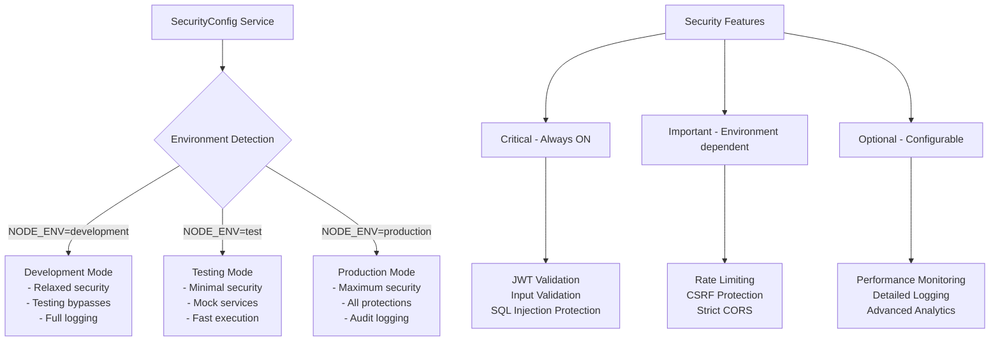
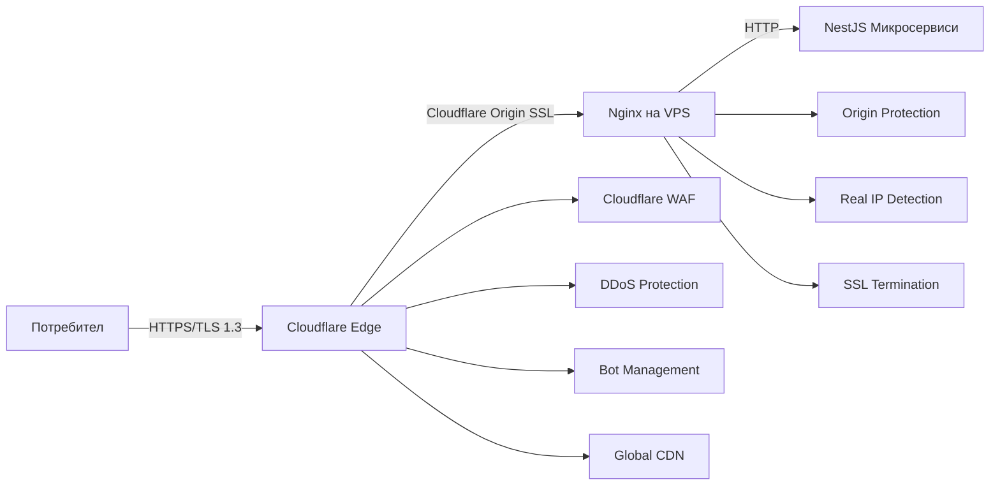

# Security Implementation Guide

## Environment-Based Security Configuration

### Философия на защитата

Системата използва **environment-driven подход** за управление на security features, който позволява:
- **Безопасно тестване** в development и testing environments
- **Максимална защита** в production по default
- **Гъвкавост** за debugging и performance tuning
- **Еволюция** към по-сложни конфигурации

### Security Configuration Architecture



### Configuration Implementation

```typescript
// config/security.config.ts
export class SecurityConfig {
  private readonly env = process.env.NODE_ENV || 'development';
  
  // Environment detection
  get isProduction(): boolean { return this.env === 'production'; }
  get isDevelopment(): boolean { return this.env === 'development'; }
  get isTesting(): boolean { return this.env === 'test'; }
  
  // Critical features - ALWAYS ENABLED
  get jwtValidation(): boolean { return true; }
  get inputValidation(): boolean { return true; }
  get sqlInjectionProtection(): boolean { return true; }
  
  // Important features - Environment dependent
  get rateLimiting(): boolean {
    if (this.isProduction) return true;
    return process.env.FORCE_RATE_LIMITING === 'true';
  }
  
  get corsStrict(): boolean {
    if (this.isProduction) return true;
    return process.env.FORCE_CORS_STRICT === 'true';
  }
  
  get csrfProtection(): boolean {
    if (this.isProduction) return true;
    return process.env.FORCE_CSRF === 'true';
  }
  
  // Testing utilities
  get allowTestingBypass(): boolean {
    return !this.isProduction && process.env.TESTING_BYPASS === 'true';
  }
}
```

### Environment Configuration Files

**.env.development:**
```bash
NODE_ENV=development
FORCE_RATE_LIMITING=false
FORCE_CORS_STRICT=false
FORCE_CSRF=false
TESTING_BYPASS=true
SECURITY_LOGGING=verbose
```

**.env.test:**
```bash
NODE_ENV=test
FORCE_RATE_LIMITING=false
TESTING_BYPASS=true
SECURITY_LOGGING=minimal
JWT_SECRET=test-secret-key
```

**.env.production:**
```bash
NODE_ENV=production
# All security features automatically enabled
SECURITY_LOGGING=audit
JWT_SECRET=${SECURE_JWT_SECRET}
```

## 1. Transport Layer Security - HTTPS с Cloudflare

### Архитектура на защитата



### Какво представлява защитата?

**HTTPS с Cloudflare** е многопластова защита, която комбинира:
- **Edge SSL termination** с TLS 1.3 и modern ciphers
- **Origin protection** - VPS IP адресът е скрит от публичен достъп
- **Web Application Firewall** - automatic OWASP Top 10 protection
- **DDoS mitigation** - до 100+ Tbps защита без configuration
- **Global CDN** - performance и availability optimization

### Какви атаки спира?

**На Cloudflare Edge ниво:**
- **DDoS атаки** (Layer 3, 4, 7) - automatic mitigation
- **Bot attacks** - sophisticated bot detection и blocking
- **Geographic attacks** - country-level blocking
- **IP reputation filtering** - automatic bad IP blocking
- **Rate limiting** - sophisticated request limiting
- **Basic WAF protection** - SQL injection, XSS attempts

**На Origin ниво:**
- **Direct IP attacks** - невъзможни, VPS IP е скрит
- **Certificate attacks** - Origin Certificate работи само с Cloudflare
- **Man-in-the-Middle** - двойно криптиране (Edge + Origin)
- **Traffic analysis** - real traffic patterns са скрити

### Implementation Strategy

#### Phase 1: Cloudflare Setup
```yaml
# Cloudflare Dashboard Configuration
ssl_mode: "Full (strict)"           # End-to-end encryption
security_level: "Medium"            # Balanced protection
always_use_https: true              # Force HTTPS redirect
hsts_enabled: true                  # Strict transport security
bot_fight_mode: true                # Basic bot protection
minify:
  css: true
  js: true
  html: true
```

#### Phase 2: Origin Certificate
```bash
# Cloudflare Dashboard Steps:
# 1. SSL/TLS → Origin Server → Create Certificate
# 2. Generate RSA 2048 certificate (15 години validity)
# 3. Download cert.pem и key.pem files
# 4. Install на VPS /etc/ssl/cloudflare/
```

#### Phase 3: Nginx Configuration
```nginx
# /etc/nginx/sites-available/learning-platform
server {
    listen 443 ssl http2;
    server_name yourdomain.com;
    
    # Cloudflare Origin Certificate
    ssl_certificate /etc/ssl/cloudflare/cert.pem;
    ssl_certificate_key /etc/ssl/cloudflare/key.pem;
    
    # Modern SSL configuration
    ssl_protocols TLSv1.2 TLSv1.3;
    ssl_ciphers ECDHE-ECDSA-AES128-GCM-SHA256:ECDHE-RSA-AES128-GCM-SHA256:ECDHE-ECDSA-AES256-GCM-SHA384:ECDHE-RSA-AES256-GCM-SHA384;
    ssl_prefer_server_ciphers off;
    
    # Cloudflare IP restriction
    include /etc/nginx/cloudflare-ips.conf;
    deny all;
    
    # Real IP detection
    set_real_ip_from 103.21.244.0/22;
    set_real_ip_from 103.22.200.0/22;
    set_real_ip_from 103.31.4.0/22;
    set_real_ip_from 104.16.0.0/13;
    set_real_ip_from 104.24.0.0/14;
    set_real_ip_from 108.162.192.0/18;
    set_real_ip_from 131.0.72.0/22;
    set_real_ip_from 141.101.64.0/18;
    set_real_ip_from 162.158.0.0/15;
    set_real_ip_from 172.64.0.0/13;
    set_real_ip_from 173.245.48.0/20;
    set_real_ip_from 188.114.96.0/20;
    set_real_ip_from 190.93.240.0/20;
    set_real_ip_from 197.234.240.0/22;
    set_real_ip_from 198.41.128.0/17;
    real_ip_header CF-Connecting-IP;
    
    # Security headers
    add_header Strict-Transport-Security "max-age=31536000; includeSubDomains" always;
    add_header X-Frame-Options "SAMEORIGIN" always;
    add_header X-Content-Type-Options "nosniff" always;
    add_header Referrer-Policy "strict-origin-when-cross-origin" always;
    
    # Frontend
    location / {
        proxy_pass http://react-frontend:3000;
        proxy_set_header Host $host;
        proxy_set_header X-Real-IP $remote_addr;
        proxy_set_header X-Forwarded-For $proxy_add_x_forwarded_for;
        proxy_set_header X-Forwarded-Proto $scheme;
        proxy_set_header CF-Connecting-IP $http_cf_connecting_ip;
        proxy_set_header CF-IPCountry $http_cf_ipcountry;
    }
    
    # API endpoints
    location /api/ {
        proxy_pass http://nestjs-backend:3000;
        proxy_set_header Host $host;
        proxy_set_header X-Real-IP $remote_addr;
        proxy_set_header X-Forwarded-For $proxy_add_x_forwarded_for;
        proxy_set_header X-Forwarded-Proto $scheme;
        proxy_set_header CF-Connecting-IP $http_cf_connecting_ip;
        proxy_set_header CF-IPCountry $http_cf_ipcountry;
        proxy_set_header CF-Ray $http_cf_ray;
        
        # API timeouts
        proxy_connect_timeout 30s;
        proxy_send_timeout 30s;
        proxy_read_timeout 30s;
    }
}

# HTTP to HTTPS redirect
server {
    listen 80;
    server_name yourdomain.com;
    return 301 https://$server_name$request_uri;
}
```

#### Phase 4: NestJS Backend Integration
```typescript
// main.ts
import { NestFactory } from '@nestjs/core';
import helmet from 'helmet';
import { SecurityConfig } from './config/security.config';

async function bootstrap() {
  const app = await NestFactory.create(AppModule);
  const securityConfig = app.get(SecurityConfig);
  
  // Trust Cloudflare proxy
  app.set('trust proxy', true);
  
  // Security headers - compatible with Cloudflare
  app.use(helmet({
    contentSecurityPolicy: securityConfig.isProduction ? {
      directives: {
        defaultSrc: ["'self'"],
        scriptSrc: ["'self'"],
        styleSrc: ["'self'", "'unsafe-inline'"],
        imgSrc: ["'self'", "data:", "https:"],
        connectSrc: ["'self'"],
      },
    } : false, // Disabled in development
    hsts: false, // Cloudflare handles HSTS
  }));
  
  // CORS configuration
  app.enableCors({
    origin: securityConfig.corsStrict ? [
      'https://yourdomain.com',
      'https://www.yourdomain.com'
    ] : true,
    credentials: true,
    optionsSuccessStatus: 200
  });
  
  // Cloudflare middleware
  app.use((req, res, next) => {
    // Extract Cloudflare headers
    req.cloudflare = {
      ip: req.headers['cf-connecting-ip'] || req.ip,
      country: req.headers['cf-ipcountry'],
      ray: req.headers['cf-ray'],
    };
    
    // Override request IP with real client IP
    req.ip = req.cloudflare.ip;
    
    next();
  });
  
  await app.listen(3000, '0.0.0.0');
}
```

### Conditional Security Guards

```typescript
// guards/conditional-security.guard.ts
export function ConditionalRateLimit() {
  return function (target: any, propertyKey: string, descriptor: PropertyDescriptor) {
    const originalMethod = descriptor.value;
    
    descriptor.value = async function (...args: any[]) {
      const securityConfig = this.securityConfig || new SecurityConfig();
      
      if (securityConfig.rateLimiting) {
        // Apply rate limiting
        const context = args[0]; // ExecutionContext
        const request = context.switchToHttp().getRequest();
        
        if (!await this.rateLimitService.checkLimit(request)) {
          throw new HttpException('Rate limit exceeded', HttpStatus.TOO_MANY_REQUESTS);
        }
      }
      
      return originalMethod.apply(this, args);
    };
  };
}

// Използване в controllers
@Controller('api/users')
export class UserController {
  @Get()
  @ConditionalRateLimit()
  @UseGuards(JwtAuthGuard) // JWT винаги се прилага
  async getUsers() {
    return this.userService.findAll();
  }
}
```

### Testing Strategy

#### Development Testing
```typescript
// test/security.e2e-spec.ts
describe('Security Configuration (Development)', () => {
  beforeAll(async () => {
    process.env.NODE_ENV = 'development';
    process.env.TESTING_BYPASS = 'true';
  });
  
  it('should bypass rate limiting in development', async () => {
    const promises = Array(100).fill(null).map(() => 
      request(app.getHttpServer())
        .get('/api/users')
        .set('Authorization', 'Bearer ' + validToken)
    );
    
    const results = await Promise.all(promises);
    expect(results.every(r => r.status !== 429)).toBe(true);
  });
  
  it('should still enforce JWT validation', async () => {
    await request(app.getHttpServer())
      .get('/api/protected')
      .expect(401);
  });
});
```

#### Production Testing
```typescript
// test/production-security.e2e-spec.ts
describe('Security Configuration (Production)', () => {
  beforeAll(async () => {
    process.env.NODE_ENV = 'production';
  });
  
  it('should enforce all security measures', async () => {
    // Rate limiting should be active
    // CORS should be strict
    // All validations should be active
  });
});
```

#### Cloudflare Testing
```bash
# SSL/TLS quality test
curl -I https://yourdomain.com
ssllabs.com/ssltest/analyze.html?d=yourdomain.com

# Origin protection test (should fail)
curl -I https://VPS-DIRECT-IP

# Cloudflare headers verification
curl -v https://yourdomain.com | grep -i "cf-"

# Performance testing
curl -I https://yourdomain.com/static/test.css
# Should show: cf-cache-status: HIT

# Security headers validation
curl -I https://yourdomain.com | grep -i security
```

### Monitoring и Maintenance

#### Automated IP Updates
```bash
#!/bin/bash
# /scripts/update-cloudflare-ips.sh
curl -s https://www.cloudflare.com/ips-v4 > /tmp/cf-ips-v4
curl -s https://www.cloudflare.com/ips-v6 > /tmp/cf-ips-v6

echo "# Cloudflare IP ranges - Auto-generated $(date)" > /etc/nginx/cloudflare-ips.conf
awk '{print "allow " $1 ";"}' /tmp/cf-ips-v4 >> /etc/nginx/cloudflare-ips.conf
awk '{print "allow " $1 ";"}' /tmp/cf-ips-v6 >> /etc/nginx/cloudflare-ips.conf

nginx -t && nginx -s reload
```

#### Health Monitoring
```typescript
// health/cloudflare-health.service.ts
@Injectable()
export class CloudflareHealthService {
  @Cron('0 */6 * * *') // Every 6 hours
  async checkCloudflareStatus() {
    const health = {
      originProtection: await this.checkOriginProtection(),
      certificateValidity: await this.checkCertificate(),
      edgeConnectivity: await this.checkEdgeConnectivity(),
    };
    
    if (!health.originProtection) {
      this.alertService.send('Origin protection compromised');
    }
  }
  
  private async checkOriginProtection(): Promise<boolean> {
    try {
      // Try direct IP access - should fail
      await axios.get(`https://${process.env.VPS_IP}`);
      return false; // If succeeds, protection is broken
    } catch (error) {
      return true; // Should fail due to protection
    }
  }
}
```

### Performance Benefits

**Cloudflare Free Plan предоставя:**
- Unlimited DDoS protection
- Global CDN caching
- SSL certificates
- Basic WAF rules
- 100k DNS queries/месец

**Очаквани подобрения:**
- **Latency**: -20-50ms (edge caching)
- **Bandwidth**: 60-80% reduction (caching + compression)
- **Origin load**: 70-90% reduction (traffic filtering)
- **Security events**: 95%+ blocked before reaching origin

### Production Checklist

#### Initial Setup:
- [ ] Cloudflare account setup and domain verification
- [ ] DNS records pointed to Cloudflare
- [ ] SSL/TLS mode set to "Full (strict)"
- [ ] Origin Certificate generated and installed
- [ ] Origin IP access restricted to Cloudflare only
- [ ] Security level configured (Medium/High)
- [ ] Page Rules configured for caching
- [ ] Development/Testing subdomains configured

#### Security Validation:
- [ ] Direct IP access blocked
- [ ] HTTPS redirect working
- [ ] Security headers present
- [ ] Real IP detection working
- [ ] Rate limiting functional
- [ ] WAF protection active
- [ ] SSL Labs test Grade A
- [ ] All API endpoints behind protection

#### Ongoing Maintenance:
- [ ] Monthly Cloudflare IP updates
- [ ] Quarterly security settings review
- [ ] Performance monitoring active
- [ ] Security event alerting configured
- [ ] Backup Origin Certificate stored securely